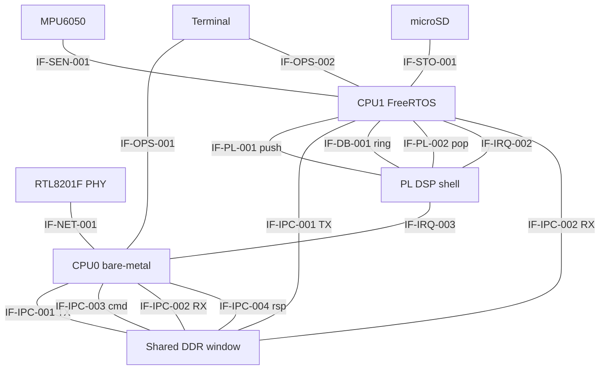

# Architecture Detail — Interfaces, Memory Map, and Wire Protocols

**Document ID:** ZMPIO-DETAIL-001
**Level:** L1 — supplements `SAD.md`
**Scope:** register/pin/clock-level hardware detail, the full interface catalog, the DDR/MMIO memory
map, and the bit-exact wire format of every message and record that crosses a component boundary.
`SAD.md` describes what the components are and why; this document describes exactly how they talk to
each other and to memory.

This document is organized in three parts:

- **Part A — Interface Catalog:** for each interface, the producer, consumer, transport, ownership,
  synchronization, timeout, retry, and error handling.
- **Part B — Memory and Resource Map:** DDR layout, MMIO addresses, FreeRTOS resources, PL resources,
  clocks, and budget/margin figures.
- **Part C — Protocol and Wire Format Specification:** the bit-exact layout of every struct, ring,
  register, and file format.

---

# Part A — Interface Catalog

Each interface below is described using: producer, consumer, transport, message format, field
layout, size, encoding, byte order, ownership, synchronization, timeout, retry, error handling, and
compatibility/versioning.

## A.1 Interface Map



## A.2 Index

| ID | Name | Kind | Producer | Consumer |
|---|---|---|---|---|
| IF-SEN-001 | MPU6050 I2C | external hardware | MPU6050 | CPU1 |
| IF-STO-001 | microSD SPI mode | external hardware | bidirectional | CPU1 |
| IF-NET-001 | GEM0 RMII + MDIO | external hardware | bidirectional | CPU0 |
| IF-OPS-001 | UART0 console | user | bidirectional | CPU0 |
| IF-OPS-002 | UART1 log | user | CPU1 | terminal |
| IF-OPS-003 | JTAG/DAP | tool | host | both cores |
| IF-IPC-001 | ABI v2 TX ring | software, DDR | CPU1 | CPU0 / Linux |
| IF-IPC-002 | ABI v2 RX ring | software, DDR | CPU0 / Linux | CPU1 |
| IF-IPC-003 | ABI v3 command ring | software, DDR | CPU0 | CPU1 |
| IF-IPC-004 | ABI v3 response ring | software, DDR | CPU1 | CPU0 |
| IF-IPC-005 | ABI v3 control block | software, DDR | split per field | both |
| IF-PL-001 | `mmio_axis_bridge` AXI4-Lite | MMIO | CPU1 | PL |
| IF-PL-002 | `zmpio_dsp_ctrl` AXI4-Lite | MMIO | bidirectional | CPU1 |
| IF-PL-003 | sample AXI4-Stream 160-bit | internal to PL | bridge | dsp core |
| IF-PL-004 | feature AXI4-Stream 384-bit | internal to PL | dsp core | dsp ctrl |
| IF-PL-005 | `dsp_soft_rst_n` | internal PL signal | dsp ctrl | bridge + core |
| IF-DB-001 | `zmpio_doorbell` AXI4-Lite | MMIO | both cores | PL |
| IF-IRQ-001 | GIC SPI 61 `axi_iic_0` | interrupt | PL | CPU1 (unused) |
| IF-IRQ-002 | GIC SPI 62 `zmpio_dsp_ctrl` | interrupt | PL | CPU1 |
| IF-IRQ-003 | GIC SPI 63 `zmpio_doorbell` | interrupt | PL | CPU0 |
| IF-LOG-001 | logger queue | internal to CPU1 | 4 producers | `storage_task` |
| IF-LOG-002 | ZLOG file on card | storage | CPU1 | host tooling |

## A.3 IF-SEN-001 — MPU6050 over I2C

| Attribute | Value |
|---|---|
| Producer / Consumer | MPU6050 (slave) / CPU1 (sole master) |
| Transport | AXI IIC `axi_iic_0` @ `0x43C0_0000`, 100 kHz bus, 7-bit address `0x68` |
| Format | 8-bit register access; data read is a 14-byte burst from `ACCEL_XOUT_H` (`0x3B`) |
| Byte order | **big-endian** for each 16-bit value (MSB first) |
| Encoding | 16-bit two's complement, scale determined by `ACCEL_CONFIG`/`GYRO_CONFIG` |
| Ownership | CPU1 exclusive; no other component may open this bus |
| Synchronization | polled, no use of IRQ 61; each transfer is one complete transaction |
| Timeout | 20,000 µs for a full transaction (`APP_MPU6050_I2C_TIMEOUT_US`) |
| Retry | none at the transaction level; errors are counted in `consecutive_errors`, and 5 consecutive triggers recovery |
| Error handling | 4 distinct codes: `bus-busy`, `timeout`, `arb-lost`, `tx-error` |
| Versioning | none; the contract is the MPU6050 datasheet |

### 14-byte read window layout

| Offset | Field | Type |
|---:|---|---|
| 0..1 | `accel_x` | int16 BE |
| 2..3 | `accel_y` | int16 BE |
| 4..5 | `accel_z` | int16 BE |
| 6..7 | `temperature` | int16 BE |
| 8..9 | `gyro_x` | int16 BE |
| 10..11 | `gyro_y` | int16 BE |
| 12..13 | `gyro_z` | int16 BE |

### Mandatory configuration registers

| Register | Address | Written value | Meaning | Read back and checked |
|---|---:|---:|---|---|
| `PWR_MGMT_1` | `0x6B` | `0x80` then `0x01` | device reset, then select gyro-X clock | yes: bit `0x40` (sleep) must be 0, `[2:0]` must be 1 |
| `CONFIG` | `0x1A` | `0x04` | DLPF 21 Hz | yes |
| `SMPLRT_DIV` | `0x19` | `9` | 1 kHz / (1+9) = 100 Hz | yes |
| `GYRO_CONFIG` | `0x1B` | `0x08` | ±500 °/s | yes |
| `ACCEL_CONFIG` | `0x1C` | `0x10` | ±8 g | yes |
| `WHO_AM_I` | `0x75` | — | identity, checked against `(v & 0x7E) == 0x68` | yes |

**Timing constraint:** after the reset command (`0x80`), a 100 ms wait is required; after writing
configuration, another 100 ms wait is required before reading back — this is a chip requirement, not
an arbitrarily chosen safety margin.

## A.4 IF-STO-001 — microSD in SPI mode

| Attribute | Value |
|---|---|
| Producer / Consumer | bidirectional; CPU1 is the sole master |
| Transport | PS SPI0, chip-select 0, master mode + forced slave-select |
| Speed | prescaler 256 at init, 32 for data transfer (`app_config.h`) |
| Format | 6-byte SD command (`0x40\|cmd`, 4-byte argument, CRC7 + stop bit), R1/R3/R7 responses |
| Byte order | command arguments are big-endian; sector data is a raw byte stream |
| Size | fixed 512-byte sectors (`SD_SPI_SECTOR_SIZE`) |
| Ownership | CPU1 exclusive, and within CPU1 only `storage_task` |
| Synchronization | polled, no IRQ, no DMA |
| Timeout | `APP_SD_COMMAND_TIMEOUT_MS` = 1000 ms for commands; `APP_SD_DATA_TIMEOUT_MS` = 1000 ms for data |
| Retry | none at the command level; errors propagate up to FatFs → `storage_task` closes and remounts |
| Error handling | `sd_spi_diagnostic_t` code (14 stages) + a bit-packed `detail` field |
| Versioning | detected at runtime: SDv2 / block-addressed (SDHC) via CMD8 + CMD58 |

### Initialization sequence (mandatory order)

```text
1. Drop to prescaler 256              -> SD_SPI_DIAG_SET_INIT_CLOCK
2. Send >= 74 idle clock pulses       -> SD_SPI_DIAG_IDLE_CLOCKS
3. CMD0  GO_IDLE_STATE                -> SD_SPI_DIAG_CMD0
4. CMD8  SEND_IF_COND                 -> SD_SPI_DIAG_CMD8      (distinguishes v1/v2)
5. ACMD41 looped until idle clears    -> SD_SPI_DIAG_ACMD41
6. CMD58 read OCR                     -> SD_SPI_DIAG_CMD58     (detects block addressing)
7. CMD16 set block length to 512      -> SD_SPI_DIAG_CMD16     (skipped if block-addressed)
8. Raise speed to prescaler 32        -> SD_SPI_DIAG_SET_DATA_CLOCK
9. CMD9  read CSD -> sector_count     -> SD_SPI_DIAG_CMD9
```

The stage code is passed intact to the host via `MSG_TYPE_LOG_DIAGNOSTIC`, so when a card fails to
come up, the exact failing step can be identified without connecting JTAG.

### `detail` field (packed into 32 bits)

| Bit | Content |
|---|---|
| 31..28 | `reason`: none / mode-fault / rx-timeout / response-timeout / bad-response / controller-setup |
| 27..20 | last byte received from the card |
| 19..2 | SPI configuration register (18 bits implemented) |
| 1 | SPI enable bit |
| 0 | mode-fault status bit |

Why this is packed into 32 bits: it preserves the existing diagnostic ABI size while still
distinguishing "the card is not responding" from "the PS SPI hit a mode fault" — two failures that
call for two different responses.

## A.5 IF-IPC-001 / IF-IPC-002 — ABI v2 Rings

| Attribute | IF-IPC-001 (TX) | IF-IPC-002 (RX) |
|---|---|---|
| Producer | CPU1 | CPU0 or Linux (never simultaneously) |
| Consumer | CPU0 or Linux | CPU1 |
| Control address | `0x1900_0000` | `0x1902_0000` |
| Buffer address | `0x1900_1000` | `0x1902_1000` |
| Capacity | 256 slots × 256 bytes | 256 slots × 256 bytes |
| Index ownership | `head` = producer, `tail` = consumer | same |
| Synchronization | `dmb` before reading indices, after writing the payload, after writing the index | same |
| Cache | `NORM_NONCACHE` on both cores | same |
| Timeout | none at the ring level; at the transaction level: 2000 ms (CPU0), 2000 ms (Linux) | — |
| Retry | none; a full ring returns an error to the caller immediately | — |
| Error handling | `control_is_valid()` checks `size`/`head`/`tail` before every operation | — |
| Versioning | `IPC_PROTOCOL_VERSION` = 2, `IPC_MAGIC` checked on every message | — |

**Ring invariants:**

1. `next_head == tail` means full → the producer refuses to write, never overwrites.
2. `head == tail` means empty → the consumer reports "nothing available."
3. The producer writes the payload **first**, issues `dmb`, then updates `head`. A consumer that
   sees the new `head` is guaranteed to see the complete payload.
4. Since each index has exactly one writer, no atomic operation is required beyond an aligned word
   write.

**Constraint:** standalone CPU0 and Linux must NEVER be simultaneous producers on the RX ring. This
is an implementation-level constraint, not one enforced by hardware.

## A.6 IF-IPC-003 / IF-IPC-004 / IF-IPC-005 — ABI v3

| Attribute | Command ring | Response ring | Control block |
|---|---|---|---|
| Address | `0x1904_1000` | `0x1904_2000` | `0x1904_0000` |
| Slot count | 16 | 16 | — |
| Slot size | 84 bytes | 88 bytes | 52 bytes |
| Producer | CPU0 | CPU1 | per field |
| Consumer | CPU1 | CPU0 | per field |
| Integrity | CRC32 per slot | CRC32 per slot | no CRC |
| Timeout | 500 ms/attempt, up to 5 attempts | — | 5000 ms readiness wait |
| Retry | yes, each attempt uses a NEW `correlation_id` | — | — |

### Control block field ownership (IF-IPC-005)

| Field | Owner (writer) | What the other side does |
|---|---|---|
| `magic`, `abi_version`, `layout_hash` | CPU1 | read to check readiness and compatibility |
| `cpu1_link_state` | CPU1 | read to know whether CPU1 is READY/ONLINE |
| `session_id` | CPU1 | read from HELLO_ACK, stamped onto every subsequent command |
| `cmd_head` | CPU0 | CPU1 reads it to know a new command arrived |
| `cmd_tail` | CPU1 | CPU0 reads it to know how much ring space remains |
| `rsp_head` | CPU1 | CPU0 reads it to know a response is available |
| `rsp_tail` | CPU0 | CPU1 reads it to know how much response-ring space remains |
| `cmd_ring_size`, `rsp_ring_size` | CPU1 (written once at init) | CPU0 uses it as a modulo |
| `cpu1_crc_drop_count` | CPU1 | CPU0 reads it to verify CRC test behavior |
| `cpu0_crc_drop_count` | CPU0 | not used by CPU1 |

**This is the exact technical reason for a non-cacheable shared window (see `SAD.md` ADR-008):**
`cmd_head` (owned by CPU0) sits at offset 20, sharing a 32-byte cache line with 5 fields owned by
CPU1. If this window were cacheable, every CPU1 flush would undo `cmd_head`.

### Semantics of the four protection layers

| Layer | Field | Protects against | Behavior on violation |
|---|---|---|---|
| Integrity | `crc32` | a corrupted slot | drop counter incremented, tail still advances (the ring never stalls) |
| Pairing | `correlation_id` | receiving the wrong command's response | mismatched response discarded, counted toward timeout |
| Session | `session_id` | a command composed for a dead boot session | NACK `ERR_STALE_SESSION` |
| Version | `layout_hash` | two binaries with different layout understandings | CPU0 refuses the transition to ONLINE, returns `LAYOUT_MISMATCH` |

## A.7 IF-PL-001 — `mmio_axis_bridge` AXI4-Lite

| Attribute | Value |
|---|---|
| Base | `0x4000_0000`, 4 KiB range, `C_S_AXI_ADDR_WIDTH=5` |
| Producer / Consumer | CPU1 writes; CPU1 reads status |
| Synchronization | writing `SAMPLE_W4` is the **commit strobe**; no other handshake exists |
| Timeout | none — AXI4-Lite always returns `BRESP=OKAY`, no address-fault trap |
| Retry | none; a sample is dropped when busy, and the drop is counted |

| Offset | Name | R/W | Content |
|---:|---|---|---|
| `0x00` | `SAMPLE_W0` | W | `accel_x[15:0]` \| `accel_y[31:16]` |
| `0x04` | `SAMPLE_W1` | W | `accel_z[15:0]` \| `temperature[31:16]` |
| `0x08` | `SAMPLE_W2` | W | `gyro_x[15:0]` \| `gyro_y[31:16]` |
| `0x0C` | `SAMPLE_W3` | W | `gyro_z[15:0]` \| `flags[31:16]` |
| `0x10` | `SAMPLE_W4` | W | `sample_sequence` — **writing this word commits** |
| `0x14` | `STATUS` | R | bit0 `BUSY` |
| `0x18` | `DROP_COUNT` | R | number of samples dropped due to `BUSY` at commit time |

**Ordering contract:** `W0..W3` are scratch registers and may be rewritten any number of times with
no side effect. Only writing `W4` atomically commits all 5 words into one AXIS beat. Callers MUST
write `W4` last.

**Back-pressure semantics:** if the previous beat has not yet been consumed (`BUSY=1`), the new
sample is **dropped outright** and `DROP_COUNT` increments; the in-flight beat is left unmodified.
This is genuine data loss (unlike `zmpio_dsp_ctrl`'s `DROP_COUNT` — see IF-PL-002).

## A.8 IF-PL-002 — `zmpio_dsp_ctrl` AXI4-Lite

| Attribute | Value |
|---|---|
| Base | `0x4000_1000`, `C_S_AXI_ADDR_WIDTH=7` |
| Producer / Consumer | CPU1 writes CONTROL/CONFIG_SEQ, reads STATUS/counters/FIFO |
| Synchronization | level IRQ (IF-IRQ-002) + fallback polling |
| Ownership | CPU1 exclusive; CPU0 obtains data indirectly via ABI v3 |

| Offset | Name | R/W | Content |
|---:|---|---|---|
| `0x00` | `CONTROL` | R/W | bit0 `RUN`, bit1 `SOFT_RESET`, bit2 `IRQ_ENABLE` |
| `0x04` | `CONFIG_SEQ` | R/W | scratch counter, incremented by CPU1 each config cycle |
| `0x08` | `STATUS` | R/W1C | bit0 `FEATURE_READY` (read-only), bit1 `RESULT_OVERFLOW` (sticky, write 1 to clear) |
| `0x0C` | `FEATURE_COUNT` | R | total feature beats that entered the FIFO, saturating |
| `0x10` | `DROP_COUNT` | R | number of times the AXIS slave port stalled due to a full FIFO |
| `0x18`..`0x44` | `FEATURE_POP[0..11]` | R | image of the FIFO's head element; **reading word 11 (`0x44`) pops the FIFO** |

**Important semantic warning:** two registers share the name `DROP_COUNT` across two modules, with
DIFFERENT meanings.

| Register | Meaning | Actual data loss |
|---|---|---|
| `mmio_axis_bridge.DROP_COUNT` | samples discarded because the bridge was busy | **YES** — real sample loss |
| `zmpio_dsp_ctrl.DROP_COUNT` | number of times `tready` was deasserted due to a full FIFO | **NO** — upstream is merely held back |

Confusing the two leads to a completely wrong diagnosis when analyzing DSP health.

**FEATURE_POP read contract:** the caller MUST read all 12 words in ascending order. Reading too
few (stopping before word 11) leaves the FIFO un-advanced; reading extra words consumes the next
element.

## A.9 IF-PL-003 / IF-PL-004 / IF-PL-005 — Internal PL Interfaces

| ID | From → To | Width | Semantics |
|---|---|---|---|
| IF-PL-003 | `mmio_axis_bridge` → `dsp_core_axis_top` | 160 bit, `tlast=1` each beat | one `SampleFrameV1` |
| IF-PL-004 | `dsp_core_axis_top` → `zmpio_dsp_ctrl` | 384 bit, `tlast=1` each beat | one `FeatureFrameV2` |
| IF-PL-005 | `zmpio_dsp_ctrl` → bridge + core | 1 bit, active-low | dedicated reset for the DSP pipeline |

Bit layouts for IF-PL-003 and IF-PL-004: Part C §5 below. They must match exactly the register
write order at IF-PL-001 and the read order at IF-PL-002 — three places describing the same contract.

**IF-PL-005 — reset domain contract:**

| Reset | NOT reset |
|---|---|
| `dsp_core_axis_top` (all DSP state) | `zmpio_dsp_ctrl`'s AXI4-Lite slave interface |
| `mmio_axis_bridge` (scratch registers, `busy`, `drop_count`) | `zmpio_dsp_ctrl`'s own `control_reg` |
| FIFO + `feature_count` + `drop_count` in `zmpio_dsp_ctrl` | `axi_iic_0` and everything else on the global reset network |

If `control_reg` were also in the reset domain, software would lock itself out: once
`SOFT_RESET=1` is set, there would be no way left to clear it.

## A.10 IF-DB-001 — `zmpio_doorbell` AXI4-Lite

| Attribute | Value |
|---|---|
| Base | `0x4000_2000`, `C_S_AXI_ADDR_WIDTH=5` |
| Reachable from | **both cores**, over the same PS7 GP AXI path — hardware makes no distinction |
| Ownership by software convention | CPU1 only writes `DBELL_SET`; CPU0 owns `DBELL_ACK` and `DBELL_IRQ_ENABLE` |

| Offset | Name | R/W | Content |
|---:|---|---|---|
| `0x00` | `DBELL_STATUS` | R | bit0 `PENDING` |
| `0x04` | `DBELL_SET` | W | writing bit0=1 → `PENDING<-1`, `DBELL_COUNT++`; reads as 0 |
| `0x08` | `DBELL_ACK` | W | writing bit0=1 → `PENDING<-0`; reads as 0 |
| `0x0C` | `DBELL_IRQ_ENABLE` | R/W | bit0, mask for `irq_out` |
| `0x10` | `DBELL_COUNT` | R | total `DBELL_SET` writes, saturates at `0xFFFFFFFF` |

**Hardware invariants:**

1. `irq_out = DBELL_IRQ_ENABLE && PENDING` (level, does not self-clear).
2. Writing `DBELL_SET` while `PENDING` is already 1 **still** increments `DBELL_COUNT`. `COUNT` is
   the true event count; `PENDING` only means "there is unhandled work."
3. If `SET` and `ACK` land in the same cycle, `SET` wins: `PENDING` stays 1 and `COUNT` still
   increments. A ring must never lose to a simultaneous acknowledgment.
4. `DBELL_COUNT` saturates rather than wraps, so a delta subtraction never produces a false negative.

**Event-coalescing semantics:** the number of ISR entries CAN be smaller than the number of `SET`
writes — this is correct behavior for a level IRQ when multiple `SET`s occur while the source is
masked. Only `DBELL_COUNT` is proof that no event was ever dropped.

## A.11 IF-IRQ-001..003 — Interrupts

| ID | GIC ID | Source | Target | Type | Priority |
|---|---:|---|---|---|---|
| IF-IRQ-001 | 61 | `axi_iic_0` | CPU1 | level | unused (driver runs polled) |
| IF-IRQ-002 | 62 | `zmpio_dsp_ctrl` | CPU1 | level | `0xF0` — equal to the tick timer, **not** the BSP default `0xA0` |
| IF-IRQ-003 | 63 | `zmpio_doorbell` | CPU0 | level | `XINTERRUPT_DEFAULT_PRIORITY` |

**Shared contract for level IRQs (applies to IF-IRQ-002 and IF-IRQ-003):**

```text
1. The ISR masks the source FIRST, before anything else.
2. The ISR does no heavy work: it only signals (a semaphore or a flag).
3. The consumer clears the condition (drains the FIFO / ACKs), then RE-CHECKS it.
4. Only re-enable the source once step 3 confirms the condition is gone.
```

**Priority constraint for IF-IRQ-002:** on the ARM GIC, a lower number means higher priority.
FreeRTOS's tick runs at `0xF0` (the lowest usable priority, chosen deliberately so nothing can
outrank it). The BSP default is `0xA0`, which is **higher** than the tick. A level IRQ asserted at
`0xA0` wins every GIC arbitration and starves the tick — killing every `vTaskDelay()` in the system.
IRQ 62 must therefore use exactly the tick's priority value; when priorities tie, the lower GIC ID
(29, the tick's) wins.

**Distributor-ownership constraint:** CPU1 must only set the enable bit for SPI 62 AFTER CPU0 has run
`DoDistributorInit()` (ending with `ICDDCR=1`). See `SAD.md` ADR-014.

## A.12 IF-LOG-001 — Logger Queue (inside CPU1)

| Attribute | Value |
|---|---|
| Producer | `sensor_task`, `fpga_result_task`, `ipc_rx_task`, and `storage_task` itself (indirectly) |
| Consumer | `storage_task`, exclusively |
| Transport | `xQueueCreate(64, sizeof(log_queue_item_t))` |
| Element size | 28-byte header + 240-byte payload |
| Wait | producers always use `wait_ticks = 0` (non-blocking) |
| When full | the record is dropped; `sensor_dropped`/`linux_dropped` increments |
| Synchronization | `taskENTER_CRITICAL()` around every status-counter update |

A separate command queue: `xQueueCreate(8, sizeof(logger_command_t))` for `START`/`STOP`/`FLUSH`.

**Why a producer must never block:** `sensor_task` blocking on a full queue means missing the 10 ms
deadline. It is better to lose a countable record than to lose a sampling beat.

## A.13 IF-LOG-002 — ZLOG File on the Memory Card

| Attribute | Value |
|---|---|
| Producer | `storage_task` on CPU1 |
| Consumer | `software/linux/parse_zlog.py`, `dsp_host_sim/ml/.../mlp_quant_host.py` |
| Path | `0:/LOGnnnnn.BIN`, `nnnnn` is the smallest number not yet used, up to 99999 |
| Byte order | little-endian (ARM, direct write of `packed` structs) |
| Integrity | CRC32 over each record's payload (header excluded) |
| Durability | `f_sync()` every ≤ 1000 ms and on a `FLUSH` command |
| Versioning | `LOG_FORMAT_VERSION` for the container; each payload type has its own version |

**Forward-compatibility contract:** a reader that encounters an unknown `source` MUST use
`payload_len` to skip it and continue. This is why `payload_len` lives in the container header rather
than inside the payload. This has been verified in practice: `parse_zlog.py` correctly handles record
types added after it was written.

## A.14 IF-OPS-001..003 — Operational Interfaces

| ID | Channel | Direction | Role | Constraint |
|---|---|---|---|---|
| IF-OPS-001 | PS UART0, 115200 8N1 | bidirectional | CPU0 command menu | shared with Linux's boot console at the production target |
| IF-OPS-002 | PS UART1 (EMIO, K19 TX / M19 RX) | CPU1 → out | CPU1 log | no other consumer, so it can be left enabled at all times |
| IF-OPS-003 | JTAG/DAP | bidirectional | load ELF, read memory, reset core | the only tool that produces register-level evidence |

**Why CPU1 logs on UART1 instead of UART0:** UART0 is the shared console of CPU0/Linux. If CPU1 also
printed there, the two streams would interleave and the transcript would become unusable as
evidence. Separating the physical channel is what lets every gate be proven with two parallel
transcripts.

**Note on UART1 baud rate:** `PCW_UART1_BAUD_RATE=115200` in the PS7 configuration is metadata only;
the FSBL does not program UART1's baud divider, since its console is UART0. It is
`XUartPs_CfgInitialize()` that actually applies `XUARTPS_DFT_BAUDRATE` = 115200 and sets the device
to polled 8N1 mode.

## A.15 Ownership Matrix (summary)

| Resource | CPU0 | CPU1 | PL | Linux (target) |
|---|---|---|---|---|
| `axi_iic_0` | — | **owner** | — | forbidden |
| `spi0` / microSD | enables clock at boot | **owner** | — | forbidden |
| `mmio_axis_bridge` | — | **owner** | executes | — |
| `zmpio_dsp_ctrl` | — | **owner** | executes | — |
| `zmpio_doorbell` | **owner** of ACK/ENABLE | writes SET | executes | — |
| GIC distributor | **owner** | reads only, for self-defense | — | will become owner |
| GEM0 | **owner** | — | — | will become owner |
| UART0 | **owner** | — | — | shared |
| UART1 | — | **owner** | — | — |
| ABI v2 TX ring | consumer | **producer** | — | consumer (mutually exclusive with CPU0) |
| ABI v2 RX ring | producer | **consumer** | — | producer (mutually exclusive with CPU0) |
| ABI v3 | command producer | command consumer | — | not yet used |
| Global timer | reads | reads + enables if not enabled | — | clocksource |

---

# Part B — Memory and Resource Map

**Source of truth:** `common/zmpio_ipc_layout.h`, `common/zmpio_abi_v3.h`,
`firmware/platform_dual/hw/sdt/pl.dtsi`, `firmware/app_freertos/src/app_config.h`,
`firmware/platform_dual/.../FreeRTOSConfig.h`. Every number in this section is read directly from
source or from a build artifact; none of the values are estimates.

## B.1 DDR memory map

| Region | Base | Size | Owner | MMU attribute | Lifetime |
|---|---:|---:|---|---|---|
| Linux / CPU0 | `0x0000_0000` | up to `0x17FF_FFFF` | CPU0 / Linux | cacheable | boot → shutdown |
| CPU1 firmware (code + data + heap + stack) | `0x1800_0000` | 16 MiB | CPU1 | cacheable | CPU1 boot → reset |
| Shared window (ABI v2 + v3) | `0x1900_0000` | 4 MiB | split by field | **`NORM_NONCACHE` on both cores** | permanent |
| Remainder | from `0x1940_0000` | — | unallocated | — | — |

Runtime check: `ipc_init()` refuses to start if the CPU1 firmware linker symbol `end` exceeds
`SHARED_MEM_BASE` — i.e. firmware has encroached on the shared window.

### B.1.1 Detail of the 4 MiB shared window

| Offset in window | Absolute address | Actual size used | Content |
|---:|---:|---:|---|
| `0x0_0000` | `0x1900_0000` | 12 B | `ipc_control_t` of the TX ring |
| `0x0_1000` | `0x1900_1000` | 64 KiB | 256 × `ipc_message_t` (TX) |
| `0x2_0000` | `0x1902_0000` | 12 B | `ipc_control_t` of the RX ring |
| `0x2_1000` | `0x1902_1000` | 64 KiB | 256 × `ipc_message_t` (RX) |
| `0x4_0000` | `0x1904_0000` | 52 B | `zmpio_v3_control_t` |
| `0x4_1000` | `0x1904_1000` | 1344 B | 16 × `zmpio_v3_cmd_slot_t` (84 B) |
| `0x4_2000` | `0x1904_2000` | 1408 B | 16 × `zmpio_v3_rsp_slot_t` (88 B) |
| `0x4_3000` .. `0x7_FFFF` | `0x1904_3000` .. | — | reserved for ABI v3 growth (total v3 region = 256 KiB) |

Four `_Static_assert`s in `zmpio_abi_v3.h` enforce this layout at compile time:

```text
1. the cmd ring must not overlap the rsp ring
2. the rsp ring must not exceed the 256 KiB v3 region
3. the v3 region must not overlap the ABI v2 RX ring
4. the v3 region must not exceed the 4 MiB shared window
```

### B.1.2 Why the entire window is non-cacheable

The table below is concrete evidence, not a general rule. The Cortex-A9 cache line is 32 bytes.

**`zmpio_v3_control_t` — cache line 0 (offset 0..31):**

| Offset | Field | Owner |
|---:|---|---|
| 0 | `magic` | CPU1 |
| 4 | `abi_version` | CPU1 |
| 8 | `layout_hash` | CPU1 |
| 12 | `cpu1_link_state` | CPU1 |
| 16 | `session_id` | CPU1 |
| **20** | **`cmd_head`** | **CPU0** |
| 24 | `cmd_tail` | CPU1 |
| 28 | `rsp_head` | CPU1 |

When CPU1 writes any of its own fields, the whole 32-byte line becomes dirty in CPU1's L1, carrying
a **stale** copy of `cmd_head`. A subsequent `Xil_DCacheFlushRange()` writes the entire line back to
DDR and overwrites the `cmd_head` value CPU0 just wrote directly to DDR. No hardware arbiter resolves
this conflict. The same issue exists on line 1 (`rsp_tail` at offset 32 and `cpu0_crc_drop_count` at
offset 48, both owned by CPU0, interleaved with CPU1's fields) and in the ABI v2 `ipc_control_t`
(`head`/`tail` have different owners but share a line).

ABI v2 survived for a long time as cacheable only because it is a strict ping-pong request/response
protocol: CPU0 never writes its index while CPU1 holds the line dirty. ABI v3 breaks that assumption.

The remap is done with `Xil_SetTlbAttributes(..., NORM_NONCACHE)` per 1 MiB section (four calls),
followed by `dsb`. The function itself flushes the D-cache and invalidates the TLB, so no stale line
survives before the ring is first touched.

## B.2 MMIO map

### B.2.1 Peripherals on the PL

| Device | Base | Range | Address width | GIC SPI | Owner |
|---|---:|---:|---:|---:|---|
| `axi_iic_0` | `0x43C0_0000` | 64 KiB | — | 61 | CPU1 |
| `mmio_axis_bridge_0` | `0x4000_0000` | 4 KiB | 5 bit | — | CPU1 |
| `zmpio_dsp_ctrl_0` | `0x4000_1000` | 4 KiB | 7 bit | 62 | CPU1 |
| `zmpio_doorbell_0` | `0x4000_2000` | 4 KiB | 5 bit | 63 | CPU0 (ACK/ENABLE), CPU1 (SET) |

Deriving the GIC ID from `pl.dtsi`: the `interrupts = <type IRQ_M flags>` property with `type=0`
means SPI, and GIC ID = `IRQ_M + 32` (UG585 Table B-1). Hence `<0 29 4>` → 61, `<0 30 4>` → 62,
`<0 31 4>` → 63.

### B.2.2 PS peripherals touched directly by firmware

| Register / block | Address | Touched by | Purpose |
|---|---:|---|---|
| GIC distributor `ICDDCR` | `0xF8F0_1000` | CPU0 writes, CPU1 reads | CPU1 checks whether the distributor is enabled |
| GIC distributor `ICDISER1` | `0xF8F0_1104` | CPU1 reads | checks the enable bit for SPI 62 (bit 30) |
| ARM global timer | `0xF8F0_0200` | both | shared 64-bit time source |
| SCU private timer | `XPAR_SCUTIMER_BASEADDR` | CPU1 | FreeRTOS tick (after reload fix) |
| SLCR unlock / lock | `0xF800_0008` / `0xF800_0004` | CPU0 | unlocks clock changes |
| `SPI_CLK_CTRL` | `0xF800_0158` | CPU0 | enables SPI0 clock for CPU1 |
| `APER_CLK_CTRL` | `0xF800_012C` | CPU0 | enables SPI0 and GEM0 aperture clocks |
| `GEM0_RCLK_CTRL` | `0xF800_0138` | CPU0 | GEM0 RX clock |
| `GEM0_CLK_CTRL` | `0xF800_0140` | CPU0 | GEM0 main clock (`0x0010_0141`) |
| `GEM0_RST_CTRL` | `0xF800_014C` | CPU0 | releases GEM0 reset |
| CPU1 start vector | `0xFFFF_FFF0` | CPU0 | CPU1 entry address before issuing `SEV` |

**Operational note:** the first three clock registers are work Linux normally does on CPU1's behalf
(via `clk_ignore_unused` and the `zmpio-enable-cpu1-clocks` service). On the bare-metal branch,
CPU0 must do this itself, otherwise the microSD card never responds to CMD0 — a symptom easily
misdiagnosed as a card or wiring fault.

## B.3 FreeRTOS resources on CPU1

### B.3.1 Kernel configuration

| Parameter | Value | Source |
|---|---:|---|
| `configTICK_RATE_HZ` | 100 | `FreeRTOSConfig.h` |
| `configMAX_PRIORITIES` | 8 | `FreeRTOSConfig.h` |
| `configTOTAL_HEAP_SIZE` | 65,536 B | `FreeRTOSConfig.h` |
| Derived tick period | 10 ms | — |
| Compiler optimization level | `-O0` | `UserConfig.cmake` |

`-O0` matters for stack sizing: no frame slot is reused or optimized away, so actual stack
consumption is significantly higher than the same code built at `-O2`.

### B.3.2 Per-task stacks

| Task | Stack (words) | Stack (bytes) | Rationale |
|---|---:|---:|---|
| `ipc_rx_task` | 3072 | 12,288 | `dispatch_command()` runs here; each response builder has its own `zmpio_v3_*_cmd_t`/`_ack_t`/`fpga_dsp_hal_counters_t` stacked on top of the `ipc_v3_poll()` frame |
| `sensor_task` | 3072 | 12,288 | 1536 was **proven insufficient** on real hardware; the call chain includes the XIic driver + `logger_submit()` (268 B item) + `mpu6050_power_cycle()` + bus recovery |
| `storage_task` | 2048 | 8,192 | `storage_run_self_test()` holds two 512 B buffers simultaneously, stacked on top of `storage_context_t` (which contains both `FATFS` and `FIL`) plus FatFs call depth |
| `fpga_result_task` | 1536 | 6,144 | 512 was **proven insufficient**; each loop iteration holds `frame`/`counters`/`health`/`rule_result` plus three `logger_submit()` calls |

**Evidence for the two "proven insufficient" cases:** halting CPU1 mid-run over JTAG showed the PC
inside `vApplicationStackOverflowHook()` (`0x1801_52B8`), and reading the `pcTaskName` bytes from RAM
at the hook's argument pointer yielded the exact task name. This is direct observation, not
inference.

`ipc_rx_task` was increased from 1536 to 3072 as a **precaution**: the symptom matched the same
failure class (CPU1 found halted with the PC frozen at `0xFFFF_FF34`, the high exception-vector
region — a genuine Data Abort/Prefetch Abort, not a live hang), but no watchpoint has caught it in
the act. A 420 s automated stress session with active JTAG monitoring of
`vApplicationStackOverflowHook` caught **no** overflow at 3072 words — enough to rule this task out
as the source of a stack overflow, not enough to close the root cause of the Data Abort.

### B.3.3 Queues and semaphores

| Object | Size | Element | Owner | Allocated from |
|---|---:|---|---|---|
| `log_queue` | 64 | `log_queue_item_t` (268 B) | `logger` | FreeRTOS heap |
| `command_queue` | 8 | `logger_command_t` (4 B) | `logger` | FreeRTOS heap |
| `tx_mutex` | 1 | mutex | `zmpio_ipc_logic` | FreeRTOS heap |
| `fpga_result_semaphore` | 1 | binary semaphore | `main.c` → `fpga_dsp_hal` | FreeRTOS heap |

Estimated heap consumption: `log_queue` takes ~17.2 KiB (64 × 268 + overhead), the four TCBs +
stacks take ~38.9 KiB. Total is approximately 56 KiB out of a 64 KiB heap — a thin remaining margin.
This is a real constraint to account for before adding a task or growing any stack further.

### B.3.4 State shared across tasks

| Variable | File | Writer | Reader | Protected by |
|---|---|---|---|---|
| `latest_sensor_sample` + timestamp | `main.c` | `sensor_task` | `ipc_rx_task` | `taskENTER_CRITICAL()` |
| `current_status`, `current_diagnostic` | `logger.c` | any task | `ipc_rx_task` | `taskENTER_CRITICAL()` |
| `fault_inject_stall_until_tick` | `fpga_dsp_hal.c` | `ipc_rx_task` | `fpga_result_task` | `volatile`, single writer, aligned word |
| `result_semaphore` | `fpga_dsp_hal.c` | `main()` before scheduler start | ISR | not needed — written before the ISR can ever run |
| static state inside `fpga_dsp_hal_update_health()` | `fpga_dsp_hal.c` | `fpga_result_task` only | same | single-task access only |

## B.4 Resources on the PL

### B.4.1 On-chip memory in the PL

| Structure | Size | Module | Note |
|---|---:|---|---|
| Feature FIFO | 64 × 384 bit = 3 KiB | `zmpio_dsp_ctrl` | ~41 s of buffering at 1.56 frame/s |
| Sample staging registers | 5 × 32 bit | `mmio_axis_bridge` | not a FIFO — holds a single sample |
| FIR history ring | 3 axes × 16 taps × 16 bit | `dsp_core` | |
| Magnitude ring | 128 × 32 bit | `dsp_core` | feature window |
| FFT buffer | 128 × 2 × 32 bit | `dsp_core` | complex spectrum |
| Hann ROM | 128 × 16 bit | `dsp_core` | |
| Twiddle ROM | 2 × 128 × 16 bit | `dsp_core` | real and imaginary parts |
| FIR coefficient ROM | 16 × 16 bit | `dsp_core` | |

### B.4.2 Aggregate resource usage

| Metric | Value | Note |
|---|---:|---|
| DSP48E1 | 25 / 220 (~11%) | deliberately capped by `#pragma HLS ALLOCATION ... limit = 1` |
| Target frequency | 50 MHz | timing closed |
| Cycle budget per frame | 640 ms × 50 MHz = 32,000,000 cycles | very large margin over the few tens of thousands of cycles a frame actually needs |

The `ALLOCATION ... limit = 1` constraint appears in five places (`vector_magnitude`,
`kurtosis_q16_16`, `build_frame`, `Fir3Axis::process`, `multiply_twiddle`, `fft_power_saturated`). It
trades throughput for resources — a reasonable trade given the cycle budget has three orders of
magnitude of headroom.

## B.5 Timing and clocks

| Source | Frequency | Used for | Enabled by |
|---|---:|---|---|
| CPU core | `XPAR_CPU_CORE_CLOCK_FREQ_HZ` | A9 core | ps7_init |
| `CPU_3x2x` (CPU/2) | ~266.64 MHz | global timer, SCU private timer | hardware |
| `FCLK_CLK0` | 50 MHz | entire PL | ps7_init |
| I2C bus | 100 kHz | `axi_iic_0` | IP parameter |
| microSD SPI | ~1.3 MHz init / ~10 MHz data | SPI0 | software-switched prescaler |

### B.5.1 Two timers, two distinct roles

| | ARM global timer | SCU private timer |
|---|---|---|
| Address | `0xF8F0_0200` | `XPAR_SCUTIMER_BASEADDR` |
| Width | 64 bit | 32 bit |
| Shared | yes, both cores + Linux | no, private per core |
| Role in the system | absolute time reference + hardware deadlines | FreeRTOS tick |
| Depends on the scheduler | **no** | yes |

The global timer's independence from the scheduler is what makes it usable in places where the tick
does not yet exist or has stalled: deadlines in `iic_polled.c`, and the `ICDDCR` wait loop in
`fpga_dsp_hal_irq_start()` (while `ICDDCR` is still 0, the tick IRQ never arrives, so a
`vTaskDelay()` there would wait forever).

### B.5.2 32-bit wraparound — a hidden constraint

`platform_time_counter()` returns only the low 32 bits of the global timer. At `CPU_3x2x` ≈ 266.64
MHz, it wraps after roughly **16 seconds**. Any deadline budget built on this counter MUST stay below
one wrap period:

| Budget | Value | Margin to wrap |
|---|---:|---|
| I2C timeout | 20 ms | very safe |
| `ICDDCR` wait | 12,000 ms | ~1.33× margin — **the tightest constraint in the system** |

The 12,000 ms value was chosen deliberately: measurement showed CPU0 enables `ICDDCR` roughly 6 s
after CPU1 boots, so 5,000 ms would be too short; 12,000 ms gives ~2× margin over the observed value
while still staying comfortably under one wrap period. This is a cross-file coupling between two
constants defined in different headers — anyone increasing `APP_DSP_IRQ_GIC_WAIT_MS` must re-check
the clock frequency assumption.

### B.5.3 Tick reload fix

Vitis 2023.2 SDT `xiltimer` computes the SCU private timer reload using the TTC/`CPU_1x` frequency,
while the Cortex-A9 private timer actually runs off `CPU_3x2x`. `platform_freertos_tick_fix()`
overwrites both `LOAD` and the running counter inside a critical section, and must run after the
scheduler has already configured the timer — so it is the first line of `ipc_rx_task` (the
highest-priority task), not something done in `main()`.

## B.6 Budgets and margins

| Resource | Used | Total | Margin |
|---|---:|---:|---|
| FreeRTOS heap | ~56 KiB | 64 KiB | ~12% |
| DSP48E1 | 25 | 220 | 89% |
| Shared window | ~386 KiB actually used | 4 MiB | ~90% |
| ABI v3 region | ~2.8 KiB actually used | 256 KiB | ~99% |
| CPU1 firmware | build-dependent | 16 MiB | large |
| PL cycles per frame | ~a few tens of thousands | 32,000,000 | ~99.9% |
| Time per sensor cycle | ~1.5 ms | 10 ms | ~85% |
| Feature FIFO capacity | 1 frame / 640 ms | 64 frames ≈ 41 s | large |

The tightest margin is the **FreeRTOS heap** (~12%). Any change that adds a task, grows a stack, or
extends the log queue must recompute this figure first, not afterward.

---

# Part C — Protocol and Wire Format Specification

This part specifies the **bit layout** of everything that crosses a boundary between two components.
Interface contracts are in Part A; addresses are in Part B.

## C.1 General conventions

| Convention | Value | Applies to |
|---|---|---|
| Byte order in memory / on the card | **little-endian** (ARM) | ABI v2, ABI v3, ZLOG |
| Byte order on the I2C wire | **big-endian** | MPU6050 16-bit register values only |
| Struct packing | `__attribute__((packed))` for every struct crossing a boundary | all |
| Numeric types | integers only; no `float`/`double` | all |
| Reserved fields | write 0, ignore on read | all |
| Bit numbering | `[msb:lsb]`, bit 0 is the least-significant bit | registers and AXIS fields |

**Compatibility principle:** every message is self-describing. A consumer MUST check `magic` first,
use `length`/`payload_len` to skip content it doesn't understand, and MUST NOT infer size from
`type`.

## C.2 Shared CRC32

A single implementation, `common/zmpio_crc32.c`, used for both ZLOG and ABI v3.

| Property | Value |
|---|---|
| Algorithm | CRC-32/ISO-HDLC |
| Polynomial (reflected) | `0xEDB88320` |
| Initial value | `0xFFFFFFFF` |
| Final XOR | `0xFFFFFFFF` |
| Implementation | bit-serial, no lookup table |

Choosing bit-serial over a 1 KiB lookup table is a deliberate trade-off: the data volume needing a
CRC is tiny (an 84-byte slot per command, a payload of at most 240 bytes per log record), whereas a
1 KiB lookup table is significant on a system with a 64 KiB heap.

**CRC rule for ABI v3 slots:** the CRC covers the **entire** struct, with the `crc32` field itself
treated as 0. The sender sets `crc32 = 0`, computes the CRC over a copy, then writes the result into
the field. The receiver copies the slot to scratch, zeros the 4 bytes at the `crc32` offset,
recomputes, and compares.

**CRC rule for ZLOG:** the CRC covers only the **payload**, not the header. The header protects
itself via `magic` plus a `payload_len` validity check.

## C.3 ABI v2 — Data ring

### C.3.1 Control block (`ipc_control_t`, 12 bytes)

| Offset | Size | Field | Writer | Semantics |
|---:|---:|---|---|---|
| 0 | 4 | `head` | producer | index of the next slot to write |
| 4 | 4 | `tail` | consumer | index of the next slot to read |
| 8 | 4 | `size` | initializer | must equal exactly 256 |

Validity check (`control_is_valid()`) runs before EVERY operation on both sides:

```text
size == 256  AND  head < size  AND  tail < size
```

An invalid control block means "the other side hasn't initialized yet" — not an error, a wait
state. This is exactly how CPU0 knows CPU1 is ready (`cpu0_ipc_wait_for_cpu1_ready()`).

### C.3.2 Message (`ipc_message_t`, exactly 256 bytes)

```text
 offset  0       4       8      12                                    256
        +-------+-------+-------+-------+-----------------------------+
        | magic | type  | tstamp| length|      payload 240 bytes      |
        +-------+-------+-------+-------+-----------------------------+
        |<------------ 16-byte header ------------->|
```

| Offset | Size | Field | Semantics |
|---:|---:|---|---|
| 0 | 4 | `magic` | must be `0x5A4D5049` (`"ZMPI"`) |
| 4 | 4 | `type` | `msg_type_t` |
| 8 | 4 | `timestamp` | **actually a request ID** — the response must echo it back unchanged |
| 12 | 4 | `length` | number of valid bytes in `payload`, ≤ 240 |
| 16 | 240 | `payload` | depends on `type` |

The name `timestamp` is a legacy artifact; its real semantics are a **transaction identifier**. CPU0
assigns a monotonically increasing number and discards any response that doesn't match. This is
documented explicitly here because the field name is misleading and cannot be changed without
breaking the ABI.

### C.3.3 Message type table

| Value | Name | Direction | Request payload | Response payload |
|---:|---|---|---|---|
| `0x01` | `MSG_TYPE_RAW_DATA` | host → CPU1 | arbitrary data | `ipc_ack_payload_t` |
| `0x02` | `MSG_TYPE_PROCESSED` | reserved | — | — |
| `0x10` | `MSG_TYPE_SENSOR_DATA` | host → CPU1 | **empty** (`length` must be 0) | `ipc_sensor_data_t` (22 B) |
| `0x20` | `MSG_TYPE_LOG_DATA` | host → CPU1 | 1..240 bytes | `ipc_ack_payload_t` |
| `0x21` | `MSG_TYPE_LOG_START` | host → CPU1 | empty | `ipc_ack_payload_t` |
| `0x22` | `MSG_TYPE_LOG_STOP` | host → CPU1 | empty | `ipc_ack_payload_t` |
| `0x23` | `MSG_TYPE_LOG_FLUSH` | host → CPU1 | empty | `ipc_ack_payload_t` |
| `0x24` | `MSG_TYPE_LOG_STATUS` | host → CPU1 | empty | `ipc_logger_status_t` |
| `0x25` | `MSG_TYPE_LOG_DIAGNOSTIC` | host → CPU1 | **empty** | `ipc_logger_diagnostic_t` |
| `0x30` | `MSG_TYPE_FEATURE_V2` | **CPU1 → host, unsolicited** | — | `ipc_feature_stream_v1_t` (80 B) |
| `0x31` | `MSG_TYPE_DSP_HEALTH` | **CPU1 → host, unsolicited** | — | `ipc_dsp_health_stream_v1_t` (36 B) |
| `0x32` | `MSG_TYPE_STREAM_STATUS` | host → CPU1 | **empty** | `ipc_stream_status_t` (48 B) |
| `0x7E` | `MSG_TYPE_ACK` | CPU1 → host | — | `ipc_ack_payload_t` |
| `0x7F` | `MSG_TYPE_ERROR` | CPU1 → host | — | `ipc_ack_payload_t` |
| `0xFF` | `MSG_TYPE_HEARTBEAT` | host → CPU1 | empty | `ipc_ack_payload_t`, `detail` = 2 |

`MSG_TYPE_LOG_DIAGNOSTIC` was added as a **new request**, not an extension of `ipc_logger_status_t`.
That was a deliberate choice: existing v2 clients keep working unmodified with `LOG_STATUS`. An
older client that doesn't understand `0x25` receives `MSG_TYPE_ERROR` with `status = -3`, and CPU0
correctly interprets that case as "this CPU1 ELF does not implement LOG_DIAGNOSTIC."

**`0x30`/`0x31` break the assumption that "everything on the TX ring is a reply to some request"**
(see `SAD.md` ADR-018). These two types are self-initiated by CPU1; nobody requests them. Direct
consequence: a consumer **must not** read the ring and discard anything it isn't waiting for — doing
so turns the stream into deterministic data loss. Since Step 7, the Linux side runs exactly one
drain loop, demultiplexes by `type`, and **exactly one process** reads the TX ring. `0x32` remains an
ordinary request/response, used to reconcile counters between both sides within one sample.

A pre-Step-7 CPU1 build returns `MSG_TYPE_ERROR status = -3` for `0x32`; `zmpio_v2_stream_status()`
correctly maps that case to `ZMPIO_ERR_PROTOCOL_VERSION_MISMATCH`.

### C.3.4 Payloads

**`ipc_ack_payload_t` (12 bytes)**

| Offset | Field | Semantics |
|---:|---|---|
| 0 | `request_type` | echoes the request's `type` |
| 4 | `status` | 0 = OK; see table below |
| 8 | `detail` | context-dependent (queue depth, invalid `length`, protocol version, ...) |

| `status` | Meaning | Caller action |
|---:|---|---|
| `0` | success | continue |
| `-1` | malformed message (bad magic, bad `length`) | fix the sender |
| `-2` | resource unavailable (queue full) | retry later |
| `-3` | unsupported message type | don't use that type with this ELF |
| `-4` | no sensor sample available yet | retry once the sensor is online |

**`ipc_mpu6050_sample_t` (14 bytes)** — seven `int16` values in order: `accel_x`, `accel_y`,
`accel_z`, `temperature`, `gyro_x`, `gyro_y`, `gyro_z`. These are **raw register values**;
converting to physical units is the consumer's responsibility, since the full-scale range is a CPU1
configuration detail.

**`ipc_sensor_data_t` (22 bytes)** — `uint64 sample_timestamp_us` + `ipc_mpu6050_sample_t`.

**`ipc_logger_status_t` (72 bytes)**

| Field | Type | Semantics |
|---|---|---|
| `protocol_version` | u32 | always = 2 |
| `mounted` | u32 | 1 if FatFs is mounted |
| `logging` | u32 | 1 if `LOG_STOP` has not yet been received |
| `queue_depth` | u32 | number of entries currently waiting in `log_queue` |
| `sensor_accepted` / `sensor_dropped` | u32 | sensor records accepted into / dropped from the queue |
| `linux_accepted` / `linux_dropped` | u32 | same, for the host source |
| `records_written` | u32 | records written to the card so far |
| `io_errors` | u32 | cumulative I/O error count |
| `file_bytes` | u64 | size of the current log file |
| `filename` | char[16] | filename, NUL-terminated |

The four accepted/dropped counters, split by source, let one distinguish "the card is slow"
(dropped increases across every source) from "one specific producer is overloading the pipe."

### C.3.5 Feature stream payloads (Step 7)

Full design in `docs/SDD/SDD_14_FEATURE_STREAM.md`. This is the wire layout only.

**`ipc_feature_stream_v1_t` (80 bytes)** — payload of `0x30`

| Offset | Field | Type | Semantics |
|---:|---|---|---|
| 0 | `stream_sequence` | u32 | monotonically increasing across **both** stream message types; assigned only on **successful** send |
| 4 | `dropped_since_last` | u32 | frames CPU1 had to drop (ring full / mutex timeout) before this message |
| 8 | `timestamp_us` | u64 | CPU1's `platform_time_us()` at publish time — same clock as the on-card record |
| 16 | `frame` | `ipc_feature_frame_v2_t` | 48 B, **byte-for-byte** identical to the FEATURE_V2 payload on the card |
| 64 | `rule` | `ipc_anomaly_rule_v1_t` | 16 B, shares `frame_sequence` → pairs 1:1 with `frame` |

**`ipc_dsp_health_stream_v1_t` (36 bytes)** — payload of `0x31`: the first 16 bytes are identical
in shape to the above (`stream_sequence`, `dropped_since_last`, `timestamp_us`), and the trailing 20
bytes are **exactly** `zlog_dsp_health_t` from §C.6.5 below — which lets `zmpiod` write that tail
straight into a ZLOG record without repackaging it.

**`ipc_stream_status_t` (48 bytes)** — 12 × u32: `stream_abi_version`, `feature_count`,
`frames_published`, `frames_dropped`, `health_published`, `health_dropped`, `last_frame_sequence`,
`last_stream_sequence`, `ctrl_drop_count`, `bridge_drop_count`, `dsp_health_state`, `doorbell_rings`.

**Why `stream_sequence` is assigned only on successful send:** if a dropped frame also consumed a
sequence number, the receiver could not distinguish "CPU1 failed to send" from "lost in transit
after CPU1 sent it" — two entirely different failure modes. With this rule, a gap in
`stream_sequence` can **only** mean the second case, and with a single reader that case must be
zero.

**Compile-time constraint:** `ipc_feature_frame_v2_t`/`ipc_anomaly_rule_v1_t` in `common/` are wire
copies of `fpga_feature_frame_t`/`zlog_anomaly_rule_v1_t` in the firmware.
`firmware/app_freertos/src/zlog_feature_v2.h` holds an `offsetof()` `_Static_assert` for **each
field**, so a field mismatch breaks the CPU1 build loudly rather than silently.

## C.4 ABI v3 — Command/response channel

### C.4.1 Control block (`zmpio_v3_control_t`, 52 bytes)

| Offset | Field | Writer | Semantics |
|---:|---|---|---|
| 0 | `magic` | CPU1 | `0x5A4D5033` (`"ZMP3"`) once initialization is complete |
| 4 | `abi_version` | CPU1 | 3 |
| 8 | `layout_hash` | CPU1 | `ZMPIO_ABI_V3_EFFECTIVE_LAYOUT_HASH` of the CPU1 build |
| 12 | `cpu1_link_state` | CPU1 | 0 NOT_READY / 1 CPU1_READY / 2 ONLINE |
| 16 | `session_id` | CPU1 | incremented once at `ipc_v3_init()` |
| 20 | `cmd_head` | **CPU0** | command write index |
| 24 | `cmd_tail` | CPU1 | command read index |
| 28 | `rsp_head` | CPU1 | response write index |
| 32 | `rsp_tail` | **CPU0** | response read index |
| 36 | `cmd_ring_size` | CPU1 | 16 |
| 40 | `rsp_ring_size` | CPU1 | 16 |
| 44 | `cpu1_crc_drop_count` | CPU1 | commands dropped due to a bad CRC |
| 48 | `cpu0_crc_drop_count` | **CPU0** | responses dropped due to a bad CRC |

**The publication order at initialization is mandatory** and must not change:

```text
1. Clear both rings
2. dmb
3. Write the new indices and ring sizes
4. Write session_id
5. dmb
6. Write cpu1_link_state = CPU1_READY
7. dmb
8. Write magic          <- LAST
9. dmb
```

`magic` is written last because it is exactly the "everything behind me is valid" flag. CPU0 only
checks `magic` and `cpu1_link_state`; if `magic` were written earlier, CPU0 could read
`cmd_ring_size` as 0 and divide by zero when computing a modulo.

### C.4.2 Command slot (`zmpio_v3_cmd_slot_t`, 84 bytes)

```text
 offset  0     4              8            12           16                  80    84
        +-----+--------------+------------+------------+-------------------+-----+
        |type |correlation_id| session_id |payload_len |  payload 64 bytes | crc |
        +-----+--------------+------------+------------+-------------------+-----+
```

| Field | Type | Constraint |
|---|---|---|
| `type` | u32 | `zmpio_v3_cmd_type_t` |
| `correlation_id` | u32 | nonzero, incrementing; **each retry uses a NEW value** |
| `session_id` | u32 | ignored for `HELLO`; must match on every other command |
| `payload_len` | u32 | ≤ 64 |
| `payload` | u8[64] | depends on `type` |
| `crc32` | u32 | CRC over the entire slot with this field treated as 0 |

### C.4.3 Response slot (`zmpio_v3_rsp_slot_t`, 88 bytes)

Same shape as the command slot, with an added `int32 status` after `session_id`:

| Offset | Field |
|---:|---|
| 0 | `type` (`zmpio_v3_rsp_type_t`) |
| 4 | `correlation_id` — echoes the command being answered |
| 8 | `session_id` — CPU1's session at the time of the reply |
| 12 | `status` — 0 = OK, nonzero = `zmpio_v3_config_status_t` |
| 16 | `payload_len` |
| 20 | `payload[64]` |
| 84 | `crc32` |

### C.4.4 Command and response table

| Command | Value | Payload | Response | Response payload | Side effect |
|---|---:|---|---|---|---|
| `HELLO` | 1 | empty | `HELLO_ACK` (1) | `uint32 layout_hash` | sets `cpu1_link_state = ONLINE` |
| `SET_DSP_CONFIG` | 2 | `zmpio_v3_set_dsp_config_t` (12 B) | `CONFIG_ACK` (2) or `CONFIG_NACK` (3) | echoes the config | on ACK: `fpga_dsp_hal_bump_config_seq()` |
| `DSP_SOFT_RESET` | 3 | empty | `DSP_SOFT_RESET_ACK` (4) | `zmpio_v3_dsp_soft_reset_ack_t` (8 B) | pulses `CONTROL.SOFT_RESET` |
| `FIFO_FULL_INJECT` | 4 | `zmpio_v3_fifo_full_inject_cmd_t` (4 B) | `FIFO_FULL_INJECT_ACK` (5) | `zmpio_v3_fifo_full_inject_ack_t` (12 B) | pauses `fpga_result_task`'s drain loop |
| invalid | other | — | `CONFIG_NACK` (3) | — | none |

### C.4.5 Status codes

| Value | Name | Cause | Caller action |
|---:|---|---|---|
| `0` | `CONFIG_OK` | valid | continue |
| `-1` | `ERR_BAD_COEFF_SET` | `coeff_set_id != 0` | fix the parameter |
| `-2` | `ERR_BAD_FFT_SCALE` | `fft_scale_shift > 7` | fix the parameter |
| `-3` | `ERR_BAD_FEATURE_MASK` | mask = 0 or has bits outside `0x3FF` | fix the parameter |
| `-4` | `ERR_STALE_SESSION` | `session_id` mismatch | resend `HELLO`, obtain a fresh session |
| `-5` | `ERR_UNKNOWN_COMMAND` | unknown `type`, or bad `payload_len` | fix the sender |

These are **protocol-layer** codes. **Transport-layer** failures (timeout, CRC drop, ring full)
never appear in this field — they surface through the CPU0 function's own return value
(`CPU0_IPC_V3_*`). Keeping these two layers distinct is essential: a `CONFIG_NACK` means CPU1
received and rejected the command; a `TIMEOUT` means we don't know whether CPU1 received it at all.

### C.4.6 Payload details

**`zmpio_v3_set_dsp_config_t` (12 bytes)**

| Field | Valid range | Note |
|---|---|---|
| `coeff_set_id` | `0` only | only `coefficients_v1.json` is loaded into the PL |
| `fft_scale_shift` | `0..7` | |
| `feature_mask` | nonzero, only bits `0..9` (`0x3FF`) | one bit per field of `FeatureFrameV2` |

**Caveat:** there is currently no real path to write this configuration down into the PL. This
command validates, ACKs/NACKs, and bumps `CONFIG_SEQ` — it does **not** change FIR/FFT behavior.

**`zmpio_v3_dsp_soft_reset_ack_t` (8 bytes)** — `feature_count_before`, `drop_count_before`: the
`zmpio_dsp_ctrl` counter values immediately BEFORE the reset pulse. They are included here so CPU0
can obtain fault-injection evidence without reading PL MMIO directly — preserving the static
peripheral-ownership principle (`SAD.md` ADR-002).

**`zmpio_v3_fifo_full_inject_cmd_t` (4 bytes)** — `hold_ms`, clamped by CPU1 to
`APP_FIFO_FULL_INJECT_MAX_HOLD_MS` = 120,000.

**`zmpio_v3_fifo_full_inject_ack_t` (12 bytes)** — `feature_count_before`, `drop_count_before`,
`hold_ms_applied`. Callers MUST use `hold_ms_applied` and must not assume the requested value was
accepted unmodified.

### C.4.7 Layout hash

`ZMPIO_ABI_V3_LAYOUT_HASH` = `0x7CF622B4` at the time of writing, generated by
`tools/gen_layout_hash.py` from the field list in the script's own `SPEC` variable. It is NOT
hand-edited.

Since both sides normally compile the same generated header, the hashes trivially match whenever
both are built from the same checkout. What it actually protects against is the scenario where
**only one side gets rebuilt**. To exercise that scenario without maintaining two checkouts, define
`ZMPIO_ABI_V3_TEST_FORCE_HASH_MISMATCH=1` on exactly ONE side; the macro flips every bit of the
effective hash.

## C.5 On-wire formats inside the PL

### C.5.1 `SampleFrameV1` — 160 bits

| Bits | Field | Type | Source |
|---|---|---|---|
| `[15:0]` | `accel_x` | int16 | `SAMPLE_W0[15:0]` |
| `[31:16]` | `accel_y` | int16 | `SAMPLE_W0[31:16]` |
| `[47:32]` | `accel_z` | int16 | `SAMPLE_W1[15:0]` |
| `[63:48]` | `temperature` | int16 | `SAMPLE_W1[31:16]` |
| `[79:64]` | `gyro_x` | int16 | `SAMPLE_W2[15:0]` |
| `[95:80]` | `gyro_y` | int16 | `SAMPLE_W2[31:16]` |
| `[111:96]` | `gyro_z` | int16 | `SAMPLE_W3[15:0]` |
| `[127:112]` | `flags` | uint16 | `SAMPLE_W3[31:16]` — reserved, currently always 0 |
| `[159:128]` | `sample_sequence` | uint32 | `SAMPLE_W4` |

The same layout appears in three places and must match exactly: the register write order in
`fpga_dsp_hal_push_sample()`, the bit packing in `mmio_axis_bridge.v`, and `unpack_sample()` in
`dsp_core_axis_top.cpp`. Nothing detects a mismatch between these three locations other than testing
on the board — this is the most fragile point in the entire specification.

**Only `accel_x/y/z` are used by the DSP.** `temperature`, `gyro_*`, and `flags` pass through but
the core only consumes the acceleration values (`acceleration_of()`). They exist so the layout
matches `ipc_mpu6050_sample_t` and to reserve room for future extension.

### C.5.2 `FeatureFrameV2` — 384 bits / 48 bytes

| Bits | Word | Field | Scale | Interpretation |
|---|---:|---|---|---|
| `[31:0]` | 0 | `frame_sequence` | u32 | frame counter, starts at 0, resets on `SOFT_RESET` |
| `[63:32]` | 1 | `window_end_sample_sequence` | u32 | `sample_sequence` of the last sample in the window |
| `[95:64]` | 2 | `rms_q24_8` | Q24.8 | RMS of the mean-removed signal; divide by 256 for LSB units |
| `[127:96]` | 3 | `peak_q24_8` | Q24.8 | largest deviation magnitude in the window |
| `[159:128]` | 4 | `variance_q32_0` | u32 | mean squared deviation (mean already subtracted) |
| `[191:160]` | 5 | `kurtosis_q16_16` | Q16.16 | divide by 65536 for a dimensionless value |
| `[223:192]` | 6 | `dominant_frequency_q16_16` | Q16.16 Hz | divide by 65536 for Hz |
| `[255:224]` | 7 | `dominant_power_q32_0` | u32 | power of the dominant bin, saturated |
| `[287:256]` | 8 | `band_energy_q32_0[0]` | u32 | total power of bins 1..6 |
| `[319:288]` | 9 | `band_energy_q32_0[1]` | u32 | bins 7..12 |
| `[351:320]` | 10 | `band_energy_q32_0[2]` | u32 | bins 13..18 |
| `[383:352]` | 11 | `band_energy_q32_0[3]` | u32 | bins 19..25 |

Bin-to-frequency mapping at `fs` = 100 Hz, `N` = 128:

```text
f(bin) = bin * fs / N = bin * 0.78125 Hz
```

| Band | Bins | Frequency |
|---|---|---|
| 0 | 1..6 | 0.78 .. 4.69 Hz |
| 1 | 7..12 | 5.47 .. 9.38 Hz |
| 2 | 13..18 | 10.16 .. 14.06 Hz |
| 3 | 19..25 | 14.84 .. 19.53 Hz |

Bin 0 (DC) is deliberately excluded: the signal has already had its mean removed, so DC carries no
information and would always dominate the dominant-bin selection. Bins above 25 are excluded because
the sensor's 21 Hz DLPF already cuts off there — scanning higher only picks up noise.

**Bit mapping of `feature_mask` in `SET_DSP_CONFIG`:** bit `i` corresponds to the `i`-th field in
the list of 10 logical fields (`rms`, `peak`, `variance`, `kurtosis`, `dominant_frequency`,
`dominant_power`, `band_energy[0..3]`), so the only valid mask is `0x3FF`.

## C.6 ZLOG file format

### C.6.1 File structure

```text
+---------------------------+
| log_file_header_t  32 B   |
+---------------------------+
| log_record_header_t 28 B  |
| payload  payload_len B    |
+---------------------------+
| log_record_header_t 28 B  |
| payload  payload_len B    |
+---------------------------+
| ...                       |
```

Records are variable-length and **not** padded to alignment. A reader must walk sequentially;
offsets cannot be computed by index.

### C.6.2 `log_file_header_t` (32 bytes)

| Offset | Size | Field | Value |
|---:|---:|---|---|
| 0 | 4 | `magic` | `0x474F4C5A` (`"ZLOG"`) |
| 4 | 2 | `version` | `LOG_FORMAT_VERSION` = 1 |
| 6 | 2 | `header_size` | 32 |
| 8 | 8 | `start_time_us` | file-open time, from the global timer |
| 16 | 16 | `reserved[4]` | 0 |

### C.6.3 `log_record_header_t` (28 bytes)

| Offset | Size | Field | Semantics |
|---:|---:|---|---|
| 0 | 4 | `magic` | `0x52474F4C` (`"LOGR"`) |
| 4 | 2 | `version` | `LOG_FORMAT_VERSION` = 1 |
| 6 | 2 | `source` | `log_source_t` |
| 8 | 4 | `sequence` | counter, **per source** |
| 12 | 8 | `timestamp_us` | from the global timer |
| 20 | 2 | `payload_len` | ≤ 240 |
| 22 | 2 | `flags` | source-dependent |
| 24 | 4 | `payload_crc32` | CRC32 of the payload |

There are three independent `sequence` counters (`sensor`, `linux`, `event` — every other source
shares `event`), so `sequence` is NOT a global index within the file. A reader that needs
chronological order must use `timestamp_us`.

### C.6.4 Source and payload table

| `source` | Name | Payload | Size | `flags` |
|---:|---|---|---:|---|
| 1 | `LOG_SOURCE_MPU6050` | `ipc_mpu6050_sample_t` | 14 | 0 |
| 2 | `LOG_SOURCE_LINUX` | arbitrary bytes from host | 1..240 | original `msg_type` |
| 3 | `LOG_SOURCE_EVENT` | reserved | — | — |
| 4 | `LOG_SOURCE_FEATURE_V2` | `fpga_feature_frame_t` | 48 | 0 |
| 5 | `LOG_SOURCE_ANOMALY_RULE_V1` | `zlog_anomaly_rule_v1_t` | 16 | `verdict` |
| 6 | `LOG_SOURCE_ANOMALY_ML_V1` | **RESERVED — no producer anywhere** (ML is out of scope for V3, `SAD.md` ADR-017). The value is kept unchanged so that older captures remain self-describing | — | — |
| 7 | `LOG_SOURCE_DSP_HEALTH` | `zlog_dsp_health_t` | 20 | `state` |

`flags` deliberately duplicates one key field from the payload. This enables fast filtering (e.g.
finding every record with an anomaly verdict) without decoding the payload.

**Two producers, one format (Step 7).** Since Step 7 there are two writers of the ZLOG format:
CPU1's `storage_task` writing to microSD (`LOGnnnnn.BIN`) and Linux's `zmpiod` writing to
`/var/log/zmpio/STREAMnnnnn.ZBIN`. Both use exactly the structure in §C.6.1–§C.6.4 (the shared
definitions live in `common/zmpio_zlog.h`), so `parse_zlog.py` reads both without any extra parser.
The only field that legitimately differs between the two copies of the same frame is
`log_record_header_t::sequence` — CPU1 numbers across all sources, while the capture numbers within
the scope of its own file. Payload, `timestamp_us`, `source`, and `flags` must match exactly; that
is precisely what a card-to-host reconciliation pass checks.

### C.6.5 Step 3 payloads

**`zlog_anomaly_rule_v1_t` (16 bytes)**

| Offset | Field | Type | Semantics |
|---:|---|---|---|
| 0 | `rule_version` | u8 | `APP_RULE_ANOMALY_VERSION` (currently 2) |
| 1 | `metric_id` | u8 | 1 = RMS |
| 2 | `verdict` | u8 | 1 = anomalous |
| 3 | `reserved0` | u8 | 0 |
| 4 | `frame_sequence` | u32 | matches the `FEATURE_V2` frame it corresponds to |
| 8 | `value_q24_8` | u32 | metric value |
| 12 | `threshold_q24_8` | u32 | threshold in effect at the time |

`threshold_q24_8` is recorded in EVERY record, not just documented. This means an old capture
remains self-explanatory even after the threshold in firmware has since changed.

**`zlog_dsp_health_t` (20 bytes)**

| Offset | Field | Type | Semantics |
|---:|---|---|---|
| 0 | `health_version` | u8 | 1 |
| 1 | `state` | u8 | 0 OK / 1 DEGRADED |
| 2 | `fault` | u8 | 0 none / 1 ctrl FIFO drop / 2 bridge sample drop / 3 result overflow |
| 3 | `reserved0` | u8 | 0 |
| 4 | `consecutive_fault_count` | u32 | |
| 8 | `feature_count` | u32 | mirror of the `zmpio_dsp_ctrl` counter |
| 12 | `ctrl_drop_count` | u32 | |
| 16 | `bridge_drop_count` | u32 | |

This record is emitted on every state transition, plus a heartbeat every 5000 ms while DEGRADED.
This lets a host-side replay determine how long a degraded window lasted without reading every
record.

### C.6.6 Versioning rules

Three deliberately independent version axes:

| Version | Covers | Bumped when |
|---|---|---|
| `LOG_FORMAT_VERSION` | container (file header + record header) | header layout changes |
| `ZLOG_ANOMALY_RULE_V1_VERSION` | rule payload layout | payload fields change |
| `APP_RULE_ANOMALY_VERSION` | rule **behavior** (thresholds, formula) | any numeric constant changes |

Separating the second and third axes is what makes it possible to answer "which rule generated this
capture" without digging through git log.

## C.7 Storage diagnostic encoding

**`ipc_logger_diagnostic_t` (32 bytes)** — two sets of four fields:

| Offset | Field | Semantics |
|---:|---|---|
| 0 | `stage` | `ipc_logger_diagnostic_stage_t`, the MOST RECENT error |
| 4 | `result` | FatFs `FRESULT` code |
| 8 | `spi_diagnostic` | `sd_spi_diagnostic_t` |
| 12 | `detail` | bitfield, see §A.4 above |
| 16..31 | `first_*` | the same four fields for the FIRST error since the last successful mount |

Why both are kept: a card error rarely occurs in isolation. After the first error, `storage_task`
closes and remounts, generating a chain of secondary errors. Only the FIRST error carries causal
information; the ones after it merely describe the consequences.

The 18 values of `stage` cover both the self-test path and the normal logging path, making it
possible to distinguish "the card is bad" (failing at `SELFTEST_*`) from "out of space / filesystem
error" (failing at `LOG_*`).

## C.8 Protocol constant summary

| Constant | Value | Defined in |
|---|---:|---|
| `IPC_MAGIC` | `0x5A4D5049` | `zmpio_protocol.h` |
| `IPC_PROTOCOL_VERSION` | 2 | `zmpio_protocol.h` |
| `IPC_MESSAGE_SIZE` | 256 | `zmpio_protocol.h` |
| `IPC_PAYLOAD_SIZE` | 240 | `zmpio_protocol.h` |
| `IPC_BUFFER_SIZE` | 256 slots | `zmpio_ipc_layout.h` |
| `ZMPIO_ABI_V3_MAGIC` | `0x5A4D5033` | `zmpio_abi_v3.h` |
| `ZMPIO_ABI_V3_VERSION` | 3 | `zmpio_abi_v3.h` |
| `ZMPIO_ABI_V3_CMD_SLOTS` / `RSP_SLOTS` | 16 / 16 | `zmpio_abi_v3.h` |
| `ZMPIO_ABI_V3_CMD_PAYLOAD_SIZE` / `RSP_` | 64 / 64 | `zmpio_abi_v3.h` |
| `ZMPIO_ABI_V3_LAYOUT_HASH` | `0x7CF622B4` | `zmpio_abi_v3_layout_hash.h` (auto-generated) |
| `LOG_FILE_MAGIC` | `0x474F4C5A` | `log_record.h` |
| `LOG_RECORD_MAGIC` | `0x52474F4C` | `log_record.h` |
| `LOG_FORMAT_VERSION` | 1 | `log_record.h` |
| `LOG_MAX_PAYLOAD_SIZE` | 240 | `log_record.h` |
| `SD_SPI_SECTOR_SIZE` | 512 | `sd_spi.h` |
