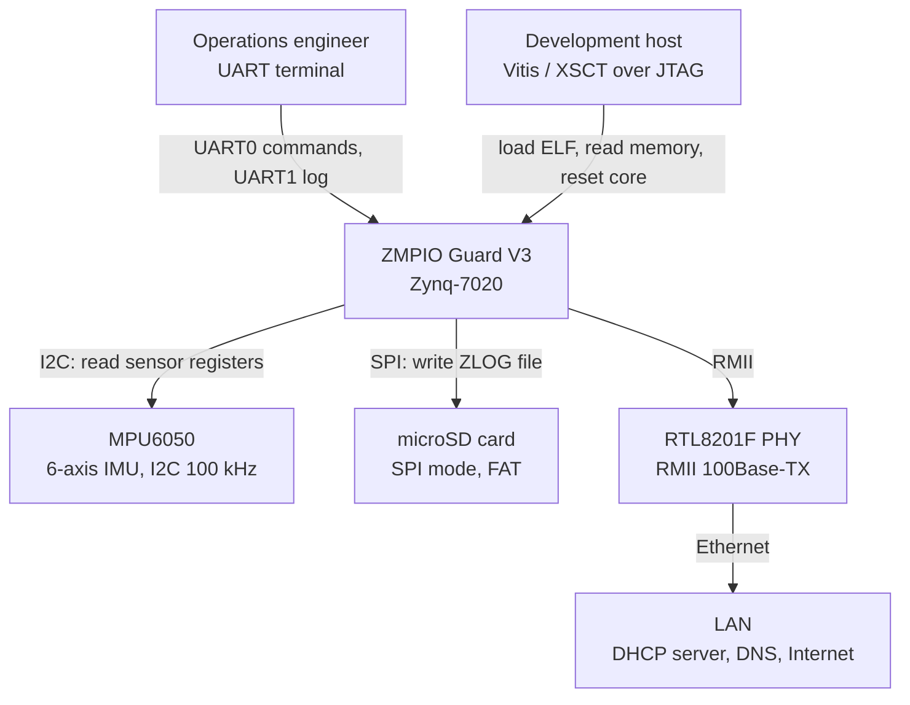
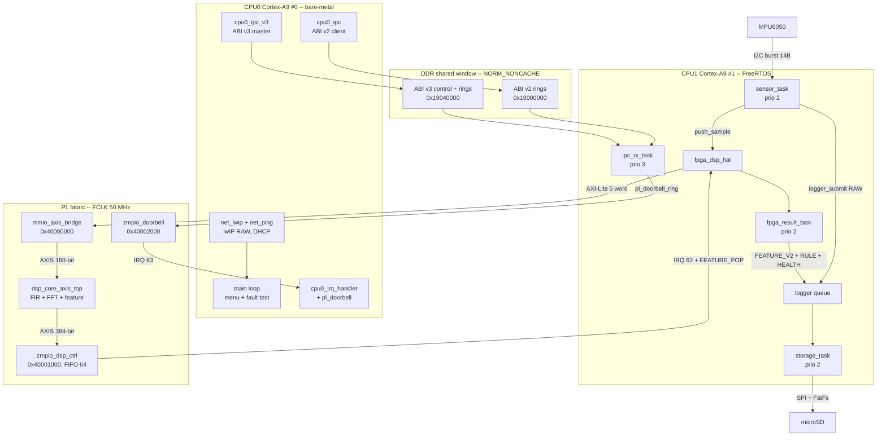
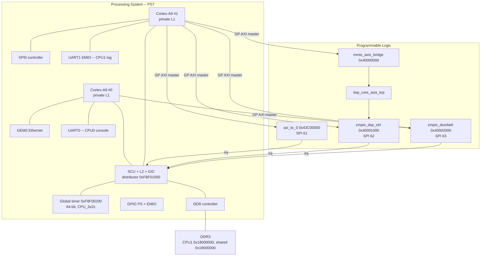
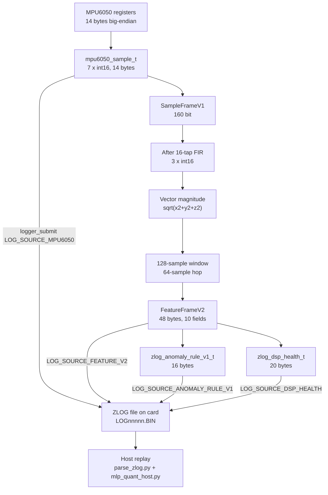
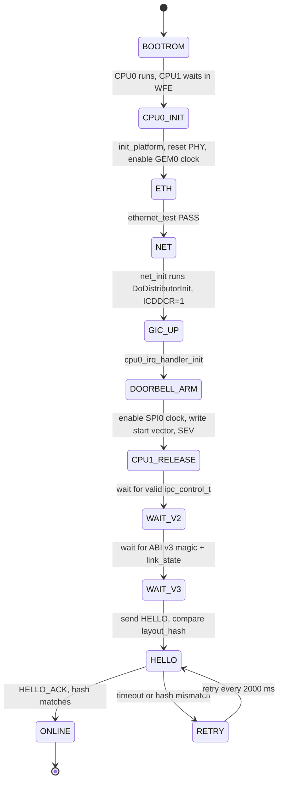
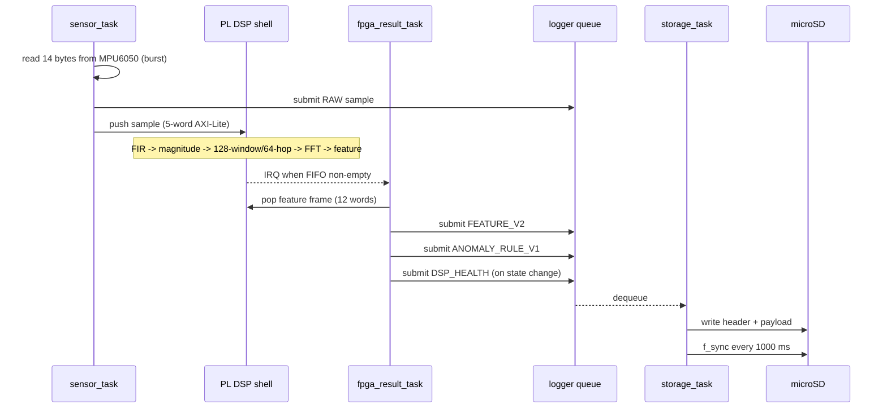
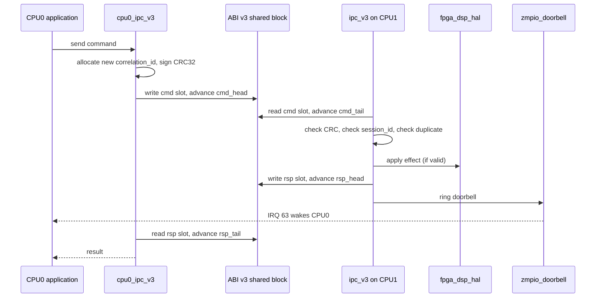
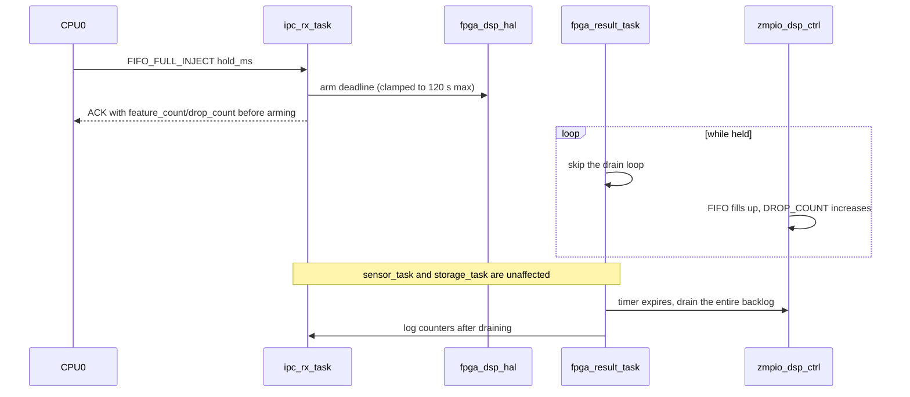
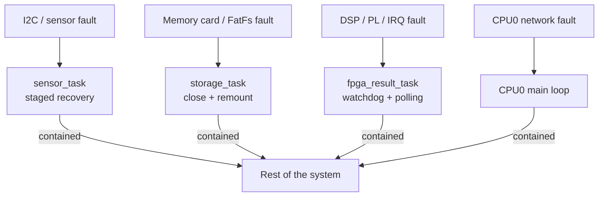

# System Architecture Document (SAD)

**Document ID:** ZMPIO-SAD-001
**Level:** L1 — System Architecture
**System:** ZMPIO Guard V3 — vibration monitoring on Zynq-7020, AMP architecture

> This document answers: *what is the system, what are its major parts, how do they interact, and
> why was this architecture chosen*. It does NOT go into implementation detail — that lives in the
> component design documents under `docs/SDD/` (`SDD_01`..`SDD_14`). Bit-level register, memory-map
> and protocol detail lives in `ARCHITECTURE_DETAIL.md`.

---

## 1. Purpose

ZMPIO Guard V3 acquires vibration signals from an IMU sensor, extracts time-frequency features in
real time on the FPGA fabric, evaluates anomalies, records a complete trace to a memory card, and
lets a host (bare-metal CPU0 today, Linux at the production target) control and observe the system
through shared memory.

The architecture must satisfy two goals that are inherently in tension:

1. **Timing determinism** — the 10 ms sampling period must not drift, and no peripheral hardware
   fault may be allowed to hang that loop.
2. **Observability and control from a multitasking OS** — which offers no timing guarantees.

Everything below follows from splitting those two goals across two different cores.

## 2. Scope

| In scope | Out of scope |
|---|---|
| CPU1 firmware (FreeRTOS) | Machine learning in any form — out of scope for V3 (ADR-017) |
| CPU0 firmware (bare-metal controller) | (production boot packaging **is now in scope** as of Step 7.5) |
| PL shell (3 Verilog modules + 1 HLS IP) | Mechanical design, enclosure, power supply |
| Shared ABI `common/` | Model training (host tool `dsp_host_sim/ml/`) |
| Linux stack `libzmpio`/`zmpiod`/`zmpioctl` (production, `SDD_13`); the earlier `/dev/mem` lab client has been superseded and removed from the source tree | Network security / backend infrastructure |

## 3. Requirements Summary

The requirements with the most architectural influence on this design:

| REQ | Architectural impact |
|---|---|
| REQ-SYS-001 | Three separate execution domains (CPU0 / CPU1 / PL) |
| REQ-SYS-002 | Static peripheral ownership — no resource is contended by two cores |
| REQ-RT-001 | CPU1 must be an RTOS, not Linux |
| REQ-DSP-005 | The entire data path is integer arithmetic → synthesizable to FPGA |
| REQ-IPC-002 | Non-cacheable shared DDR → no manual cache maintenance needed |
| REQ-RT-004 | CPU1 must tolerate CPU0 owning and re-initializing the GIC distributor |
| REQ-IPC-009 | The doorbell is an optimization layered on polling, not a dependency |

## 4. System Context

**D01 — System Context Diagram**



| External actor | Role | Interface |
|---|---|---|
| MPU6050 | the system's sole data source | IF-SEN-001 (I2C) |
| microSD card | persistent storage of the entire trace | IF-STO-001 (SPI) |
| RTL8201F PHY + LAN | CPU0 network connectivity | IF-NET-001 (RMII/MDIO) |
| Operations engineer | issues commands and reads logs | IF-OPS-001 (UART0), IF-OPS-002 (UART1) |
| JTAG host | loads firmware, collects register-level evidence | IF-OPS-003 (JTAG/DAP) |

## 5. System Boundary

Inside the boundary: the two Cortex-A9 cores, the PL fabric, DDR, and the on-chip peripheral
controllers.

The key point to emphasize: **the microSD card and MPU6050 sit OUTSIDE the boundary but INSIDE
CPU1's trust domain.** No other software — including production-target Linux — is permitted to open
`axi_iic_0` or `spi0`. This is an architectural constraint, not a coding convention
(REQ-SYS-002).

Conversely, the GIC distributor sits inside the boundary but belongs to **CPU0**'s domain; CPU1 is
merely a guest on it. The entire defensive layer in `SDD_08_FPGA_DSP_HAL.md` exists because of this.

## 6. High-Level Architecture

**D02 — Architecture Block Diagram**



Three structural principles read off the diagram:

1. **Data flows one way.** Samples travel from the sensor through PL to the memory card; there is no
   feedback loop from the storage tier back to the acquisition tier.
2. **Control flows against the data direction.** Commands go from CPU0 into CPU1; CPU1 never
   initiates a command to CPU0.
3. **The two directions never share a mechanism.** Data travels over unidirectional rings (ABI v2 /
   AXIS FIFO); control travels over CRC-protected command/response (ABI v3). Congestion on one
   channel never propagates to the other.

## 7. Major Components

| ID | Component | Domain | Responsibility | SDD |
|---|---|---|---|---|
| CMP-RT-001 | CPU1 Runtime | CPU1 | scheduler, tasks, timing, UART1 log, configuration | SDD_01 |
| CMP-SEN-001 | MPU6050 Sensor | CPU1 | 100 Hz acquisition, deadline-bounded I2C transport, recovery | SDD_02 |
| CMP-STO-001 | Storage + ZLOG | CPU1 | log queue, FatFs, SD-SPI, self-test, diagnostics | SDD_03 |
| CMP-IPC2-001 | IPC ABI v2 | CPU0+CPU1+Linux | request/response-style data/control ring | SDD_04 |
| CMP-IPC3-001 | IPC ABI v3 | CPU0+CPU1 | CRC-protected command/response, session, layout hash | SDD_05 |
| CMP-PL-001 | PL DSP shell | PL | MMIO→AXIS bridge, feature FIFO, IRQ, soft reset | SDD_06 |
| CMP-DSP-001 | DSP core | PL (HLS) | FIR, FFT, fixed-point feature extraction | SDD_07 |
| CMP-HAL-001 | FPGA DSP HAL | CPU1 | `zmpio_dsp_ctrl` driver, GIC discipline, health | SDD_08 |
| CMP-ANO-001 | Anomaly + health | CPU1 | RMS rule, DSP health hysteresis, ZLOG payload | SDD_09 |
| CMP-DB-001 | Doorbell | PL+CPU0+CPU1 | one-way wakeup for CPU0 | SDD_10 |
| CMP-C0-001 | CPU0 controller | CPU0 | boot CPU1, menu, fault-injection scenarios | SDD_11 |
| CMP-NET-001 | Ethernet/lwIP | CPU0 | GEM0, PHY, DHCP, ICMP, DNS | SDD_12 |
| CMP-LNX-001 | Linux IPC client (`ipc_linux`, `/dev/mem`) | Linux | **superseded by CMP-LNX-002 and removed from the source tree**; kept here only as a historical note, not a shipped component | — |
| CMP-LNX-002 | Linux client stack | Linux | `libzmpio`/`zmpiod`/`zmpioctl`: single reader on the TX ring, doorbell-driven drain, ZLOG capture, sysvinit respawn, `zmpio` group socket policy | SDD_13 |
| CMP-STR-001 | Feature stream | CPU1+Linux | `feature_frame_v2` from CPU1 to Linux over the ABI v2 ring, self-describing loss policy, cross-check against the card | SDD_14 |

## 8. Hardware Architecture

**D03 — HW/SW Mapping**



Fixed hardware figures (full detail: `ARCHITECTURE_DETAIL.md`):

| Item | Value | Source |
|---|---|---|
| PL clock (`FCLK_CLK0`) | 50 MHz | bitstream timing constraint |
| Global timer clock | `CPU_3x2x` = CPU/2 | `platform_time.c` |
| FreeRTOS tick | 100 Hz | `FreeRTOSConfig.h` |
| GIC SPI 61 / 62 / 63 | `axi_iic_0` / `zmpio_dsp_ctrl` / `zmpio_doorbell` | `pl.dtsi` |
| I2C bus | 100 kHz | `pl.dtsi` `xlnx,iic-freq` |
| Memory card SPI | prescaler 256 at init, 32 during data transfer | `app_config.h` |

The single most important entry in the table above: **`zmpio_doorbell` is reachable by both cores
over the same GP AXI path.** The hardware makes no distinction between which core writes. This is
both a feature (CPU0 can self-test the PL→GIC→ISR path without CPU1 generating any traffic) and a
constraint (software must discipline itself: only the CPU1 ring is used in production).

## 9. Software Architecture

### 9.1 CPU1 — FreeRTOS

Four tasks, none of which spawns another task at runtime. Priorities by design:

| Task | Priority | Stack (words) | Cadence | Why this priority |
|---|---|---|---|---|
| `ipc_rx_task` | 3 (highest) | 3072 | continuous poll, sleeps 10 ms when idle | host command latency must not depend on DSP/SD load |
| `sensor_task` | 2 | 3072 | 10 ms absolute | hard deadline |
| `fpga_result_task` | 2 | 1536 | IRQ-driven, 1000 ms watchdog | a frame arrives only every 640 ms — no need for a higher priority than the sensor |
| `storage_task` | 2 | 2048 | queue-driven, 1000 ms sync | equal to the sensor so time-slicing can drain the queue; any lower and it starves |

Giving all three tasks priority 2 is a deliberate choice: a single I2C sample can consume an entire
10 ms tick, so if the writer ran at a lower priority than the sensor it would never run at all.
FreeRTOS time-slicing at the same priority resolves this, while `ipc_rx_task` remains higher to keep
command latency low.

### 9.2 CPU0 — bare-metal

A single `for(;;)` loop, no RTOS, servicing in sequence: `net_poll()` →
`cpu0_irq_handler_service()` → UART0 keypress → periodic sampling → HELLO retry if not yet ONLINE.
ISRs only set flags; the actual work happens in the main loop.

### 9.3 PL

Three hand-written Verilog modules plus one HLS-generated IP. There is no soft CPU and no global
control state machine — each module is autonomous, connected via AXI4-Stream.

## 10. Communication Architecture

| Channel | Direction | Mechanism | Synchronization | Reference |
|---|---|---|---|---|
| ABI v2 TX ring | CPU1 → CPU0/Linux | 256×256B ring in DDR | one owner per index + `dmb` | IF-IPC-001 |
| ABI v2 RX ring | CPU0/Linux → CPU1 | as above | as above | IF-IPC-002 |
| ABI v3 cmd ring | CPU0 → CPU1 | 16 slots × 84B + CRC32 | `cmd_head` (CPU0) / `cmd_tail` (CPU1) | IF-IPC-003 |
| ABI v3 rsp ring | CPU1 → CPU0 | 16 slots × 88B + CRC32 | `rsp_head` (CPU1) / `rsp_tail` (CPU0) | IF-IPC-004 |
| Doorbell | CPU1 → CPU0 | PL register + GIC SPI 63 | level IRQ + ACK | IF-DB-001 |
| Sample push | CPU1 → PL | AXI4-Lite 5 words, commit strobe | `BUSY` + `DROP_COUNT` | IF-PL-001 |
| Feature pop | PL → CPU1 | AXI4-Lite 12 words, last word read pops | FIFO + GIC SPI 62 | IF-PL-002 |
| Sample stream | bridge → core | AXI4-Stream 160-bit | `tvalid`/`tready` | IF-PL-003 |
| Feature stream | core → ctrl | AXI4-Stream 384-bit | `tvalid`/`tready`, back-pressure | IF-PL-004 |

**Important architectural constraint:** ABI v2 and ABI v3 occupy two separate address regions and
share no state field. This is what allows v3 to be brought up without threatening the already-running
v2 stream — and it is also what allows v3 to be disabled entirely while v2 keeps working.

## 11. Data Architecture

**D04 — Data Flow Diagram**



Data principles:

- **Raw samples are logged in parallel with the DSP path, not in place of it.** If the DSP algorithm
  ever changes, old captures can still be replayed from raw samples.
- **Physical-unit conversion happens on the consumer side, not on CPU1.** CPU1 records raw register
  values; full-scale range is a CPU1 configuration detail documented separately, not embedded in the
  data.
- **Every record is self-describing** (magic, version, length, CRC), so an old reader can still parse
  a newer file.

## 12. Runtime / Startup Architecture



This ordering is NOT arbitrary. Three real ordering constraints apply:

1. `cpu0_irq_handler_init()` MUST run **after** `net_init()`, because `net_init()` is what causes
   CPU0 to run `DoDistributorInit()` for the first time; anything touching the GIC must come after
   that.
2. CPU1 is released **after** CPU0 has enabled the `spi0` clock — otherwise the memory card never
   answers CMD0.
3. CPU1 MUST **wait for `ICDDCR` to be set** before arming IRQ 62, because CPU0's
   `DoDistributorInit()` clears the enable bit for every SPI. The wait budget is 12 s (measured on
   real hardware: CPU0 sets ICDDCR roughly 6 s after CPU1 boots) — see ADR-014.

## 13. Critical Sequence Flows

### 13.1 D05a — Main data path: sample → feature → memory card



Cadence: 100 samples/s in, ~1.56 frames/s out. The 64:1 ratio is exactly the hop size — this is
where the data volume drops two orders of magnitude, and why PL earns its place in the pipeline.

### 13.2 D05b — Control path: one ABI v3 command



Four layers of protection in a single round trip: CRC (integrity), `correlation_id` (correct
pairing), `session_id` (never talking to a dead boot session), `layout_hash` (never talking to a
version-mismatched binary).

### 13.3 D05c — "FIFO full" fault injection



Design point: this fault injection is **software-only** — no PL register is touched directly. What
fills the FIFO is PL's own production activity, exactly as it would be under real backpressure.

## 14. Reliability and Error Strategy

Overall strategy: **no peripheral fault may turn into a system-wide hang.** This is realized through
four mechanisms:

| Mechanism | Applies to | Consequence if missing |
|---|---|---|
| Every hardware wait has a deadline | I2C, SD-SPI, waiting on the GIC, waiting on IPC responses | permanent hang inside a driver; the recovery path never runs |
| Mask the IRQ source before draining | `zmpio_dsp_ctrl`, `zmpio_doorbell` | an IRQ storm starves every task |
| Watchdog + fallback polling | IRQ 62 on CPU1 | wakeups are permanently lost when CPU0 re-initializes the GIC |
| Staged recovery, never exit the task | sensor, storage | one peripheral fault kills the whole function |

The full error taxonomy (E1..E8) and per-component error handling live in each component's own
design document (§13/§14 of each `SDD_nn` file under `docs/SDD/`).

Fault containment boundary:



## 15. Security

`N/A at the network-threat level` — the system currently runs on a trusted lab network with no
listening service on CPU0 (only self-initiated ICMP echo and DHCP/DNS client traffic).

The following properties are nonetheless deliberately designed and carry safety value:

| Property | Mechanism | Protects against |
|---|---|---|
| Command integrity | CRC32 per ABI v3 slot | a memory-corrupted slot being accepted as a valid command |
| Intra-session replay protection | `correlation_id` + duplicate cache | a repeated command producing a side effect twice |
| Cross-session command rejection | `session_id` | a command composed before a CPU1 reboot being applied to the new session |
| Version-mismatch rejection | `layout_hash` | two binaries with different layout understandings shaking hands |
| Peripheral isolation | static ownership | any process other than CPU1 touching the memory card/sensor |

Not yet present: command-source authentication (anyone able to write shared DDR can issue commands),
encryption, log-file tamper protection. Tracked as RISK-006.

## 16. Performance Constraints

| Constraint | Value | Real-world margin |
|---|---|---|
| Sampling period | 10 ms absolute | one 14-byte burst @100 kHz ≈ 1.4 ms → ~7x margin |
| I2C transaction deadline | 20 ms | ≈ 15x the valid transfer time |
| Feature production rate | 640 ms/frame | 64-deep FIFO ≈ 41 s of buffering |
| Memory-card sync | ≤ 1000 ms | bounds maximum data loss on power loss |
| GIC wait at startup | 12,000 ms | ~6 s observed in practice; comfortably under the ~16 s wrap period of the 32-bit global timer |
| ABI v3 command timeout | 500 ms × 5 attempts | |
| PL DSP resources | 25/25 DSP48E1 (~11%) @ 50 MHz | timing closed |

Sensor-cycle timing breakdown:

```text
T_cycle = T_i2c_burst + T_logger_submit + T_push_sample + T_uart_log(periodic)
        ≈ 1.4 ms      + microseconds   + microseconds  + ~1 ms every 1000 ms
Requirement: T_cycle << 10 ms   →  met, with roughly 7x margin
```

## 17. Constraints

Mandatory constraints; a violation is an architectural defect:

1. Only `storage_task` may call FatFs/SD-SPI. Linux must not bind `axi_iic_0` or `spi0`.
2. Standalone CPU0 and Linux must never be simultaneous producers on the RX ring.
3. Do not use OCM at `0xFFFF0000`; CPU1 firmware lives at `0x18000000`.
4. Do not use OpenAMP/RPMsg/remoteproc as the data path.
5. No floating-point numbers in CPU1 firmware.
6. Do not modify a closed step's snapshot (`dsp_host_sim/`) while developing a new step.
7. Do not enable `APP_MPU6050_PWR_GPIO_ENABLED=1` before finalizing the PACKAGE_PIN, adding the
   constraint, rebuilding + exporting the XSA, and fitting the real P-MOSFET.
8. After any Vivado/Vitis rebuild, re-verify from scratch on the board — a previous PASS has no
   validity for an artifact built afterward.

## 18. Architecture Decisions

Each decision record below answers exactly four questions: *what is the problem*, *what alternatives
were considered*, *what was chosen*, *what is the cost*. A decision that cannot state its own cost is
not yet an architecture decision. ID convention: `ADR-nnn`, numbers are never reused. Status:
`ACCEPTED` / `SUPERSEDED` / `PROPOSED`.

### ADR-001 — AMP split: RTOS on CPU1, multitasking OS on CPU0

**Status:** ACCEPTED
**Requirement:** REQ-SYS-001, REQ-RT-001

**Context.** The system needs, simultaneously: (a) a 10 ms sampling period with no drift, (b)
networking, a filesystem, and — eventually — ML inference, all of which naturally belong on Linux.

**Alternatives considered**

| Option | Why rejected |
|---|---|
| Linux only, with PREEMPT_RT + isolcpus | Jitter still depends on third-party drivers; a 10 ms deadline over userspace I2C bit-banging cannot be guaranteed |
| Bare-metal on both cores | Loses all of Linux's networking/filesystem/toolchain infrastructure for the upper layers |
| AMP: RTOS on one core, multitasking OS on the other | Chosen |

**Decision.** CPU1 runs FreeRTOS and owns the entire real-time acquisition path. CPU0 runs a
multitasking OS (currently a bare-metal test controller filling that role) and never touches any
real-time peripheral.

**Consequences.**
- (+) Real-time deadlines are guaranteed by a simple, verifiable scheduler.
- (+) The CPU0 side can be reset/upgraded while CPU1 keeps acquiring data.
- (−) The entire cross-core IPC layer has to be built from scratch (leading to ADR-003, ADR-008).
- (−) The GIC distributor is shared but has a single owner — this alone produced an entire class of
  bugs (see ADR-014).

### ADR-002 — Static peripheral ownership, one owner per peripheral

**Status:** ACCEPTED
**Requirement:** REQ-SYS-002

**Context.** The two cores run two different operating systems and share no OS-level synchronization
primitive. No mutex can span that boundary.

**Decision.** Every peripheral has exactly one owner, fixed at design time:

| Peripheral | Owner | How the other side gets information |
|---|---|---|
| `axi_iic_0` (MPU6050) | CPU1 | ABI v2 `MSG_TYPE_SENSOR_DATA` |
| `spi0` (microSD) | CPU1 | ABI v2 `MSG_TYPE_LOG_STATUS`/`LOG_DIAGNOSTIC` |
| `zmpio_dsp_ctrl` | CPU1 | ABI v3 ACK carrying counters |
| GEM0, UART0 | CPU0 | — |
| GIC distributor | CPU0 | CPU1 only reads `ICDDCR`/`ICDISER` for self-defense |
| `zmpio_doorbell` | split by register: CPU1 writes `SET`, CPU0 owns `ACK`/`IRQ_ENABLE` | — |

**Consequences.**
- (+) No class of cross-core peripheral-contention bugs exists.
- (+) `DSP_SOFT_RESET_ACK` carries a counter, so CPU0 gets evidence without reading PL MMIO directly
  — a JTAG-based approach was tried earlier and proved unreliable against a running core.
- (−) Every piece of cross-boundary information, even display-only data, must travel through IPC.

### ADR-003 — Self-defined shared-DDR ring instead of OpenAMP/RPMsg

**Status:** ACCEPTED
**Requirement:** REQ-SYS-004

**Context.** Xilinx provides OpenAMP/RPMsg/remoteproc for AMP on Zynq.

**Why it was not used.**
1. RPMsg requires an `rsc_table` and a lifecycle driven by remoteproc — meaning Linux decides when
   CPU1 is alive. That contradicts ADR-001: CPU1 must run independently, including while CPU0 is
   rebooting.
2. RPMsg's packet format is not self-describing the way this project needs (no per-slot CRC, no
   session id, no layout hash).
3. That abstraction layer would hide exactly what needs to be observable when debugging: the real
   head/tail indices in DDR, readable directly via JTAG.

**Decision.** Define two custom ABIs in shared DDR: ABI v2 (data ring) and ABI v3 (command/response).

**Consequences.**
- (+) Debuggable with `mrd` over JTAG without any agent running.
- (+) Full control over error semantics (CRC, duplicates, session, hash).
- (−) The correctness of the ring, cache behavior, and memory ordering all had to be built and proven
  in-house.
- (−) The leftover `openamp` string in some directory paths is a naming artifact that can be
  misleading; `rsc_table.c/h` exists but is not part of the data path.

### ADR-004 — DSP stays on PL+CPU1; only ML moves to Linux

**Status:** ACCEPTED **in part** — the "DSP stays on PL+CPU1" clause still holds; the "ML moves to
Linux" clause has been **superseded by ADR-017** (ML is removed from V3 scope entirely). The
boundary at the feature frame is unchanged; only what runs on the Linux side changed: `zmpiod`
consumes and stores the feature stream, performing no inference.
**Requirement:** REQ-SYS-005, REQ-ANO-005

**Context.** The original plan considered moving the entire DSP + ML chain to Linux for ease of
development.

**Decision.** The boundary sits at the **feature frame**:

```text
[sensor] → [FIR/FFT/feature]  |  [anomaly inference]
            PL + CPU1          |   Linux (Step 7)
```

**Rationale.**
- Feature extraction is tightly coupled to the sampling cadence and carries a deadline; inference
  does not — it runs on a completed frame, every 640 ms.
- The feature frame reduces data volume 64:1, making this the most sensible place to cut IPC
  bandwidth.
- The DSP chain is already bit-exact and has closed timing on PL; moving it would discard all of
  that evidence.

**Consequences.**
- (+) Changing the ML model requires no change to the bitstream or CPU1 firmware.
- (−) Changing the DSP algorithm requires re-running the full HLS → synth → impl → board cycle.
- (−) `LOG_SOURCE_ANOMALY_ML_V1` exists in the ABI with no producer — after ADR-017 this is its
  final state (RESERVED), not a gap waiting to be filled.

### ADR-005 — All data-path arithmetic is integer fixed-point

**Status:** ACCEPTED
**Requirement:** REQ-DSP-005, REQ-OPS-003

**Decision.** No `float`/`double` anywhere in `dsp_host_sim/fpga/dsp_core` or
`firmware/app_freertos`. Fixed scales: Q15 for coefficients, Q24.8 for RMS/peak, Q16.16 for kurtosis
and frequency, Q32.0 for energy.

**Rationale.**
1. HLS synthesizes integer arithmetic into DSP48E1 slices efficiently and deterministically; float
   would blow up resource usage.
2. Bit-exactness between the host sim and RTL is only achievable without floating point (ADR-006).
3. On FreeRTOS, this avoids having to save/restore VFP context on every task switch.
4. Even seemingly harmless spots follow this rule: `session_id` is derived from a microsecond
   timestamp truncated to 32 bits, and the rule threshold is a precomputed host-side integer
   constant, not a runtime estimate.

**Consequences.**
- (+) Results are perfectly reproducible and debuggable on a PC.
- (−) `integer_sqrt_u64`, `round_shift_q15`, `saturate_*` all had to be hand-written and proven
  correct.
- (−) Every feature must choose its own scale; a wrong scale is a silent bug that only surfaces
  against a golden vector comparison.

### ADR-006 — A single C++ source for DSP, shared by the host sim and HLS

**Status:** ACCEPTED
**Requirement:** REQ-DSP-006

**Context.** The common approach is to write a reference model in Python/MATLAB and reimplement it
separately in RTL. The two versions inevitably drift apart.

**Decision.** `dsp_host_sim/fpga/dsp_core/src/*.cpp` is the ONE source. It is:
- compiled with a host compiler to run regression tests and generate golden vectors;
- `#include`d (not copied) by `hardware/rtl/dsp_core/hls/dsp_core_axis_top.cpp` for HLS synthesis.

The only difference between the two paths is the set of pragmas guarded by `#ifdef __SYNTHESIS__`.

**Consequences.**
- (+) "The model is correct but the hardware is wrong" cannot happen at the algorithm level.
- (+) A fix to the algorithm in one place propagates to both paths.
- (−) The source must be written in a synthesizable HLS style (no dynamic allocation, no recursion,
  statically bounded loops) even though it also runs on the host.
- (−) `dsp_host_sim/` is Step 1's closed snapshot: it must not be modified while another step is in
  progress.

### ADR-007 — A single task owns FatFs; every producer goes through a queue

**Status:** ACCEPTED
**Requirement:** REQ-LOG-002

**Context.** Four sources want to write logs: the sensor (100 Hz), DSP results (1.56 Hz), host
commands, and health events. Xilinx's FatFs is not reentrant the way the project needs, and a single
card write can take tens of milliseconds.

**Decision.** `logger` is a 64-element `log_queue_item_t` queue. Producers only call
`logger_submit()` (non-blocking, `wait_ticks=0`). `storage_task` is the sole consumer and the only
code allowed to call FatFs.

**Consequences.**
- (+) No mutex is needed around FatFs; no deadlock between sensor and storage.
- (+) A slow memory card never slips the sensor deadline — it only fills the queue.
- (−) When the queue is full, a record is dropped; this must be counted
  (`sensor_dropped`/`linux_dropped`).
- (−) `log_queue_item_t` carries the full 240-byte payload inline, so each `logger_submit()` call
  costs ~268 bytes of producer-side stack — one of the reasons task stacks had to be increased.

### ADR-008 — Shared DDR mapped non-cacheable instead of manual cache maintenance

**Status:** ACCEPTED (supersedes the earlier cacheable + `Xil_DCache*Range()` approach)
**Requirement:** REQ-IPC-002

**Context.** CPU0 already mapped the shared window as `NORM_NONCACHE`. CPU1 previously left it
cacheable write-back and issued manual flush/invalidate calls around every ring access.

**Why the old approach cannot be correct.** Cache maintenance on Cortex-A9 operates on whole 32-byte
lines. Both control structs deliberately pack fields owned by two different masters into the same
line:

```text
zmpio_v3_control_t, line 0 (offset 0..31):
  magic, abi_version, layout_hash, cpu1_link_state, session_id, cmd_tail, rsp_head  <- owned by CPU1
  cmd_head at offset 20                                                             <- owned by CPU0
```

When CPU1 writes any field it owns, the whole line becomes dirty and carries a STALE copy of
`cmd_head`. The next `Xil_DCacheFlushRange()` writes that entire line back to DDR and **undoes** the
value of `cmd_head` CPU0 just wrote. No arbiter resolves this conflict.

**Alternatives considered**

| Option | Assessment |
|---|---|
| Pad each field onto its own cache line | Changes the wire ABI and `layout_hash` to buy performance the system doesn't need |
| Finer-grained cache maintenance | Not fixable this way — the problem is the hardware's line granularity |
| Non-cacheable for the whole window | Chosen |

**Decision.** `ipc_shared_mem_init()` calls `Xil_SetTlbAttributes(..., NORM_NONCACHE)` for every
1 MiB section of the shared window, before any ring access. `NORM_NONCACHE` is Normal memory (not
Device), so `memcpy()` and unaligned accesses remain valid.

**Consequences.**
- (+) Eliminates an entire bug class from BOTH ABIs at once.
- (+) Matches what CPU0 was already doing, and matches Xilinx's guidance for AMP shared memory.
- (−) Slightly slower access — negligible, since this window only moves a few hundred bytes per
  second.
- (−) Ordering is still the caller's responsibility: a `dmb` around every index update remains
  mandatory.

### ADR-009 — Auto-generated layout hash + in-place `_Static_assert`

**Status:** ACCEPTED
**Requirement:** REQ-OPS-002

**Decision.** Two protection layers for the ABI, covering two different scenarios:

| Layer | Catches | Detected when |
|---|---|---|
| `_Static_assert(sizeof(...) == N)` | a layout change when rebuilding from the same checkout | compile time |
| `ZMPIO_ABI_V3_LAYOUT_HASH` exchanged in HELLO | **only one side got rebuilt** — CPU1 reloaded, CPU0 still on an old ELF | handshake time |

The hash is generated by `tools/gen_layout_hash.py` from the field list in that script's own `SPEC`
variable; this list must be updated by hand whenever the ABI changes.

A test mechanism is available: defining `ZMPIO_ABI_V3_TEST_FORCE_HASH_MISMATCH=1` on exactly ONE side
simulates a mismatched-binary scenario without needing two separate checkouts.

**Consequences.**
- (+) The most dangerous failure mode (a silent binary mismatch) becomes an explicit, logged error.
- (−) `SPEC` in the script must be kept in sync with the header by hand — if forgotten, the hash
  won't change even though the ABI did. This is a known weak point, mitigated by the
  `_Static_assert` layer.

### ADR-010 — Custom deadline-bounded I2C transport instead of the BSP's

**Status:** ACCEPTED
**Requirement:** REQ-SEN-002, REQ-RT-002

**Context.** `bsp/libsrc/iic/src/xiic_l.c` contains hardware poll loops with no timeout, including one
(`xiic_l.c:576`, on exactly the repeated-start path the MPU6050 driver uses) that only exits on
`TX_EMPTY`, with no exit for `ARB_LOST`/`TX_ERROR`/`BNB`.

**Real-world consequence of using the BSP as-is.** A slave wedging the bus causes
`mpu6050_read_sample()` to never return, so `consecutive_errors` never increments, and the recovery
path plus `vTaskDelayUntil()` never runs. That is a true hang, not degraded performance.

**Decision.** `iic_polled.c` replicates the BSP's exact register sequence (so on-wire behavior is
unchanged), but every wait carries an ARM global-timer deadline, and every wait has an error exit. A
timed-out transfer returns short, which is precisely what feeds the existing recovery path.

**Consequences.**
- (+) A wedged bus becomes a classified fault, not a dead system.
- (+) Distinguishes `bus-busy`/`timeout`/`arb-lost`/`tx-error`.
- (−) A logical copy of the BSP driver must be maintained; if Xilinx patches the BSP, this must be
  reconciled by hand.
- (−) Deadlines use the 32-bit global timer, which wraps roughly every 13-16 s → every budget must
  stay below one wrap period.

### ADR-011 — Level-IRQ discipline: mask at the source before draining

**Status:** ACCEPTED
**Requirement:** REQ-PL-004

**Context.** `zmpio_dsp_ctrl`'s `irq_out` is `IRQ_ENABLE && (FEATURE_READY || RESULT_OVERFLOW)`;
`zmpio_doorbell`'s is `IRQ_ENABLE && PENDING`. Both are level signals that clear neither on ISR entry
nor on EOI.

**Decision — three mandatory rules.**
1. **The ISR masks the source first**, before even releasing a semaphore.
2. **Re-enable only after the condition is truly cleared** — FIFO empty, or `PENDING` ACKed and
   re-checked.
3. **GIC priority must never outrank the tick timer** (see REQ-RT-003).

**Evidence for why all three are needed.** Without (1): the board froze at exactly sample #128 —
precisely the DSP window size, i.e. the first moment the FIFO becomes non-empty. The GIC re-entered
the ISR immediately after every EOI, forever, because only `fpga_result_task` could clear the
condition and it never got to run.

Without (3): a level IRQ at the default priority 0xA0 wins every GIC arbitration against the tick
(0xF0) → `xTickCount` freezes → every `vTaskDelay()` in the system freezes with it.

**Consequences.**
- (+) One pattern applies to every level IRQ from PL, on both cores.
- (−) There is a race window between ACK and the re-check of `PENDING`; CPU0 handles it with a
  bounded 8-iteration ACK loop — once the limit is hit, the source stays masked for one more
  main-loop pass, but never hangs.

### ADR-012 — `SOFT_RESET` is its own reset domain, separate from the global reset

**Status:** ACCEPTED
**Requirement:** REQ-PL-005

**Context.** The fault-injection gate requires resetting PL mid-RUN and proving that I2C/SD/the
scheduler survive it. If `SOFT_RESET` shared the `rst_ps7_0_49M` reset network, it would also reset
`axi_iic_0` — the test would always "fail" for a reason the test itself created.

**Decision.** `zmpio_dsp_ctrl` exposes a dedicated `dsp_soft_rst_n`, asserted by either
`s_axi_aresetn` OR `CONTROL.SOFT_RESET`. It resets `dsp_core_axis_top` + `mmio_axis_bridge` + its own
FIFO/counters, and deliberately does NOT reset:
- its own AXI4-Lite slave interface (resetting it would lock software out — with no way left to
  clear `SOFT_RESET`);
- `axi_iic_0`, which sits on the global reset network.

`SOFT_RESET` is level-sensitive; software generates a pulse with two writes
(`fpga_dsp_hal_soft_reset_pulse()`).

**Consequences.**
- (+) Fault injection isolates exactly what needs isolating.
- (+) The same mechanism serves both normal initialization and fault injection.
- (−) Software must remember to clear the bit; forgetting leaves the DSP permanently stalled while
  AXI keeps responding normally.

### ADR-013 — One-way doorbell, wakeup only

**Status:** ACCEPTED
**Requirement:** REQ-IPC-009, REQ-IPC-010

**Decision.** `zmpio_doorbell` has only 5 registers and carries zero bytes of data. It is a
**latency optimization layered on polling**: CPU0 still polls `rsp_ring` as before; the doorbell just
lets it find out sooner.

Direction: CPU1 → CPU0 only. No reverse-direction doorbell exists.

**Why one-way.** A CPU0 → CPU1 direction would require CPU1 to enable another SPI on the GIC —
exactly the fragile action ADR-014 documents, since CPU0 owns the distributor. The CPU1 → CPU0
direction targets CPU0, where CPU0 enables its own IRQ on the distributor it owns; there is no
cross-core enable-bit race.

**Consequences.**
- (+) The system runs correctly with the doorbell disabled, only slower — this is a mandatory gate
  test.
- (+) A saturating `DBELL_COUNT` is ground truth proving PL never dropped an event, independent of
  whether the IRQ coalesced multiple events.
- (−) CPU1 must still poll to receive commands; there is no way to wake CPU1 from CPU0.

### ADR-014 — CPU1 waits for `ICDDCR`, then re-arms its IRQ via a watchdog

**Status:** ACCEPTED
**Requirement:** REQ-RT-004

**Context (root cause, not symptom).** CPU1's BSP is built with `-DUSE_AMP=1`, so
`DistributorInit()` in `xscugic.c` compiles to an empty `return` — by design, since an AMP master is
expected to have already initialized the distributor. CPU0's BSP has no `USE_AMP`, so its first
`XSetupInterruptSystem()` call runs the full `DoDistributorInit()`: it writes `ICDICER=0xFFFFFFFF`
for every SPI bank, resets every SPI's priority to 0xA0, and only then sets `ICDDCR=1`.

The bring-up script boots CPU1 first, then CPU0 roughly 2 s later. The order is always: CPU1 enables
SPI 62 → CPU0 clears it. This is a deterministic failure, not an intermittent one — it fails on every
run where the GIC starts from reset, and only appears to "work" on runs where a prior CPU0 session
had already left `ICDDCR=1`.

**Decision — two halves.**
1. **Wait before the first arm:** busy-wait up to `APP_DSP_IRQ_GIC_WAIT_MS` = 12,000 ms for
   `ICDDCR`. This must be a busy-wait on the global timer, not `vTaskDelay()`: while `ICDDCR` is
   still 0, the distributor forwards no IRQ at all, including the tick, so a `vTaskDelay()` would
   wait forever.
2. **Watchdog re-arm:** `fpga_result_task` waits on a semaphore with a 1000 ms bound; on every
   timeout it checks the enable bit and re-arms it if lost, while still draining the FIFO if there
   is work to do.

The second half is what actually covers every case: CPU0 restarting, Linux booting — no static wait
budget covers those.

**Consequences.**
- (+) A lost IRQ becomes a recoverable, logged event instead of a silent death.
- (+) The fallback polling path means no data is lost even if the GIC path is completely broken.
- (−) Up to 12 s of busy-wait at startup — acceptable since it happens only once.
- (−) 12 s must stay under the ~16 s wrap period of the 32-bit global timer at `CPU_3x2x` =
  266.64 MHz — a hidden coupling between two constants defined in two different files.

### ADR-015 — Fault injection goes through ABI v3, not JTAG pokes

**Status:** ACCEPTED (supersedes an earlier attempt using `mrd`/`mwr` over JTAG)
**Requirement:** REQ-RT-005

**Context.** The obvious way to "reset PL mid-RUN" is to write directly to `zmpio_dsp_ctrl`
registers via JTAG. In practice, debug-memory access into PL peripheral space against a running core
proved unreliable — this is not an RTL bug.

**Decision.** Every fault injection is an ABI v3 command (`DSP_SOFT_RESET`, `FIFO_FULL_INJECT`),
executed by CPU1 — the actual owner of the MMIO.

**Consequences.**
- (+) Reuses the same send path already proven correct for cache/barrier behavior, as with
  `SET_DSP_CONFIG`.
- (+) The ACK carries counters from before the effect, so evidence lands directly in the UART0 log.
- (+) The test runs without JTAG — meaning it also runs on a deployed system.
- (−) Test code lives inside production firmware and must be guarded by macros
  (`APP_*_FAULT_TEST`) and remembered to be disabled again after collecting evidence.

### ADR-016 — No PASS claim without real-board evidence

**Status:** ACCEPTED
**Requirement:** REQ-OPS-001

**Decision.** A gate is only recorded as PASS when backed by a real artifact: a UART transcript, a
ZLOG file, a timing/utilization report, or a JTAG register-read log. Reasoning from code alone is not
sufficient. A previous PASS has no validity for an artifact rebuilt afterward.

**Why this is an architectural constraint, not a process rule.** Some of the project's most severe
bugs — the IRQ storm at sample #128, the GIC clearing an enable bit, the tick freezing due to two
`XScuGic` instances — were NOT detectable by reading code or by simulation. They only surfaced when
run on real hardware, in the real boot order. If the documentation allowed reasoning to substitute
for evidence, exactly the most dangerous bug class would be the one that got missed.

**Consequences.**
- (+) Recorded status reflects reality, not intent.
- (−) The verification cycle is slow; every rebuild requires another board session.

### ADR-017 — Remove ML from V3 scope

**Status:** ACCEPTED (2026-09-10) — supersedes the "only ML moves to Linux" clause of ADR-004
**Requirement:** REQ-SYS-005, REQ-ANO-005, REQ-STR-*

**Context.** ADR-004 fixed the boundary at the feature frame and assigned anomaly inference (MLP) to
a Linux service at Step 7. By the time Step 7 was actually undertaken, two facts had become clear:

1. **No feature transport to Linux had ever existed.** The assumption that "`zmpio_ml` consumes
   `feature_frame_v2` drained by `zmpiod` over UIO" had never actually been implemented —
   `msg_type_t` had no FEATURE variant, and ABI v3 was only a 16-slot × 64B command/response channel.
   In other words, the hard part of Step 7 was the data path itself, not the inference.
2. **The dataset cannot honestly support model acceptance.** Current thresholds and models are
   derived from a SINGLE manual-shake session, not real mechanical fault modes (bearing wear,
   imbalance, looseness). The Step 3 replay report already showed the consequence: 100% agreement on
   NORMAL frames but only 36%/8% on fault frames, because the model had never seen a real anomaly
   sample.

**Decision.** **V3 runs no machine learning anywhere** — not on PL, not on CPU1, not on Linux. V3's
goal is the ARM + PL chain: vibration → PL DSP → CPU1 → Linux, with evidence of zero data loss.
Anomaly detection in V3 is a **versioned threshold rule** (`rule_anomaly.c`,
`APP_RULE_ANOMALY_VERSION`) — that is threshold logic, not ML, and it **remains unchanged**.

**Why this is a scope reduction, not a deferral.** A model accepted against an unrepresentative
dataset is worse than no model at all: it produces a false confidence figure on a data path that has
not itself been proven loss-free. The correct order is to prove the data path first and add the
model afterward — and "afterward" falls outside V3.

**This does not rewrite history.** Steps 1 and 3 passed gates that referenced the MLP. That evidence
stands; the `dsp_host_sim/` snapshot stands unchanged, and `ml/models/v1/mlp_quant_host.py` stands
unchanged, now marked as a Step 1/3 legacy artifact. This is a deliberate scope reduction, not a
failed gate.

**Consequences.**
- (+) Step 7 focuses on exactly what never existed before: an evidenced CPU1 → Linux data path.
- (−) V3 has no anomaly detection stronger than a univariate RMS threshold; this limitation must be
  stated in any "V3 complete" claim.
- (−) `LOG_SOURCE_ANOMALY_ML_V1 = 6` becomes permanently RESERVED: **its value is kept**, since
  removing it would break the self-describing property of existing captures that already carry that
  record.

### ADR-018 — Feature stream rides the ABI v2 ring, with a single reader

**Status:** ACCEPTED (2026-09-10)
**Requirement:** REQ-STR-001..005, REQ-IPC-*

**Context.** Step 7 needs to move `feature_frame_v2` (48 B, every 640 ms) from CPU1 to Linux. Two
options: add a new ring inside the ABI v3 region, or add a new message type to the existing ABI v2 TX
ring.

**Decision.** Use a **new message type on the existing ABI v2 TX ring**
(`MSG_TYPE_FEATURE_V2 = 0x30`, `MSG_TYPE_DSP_HEALTH = 0x31`, plus `MSG_TYPE_STREAM_STATUS = 0x32`
for request/response cross-checking). Alongside this, **only one Linux process reads the TX ring** —
`zmpiod`.

**Rationale.**
- Adding a ring inside the v3 region would change `ZMPIO_ABI_V3_LAYOUT_HASH`, discarding all Step 4
  and Step 5 board evidence and requiring a full re-run (ADR-016). A third ring is not worth that
  cost.
- The 256-slot × 256B TX ring already exists, has already run a real 1-hour soak, and at 1.5625
  frames/s buffers ~164 seconds — plenty for any daemon-restart scenario.

**The cost, and how it is paid.** The TX ring now carries **two kinds of traffic**: request responses
and unsolicited stream data. Before Step 7, `zmpio_v2_request()` read the ring and **discarded** any
message that didn't match its `request_id` — with a shared ring, that is deterministic data loss (a
`zmpioctl status` call in the middle of a session would swallow frames passing through). The fix:

1. **A single drain-and-demux loop** in `libzmpio` (`drain_one()`): stream messages go to a sink,
   responses go to whoever is waiting or to a bounded orphan queue. No function silently advances
   `tail` and discards a message it doesn't care about.
2. **Exactly one reader**: the earlier `/dev/mem` lab client must be absent from the production
   image. Two readers on an SPSC ring is deterministic data loss, not a probabilistic risk.

Both points have host-side regression tests requiring no board:
`software/linux/tests/zmpio_v2_demux_test.c`.

**Consequences.**
- (+) The v3 `layout_hash` is unchanged → Step 4/5 evidence remains valid.
- (+) Loss is self-describing in the stream (`dropped_since_last`), not inferred from a separately
  read counter.
- (−) The "single reader" discipline becomes an architectural constraint that must be enforced at
  packaging time, not merely a documentation note.

## 19. Risks

| ID | Risk | Probability | Impact | Current mitigation | Residual |
|---|---|---|---|---|---|
| RISK-001 | Non-deterministic Data Abort on CPU1 (still-open bug class) | Medium | High — loss of a capture session | Stack increased on all 4 tasks; `ipc_rx_task` ruled out as a self-inflicted stack overflow via a 420 s stress run with hook monitoring | Root cause not yet identified |
| RISK-002 | I2C recovery is best-effort only | High | Medium — may require manual unplug | `iic_bus_force_recover()` forces an SCL sequence | GPIO power-cycling not yet usable |
| RISK-003 | Rule thresholds derived from a single manual-shake session | High | Medium — false positives/negatives on real faults | Threshold is versioned; dataset and derivation method are recorded | Needs a multi-mode fault dataset |
| RISK-004 | `SET_DSP_CONFIG` does not yet change PL behavior | Certain | Low currently | Validation + correct ACK/NACK; `CONFIG_SEQ` bumps correctly | Needs a real config write path down to PL |
| RISK-005 | The Linux branch is not yet production-hardened everywhere | Certain | High for the final target | ABI is stable and demonstrated on real hardware | Large-scale acceptance (soak, cold-boot repetition, byte-for-byte reconciliation) deliberately deferred |
| RISK-006 | No command-source authentication on ABI v3 | Low in the lab | Medium if deployed | CRC + session + hash catch random corruption | Does not defend against an attacker with DDR write access |
| RISK-007 | CPU0 owns the GIC and can clear CPU1's IRQ at any time | Medium | High — silent wakeup loss | Wait for `ICDDCR` + watchdog + fallback polling | No control over when Linux re-initializes the distributor |

## 20. Traceability

| REQ | ARCH (SAD section) | CMP | Verify |
|---|---|---|---|
| REQ-SYS-001 | §6, §8, §9 | CMP-RT-001, CMP-C0-001, CMP-PL-001 | TEST-SYS-001 |
| REQ-SYS-002 | §5, §10 | all | TEST-SYS-002 |
| REQ-SYS-003 | §12 | CMP-C0-001 | TEST-SYS-003 |
| REQ-SYS-005 | §7, §11 | CMP-DSP-001, CMP-ANO-001 | TEST-SYS-005 |
| REQ-SEN-001..006 | §11, §16 | CMP-SEN-001 | TEST-SEN-* |
| REQ-DSP-001..007 | §11 | CMP-DSP-001 | TEST-DSP-* |
| REQ-PL-001..005 | §8, §10 | CMP-PL-001, CMP-HAL-001 | TEST-PL-* |
| REQ-LOG-001..008 | §11, §14 | CMP-STO-001 | TEST-LOG-* |
| REQ-IPC-001..010 | §10, §13.2 | CMP-IPC2-001, CMP-IPC3-001, CMP-DB-001 | TEST-IPC-*, TEST-DB-* |
| REQ-ANO-001..005 | §11 | CMP-ANO-001 | TEST-ANO-* |
| REQ-RT-001..005 | §9.1, §14, §16 | CMP-RT-001, CMP-HAL-001 | TEST-RT-* |
| REQ-NET-001 | §8, §12 | CMP-NET-001 | TEST-NET-001 |

This table is illustrative of the trace discipline the project follows; the exhaustive
requirement-by-requirement catalog and its test evidence are maintained alongside the source tree,
not reproduced in full here.
