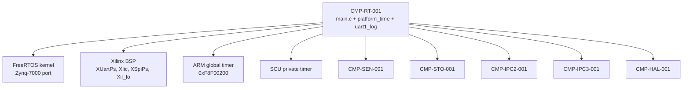
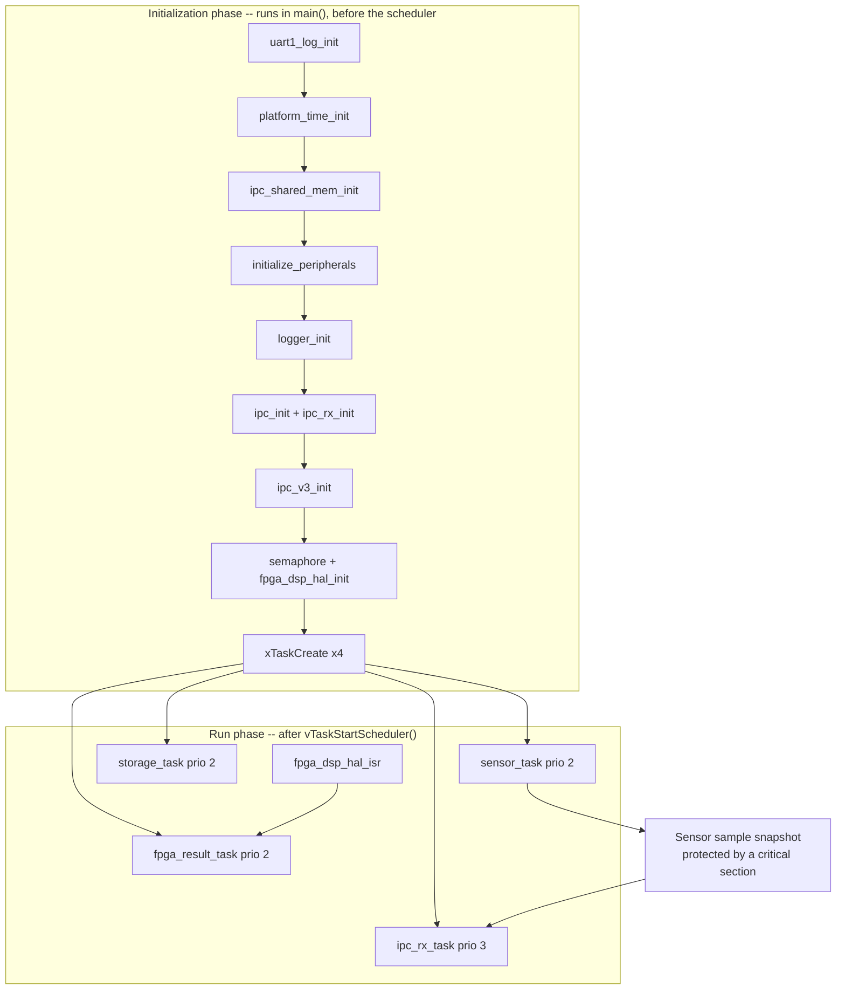
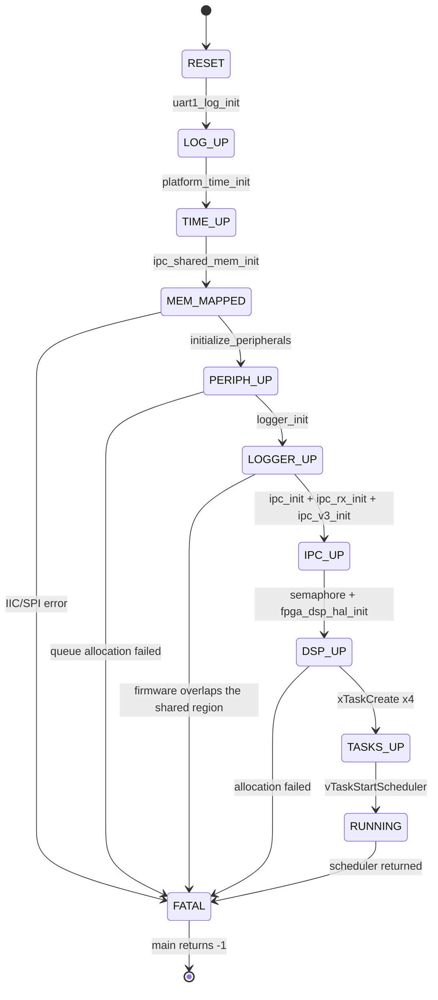
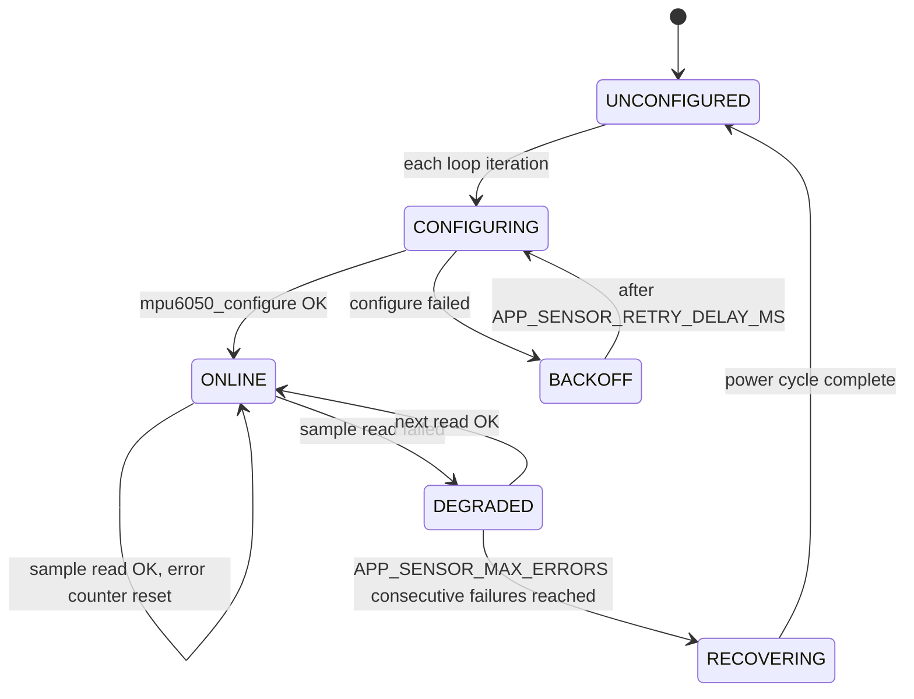
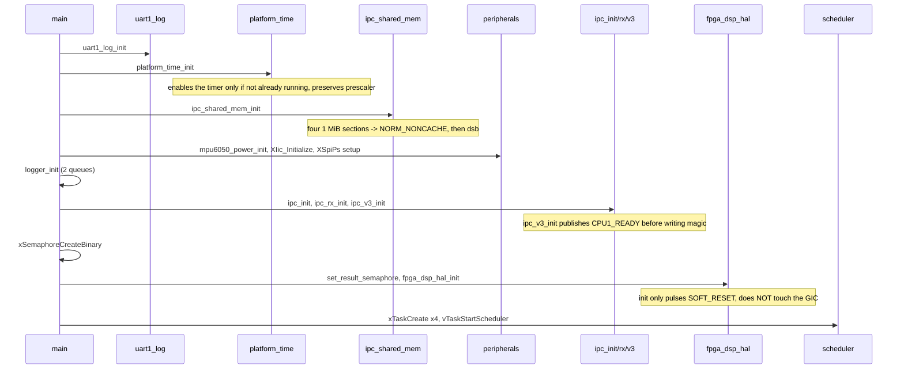
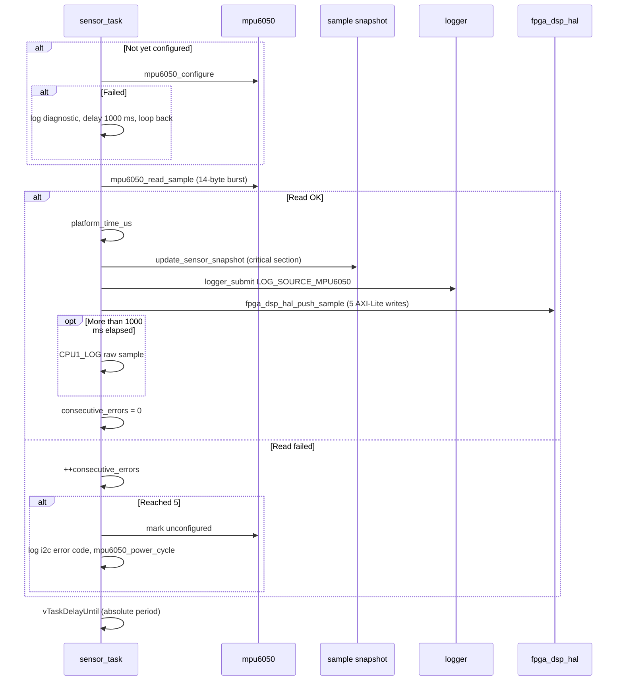
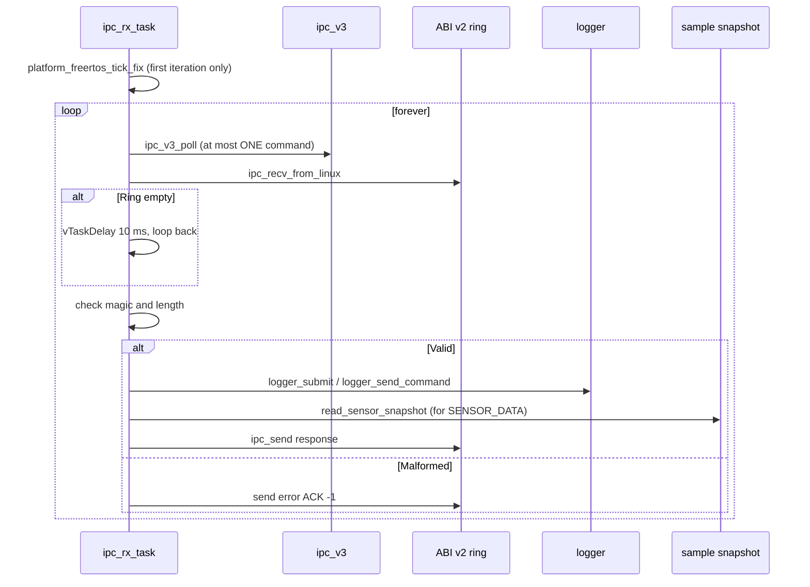
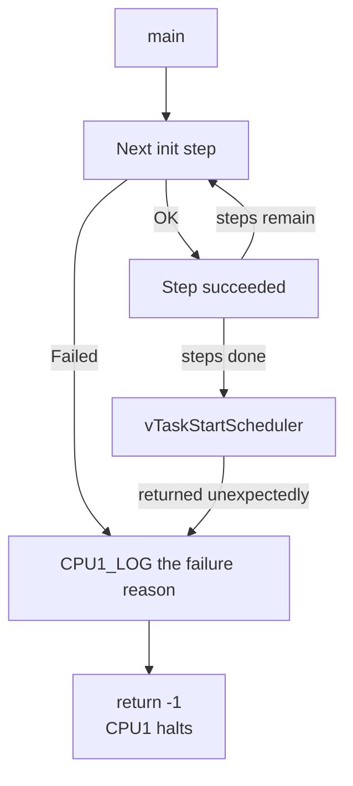

# SDD_01 — CPU1 Runtime (CMP-RT-001)

**Document ID:** ZMPIO-SDD-01
**Component:** CMP-RT-001 — CPU1 execution framework
**Level:** L2 — Detailed Design
**Source:** `firmware/app_freertos/src/main.c`, `app_config.h`, `platform_time.{c,h}`,
`uart1_log.{c,h}`, `cpu1_log.h`

---

## 1. Purpose

This component is the **framework** every other CPU1 component runs inside: it initializes hardware
in the correct order, creates four tasks, provides a time source, corrects a BSP tick configuration
defect, and provides an independent logging channel.

It implements no business logic of its own. Its value lies in **ordering** and **constraints** —
and almost every constraint documented here exists because of a failure mode that was actually
observed on hardware.

## 2. Responsibility

### MUST

- Initialize, in this order: UART1 log → time source → shared-memory MMU mapping → peripherals →
  logger → IPC v2 ring → ABI v3 → semaphore + DSP HAL → task creation → scheduler start.
- Ensure `ipc_shared_mem_init()` runs **before** any access to shared memory.
- Ensure `fpga_result_semaphore` exists **before** `fpga_dsp_hal_init()` can enable its IRQ.
- Correct the SCU private timer reload after the scheduler has started
  (`platform_freertos_tick_fix()`).
- Provide `platform_time_us()` (absolute reference) and `platform_time_counter()` (tick-independent
  deadlines).
- Provide `CPU1_LOG()` on a UART not shared with anyone else.
- Keep every tunable parameter in one place (`app_config.h`), with the rationale for each value.

### MUST NOT

- MUST NOT touch any peripheral register owned by another component (`XIic`, `XSpiPs`,
  `zmpio_dsp_ctrl`) beyond one-time initialization and binding.
- MUST NOT create or delete tasks at runtime — the task set is fixed.
- MUST NOT use floating-point arithmetic.
- MUST NOT call `fpga_dsp_hal_irq_start()` from `main()`; it must run from within a task, after
  `vTaskStartScheduler()`.
- MUST NOT print log output to UART0 (the CPU0/Linux channel).

## 3. Non-Responsibilities

| Not owned by this component | Owned by |
|---|---|
| I2C protocol and recovery | CMP-SEN-001 (SDD_02) |
| FatFs, SD-SPI, log queue | CMP-STO-001 (SDD_03) |
| IPC ring semantics | CMP-IPC2-001, CMP-IPC3-001 (SDD_04, SDD_05) |
| PL registers and GIC discipline | CMP-HAL-001 (SDD_08) |
| Anomaly evaluation | CMP-ANO-001 (SDD_09) |

## 4. Dependencies



Dependencies are one-directional: business-logic components never call back into `main.c`. The one
exception is `CPU1_LOG()` — every component uses it, so `cpu1_log.h` deliberately depends on nothing
but `app_config.h`.

## 5. Architecture



**Four ordering constraints in the initialization phase are mandatory, not arbitrary:**

1. `platform_time_init()` runs before anything that needs a time reference (`ipc_v3_init()` derives
   `session_id` from it).
2. `ipc_shared_mem_init()` runs before `ipc_init()`/`ipc_rx_init()`/`ipc_v3_init()` — reversing this
   order would let those functions write to memory that is still cacheable, reproducing exactly the
   class of bug ADR-008 eliminates.
3. `mpu6050_power_init()` (inside `initialize_peripherals()`) runs before the first I2C transaction —
   a JTAG reload only resets the AXI IIC core in the PL, not the MPU6050 chip itself, so a bus stall
   left over from a previous run survives across a fresh firmware load.
4. `fpga_dsp_hal_set_result_semaphore()` runs before `fpga_dsp_hal_init()` — reversing this order
   would let the ISR run with a `NULL` semaphore pointer.

## 6. Module Structure

| Module | ID | File | Role |
|---|---|---|---|
| Boot orchestration | MOD-RT-001 | `main.c` | init order, task creation |
| Task bodies | MOD-RT-002 | `main.c` | `sensor_task`, `fpga_result_task`, `ipc_rx_task` |
| Sensor sample snapshot | MOD-RT-003 | `main.c` | shares the latest sample between two tasks |
| Time source | MOD-RT-004 | `platform_time.{c,h}` | global timer, tick fix |
| UART1 log | MOD-RT-005 | `uart1_log.{c,h}`, `cpu1_log.h` | dedicated log channel |
| Configuration | MOD-RT-006 | `app_config.h` | every tunable constant |

## 7. File Structure

### FILE-RT-001 — `main.c`

| Field | Value |
|---|---|
| Component | CMP-RT-001 |
| Layer | application / composition root |
| Runtime owner | CPU1, `main()` context then 3 of the 4 task contexts |

**MUST**

- Own the `XIic`, `XSpiPs`, `mpu6050_t`, `sd_spi_t` instances (static, file scope) and bind them to
  the corresponding components.
- Own the sensor sample snapshot and every access to it.
- Define the bodies of `sensor_task`, `fpga_result_task`, `ipc_rx_task`.

**MUST NOT**

- MUST NOT implement protocol details (I2C, SPI, ring logic). It only orchestrates.
- MUST NOT access the sensor sample snapshot outside `update_sensor_snapshot()`/
  `read_sensor_snapshot()`.
- MUST NOT return from `main()` on the success path.

### FILE-RT-002 — `platform_time.c`

| Field | Value |
|---|---|
| Layer | HAL |
| Runtime owner | CPU1, every context including before the scheduler starts |

**MUST**

- Preserve the prescaler in the global timer's shared control register — Linux may have set it to a
  nonzero value and may still be using this timer as its clocksource.
- Read the 64-bit global timer tear-free (read HIGH, LOW, HIGH again, and retry if HIGH changed).
- Enable the timer only if it isn't already running.

**MUST NOT**

- MUST NOT clear or overwrite the prescaler.
- MUST NOT depend on the FreeRTOS tick in any function — this independence is exactly what makes it
  usable in places where the tick does not yet exist.

### FILE-RT-003 — `uart1_log.c`

**MUST** initialize UART1 via `XUartPs_CfgInitialize()` (the FSBL does not program UART1's baud
divisor, since its own console is on UART0) and cap each log line to a 160-byte buffer.

**MUST NOT** write to UART0, and MUST NOT block while the UART isn't ready (silently skip instead).

## 8. Interfaces

### 8.1 Public API

| Function | Thread-safe | ISR-safe | Blocking |
|---|---|---|---|
| `platform_time_init()` | no (called once) | no | no |
| `platform_time_us()` | yes | yes | no |
| `platform_time_counter()` | yes | yes | no |
| `platform_time_us_to_counts()` | yes | yes | no |
| `platform_freertos_tick_fix()` | no (called once) | no | no |
| `uart1_log_init()` | no (called once) | no | no |
| `uart1_log_write()` | **no** | no | yes (polled) |

**Caveat on `uart1_log_write()`:** it is not thread-safe (shares one static 160-byte buffer) and it
**blocks** until the last byte has left the UART FIFO. At 115200 baud, a 100-character line takes
roughly 8.7 ms — nearly an entire sensor cycle. This is why sensor sample logging is throttled to
every `APP_SENSOR_UART_LOG_INTERVAL_MS` = 1000 ms rather than printed on every sample.

### 8.2 FUNC-RT-001 — `platform_time_us()`

**Identity**

| Field | Value |
|---|---|
| Signature | `uint64_t platform_time_us(void)` |
| Thread-safe | YES (read-only) |
| Reentrant | YES |
| ISR-safe | YES |
| Blocking | NO |

**Purpose:** returns the absolute time in microseconds since the global timer started running.

**Parameters:** none.

**Preconditions:** `platform_time_init()` has run, or another agent (Linux) has already enabled the
timer. If the timer is not running, the function returns a frozen value — this is not a
detectable error.

**Processing Steps**

```text
Step 1 — Read the 64-bit counter tear-free
  Read HIGH, read LOW, read HIGH again; retry if HIGH changed.
  Reason: the counter can carry from LOW into HIGH between two MMIO reads.

Step 2 — Get the effective frequency
  counts_per_second = (CPU_CORE_CLOCK / 2) / (prescaler + 1)
  prescaler is read from the shared control register, NOT assumed to be 0.

Step 3 — Convert to microseconds without overflow
  us = (ticks / cps) * 1e6 + ((ticks % cps) * 1e6) / cps
  Split into integer and remainder parts to avoid 64-bit overflow while keeping precision.
```

**Return Contract**

| Return value | Meaning | Caller obligation |
|---|---|---|
| any `uint64` | microseconds since the timer started | use as a reference point; do not assume the origin is boot time |

**Postconditions:** no side effects; no register is written.

**Timing:** three to four MMIO reads plus two 64-bit divisions. Noticeably more expensive than
`platform_time_counter()` — which is exactly why hardware polling loops use the latter instead.

**Given / When / Then**

| Scenario | Given | When | Then |
|---|---|---|---|
| RT-001-01 normal | timer running, prescaler = 0 | called twice 1 ms apart | difference ≈ 1000, within counter tolerance |
| RT-001-02 LOW-to-HIGH carry | LOW about to wrap | called exactly at the wrap | value increases monotonically, never jumps backward |
| RT-001-03 nonzero prescaler | Linux set prescaler = 3 | called | time still reports on the correct scale, not 4x too fast |
| RT-001-04 timer not running | nobody has enabled the timer | called repeatedly | returns a constant value (known limitation) |

### 8.3 FUNC-RT-002 — `platform_time_us_to_counts()`

**Signature:** `uint32_t platform_time_us_to_counts(uint32_t microseconds)`

**Parameters**

| Parameter | Type | Direction | Unit | Valid range | Boundary behavior |
|---|---|---|---|---|---|
| `microseconds` | u32 | IN | µs | `0 .. 0xFFFFFFFF` | a value that would overflow the multiplication is clamped to `0xFFFFFFFF` |

**Decision Table**

| Condition | Action | Result |
|---|---|---|
| `counts_per_us == 0` (broken prescaler) | force to 1 | timeouts still function, just longer than intended |
| `microseconds > 0xFFFFFFFF / counts_per_us` | clamp | returns `0xFFFFFFFF` |
| otherwise | multiply | `microseconds * counts_per_us` |

**Why `counts_per_us` is forced to 1 instead of raising an error:** a value of 0 would turn EVERY
deadline into "already expired," meaning every I2C transaction would fail instantly. A timeout that
runs longer than intended degrades gracefully; a timeout of zero fails completely.

### 8.4 FUNC-RT-003 — `platform_freertos_tick_fix()`

**Signature:** `void platform_freertos_tick_fix(void)`

**Purpose:** corrects the SCU private timer reload value. Vitis 2023.2 SDT's `xiltimer` computes the
reload based on the TTC/`CPU_1x` frequency, while the Cortex-A9 private timer actually runs off
`CPU_3x2x` (CPU/2). Without this correction, the tick runs at the wrong frequency and every
`vTaskDelay()` interval is off-scale.

**Preconditions (mandatory — violating them is a silent bug)**

- The scheduler has started and has already configured the private timer.
- Called from the highest-priority task, as its very first line, before other tasks can consume any
  ticks.

**Processing Steps**

```text
Step 1 — Compute the correct reload: (CPU_CORE_CLOCK / 2) / configTICK_RATE_HZ
Step 2 — Enter a critical section
Step 3 — Write both LOAD and the running COUNTER (not just LOAD --
         writing only LOAD would let the current cycle finish with the old value)
Step 4 — Clear the ISR's pending event flag
Step 5 — Exit the critical section
```

**Concurrency:** must be atomic with respect to the tick ISR itself, hence the critical section.

## 9. Data Structures

| Structure | Declared in | Owned by | Protected by |
|---|---|---|---|
| `XIic iic_instance` | `main.c` static | CMP-SEN-001 after binding | touched only by `sensor_task` |
| `XSpiPs spi_instance` | `main.c` static | CMP-STO-001 after binding | touched only by `storage_task` |
| `mpu6050_t mpu6050` | `main.c` static | `sensor_task` | single task only |
| `sd_spi_t sd_card` | `main.c` static | `storage_task` via `diskio_sd` | single task only |
| `latest_sensor_sample` + `latest_sensor_timestamp_us` + `latest_sensor_available` | `main.c` static | written by `sensor_task`, read by `ipc_rx_task` | `taskENTER_CRITICAL()` |
| `fpga_result_semaphore` | `main.c` static | created in `main()`, given in the ISR, taken in `fpga_result_task` | the semaphore itself |
| `fpga_sample_sequence` | `main.c` static | `sensor_task` only | single task only |

**Why the sensor sample snapshot needs a critical section rather than just `volatile`:** it consists
of 14 bytes of data + a 64-bit timestamp + a flag — not one atomic word. Without protection,
`ipc_rx_task` (higher priority) could interleave mid-update with `sensor_task` and read a sample
assembled from two different measurements.

## 10. State Machine

### STATE-RT-001 — Boot lifecycle



| Current state | Event | Guard | Action | Next state |
|---|---|---|---|---|
| `MEM_MAPPED` | `XIic_Initialize` fails | — | log the reason | `FATAL` |
| `PERIPH_UP` | `xQueueCreate` returns `NULL` | heap exhausted | log | `FATAL` |
| `LOGGER_UP` | `&end > SHARED_MEM_BASE` | firmware too large | log the address | `FATAL` |
| `TASKS_UP` | `vTaskStartScheduler` returns | not enough heap for the idle task | log | `FATAL` |

**Known limitation:** `FATAL` simply means `main()` returns `-1`. There is no watchdog, no automatic
reset, no error LED. CPU1 stops silently and CPU0 only learns of it via timeout. See §20.

### STATE-RT-002 — `sensor_task`



## 11. Runtime Sequence

### 11.1 Boot, through scheduler start



**Point of note:** `fpga_dsp_hal_init()` deliberately does NOT touch the GIC. Arming the IRQ is
deferred entirely to the first line of `fpga_result_task` — see SDD_08 for the three independent
reasons behind that decision.

### 11.2 One `sensor_task` cycle



### 11.3 `ipc_rx_task`



**Why `ipc_v3_poll()` drains exactly one command per iteration:** to keep the two channels from
starving each other. If v3 drained its entire ring in one pass, a burst of v3 commands would stall
the v2 path, and vice versa.

## 12. Algorithms

This component contains no signal-processing algorithms. Three computations worth documenting:

**Tear-free 64-bit global timer read** — see FUNC-RT-001 Step 1.

**Overflow-safe microsecond-to-counter conversion** — see FUNC-RT-002.

**Absolute sensor cycle period:**

```text
sample_period = configTICK_RATE_HZ / APP_SENSOR_RATE_HZ = 100 / 100 = 1 tick = 10 ms
if sample_period == 0, force it to 1   (guards against SENSOR_RATE being set above TICK_RATE)
vTaskDelayUntil(&last_wake, sample_period)
```

`vTaskDelayUntil()` rather than `vTaskDelay()`: it maintains an **absolute** period, so processing
time from a previous cycle does not accumulate into drift. `last_wake` is reset after every
error/reconfiguration path to prevent the task from "catching up" by running several undelayed
cycles in a row.

## 13. Error Handling

| Error | Class | Detection | Immediate action | Recovery | Escalation |
|---|---|---|---|---|---|
| `uart1_log_init()` fails | E6 hardware | return code | ignore, `uart1_ready` = false | none | none — logging is optional |
| `XIic_Initialize()` fails | E6 | return code | log, return `XST_FAILURE` | none | `main()` returns `-1` |
| SPI configuration not found | E6 | `NULL` | log | none | `main()` returns `-1` |
| `logger_init()` fails | E3 resource | nonzero return | log | none | `main()` returns `-1` |
| Firmware overlaps the shared region | E7 invariant violation | `&end > SHARED_MEM_BASE` | log the actual address | none | `main()` returns `-1` |
| Semaphore/task creation fails | E3 | `NULL`/`pdFAIL` | log | none | `main()` returns `-1` |
| `vTaskStartScheduler()` returns | E8 critical | control flow | log | none | `main()` returns `-1` |
| Sensor read fails | E5 communication | return code | count | staged recovery (SDD_02) | never kills the task |

**Initialization phase error flow:**



**Known weakness:** every initialization failure leads to the same outcome — a silent halt. There is
no distinction between "hardware missing" (sensor not connected) and "software failure" (heap
exhausted). The only evidence is the UART1 log line immediately preceding the halt.

## 14. Concurrency

| Execution context | Runs | Priority |
|---|---|---|
| `main()` before the scheduler | the entire init phase | not applicable |
| `ipc_rx_task` | IPC v2 + v3 polling | 3 |
| `sensor_task` | sample acquisition | 2 |
| `fpga_result_task` | FIFO drain, rule evaluation, health | 2 |
| `storage_task` | FatFs | 2 |
| `fpga_dsp_hal_isr` | mask IRQ + give semaphore | IRQ context, GIC priority `0xF0` |
| tick ISR | scheduler | GIC priority `0xF0`, ID 29 |

**Synchronization objects**

| Object | Kind | Held by | Deadlock risk |
|---|---|---|---|
| `fpga_result_semaphore` | binary | given in the ISR, taken in `fpga_result_task` | none — no other lock is held while taking it |
| `tx_mutex` (SDD_04) | mutex | every task sending IPC | low — no nested locking inside |
| critical section around the sample snapshot | interrupts disabled | `sensor_task`, `ipc_rx_task` | none — very short region, calls nothing |
| critical section inside `logger` | interrupts disabled | every task | none — only updates counters |

**Giving all three tasks priority 2 is a deliberate choice.** A single I2C sample can occupy an
entire 10 ms tick; if `storage_task` sat below `sensor_task`, it would never get scheduled and the
log queue would fill permanently. FreeRTOS time-slicing at the same priority resolves that, while
`ipc_rx_task` keeps a higher priority so host command response time doesn't depend on DSP or SD-card
load.

**No lock crosses the two-core boundary.** All synchronization with CPU0 relies entirely on a
single-writer-per-field rule, combined with `dmb` and non-cacheable mapping (ADR-008).

## 15. Timing

| Quantity | Value | Constraint |
|---|---:|---|
| Tick period | 10 ms | `configTICK_RATE_HZ` = 100 |
| Sensor cycle | 10 ms absolute | = 1 tick; the shortest period representable |
| Backoff on sensor configuration error | 1000 ms | |
| Raw-sample UART log interval | 1000 ms | throttled to avoid eating into the task's time budget |
| Sleep when the v2 ring is empty | 10 ms | |
| DSP IRQ watchdog | 1000 ms | SDD_08 |
| SD-card sync | 1000 ms | SDD_03 |

**Sensor cycle budget analysis:**

```text
T_cycle = T_i2c + T_snapshot + T_logger + T_push + T_uart
        = ~1.4 ms + microseconds + microseconds + microseconds + ~1 ms every 1000 ms
Requirement: T_cycle < 10 ms  →  met, with roughly 7x margin
Worst case: T_i2c hits its 20 ms deadline  →  ONE tick is skipped
```

The worst case is acceptable because it only occurs on the error path, and a single skipped sample
is a much lighter consequence than hanging the entire task (which is exactly what happened before
ADR-010).

**Hidden coupling between the 100 Hz tick and the sample rate:** since `sample_period` is expressed
in whole ticks, `APP_SENSOR_RATE_HZ` cannot exceed `configTICK_RATE_HZ`. Sampling faster than 100 Hz
requires raising the tick rate first — a constraint not documented anywhere else in the code.

## 16. Resource / Memory Usage

| Resource | Used | Note |
|---|---:|---|
| Four task stacks | 38.9 KiB | see `ARCHITECTURE_DETAIL.md` §3.2 |
| FreeRTOS heap | ~56 KiB / 64 KiB | ~12% margin |
| `main.c` static variables | ~1.5 KiB | `XIic` + `XSpiPs` + device structs |
| `uart1_log` buffer | 160 B static | shared, not thread-safe |
| MMIO registers | 3 regions | global timer, SCU timer, UART1 |

## 17. Configuration

All parameters live in `app_config.h`. The table below lists only the portion owned by this
component; other components' parameters are documented in their own SDDs.

| Constant | Value | Meaning | Effect of changing it |
|---|---:|---|---|
| `APP_SENSOR_RATE_HZ` | 100 | sample rate | must stay ≤ `configTICK_RATE_HZ`; changing it also changes the DSP frame cadence |
| `APP_SENSOR_RETRY_DELAY_MS` | 1000 | backoff on configuration error | too short floods the bus when the sensor is absent |
| `APP_CPU1_UART_LOG_ENABLED` | 1 | enables UART1 logging | setting it to 0 strips all log strings from the binary |
| `APP_SENSOR_UART_LOG_INTERVAL_MS` | 1000 | raw-sample print cadence | too short eats into the 10 ms budget |
| `APP_*_TASK_STACK_WORDS` | 3072/3072/2048/1536 | per-task stack | every increase requires recomputing the heap margin |
| `APP_*_TASK_PRIORITY` | 3/2/2/2 | priorities | changing this breaks the anti-starvation reasoning in §14 |

**Mandatory convention for `app_config.h`:** every non-obvious constant must carry a comment
explaining **why** that value was chosen, and if the value comes from an empirical observation, that
observation must be stated. This is why the file is unusually long for a configuration file — and
exactly what makes it valuable.

## 18. Logging / Debug

| Channel | Content | When |
|---|---|---|
| UART1 (`CPU1_LOG`) | all CPU1 logging | always |
| ZLOG | data, not diagnostic logging | always |
| JTAG | memory, PC, task name inspection | during investigation |

**Key log lines for this component**

| Line | Meaning |
|---|---|
| `CPU1: starting MPU6050/IPC SD logger` | firmware has reached `main()` |
| `CPU1: shared DDR 0x... mapped non-cacheable` | the MMU mapping has been applied — a missing line means ADR-008 is not in effect |
| `CPU1: firmware end 0x... overlaps IPC memory` | firmware is too large; a build-time defect, not a runtime one |
| `CPU1: scheduler stopped unexpectedly` | heap too low even to create the idle task |

**Diagnostic techniques applicable to this component**

1. **Reading `xTickCount` over JTAG** detects a stalled tick (it increments exactly once and then
   freezes) and can trace the failure to two conflicting `XScuGic` instances (BUG-004).
2. **Halting and reading the PC**: a PC inside `vApplicationStackOverflowHook()` (`0x1801_52B8`) is
   direct evidence of a stack overflow; reading the `pcTaskName` bytes at the hook's argument pointer
   yields the offending task's name.
3. **A PC frozen at `0xFFFF_FF34`**, observed across three reads 1 s apart, indicates the high
   exception-vector region — i.e. a genuine ARM exception (Data Abort class), not a live hang.

## 19. Verification

| Test | Verifies | Evidence |
|---|---|---|
| TEST-RT-001 | sensor cycle holds 10 ms | ZLOG timestamps |
| TEST-RT-002 | no unbounded poll loop | code audit + behavior when the sensor is removed |
| TEST-SYS-001 | correct boot order, all 4 tasks running | UART1 transcript |
| TEST-RT-007 | tick runs at the correct frequency after the reload fix | `xTickCount` compared against an external clock |
| TEST-RT-008 | no task overflows its stack | 420 s stress run with JTAG-based hook monitoring |

## 20. Known Limitations

| ID | Limitation | Impact | Current mitigation |
|---|---|---|---|
| LIM-RT-001 | No hardware watchdog | a hung CPU1 stays hung until manually reset | CPU0 detects it via timeout, but cannot restart it automatically |
| LIM-RT-002 | Every initialization failure leads to the same silent outcome | cannot distinguish hardware failure from software failure | the log line immediately before the halt |
| LIM-RT-003 | `uart1_log_write()` blocks and is not thread-safe | one long line can consume most of the 10 ms budget | periodic rather than per-sample logging |
| LIM-RT-004 | `platform_time_us()` cannot detect a timer that isn't running | returns a frozen value, all timestamps equal | `platform_time_init()` proactively enables the timer |
| LIM-RT-005 | A non-deterministic Data Abort remains open | loses the current capture session | stacks increased on all 4 tasks; `ipc_rx_task` has been ruled out as the source of a stack overflow |
| LIM-RT-006 | `APP_SENSOR_RATE_HZ` is upper-bounded by the tick rate | cannot sample faster than 100 Hz without raising the tick | documented in §15 |

## 21. Traceability

| REQ | Design | FUNC | TEST |
|---|---|---|---|
| REQ-SYS-001 | §5, §14 | — | TEST-SYS-001 |
| REQ-RT-001 | §12, §15 | — | TEST-RT-001 |
| REQ-RT-002 | §8.3, ADR-010 | FUNC-RT-002 | TEST-RT-002 |
| REQ-IPC-002 | §5 ordering constraint 2 | — | TEST-IPC-002 |
| REQ-OPS-003 | §12 | FUNC-RT-001 | TEST-DSP-005 |
| REQ-SEN-001 | §11.2, §17 | — | TEST-SEN-001 |
