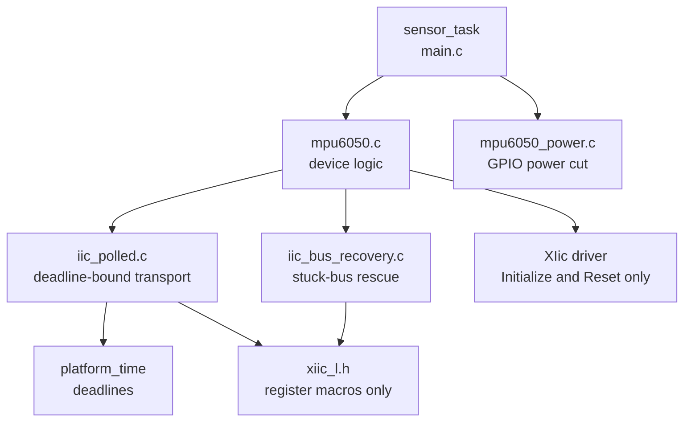
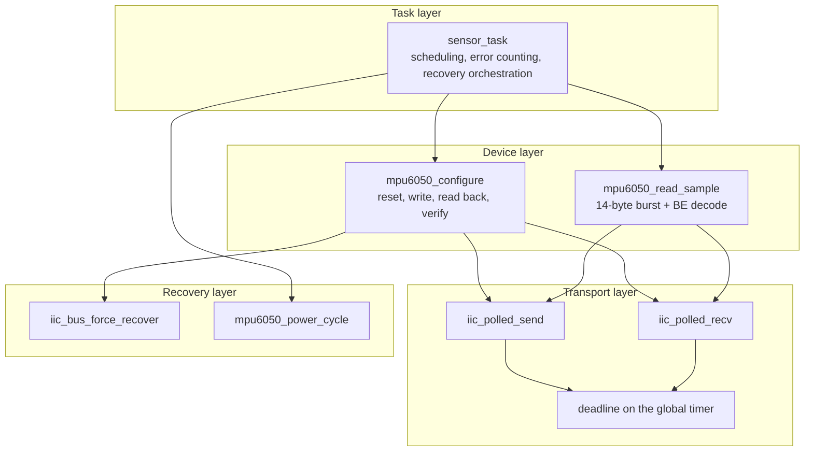
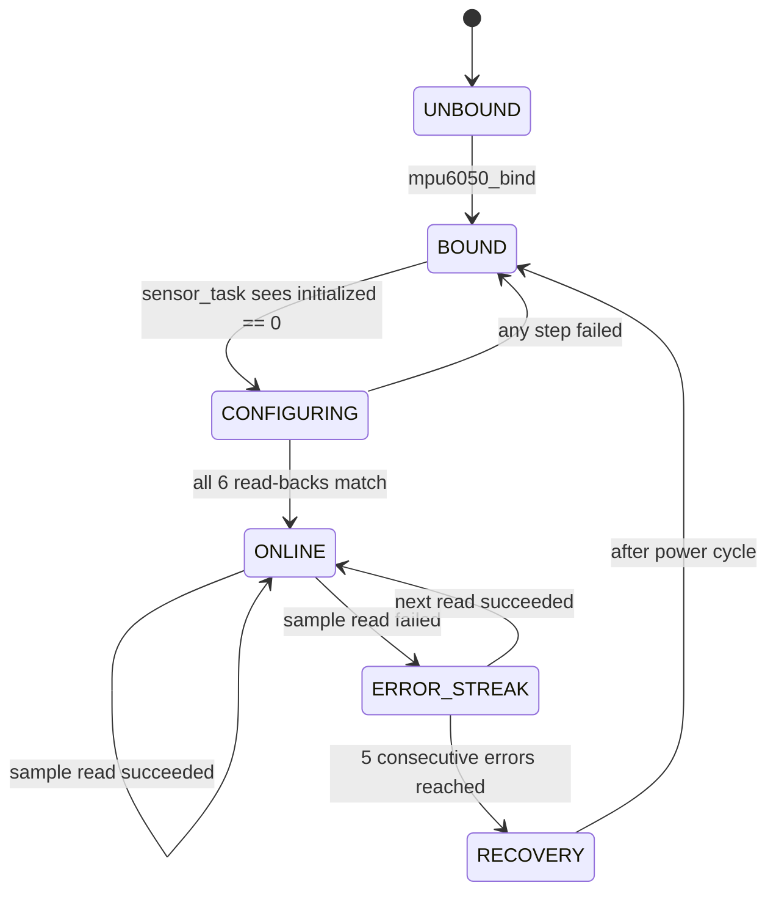
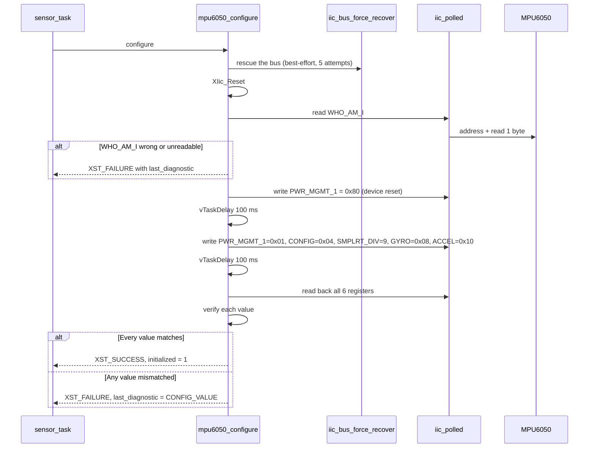
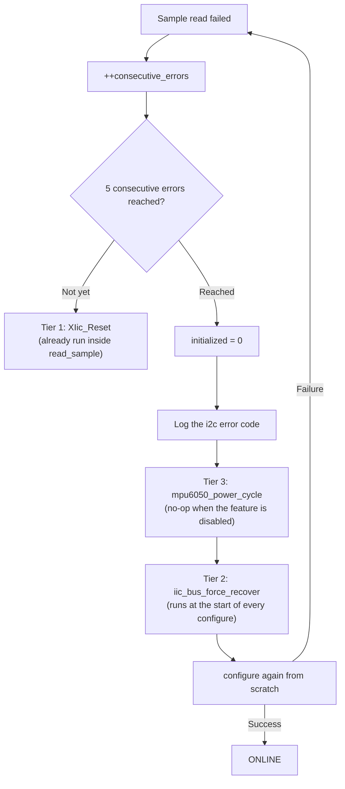
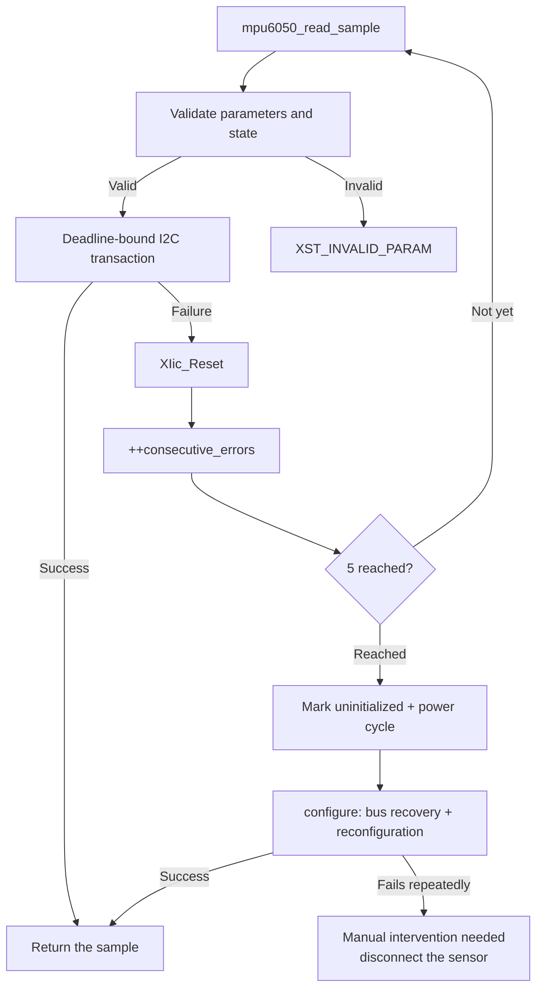

# SDD_02 — MPU6050 Sensor over I2C (CMP-SEN-001)

**Document ID:** ZMPIO-SDD-02
**Component:** CMP-SEN-001
**Level:** L2
**Source:** `firmware/app_freertos/src/mpu6050.{c,h}`, `iic_polled.{c,h}`,
`iic_bus_recovery.{c,h}`, `mpu6050_power.{c,h}`, and the body of `sensor_task` in `main.c`

---

## 1. Purpose

This component turns an unreliable I2C sensor into a 100 Hz sample source that **never hangs the
system calling it**.

Reading the sensor itself is the easy part. The hard part — and what most of this document is
about — is that the I2C bus can lock into a state that no ordinary software command can clear, and
the BSP's default transport turns that state into a permanent hang inside the driver itself, which
prevents the recovery path from ever running in the first place.

## 2. Responsibility

### MUST

- Configure the MPU6050 with the finalized register set and **read back and verify** each value
  before declaring the device online.
- Read the 14-byte data window in a single repeated-start transaction.
- Apply a deadline to EVERY hardware-wait operation.
- Distinguish and report four separate classes of bus error.
- Perform staged recovery when errors repeat.
- Decode big-endian register data into host `int16` values.

### MUST NOT

- MUST NOT call the BSP's `XIic_Send()`/`XIic_Recv()`.
- MUST NOT call `XIic_Reset()` on the success path.
- MUST NOT convert to physical units — raw register values go directly into the ABI and into ZLOG.
- MUST NOT block indefinitely on any path, including the recovery path.
- MUST NOT declare the sensor online based on a correct `WHO_AM_I` alone.

## 3. Non-Responsibilities

| Not owned by this component | Owned by |
|---|---|
| Scheduling the 10 ms cycle | CMP-RT-001 |
| Writing samples to the SD card | CMP-STO-001 |
| Pushing samples into the PL | CMP-HAL-001 |
| Answering host sensor queries | CMP-IPC2-001 |
| Converting LSB to g / °/s | consumer (host-side tooling) |

## 4. Dependencies



**The relationship with the BSP is deliberately narrow:** `xiic_l.h` is used only for register
definitions/masks, and `XIic_Initialize()`/`XIic_Reset()` are used only for lifecycle management. The
BSP's data-transfer path is never used at all — see §12 for the full rationale.

## 5. Architecture



The four layers correspond to four severity levels. A failure is handled at the lowest layer
possible; it escalates upward only when the layer below fails repeatedly.

## 6. Module Structure

| Module | ID | File | Role |
|---|---|---|---|
| Device control | MOD-SEN-001 | `mpu6050.{c,h}` | configuration, sampling, diagnostics |
| Deadline-bound transport | MOD-SEN-002 | `iic_polled.{c,h}` | replaces the BSP's transfer path |
| Bus rescue | MOD-SEN-003 | `iic_bus_recovery.{c,h}` | forces SCL activity on a stuck bus |
| Power cut | MOD-SEN-004 | `mpu6050_power.{c,h}` | GPIO-based hard reset (currently disabled) |
| Sampling loop | MOD-SEN-005 | `main.c` | cycle timing, error counting, escalation |

## 7. File Structure

### FILE-SEN-001 — `iic_polled.c`

| Field | Value |
|---|---|
| Layer | transport / HAL |
| Runtime owner | CPU1, `sensor_task` context |

**MUST**

- Reproduce **exactly** the register-access sequence used by `xiic_l.c` (`XIic_Send`/`SendData`/
  `XIic_Recv`/`RecvData`, iic_v3_10) so that on-wire behavior is unchanged.
- Attach a deadline to every wait loop, based on the global timer rather than the tick.
- Give every wait loop an error exit (`TX_ERROR`, `ARB_LOST`, `BNB`).
- Return the **actual number of bytes transferred**, matching the BSP's signature so callers don't
  need rewriting.
- Retain the most recent call's status for diagnostic purposes.

**MUST NOT**

- MUST NOT change any value written to the device relative to the BSP.
- MUST NOT call `usleep()` or `vTaskDelay()` inside a wait loop — deadlines must work even before the
  scheduler is running.
- MUST NOT retry at this layer. Retry policy belongs to the layer above.

### FILE-SEN-002 — `mpu6050.c`

**MUST** verify every written value by reading it back; **MUST** call `XIic_Reset()` **only** after a
failed transfer.

**MUST NOT** call `XIic_Reset()` after every transaction. That was the previous behavior — 28 resets
per sample at 100 Hz — and resetting the controller mid-transfer is precisely what leaves a slave
device holding SDA low. In other words, that "precautionary" code was itself the source of the fault
that the recovery code later has to clean up.

### FILE-SEN-003 — `iic_bus_recovery.c`

**MUST** bound every wait loop (`RECOVERY_POLL_TIMEOUT_US` = 2000 µs), and **MUST** issue a
best-effort STOP regardless of outcome.

**MUST NOT** promise success. The function returns 1/0 to indicate whether the bus reads idle
afterward, and the caller ignores that value — it is best-effort, not a guarantee.

### FILE-SEN-004 — `mpu6050_power.c`

**MUST** keep the entire function body behind `#if APP_MPU6050_PWR_GPIO_ENABLED` so that when
disabled, the function is a true no-op.

**MUST NOT**, while disabled, still call `vTaskDelay(300 ms)` or log anything implying it did
something — a fake "recovery" that produces misleading log output is worse than no recovery at all.

## 8. Interfaces

### 8.1 Public API

| Function | Thread-safe | ISR-safe | Blocking | Maximum time |
|---|---|---|---|---|
| `mpu6050_bind()` | no | no | no | — |
| `mpu6050_configure()` | no | no | **yes** | ~200 ms (two mandatory delays) + 11 transactions |
| `mpu6050_read_sample()` | no | no | yes | ≤ 40 ms (two 20 ms deadlines) |
| `iic_polled_send()` | no | no | yes | ≤ `timeout_us` |
| `iic_polled_recv()` | no | no | yes | ≤ `timeout_us` |
| `iic_polled_last_status()` | yes (read-only) | yes | no | — |
| `iic_bus_force_recover()` | no | no | yes | ≤ `attempts` × ~5 ms |
| `mpu6050_power_cycle()` | no | no | yes | 300 ms when enabled, 0 when disabled |

No function is thread-safe. That is acceptable because only `sensor_task` ever touches this
component — an invariant enforced by design (`main.c` is the only place holding the `mpu6050_t`
instance).

### 8.2 FUNC-SEN-001 — `mpu6050_read_sample()`

**Identity**

| Field | Value |
|---|---|
| Signature | `int mpu6050_read_sample(mpu6050_t *device, mpu6050_sample_t *sample)` |
| File | `mpu6050.c` |
| Thread-safe | NO |
| Reentrant | NO |
| ISR-safe | NO |
| Blocking | YES, bounded |

**Purpose:** reads a 7-channel sample from the MPU6050's output window and decodes it into host
types.

**Parameters**

| Parameter | Type | Direction | Required | Constraint | Ownership |
|---|---|---|---|---|---|
| `device` | `mpu6050_t *` | INOUT | YES | non-`NULL`, bound, `initialized == 1` | caller-owned |
| `sample` | `mpu6050_sample_t *` | OUT | YES | non-`NULL`, ≥ 14 bytes | caller-owned |

**Parameter Interaction:** `sample` is written only when the function returns `XST_SUCCESS`. On
failure, its previous content is left untouched — a caller can safely reuse the same variable across
repeated calls.

**Preconditions**

```text
- device != NULL and device->iic != NULL
- device->initialized == 1  (i.e. mpu6050_configure() has already succeeded)
- sample != NULL
```

**State Preconditions**

| Device state | Allowed | Behavior |
|---|---|---|
| not bound (`iic == NULL`) | NO | returns `XST_INVALID_PARAM`, touches nothing on the bus |
| `initialized == 0` | NO | returns `XST_INVALID_PARAM`, touches nothing on the bus |
| `initialized == 1` | YES | performs the read |

**Processing Steps**

```text
Step 1 — Validate parameters
  Input:    device, sample
  Condition: both non-NULL and initialized == 1
  Failure:  return XST_INVALID_PARAM, no side effects
  Next:     Step 2

Step 2 — Send the register address with a repeated start
  Action:  iic_polled_send(base, 0x68, {0x3B}, 1, XIIC_REPEATED_START, 20000)
  Success: returns 1
  Failure: XIic_Reset(), return XST_FAILURE
  Next:    Step 3

Step 3 — Receive 14 bytes then STOP
  Action:  iic_polled_recv(base, 0x68, raw, 14, XIIC_STOP, 20000)
  Success: returns 14
  Failure: XIic_Reset(), return XST_FAILURE
  Next:    Step 4

Step 4 — Decode big-endian
  7 calls to decode_be_i16, writing into sample
  Cannot fail
  Next:    return XST_SUCCESS
```

**Decision Table**

| Parameters | State | Address send | Data receive | Action | Result |
|---|---|---|---|---|---|
| invalid | any | — | — | reject | `XST_INVALID_PARAM` |
| valid | not initialized | — | — | reject | `XST_INVALID_PARAM` |
| valid | initialized | failed | — | reset controller | `XST_FAILURE` |
| valid | initialized | OK | short/timeout | reset controller | `XST_FAILURE` |
| valid | initialized | OK | full 14 bytes | decode | `XST_SUCCESS` |

**Return Contract**

| Value | Class | Meaning | Caller MUST |
|---|---|---|---|
| `XST_SUCCESS` | success | `*sample` is valid | use the sample, reset the error counter |
| `XST_FAILURE` | recoverable | transfer failed | increment the error counter; recover after 5 |
| `XST_INVALID_PARAM` | caller error | bad parameter or state | fix the caller — do **not** retry |

Distinguishing these two failure classes is essential: `XST_FAILURE` is a transient environmental
fault, `XST_INVALID_PARAM` is a programming error. Retrying the latter accomplishes nothing.

**Postconditions**

```text
On success:
  - *sample holds 7 int16 values decoded from a single read
  - the I2C bus is idle (STOP has been issued)
  - transport status = IIC_POLLED_OK

On failure:
  - *sample is NOT modified
  - the I2C controller has been reset
  - iic_polled_last_status() reports the specific reason
```

**Side Effects**

| May be modified | Must not be modified |
|---|---|
| AXI IIC controller registers | `device->initialized` |
| `*sample` (only on success) | any configuration field of `device` |
| global transport status | |

**Error Handling**

| Error | Detection | Immediate action | Recovery |
|---|---|---|---|
| slave did not ACK | `TX_ERROR` in the ISR | `XIic_Reset()` | caller counts the error |
| bus stuck | timeout or `ARB_LOST` | `XIic_Reset()` | caller escalates to bus recovery |
| short return | byte-count check | `XIic_Reset()` | caller counts the error |

**Concurrency:** not thread-safe, not reentrant, not ISR-safe. Protecting invariant: only
`sensor_task` calls it.

**Timing**

```text
T_theoretical = T_address + T_data
              = (1 address byte + 1 register byte) + (1 address byte + 14 data bytes)
              ≈ 17 bytes × 9 bits / 100 kHz ≈ 1.4 ms
T_max         = 2 × 20 ms = 40 ms  (two independent deadlines)
```

The 40 ms worst case exceeds the 10 ms cycle and can skip up to three ticks. This is a deliberate
trade-off: a missed cadence on the error path is preferable to a permanent hang.

**Given / When / Then**

| Scenario | Given | When | Then |
|---|---|---|---|
| SEN-001-01 normal | device online, bus idle | called | returns `XST_SUCCESS`, `*sample` holds real data, `last_status = ok` |
| SEN-001-02 bad parameter | `sample == NULL` | called | returns `XST_INVALID_PARAM`, no bus transaction occurs |
| SEN-001-03 bad state | `initialized == 0` | called | returns `XST_INVALID_PARAM`, bus untouched |
| SEN-001-04 slave absent | sensor disconnected | called | returns `XST_FAILURE` within ≤ 40 ms, `last_status = tx-error` |
| SEN-001-05 bus stuck | SDA held low | called | returns `XST_FAILURE` within ≤ 40 ms, `last_status = timeout` or `bus-busy` |
| SEN-001-06 sustained load | called continuously for 20 minutes | 120,000 calls | no leaks, no state drift, no hang |
| SEN-001-07 recovery | after the sensor is reconnected | called | still `XST_FAILURE` until `configure()` runs again — as designed |

**Caller Responsibilities**

| Result | Caller must |
|---|---|
| `XST_SUCCESS` | use the sample, set `consecutive_errors = 0` |
| `XST_FAILURE` | increment `consecutive_errors`; after 5, set `initialized = 0` and run recovery |
| `XST_INVALID_PARAM` | fix the programming error — do not retry |

**Debug Information:** `iic_polled_status_string(iic_polled_last_status())` returns one of six
strings. It is printed exactly when recovery begins, so the UART1 transcript always states the
reason clearly.

### 8.3 FUNC-SEN-002 — `iic_polled_recv()`

**Signature**

```c
unsigned iic_polled_recv(UINTPTR base_address, u8 address, u8 *buffer,
                         unsigned byte_count, u8 option, uint32_t timeout_us);
```

**Parameters**

| Parameter | Type | Direction | Unit | Valid range | Note |
|---|---|---|---|---|---|
| `base_address` | `UINTPTR` | IN | address | base of `axi_iic_0` | not validated |
| `address` | `u8` | IN | 7-bit I2C address | `0x08..0x77` | not validated |
| `buffer` | `u8 *` | OUT | — | non-`NULL`, ≥ `byte_count` | caller-owned |
| `byte_count` | `unsigned` | IN | bytes | ≥ 1 | 1 triggers the special NO-ACK path |
| `option` | `u8` | IN | — | `XIIC_STOP` or `XIIC_REPEATED_START` | controls whether the final bus-free wait happens |
| `timeout_us` | `u32` | IN | µs | > 0 | covers the **entire** transfer, not each byte |

**Parameter Interaction**

- `byte_count == 1` requires NO-ACK to be armed **before** the address goes out on the wire. This is
  a hardware constraint, not a software choice.
- `option == XIIC_REPEATED_START` skips the final bus-free wait, since the transaction is not yet
  complete.
- `timeout_us` only matters when the hardware is slow or stuck; the success path never touches it.

**Processing Steps**

```text
Step 1 — Validate parameters: buffer != NULL and byte_count > 0
         Failure: last_status = INVALID_ARG, return 0

Step 2 — Start a deadline on the global timer

Step 3 — Wait for bus-free (skipped when mid-repeated-start)
         Failure: last_status = BUS_BUSY, return 0

Step 4 — Arm NO-ACK early if byte_count == 1

Step 5 — Send the address with the read bit set

Step 6 — Receive each byte, checking both the expected condition and any error
         condition every iteration

Step 7 — Handle the final two bytes following the BSP's exact NO-ACK/MSMS sequence

Step 8 — Issue STOP if option == XIIC_STOP, then wait for bus-free

Step 9 — Store last_status, return the number of bytes received
```

**Return Contract**

| Value | Meaning | Caller MUST |
|---|---|---|
| `== byte_count` | fully successful | use the data |
| `0` | never started | treat as failure, check `last_status` |
| `0 < n < byte_count` | failed partway through | treat as failure; partial data **cannot** be used |

**Why it returns a "byte count" rather than an error code:** to keep the exact signature of
`XIic_Recv()` so it can be substituted without rewriting the caller. Detailed error information is
obtained separately via `iic_polled_last_status()`.

**Given / When / Then**

| Scenario | Given | When | Then |
|---|---|---|---|
| SEN-002-01 normal | bus idle, slave present | receive 14 bytes | returns 14, `last_status = ok` |
| SEN-002-02 bad parameter | `buffer == NULL` | called | returns 0, `last_status = invalid-argument`, bus untouched |
| SEN-002-03 boundary | `byte_count == 1` | called | NO-ACK armed before the address is sent; returns 1 |
| SEN-002-04 slave absent | no slave at that address | called | returns 0, `last_status = tx-error`, within ≤ `timeout_us` |
| SEN-002-05 bus stuck | SDA held low | called | returns 0, `last_status = bus-busy` or `timeout` |
| SEN-002-06 timeout | slave holds the clock indefinitely | called with `timeout_us = 20000` | returns within ≤ 20 ms, **never hangs** |
| SEN-002-07 contention | another master on the bus | called | returns 0, `last_status = arb-lost` |

## 9. Data Structures

### `mpu6050_t`

| Field | Type | Written by | Purpose |
|---|---|---|---|
| `iic` | `XIic *` | `bind` | controller instance |
| `address` | `u8` | `bind` | `0x68` |
| `initialized` | `u8` | `configure`, `sensor_task` | gates `read_sample` |
| `who_am_i` .. `accel_config` | `u8` × 7 | `configure` | **actual read-back values**, not expected ones |
| `last_diagnostic` | enum | `configure` | the last failing step |

The seven read-back values are preserved after a configuration failure and logged. This is what
turns a single log line into a usable diagnostic: `who=0x00` means the bus is completely silent;
`who=0x68` with a wrong `pwr1` means reads succeed but writes aren't landing.

### `mpu6050_diagnostic_t`

| Value | Meaning | What it implies |
|---|---|---|
| `WHO_AM_I_READ` | `WHO_AM_I` could not be read | bus or wiring, not the chip |
| `WHO_AM_I_VALUE` | read succeeded but the value is wrong | wrong address, or not an MPU6050 |
| `DEVICE_RESET_WRITE` | the reset command write failed | bus is readable but not writable |
| `CONFIG_WRITE` | a configuration write failed | intermittent bus |
| `CONFIG_READ` | read-back failed | bus broke after the write |
| `CONFIG_VALUE` | read back but mismatched | chip rejected the configuration / still asleep |

### `iic_polled_status_t`

| Value | Typical physical cause |
|---|---|
| `OK` | — |
| `ERR_BUS_BUSY` | the bus never went idle before the operation started |
| `ERR_TIMEOUT` | hardware made no progress within budget |
| `ERR_ARB_LOST` | another master, or SDA held low |
| `ERR_TX_ERROR` | slave did not ACK |
| `ERR_INVALID_ARG` | programming error |

Distinguishing `ERR_TX_ERROR` from `ERR_TIMEOUT` is the single most valuable distinction in this
table: the former means the bus is electrically healthy but nothing answered (sensor/wiring fault);
the latter means the bus itself has a problem.

## 10. State Machine

### STATE-SEN-001 — Device lifecycle



| Current | Event | Guard | Action | Next |
|---|---|---|---|---|
| `BOUND` | task loop | `initialized == 0` | call `configure()` | `CONFIGURING` |
| `CONFIGURING` | all steps OK | every read-back matches | `initialized = 1`, log configuration | `ONLINE` |
| `CONFIGURING` | any step fails | — | log `last_diagnostic` + all 7 read-back values, delay 1000 ms | `BOUND` |
| `ONLINE` | read fails | — | `++consecutive_errors` | `ERROR_STREAK` |
| `ERROR_STREAK` | read OK | — | `consecutive_errors = 0` | `ONLINE` |
| `ERROR_STREAK` | 5 errors reached | — | `initialized = 0`, log the i2c error code, `power_cycle()` | `RECOVERY` |

**Note:** the error counter resets to 0 only on a **successful** read, not every cycle. This means
five errors scattered across a minute will not trigger recovery if a good read occurred in between —
by design: recovery targets sustained failure, not intermittent noise.

## 11. Runtime Sequence

### 11.1 Configuration



**The two `vTaskDelay(100 ms)` calls are chip requirements**, not an arbitrarily chosen safety
margin: after a reset command the chip needs time to restart, and after a configuration change it
needs time to begin a new conversion cycle. Reading earlier would return values from the old
configuration.

**Important side effect:** these two `vTaskDelay()` calls are why the "stalled tick" defect (BUG-004)
manifested as "the MPU6050 never comes online." When the tick dies, these delays never expire, so
`configure()` hangs — and the symptom looks exactly like a sensor fault, even though the sensor was
completely healthy (independently verified with a separate Arduino test rig).

### 11.2 Staged recovery



## 12. Algorithms

### ALG-SEN-001 — Deadline-bound wait loop

**Purpose:** replaces the BSP's unbounded wait loops without changing on-wire behavior.

**Input:** base address, deadline, expected-bit mask, error-bit mask.
**Output:** `IIC_POLLED_OK` / `ERR_ARB_LOST` / `ERR_TX_ERROR` / `ERR_TIMEOUT`.

**Pseudocode**

```text
loop:
    status = read the ISR register
    if status & wanted:  return OK
    if status & fatal:
        if status & ARB_LOST:  return ERR_ARB_LOST
        return ERR_TX_ERROR
    if deadline_expired():  return ERR_TIMEOUT
```

**Counter wraparound handling:**

```text
deadline_expired() ⇔ (uint32)(now - start) >= limit
```

Unsigned subtraction produces the correct result across a 32-bit wrap boundary, provided `limit` is
smaller than one wrap period (~16 s at `CPU_3x2x`). That condition always holds for a 20 ms timeout.

**Boundary conditions**

| Condition | Behavior |
|---|---|
| both `wanted` and `fatal` set in the same read | `wanted` wins — the transfer has already progressed |
| the deadline expires exactly when `wanted` becomes set | `wanted` is checked first, so OK is returned |
| `limit == 0` | every call expires immediately; prevented by `platform_time_us_to_counts()` forcing `counts_per_us ≥ 1` |

**Why the BSP's three wait loops cannot be used** (this is the root cause, not a symptom):

| Location | Problem |
|---|---|
| `xiic_l.c:175` / `:437` | `while ((StatusReg & BUS_BUSY) == 0)` — no timeout |
| `xiic_l.c:482` | `while ((StatusReg & BUS_BUSY) != 0)` — no timeout |
| `xiic_l.c:576` | `while (1) { if (IntrStatus & TX_EMPTY) break; }` — **no timeout and no error exit** |

Loop `:576` sits directly on the repeated-start path that `mpu6050_read_sample()` uses, and it lacks
the `ARB_LOST`/`TX_ERROR`/`BNB` exit branches present in its sibling loop at `:527`. A slave holding
the bus (typically after the master was reset mid-transaction) leaves `sensor_task` spinning inside
it forever: `mpu6050_read_sample()` never returns → `consecutive_errors` never increments →
recovery and `vTaskDelayUntil()` never run. That is a true hang, not a slow path.

### ALG-SEN-002 — Forced bus rescue

**Purpose:** makes the AXI IIC core generate real SCL/SDA activity on a bus whose Bus Busy state is
stuck, giving a slave stalled mid-byte a chance to release SDA.

**Assumption:** the slave is stuck waiting for more clock edges, not electrically dead.

**Pseudocode**

```text
reset the AXI IIC core
usleep(1000)
for i in 1..attempts:
    XIic_Send7BitAddress(base, address, WRITE)     # load the address
    clear TX_EMPTY / TX_ERROR / ARB_LOST flags
    write CR = MSMS | DIR_TX | ENABLE               # force a START
    bounded wait for BUS_BUSY = 1  (ignore the result)
    bounded wait for TX_FIFO_EMPTY = 1 (ignore the result)
    write CR = DIR_TX | ENABLE                       # clear MSMS -> STOP
    bounded wait for BUS_BUSY = 0 (ignore the result)
    reset the AXI IIC core
    usleep(1000)
    if BUS_BUSY == 0: return 1
return (BUS_BUSY == 0)
```

**Why this differs from `XIic_Reset()`:** `XIic_Reset()` only resets master-side state; it never
generates a clock pulse. `XIic_Send()`, meanwhile, refuses to touch the bus while Bus Busy is stuck —
`XIic_WaitBusFree()` polls for about 1 s and then gives up **without ever driving SCL**. This
algorithm deliberately bypasses exactly that gate.

**Limitation:** if the slave is truly latched up, only a power cycle can rescue it. The function
returns 1/0 but the caller deliberately ignores it — it is best-effort and should not create a false
sense of guarantee.

**Complexity:** `O(attempts)`, each attempt bounded by roughly 3 × 2000 µs plus two `usleep(1000)`
calls. With `attempts = 5`, the total is ≤ ~40 ms.

### ALG-SEN-003 — Big-endian decode

```text
value = (int16)((uint16)bytes[0] << 8 | bytes[1])
```

Casting through `uint16` before casting to `int16` is deliberate: left-shifting a signed value
directly is undefined behavior in C whenever the sign bit gets shifted into.

## 13. Error Handling

| Error | Class | Detection | Immediate action | Return | Caller action | Recovery | Escalation |
|---|---|---|---|---|---|---|---|
| `NULL` parameter | E1 | validation | none | `XST_INVALID_PARAM` | fix the code | — | — |
| Not configured | E2 | `initialized == 0` | none | `XST_INVALID_PARAM` | run `configure()` | — | — |
| Slave did not ACK | E5 | `TX_ERROR` | `XIic_Reset()` | `XST_FAILURE` | count the error | recovery on the 5th | — |
| Bus stuck | E6 | timeout / `ARB_LOST` | `XIic_Reset()` | `XST_FAILURE` | count the error | bus recovery → power cycle | manual disconnect |
| Transfer timeout | E4 | deadline | `XIic_Reset()` | `XST_FAILURE` | count the error | as above | — |
| Read-back mismatch | E7 | comparison | none | `XST_FAILURE` | retry `configure()` | delay 1000 ms | — |
| Bus recovery failed | E6 | returns 0 | none | (ignored) | still attempts `configure()` | power cycle | manual disconnect |

**Full error flow**



## 14. Concurrency

| Property | Value |
|---|---|
| Thread-safe | NO — transport status is a global static variable |
| Reentrant | NO |
| ISR-safe | NO — the configuration path calls `vTaskDelay()` |
| Blocking | YES, always bounded |

**Protecting invariant:** only `sensor_task` ever calls this component. Enforced structurally —
`main.c` is the only place holding the `mpu6050_t` instance, and it is never passed to any other
task.

`iic_polled_last_status()` is a global static variable, so it is only meaningful when read from the
same context that issued the transfer. In the current system that is always true.

## 15. Timing

| Quantity | Typical | Maximum | Source |
|---|---:|---:|---|
| One burst transaction | 1.4 ms | 20 ms | bus speed / deadline |
| `mpu6050_read_sample()` | 1.4 ms | 40 ms | two deadlines |
| `mpu6050_configure()` | ~205 ms | ~200 ms + 11 × 20 ms = 420 ms | two delays + 11 transactions |
| `iic_bus_force_recover()` | a few ms | ~40 ms | 5 attempts |
| `mpu6050_power_cycle()` | 0 ms (currently disabled) | 300 ms (when enabled) | `OFF_MS` + `STABLE_MS` |

**Why 20 ms:** a 15-byte burst at 100 kHz, including both address phases, takes roughly 1.4 ms. 20 ms
is about 15x that figure. Anything slower than that is a fault, not merely slow hardware — and must
be reported as a failed sample so the error counter can progress toward the recovery threshold.

## 16. Resource / Memory Usage

| Resource | Usage |
|---|---|
| `mpu6050_t` | 16 bytes (inside `main.c`) |
| `XIic` | ~100 bytes |
| `last_status` | 4 bytes static |
| Raw buffer in `read_sample` | 14 bytes on the stack |
| Deepest stack path | `configure()` → `iic_bus_force_recover()` → `poll_until()` |
| MMIO | `axi_iic_0` @ `0x43C0_0000` |
| GIC | not used (runs polled) |

## 17. Configuration

| Constant | Value | Meaning | Effect of changing it |
|---|---:|---|---|
| `APP_MPU6050_I2C_ADDRESS` | `0x68` | AD0 tied to ground | `0x69` if AD0 is tied high |
| `APP_MPU6050_I2C_TIMEOUT_US` | 20000 | per-transaction deadline | too small produces false failures; too large delays fault detection |
| `APP_MPU6050_BURST_READ_ENABLED` | 1 | read as one transaction | setting it to 0 reverts to 14 separate transactions — much slower |
| `APP_MPU6050_BUS_RECOVERY_ATTEMPTS` | 5 | number of forced START attempts | |
| `APP_SENSOR_MAX_ERRORS` | 5 | escalation threshold | too small triggers unnecessary recovery |
| `APP_MPU6050_PWR_GPIO_ENABLED` | **0** | GPIO power cut | see the warning below |
| `APP_MPU6050_PWR_EMIO_PIN` | 55 | EMIO bit 1 | `XGpioPs` numbers EMIO starting at flat index 54, so EMIO bit 1 is **55**, not 1 |
| `APP_MPU6050_PWR_OFF_MS` / `_STABLE_MS` | 200 / 100 | off / settling time | |
| `APP_MPU6050_ACCEL_LSB_PER_G` | 4096.0 | reference only | **not** used in firmware (no floating point) |

**Warning regarding `APP_MPU6050_PWR_GPIO_ENABLED`:** must not be set to 1 until all four of the
following are complete: (1) the PACKAGE_PIN is finalized via schematic review or multimeter
verification, (2) a constraint is added to `constaint.xdc`, (3) `fix_mpu6050_pwr_gpio.tcl` has been
run followed by a rebuild and XSA export, (4) the P-MOSFET is physically wired. Enabling it early
only produces a meaningless `vTaskDelay(300 ms)` and a log line falsely claiming power was cut.

## 18. Logging / Debug

| Log line | When | What it implies |
|---|---|---|
| `MPU6050 init failed stage=%d who=0x%02x pwr1=... ` | on every configuration failure | the failing step + all 7 read-back values |
| `MPU6050 online at 0x68` | configuration succeeded | |
| `MPU cfg who=... pwr1=... ` | immediately after coming online | confirmed configuration snapshot |
| `MPU6050 read failed (i2c=%s), power-cycling...` | on entering recovery | distinguishes a sensor fault from a bus fault |
| `MPU raw ax=... ` | every 1000 ms | sample is live and within a plausible range |

**Quick diagnostic table**

| Symptom | Likely cause |
|---|---|
| `who=0x00`, `i2c=tx-error` | no slave present — wiring, power, or wrong address |
| `who=0x00`, `i2c=bus-busy` | bus stuck — SDA held low |
| `who=0x68` but `stage=CONFIG_VALUE` | reads succeed, writes aren't landing, or the chip is still asleep |
| No MPU log lines at all, CPU1 silent | stalled tick — check `xTickCount` over JTAG (BUG-004) |
| `MPU raw` reads all zero | read succeeded but the chip hasn't converted yet — check `pwr1` |

## 19. Verification

| Test | Verifies | Evidence |
|---|---|---|
| TEST-SEN-001 | rate and configuration | `MPU cfg` log line, sample cadence in ZLOG |
| TEST-SEN-002 | every wait is deadline-bound | disconnect the sensor mid-run, system must stay alive |
| TEST-SEN-003 | staged recovery | disconnect and reconnect, must come back online automatically |
| TEST-SEN-004 | read-back verification | force one value to be wrong, must be rejected |
| TEST-SEN-005 | burst read | logic analyzer capture: one START + one repeated START |
| TEST-SEN-006 | error classification | disconnect the sensor (`tx-error`), hold SDA low (`bus-busy`) |

## 20. Known Limitations

| ID | Limitation | Impact | Mitigation |
|---|---|---|---|
| LIM-SEN-001 | GPIO power cut not yet usable | recovery stops at best-effort | tracked as GAP-002; currently requires manual disconnect |
| LIM-SEN-002 | Real-world effectiveness of bus recovery unmeasured | unknown success rate | `last_status` allows classification |
| LIM-SEN-003 | Not thread-safe | usable from a single task only | enforced structurally |
| LIM-SEN-004 | 40 ms worst case exceeds the 10 ms cycle | up to 3 ticks skipped on error | accepted: a skip is preferable to a hang |
| LIM-SEN-005 | `last_status` is a global variable | meaningless with multiple callers | single-task invariant |
| LIM-SEN-006 | Only acceleration is used; temperature and gyro are logged only | the DSP never sees gyro data | deliberate for this version |

## 21. Traceability

| REQ | Design | FUNC | TEST |
|---|---|---|---|
| REQ-SEN-001 | §11.1, §17 | — | TEST-SEN-001 |
| REQ-SEN-002 | §12 ALG-SEN-001, ADR-010 | FUNC-SEN-002 | TEST-SEN-002 |
| REQ-SEN-003 | §10, §11.2 | — | TEST-SEN-003 |
| REQ-SEN-004 | §11.1 | — | TEST-SEN-004 |
| REQ-SEN-005 | §8.2 Step 2–3 | FUNC-SEN-001 | TEST-SEN-005 |
| REQ-SEN-006 | §9 | — | TEST-SEN-006 |
| REQ-RT-002 | §12 | FUNC-SEN-002 | TEST-RT-002 |
