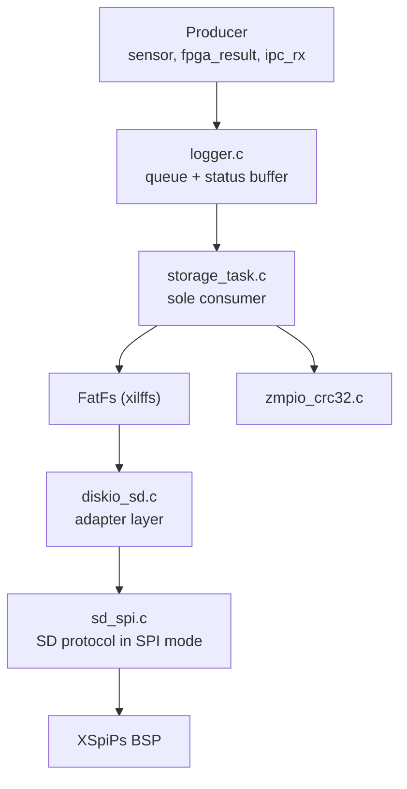
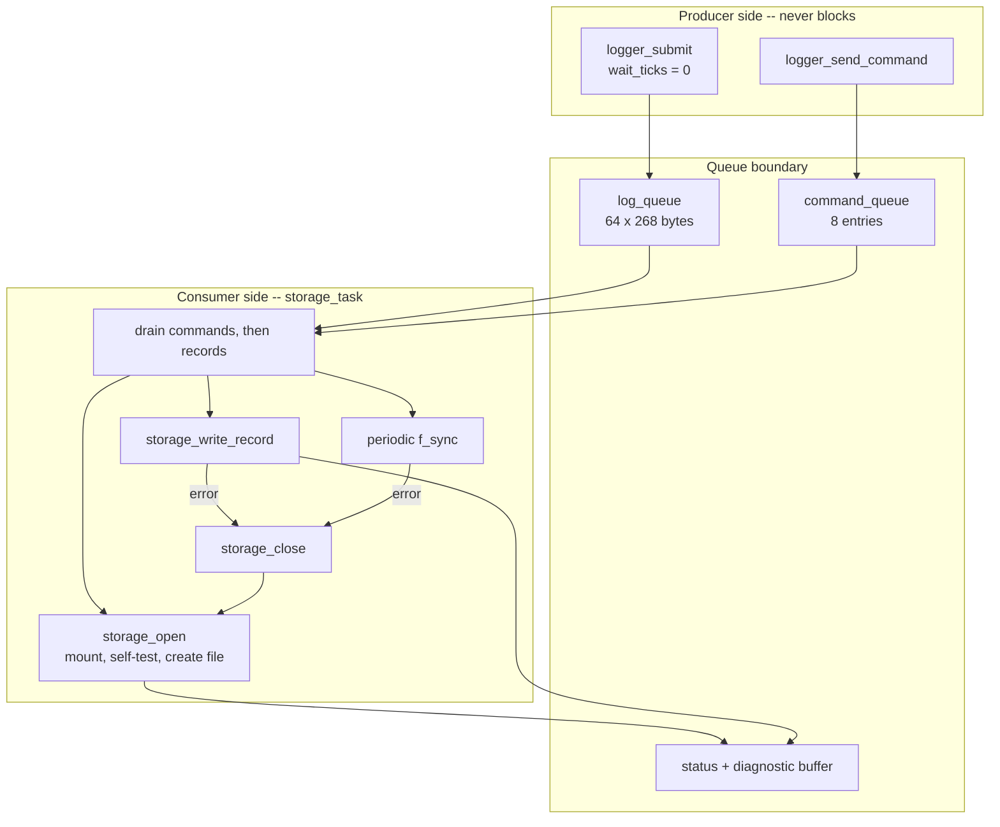
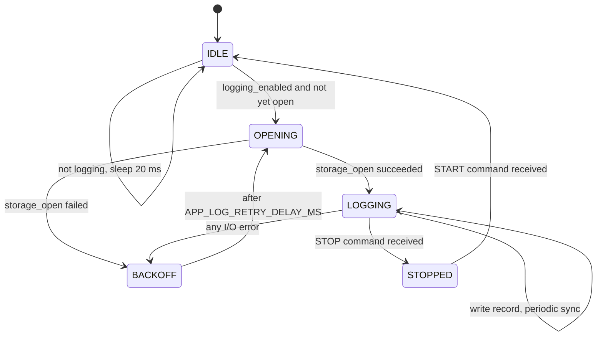
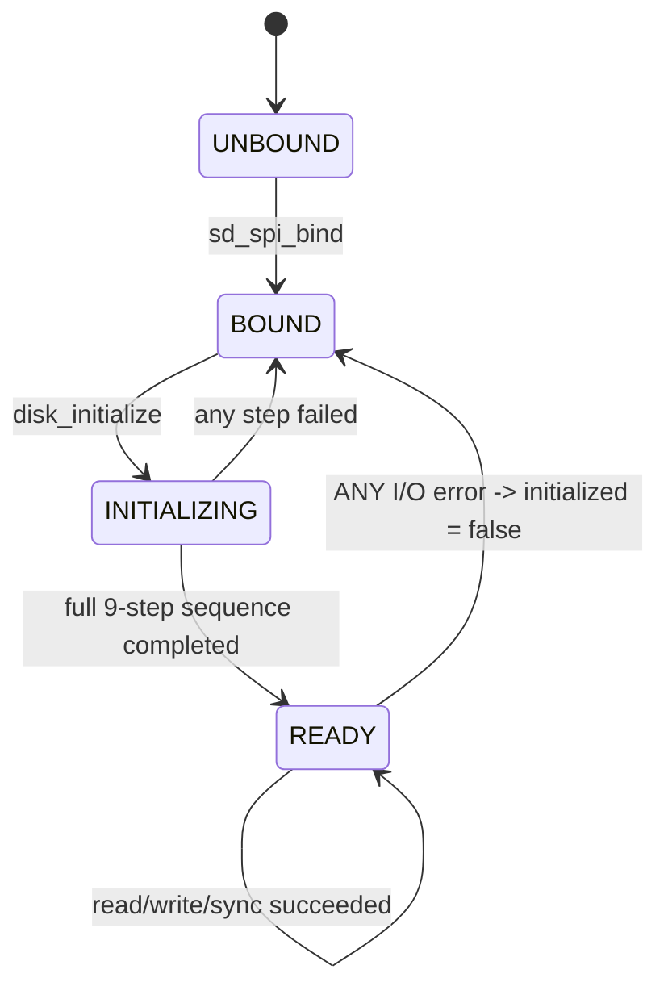
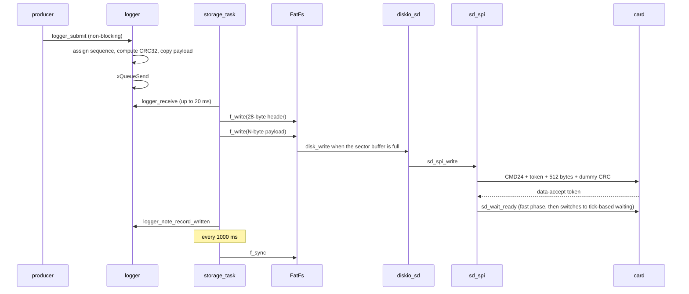
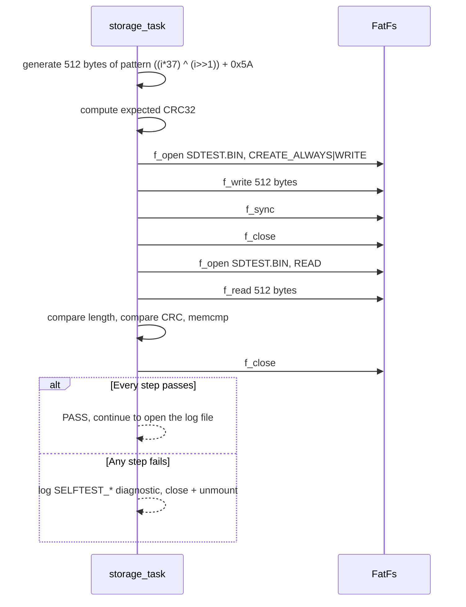
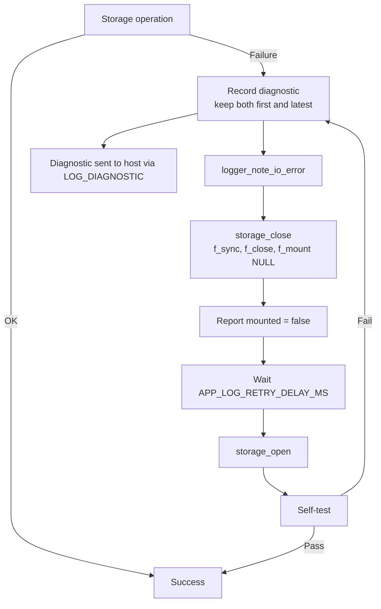

# SDD_03 — Storage: SD-SPI, FatFs, and ZLOG (CMP-STO-001)

**Document ID:** ZMPIO-SDD-03
**Component:** CMP-STO-001
**Level:** L2
**Source:** `firmware/app_freertos/src/storage_task.c`, `logger.{c,h}`, `log_record.{c,h}`,
`sd_spi.{c,h}`, `diskio_sd.{c,h}`, `common/zmpio_crc32.c`

---

## 1. Purpose

This component turns four asynchronous data sources into a single sequential, self-describing,
integrity-checked byte stream on a FAT media card — without letting the unbounded duration of a
single card-write cycle disturb the 10 ms sampling cadence.

Three practical problems the design must solve:

1. Writing a sector can take anywhere from a few milliseconds to a quarter of a second; the
   producer cannot be made to wait for that.
2. Cards and adapters fail silently; failure must be detected right at mount time.
3. When an error occurs, only the **first** error carries the root cause; subsequent errors are
   just consequences.

## 2. Responsibility

### MUST

- Accept records from every producer through a non-blocking queue.
- Frame every record with a header carrying magic, version, sequence, timestamp, length, and a
  payload CRC32.
- **Exclusively** own every FatFs and SD-SPI call.
- Run a read/write/CRC-compare self-test after every successful mount.
- Choose a filename that does not yet exist and open it with `FA_CREATE_NEW`.
- Call `f_sync()` at least every 1000 ms and whenever a `FLUSH` command arrives.
- Retain both the most recent diagnostic **and** the first diagnostic simultaneously.
- Recover from any I/O error by closing, unmounting, and remounting — never exit the task.

### MUST NOT

- MUST NOT block the producer.
- MUST NOT let any other module call FatFs or `sd_spi_*`.
- MUST NOT overwrite an existing log file.
- MUST NOT busy-spin waiting for the card beyond `APP_SD_WAIT_READY_FAST_POLLS` iterations.
- MUST NOT interpret payload content — it only copies `payload_len` bytes.

## 3. Non-Responsibilities

| Not owned by this component | Owned by |
|---|---|
| Semantics of each payload type | the corresponding producer (SDD_02, SDD_08, SDD_09) |
| Reporting log status to the host | CMP-IPC2-001 |
| Task scheduling | CMP-RT-001 |
| Log file analysis | host-side tooling |

## 4. Dependencies



Dependencies are strictly one-directional. `diskio_sd.c` exists solely to translate between FatFs's
`DSTATUS`/`DRESULT` model and `sd_spi.c`'s `XST_*` model; it contains no business logic of its own.

## 5. Architecture



The key architectural idea: **the queue is the timing boundary**. To its left, every operation has
bounded, microsecond-scale timing. To its right, timing is unbounded and measured in milliseconds to
hundreds of milliseconds. No path lets that unboundedness leak to the left.

## 6. Module Structure

| Module | ID | File | Role |
|---|---|---|---|
| Queue + state | MOD-STO-001 | `logger.{c,h}` | producer API, counters, diagnostics |
| Record format | MOD-STO-002 | `log_record.{c,h}` | header struct, CRC |
| Storage task | MOD-STO-003 | `storage_task.c` | file lifecycle, self-test, writes |
| FatFs glue layer | MOD-STO-004 | `diskio_sd.{c,h}` | `disk_*` and `get_fattime` |
| SD-SPI protocol | MOD-STO-005 | `sd_spi.{c,h}` | init, sector read/write, sync |

## 7. File Structure

### FILE-STO-001 — `storage_task.c`

| Field | Value |
|---|---|
| Layer | application |
| Runtime owner | CPU1, task `SD_Write` |

**MUST**

- Be the only code in the system that calls `f_mount`, `f_open`, `f_write`, `f_sync`, `f_close`,
  `f_stat`.
- Write the header and the payload as **two** separate `f_write` calls, and confirm the byte count
  written matches for both.
- Close and unmount before every remount attempt.
- Process commands before records on every loop iteration.

**MUST NOT**

- MUST NOT interpret payload content.
- MUST NOT use CMD24 on raw LBAs. The self-test deliberately uses a normal FatFs file so it
  structurally cannot overwrite the partition table or another file's data sectors.
- MUST NOT exit the `for(;;)` loop under any circumstance.

### FILE-STO-002 — `logger.c`

**MUST** keep every counter update inside a critical section; **MUST** allow every producer to call
with `wait_ticks = 0`.

**MUST NOT** call any FatFs or `sd_spi_*` function — it sits on the producer side of the timing
boundary.

### FILE-STO-003 — `sd_spi.c`

**MUST** set `initialized = false` whenever an I/O operation fails, forcing the next use to
reinitialize from scratch; **MUST** record `diagnostic` on every failure path.

**MUST NOT** hold CS asserted after an operation ends (every exit path goes through
`sd_deselect()`), and MUST NOT assume a clock speed — it sets the prescaler itself in both phases.

## 8. Interfaces

### 8.1 Producer-side API

| Function | Thread-safe | Blocking | Notes |
|---|---|---|---|
| `logger_submit()` | YES (critical section) | NO when `wait_ticks = 0` | every producer uses this path |
| `logger_send_command()` | YES | NO when `wait_ticks = 0` | START/STOP/FLUSH |
| `logger_get_status()` | YES | NO | consistent snapshot |
| `logger_get_diagnostic()` | YES | NO | consistent snapshot |

### 8.2 API reserved for `storage_task`

`logger_receive()`, `logger_receive_command()`, `logger_set_storage_state()`,
`logger_note_record_written()`, `logger_note_io_error()`, `logger_set_storage_diagnostic()`,
`logger_clear_storage_diagnostic()`.

The header states explicitly: *"Storage-task interface. No other module should call these
functions."* This is a convention, not compiler-enforced — a known limitation (LIM-STO-005).

### 8.3 FUNC-STO-001 — `logger_submit()`

**Identity**

| Field | Value |
|---|---|
| Signature | `bool logger_submit(log_source_t source, const void *payload, uint16_t payload_len, uint16_t flags, uint64_t timestamp_us, TickType_t wait_ticks)` |
| Thread-safe | YES |
| Reentrant | NO (uses a critical section) |
| ISR-safe | **NO** — uses `xQueueSend`, not the `FromISR` variant |
| Blocking | only when `wait_ticks > 0` |

**Purpose:** package a payload into a complete `log_queue_item_t` (with sequence, timestamp, CRC)
and enqueue it for `storage_task`.

**Parameters**

| Parameter | Type | Direction | Required | Valid range | Boundary behavior | Ownership |
|---|---|---|---|---|---|---|
| `source` | `log_source_t` | IN | YES | 1..7 | unknown values still accepted, counted under `event` | value type |
| `payload` | `const void *` | IN | YES | not `NULL` | `NULL` -> returns `false`, no side effect | **caller-owned** — copied immediately |
| `payload_len` | `u16` | IN | YES | `0..240` | `> 240` -> returns `false` | — |
| `flags` | `u16` | IN | YES | source-dependent | not validated | — |
| `timestamp_us` | `u64` | IN | YES | any | not validated | — |
| `wait_ticks` | `TickType_t` | IN | YES | `0` = non-blocking | every current producer uses `0` | — |

**Parameter Interaction**

- `payload` and `payload_len` must be consistent; the function reads exactly `payload_len` bytes.
  Passing a `payload_len` larger than the actual buffer causes an out-of-bounds read — **not**
  detectable by the function.
- `source` only affects which counter is incremented, not whether the record is accepted.
- `wait_ticks > 0` turns the call blocking; this is safe from `ipc_rx_task` but **will break the
  deadline** if used from `sensor_task`.

**Preconditions**

```text
- logger_init() has run successfully (log_queue != NULL)
- payload != NULL and points to at least payload_len valid bytes
- payload_len <= LOG_MAX_PAYLOAD_SIZE
- Called from task context, NOT from an ISR
```

**Processing Steps**

```text
Step 1 -- Validate inputs
  Condition: log_queue != NULL, payload != NULL, payload_len <= 240
  Failure: return false immediately, no counter incremented
  (Note: a rejection here does NOT count as "dropped" -- this is a
   caller error, not backpressure)

Step 2 -- Assign sequence number
  taskENTER_CRITICAL()
  MPU6050 -> sensor_sequence++, LINUX -> linux_sequence++, others -> event_sequence++
  taskEXIT_CRITICAL()

Step 3 -- Build header
  magic = LOG_RECORD_MAGIC, version = LOG_FORMAT_VERSION
  source, sequence, timestamp_us, payload_len, flags
  payload_crc32 = log_crc32(payload, payload_len)

Step 4 -- Copy payload into the item (the whole item was memset to 0 beforehand)

Step 5 -- Enqueue
  result = xQueueSend(log_queue, &item, wait_ticks)

Step 6 -- Update counters inside a critical section
  Success: sensor_accepted++ or linux_accepted++
  Failure:  sensor_dropped++ or linux_dropped++
  Always:   queue_depth = uxQueueMessagesWaiting()

Step 7 -- Return (result == pdTRUE)
```

**Decision Table**

| `log_queue` | `payload` | `payload_len` | Queue has room | Action | Return | Counter |
|---|---|---|---|---|---|---|
| `NULL` | any | any | — | reject | `false` | unchanged |
| valid | `NULL` | any | — | reject | `false` | unchanged |
| valid | valid | `> 240` | — | reject | `false` | unchanged |
| valid | valid | valid | yes | enqueue | `true` | `accepted++` |
| valid | valid | valid | no, `wait_ticks = 0` | drop | `false` | `dropped++` |
| valid | valid | valid | no, `wait_ticks > 0` | wait then retry | depends | matching |

**Return Contract**

| Value | Category | Meaning | Caller MUST |
|---|---|---|---|
| `true` | success | record is in the queue; will be written unless power is lost | continue |
| `false` | either a caller error OR a resource condition | bad parameter or queue full | **do not retry synchronously**; read `logger_get_status()` to distinguish |

**Known weakness of this contract:** a `false` return does not indicate the cause. It can be
distinguished by comparing `sensor_dropped`/`linux_dropped` before and after — but no current
producer does this. Recorded as LIM-STO-001.

**Postconditions**

```text
Success:
  - An independent copy of the payload sits in the queue
  - accepted and queue_depth counters updated
  - The sequence counter for that source has advanced (cannot be queried back)

Failure:
  - No copy is present in the queue
  - If a resource error: the dropped counter was incremented
  - The sequence counter STILL advanced -> creates a gap in the sequence stream
```

**Important consequence of the last postcondition:** the sequence number is "consumed" even when
the record is dropped. Therefore **a gap in a source's `sequence` stream is direct evidence of a
lost record**, and the replay tooling relies precisely on this property to detect missing data.

**Side Effects**

| May be modified | Must not be modified |
|---|---|
| `log_queue` | caller's payload |
| sequence counters | storage state (mount, filename) |
| accepted/dropped/queue_depth counters | diagnostics |

**Concurrency:** thread-safe via a critical section; **not ISR-safe**. Calling from an ISR breaks
because `xQueueSend()` is invalid in interrupt context.

**Timing:** runtime is dominated by bit-serial CRC32 over `payload_len` bytes. For a 48-byte
payload (FEATURE_V2) that is 384 bit iterations; for 240 bytes, 1920 iterations. At `-O0`, this is
the most expensive part of the function — notable because `sensor_task` calls it every 10 ms.

**Given / When / Then**

| Scenario | Given | When | Then |
|---|---|---|---|
| STO-001-01 normal | empty queue, logger initialized | submit 14 bytes from MPU6050 | returns `true`, `sensor_accepted` +1, `queue_depth` = 1 |
| STO-001-02 bad parameter | `payload = NULL` | submit | returns `false`, all counters unchanged |
| STO-001-03 boundary | `payload_len = 240` | submit | returns `true`, all 240 bytes copied |
| STO-001-04 over the boundary | `payload_len = 241` | submit | returns `false`, no counter changed |
| STO-001-05 resource exhaustion | queue full at 64, `wait_ticks = 0` | submit | returns `false`, `sensor_dropped` +1, `sequence` **still increments** |
| STO-001-06 wrong state | `logger_init()` not called yet | submit | returns `false`, no crash |
| STO-001-07 concurrent | three tasks submit simultaneously | 1000 iterations | no records lost beyond the counted drops; counters remain consistent |

### 8.4 FUNC-STO-002 — `storage_open()`

**Signature:** `static bool storage_open(storage_context_t *context)`

**Purpose:** mount the filesystem, verify the media, and create a new log file with a valid
header.

**Processing Steps**

```text
Step 1 -- f_mount("0:", opt=1)   [mount immediately, no deferral]
  Failure: log a FATFS_MOUNT diagnostic with sd_disk_diagnostic_detail(), return false
  Why opt=1: a deferred mount would push the failure to the first f_open call,
  losing information about which step actually failed

Step 2 -- Self-test (if APP_SD_SELF_TEST_ENABLED)
  Failure: close + unmount, return false

Step 3 -- find_new_filename()  scans LOG00000..LOG99999 for a name not yet used
  Failure: LOG_NAME diagnostic, close, return false

Step 4 -- f_open(FA_CREATE_NEW | FA_WRITE)
  FA_CREATE_NEW (not CREATE_ALWAYS): if Step 3 somehow returned a name that
  already exists, this step fails rather than overwriting an old capture

Step 5 -- Write the 32-byte log_file_header_t, confirm byte count

Step 6 -- f_sync()  -> the header lands on the card before the first record

Step 7 -- file_bytes = 32; logger_clear_storage_diagnostic()
  Clear the diagnostic here, NOT in Step 1: the "first error" window only
  reopens once the entire chain has succeeded
```

**Return Contract**

| Value | Meaning | Caller MUST |
|---|---|---|
| `true` | mounted, self-test passed, file open, header synced | write records |
| `false` | failed at some step; already cleaned up | call `logger_note_io_error()`, wait 1000 ms, retry |

**Postconditions**

```text
Success: mounted = true, open = true, valid filename, file_bytes = 32,
         diagnostic cleared
Failure: mounted = false, open = false, no handle left open,
         diagnostic retains both "latest" and "first"
```

**Given / When / Then**

| Scenario | Given | When | Then |
|---|---|---|---|
| STO-002-01 normal | good FAT-formatted card | call | `true`, creates `LOG00000.BIN` (or the next number), 32-byte header on the card |
| STO-002-02 no card | empty slot | call | `false`, `stage = fatfs-mount`, `spi = CMD0`, `detail.reason = response-timeout` |
| STO-002-03 unformatted card | blank card | call | `false`, `stage = fatfs-mount`, `result = FR_NO_FILESYSTEM` |
| STO-002-04 damaged media | card writes but reads back wrong | call | `false`, `stage = selftest-compare` |
| STO-002-05 boundary | `LOG00000..LOG00099` already exist | call | creates `LOG00100.BIN`, existing files untouched |
| STO-002-06 names exhausted | 100000 files already exist | call | `false`, `result = FR_DENIED` |
| STO-002-07 recovery | remount after a write error | call | `true`, opens a **new** file, diagnostic cleared |

## 9. Data Structures

### `log_queue_item_t` (268 bytes)

A 28-byte header plus a 240-byte payload, **not** packed (this is an in-memory struct, not an
on-wire format). Its size is the direct reason every producer's stack must be enlarged: each
`logger_submit()` call places a full copy on the caller's stack.

### `storage_context_t`

| Field | Type | Notes |
|---|---|---|
| `filesystem` | `FATFS` | filesystem object, fairly large |
| `file` | `FIL` | includes the sector buffer |
| `mounted`, `open` | `bool` | two independent flags — the media can be mounted without a file open |
| `filename` | `char[16]` | just enough for `"0:/LOGnnnnn.BIN"` |
| `file_bytes` | `u64` | cumulative size |

This struct is a local variable of `storage_task()`, i.e. it lives on the **task's stack**. Along
with the self-test's two 512-byte arrays in a nested frame, this is why `storage_task`'s stack must
be 2048 words.

### `sd_spi_t`

| Field | Written by | Purpose |
|---|---|---|
| `spi` | `bind` | controller instance |
| `sector_count` | `initialize` | derived from the CSD |
| `detail` | every failure path | packed diagnostic bit field |
| `card_type` | `initialize` | SDv2 / block-addressing flag |
| `last_rx` | every byte exchange | last byte received, for diagnostics |
| `diagnostic` | every failure path | failing stage |
| `initialized` | `initialize` and every I/O error | gate on all operations |

**Notable detail:** `spi_capture_detail()` does **not** overwrite an existing `detail` unless the
new value is `MODE_FAULT`. This preserves the **earliest** diagnostic — the same "first error"
principle applied one layer lower.

## 10. State Machine

### STATE-STO-001 — `storage_task` lifecycle



| Current | Event | Guard | Action | Next |
|---|---|---|---|---|
| `IDLE` | loop | `logging_enabled && !open` | `storage_open()` | `OPENING` |
| `OPENING` | success | — | log filename, update status | `LOGGING` |
| `OPENING` | failure | — | `note_io_error()`, delay 1000 ms | `BACKOFF` |
| `LOGGING` | record available | — | write header + payload | `LOGGING` |
| `LOGGING` | write error | — | diagnostic, `note_io_error()`, `storage_close()` | `BACKOFF` |
| `LOGGING` | 1000 ms elapsed | — | `f_sync()` | `LOGGING` |
| `LOGGING` | `f_sync()` error | — | same as write error | `BACKOFF` |
| any | `STOP` command | — | `storage_close()` | `STOPPED` |
| `STOPPED` | `START` command | — | `logging_enabled = true` | `IDLE` |

**Key invariant:** the `have_pending` variable holds a record already pulled from the queue but not
yet successfully written, across loop iterations. This ensures a record is **never lost** if an I/O
error occurs mid-write — it will be retried after remount. This is why the variable lives outside
the loop rather than inside it.

### STATE-STO-002 — Card lifecycle (`sd_spi_t.initialized`)



The transition `READY -> BOUND` on **every** I/O error is deliberate: a card that has answered
incorrectly even once is in an unknown state; it is cheaper and safer to reinitialize from CMD0
entirely.

## 11. Runtime Sequence

### 11.1 Normal write path



### 11.2 Post-mount self-test



**Why the pattern is `((i*37) ^ (i>>1)) + 0x5A` rather than a constant:** a constant pattern would
not catch an offset error (correct data read back at the wrong position), a bit stuck at a fixed
position, or byte repetition. An index-dependent pattern catches all three.

**Why a normal FatFs file is used instead of CMD24 on a raw LBA:** a self-test that writes directly
to an LBA could corrupt the partition table or another file's data sectors if the address is
computed incorrectly. Using a regular file makes that **structurally impossible**. The file is kept
as inspectable evidence and gets replaced on the next successful mount.

## 12. Algorithms

### ALG-STO-001 — Bit-serial CRC32

See `ARCHITECTURE_DETAIL.md` §2. Bit-serial was chosen over a 1 KiB table because the heap is only 64 KiB
and the volume of data needing a CRC is very small.

### ALG-STO-002 — Two-phase card-ready wait

**Purpose:** wait for the card to release its busy signal **without** starving tasks at the same
priority.

```text
start = current tick
polls = 0
do:
    read one byte
    if byte == 0xFF:  return SUCCESS          # card is ready
    if polls < 64:    polls++                 # fast phase: spin
    else:             vTaskDelay(1)           # slow phase: yield the CPU
while not deadline_expired(start, timeout_ms)
return FAILURE
```

**Why two phases:** before most commands, the card is usually already ready on the very first
byte — spinning there is far cheaper than a context switch. But when the card is mid-programming
cycle (typically 1–3 ms, up to a quarter of a second on a slow card), continuing to spin is
disastrous.

**Causal chain that motivated the current design (an earlier version spun for up to a second):**

```text
storage_task spins at priority 2
   -> sensor_task (same priority 2) only runs via time-slicing
   -> sensor_task misses its 10 ms deadline
   -> vTaskDelayUntil() sees the wake time already in the past, stops blocking
   -> sensor_task runs continuously without rest, hammering the I2C bus
```

64 polls ≈ 100 µs at the data prescaler (each poll is one SPI byte, ~1.6 µs) — comfortably more than
the "already ready" case needs, and comfortably less than a full programming cycle.

### ALG-STO-003 — Finding an unused filename

```text
for index in 0..99999:
    name = sprintf("0:/LOG%05lu.BIN", index)
    r = f_stat(name)
    if r == FR_NO_FILE:  return OK        # free slot found
    if r != FR_OK:       return r         # real error -> report immediately
return FR_DENIED                          # names exhausted
```

**Complexity:** `O(n)` in the number of existing files. Negligible for a few hundred files;
noticeably slower for tens of thousands. Recorded as LIM-STO-003.

**Subtlety:** it distinguishes `FR_NO_FILE` (the target condition) from every other `FRESULT` (a
real error, reported immediately). A loop that treats every error as "does not exist yet" would try
to create a file on a broken filesystem.

## 13. Error Handling

| Error | Class | Detection | Immediate action | Recovery | Escalation |
|---|---|---|---|---|---|
| Queue full | E3 | `xQueueSend` fails | `dropped++` | queue drains naturally | none |
| Mount failure | E6 | `FRESULT` | `FATFS_MOUNT` diagnostic + SPI detail | retry after 1000 ms | unbounded |
| Self-test failure | E6 | CRC/length mismatch | `SELFTEST_*` diagnostic | unmount, retry | unbounded |
| Filenames exhausted | E3 | loop exhausted | `LOG_NAME` diagnostic | none | card cleanup required |
| Record write error | E6 | `FRESULT` | diagnostic, `io_errors++`, close | remount, rewrite pending record | unbounded |
| Periodic `f_sync` error | E6 | `FRESULT` | same as above | same as above | unbounded |
| SD-SPI I/O error | E6 | `XST_FAILURE` | `initialized = false`, record `diagnostic` | reinitialize from CMD0 | via FatFs |
| SPI mode fault | E6 | `MODF` bit | `detail.reason = MODE_FAULT` (**highest priority**) | reset controller | — |

**Error flow**



**The "first error" policy (REQ-LOG-007)** is implemented in `logger_set_storage_diagnostic()`: if
`current_diagnostic.stage` is currently `NONE`, the four `first_*` fields are filled in; after that,
only the four "latest" fields are updated. The window only reopens once `storage_open()` completes
successfully.

Rationale: a card error is rarely isolated. After the first error, the task closes and remounts,
producing a chain of secondary errors that can be an entirely different type. If only the latest
error were kept, the root-cause information would be buried immediately.

## 14. Concurrency

| Context | Touches | Synchronization |
|---|---|---|
| `sensor_task` | `logger_submit()` | critical section inside logger |
| `fpga_result_task` | `logger_submit()` x3 per frame | same as above |
| `ipc_rx_task` | `logger_submit()`, `logger_send_command()`, `logger_get_status/diagnostic()` | same as above |
| `storage_task` | every consumer-side API + FatFs + SD-SPI | **no locking needed — it is the only task** |

**Central invariant of the whole component:** exactly one task touches FatFs and SD-SPI. As a
result, no mutex is needed around the filesystem, and no deadlock is possible between `sensor_task`
and `storage_task`.

The critical section in `logger.c` is very short (only counter updates and a struct copy, no
function calls inside), so it introduces no significant jitter to the rest of the system.

**Per-function properties**

| Function | Thread-safe | ISR-safe | Blocking |
|---|---|---|---|
| `logger_submit` | YES | NO | depends on `wait_ticks` |
| `logger_get_status` / `_diagnostic` | YES | NO | NO |
| `storage_task` | not applicable | — | YES |
| `sd_spi_*` | NO | NO | YES |
| `disk_*` | NO | NO | YES |

## 15. Timing

| Quantity | Typical | Maximum | Notes |
|---|---:|---:|---|
| `logger_submit()` | a few µs | ~50 µs | dominated by bit-serial CRC32 |
| `logger_receive()` wait | 0 | 20 ms | queue timeout |
| Single sector write | 1–3 ms | 250 ms | card programming cycle |
| `f_sync()` period | 1000 ms | — | `APP_LOG_SYNC_INTERVAL_MS` |
| Backoff after error | 1000 ms | — | `APP_LOG_RETRY_DELAY_MS` |
| SD command timeout | — | 1000 ms | `APP_SD_COMMAND_TIMEOUT_MS` |
| SD data timeout | — | 1000 ms | `APP_SD_DATA_TIMEOUT_MS` |
| Self-test | ~10 ms | — | 512-byte write + read |

**Throughput analysis**

```text
Record generation rate:
  MPU6050:      100 records/s x (28 + 14) = 4200 bytes/s
  FEATURE_V2:   1.56/s x (28 + 48)         = 119 bytes/s
  ANOMALY_RULE: 1.56/s x (28 + 16)         = 69 bytes/s
  DSP_HEALTH:   very sparse
  Total         ≈ 4.4 KiB/s

Queue capacity: 64 records ≈ 0.64 s of buffering at the sensor cadence
Conclusion: the card must sustain an average of 4.4 KiB/s; a single 250 ms
            stall consumes ~25 of the queue's 64 slots -- still marginal,
            but two consecutive stalls will start losing records.
```

This is the component's most important boundary analysis, and it has **never been measured on the
slowest supported card**. Recorded as LIM-STO-004.

## 16. Resource / Memory Usage

| Resource | Usage | Notes |
|---|---:|---|
| `log_queue` | ~17.2 KiB heap | 64 x 268 + overhead |
| `command_queue` | ~100 B heap | |
| `storage_context_t` | ~600 B stack | contains `FATFS` + `FIL` |
| Self-test arrays | 1024 B stack | two 512 B arrays live simultaneously |
| `storage_task` stack | 8 KiB | must hold both of the above plus FatFs's own call depth |
| FatFs sector buffer | inside `FIL` | |
| MMIO | SPI0 | |

## 17. Configuration

| Constant | Value | Meaning | Effect of changing |
|---|---:|---|---|
| `APP_LOG_QUEUE_LENGTH` | 64 | queue depth | each +1 costs 268 bytes of heap |
| `APP_LOG_COMMAND_QUEUE_LENGTH` | 8 | command queue | |
| `APP_LOG_SYNC_INTERVAL_MS` | 1000 | sync cadence | determines data loss on power loss |
| `APP_LOG_RETRY_DELAY_MS` | 1000 | backoff | too short causes continuous mount cycling |
| `APP_SD_SPI_SLAVE_SELECT` | 0 | CS | hardware-fixed |
| `APP_SD_SPI_INIT_PRESCALER` | 256 | ~1.3 MHz | SD nominally requires <=400 kHz during init; this value has been verified in practice |
| `APP_SD_SPI_DATA_PRESCALER` | 32 | ~10 MHz | too high causes CRC/timeout errors |
| `APP_SD_COMMAND_TIMEOUT_MS` | 1000 | command timeout | |
| `APP_SD_DATA_TIMEOUT_MS` | 1000 | data timeout | must be >= the longest programming cycle |
| `APP_SD_WAIT_READY_FAST_POLLS` | 64 | phase-switch threshold | too large starves the sensor |
| `APP_SD_SELF_TEST_ENABLED` | 1 | enable self-test | disabling saves one write per mount, at the cost of early-failure detection |
| `APP_SD_SELF_TEST_BYTES` | 512 | exactly one sector | |
| `APP_STORAGE_TASK_STACK_WORDS` | 2048 | stack | |

## 18. Logging / Debug

| Log line | Meaning |
|---|---|
| `SD SPI init OK sectors=%lu capacity=%lu MiB` | card up, correct capacity |
| `SD SPI init failed stage=%s` | which of the 9 init steps failed |
| `SD self-test begin/PASS/FAIL stage=...` | media health |
| `SD FATFS mount failed fr=%d` | `FRESULT` code |
| `logging to 0:/LOGnnnnn.BIN` | file currently being written |

**Diagnostics over IPC:** `MSG_TYPE_LOG_STATUS` for live counters;
`MSG_TYPE_LOG_DIAGNOSTIC` for both the latest and first diagnostic. CPU0 prints these in
human-readable form (`test_logger_diagnostic()` in CPU0's `main.c`).

**Diagnostic decision tree**

| Symptom | Likely cause |
|---|---|
| `stage=fatfs-mount`, `spi=CMD0`, `reason=response-timeout` | card not responding — wiring, power, or a bad card |
| `stage=fatfs-mount`, `spi=none`, `result=FR_NO_FILESYSTEM` | card responds but is not FAT-formatted |
| `stage=selftest-compare` | card accepts writes but reads back wrong data — replace card/adapter |
| `reason=mode-fault` | PS SPI configuration error, not a card fault |
| `mounted=1` but `io_errors` keeps climbing | intermittent card or poor contact |
| `sensor_dropped` climbing | card cannot keep up, or is stalled for an extended period |

## 19. Verification

| Test | Checks | Evidence |
|---|---|---|
| TEST-LOG-001 | ZLOG format | `parse_zlog.py` against real files |
| TEST-LOG-002 | single FatFs owner | code review |
| TEST-LOG-003 | self-test catches a bad card | tested with a faulty card/adapter |
| TEST-LOG-004 | periodic sync | abrupt power cut, verify loss <= 1 s |
| TEST-LOG-005 | recovery from I/O error | pull the card mid-write, reinsert |
| TEST-LOG-006 | no overwrite | mount repeatedly, count files |
| TEST-LOG-007 | first-error retention | force an error, then query diagnostics |
| TEST-LOG-008 | sensor not starved | slow card, check sampling cadence |

## 20. Known Limitations

| ID | Limitation | Impact | Mitigation |
|---|---|---|---|
| LIM-STO-001 | `logger_submit()`'s `false` return does not distinguish cause | cannot tell caller error from overload | compare the dropped counters |
| LIM-STO-002 | `payload_len` cannot be validated against the actual buffer | out-of-bounds read if the caller is wrong | calling convention |
| LIM-STO-003 | Filename search is `O(n)` | mount slows down as file count grows | capped at 100000 |
| LIM-STO-004 | Throughput boundary never measured on the slowest supported card | two consecutive 250 ms stalls begin losing records | analyzed in §15; needs real measurement |
| LIM-STO-005 | "storage_task only" API is not enforced | other modules can still call it | convention documented in the header |
| LIM-STO-006 | No RTC — `get_fattime()` returns a fixed date of 2026-01-01 | file timestamps are meaningless | `timestamp_us` inside each record is the real reference |
| LIM-STO-007 | No CRC on the record header | header corruption is only caught via `magic` | `magic` + `payload_len` check |
| LIM-STO-008 | The CRC on the SD write path is a dummy value (`0x01`) | does not detect errors on the SPI wire | the ZLOG-layer CRC catches data corruption |

## 21. Traceability

| REQ | Design | FUNC | TEST |
|---|---|---|---|
| REQ-LOG-001 | §9, `ARCHITECTURE_DETAIL.md` §6 | FUNC-STO-001 | TEST-LOG-001 |
| REQ-LOG-002 | §14, ADR-007 | — | TEST-LOG-002 |
| REQ-LOG-003 | §11.2 | FUNC-STO-002 | TEST-LOG-003 |
| REQ-LOG-004 | §10, §15 | — | TEST-LOG-004 |
| REQ-LOG-005 | §13 | — | TEST-LOG-005 |
| REQ-LOG-006 | §12 ALG-STO-003 | FUNC-STO-002 | TEST-LOG-006 |
| REQ-LOG-007 | §13 | — | TEST-LOG-007 |
| REQ-LOG-008 | §12 ALG-STO-002 | — | TEST-LOG-008 |
| REQ-RT-002 | §15 | — | TEST-RT-002 |
