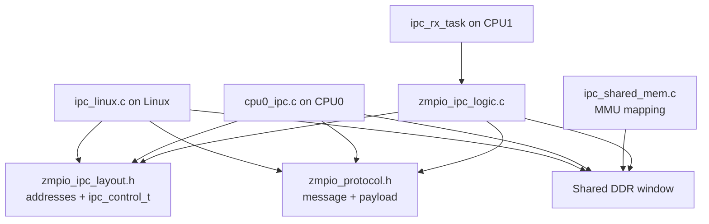
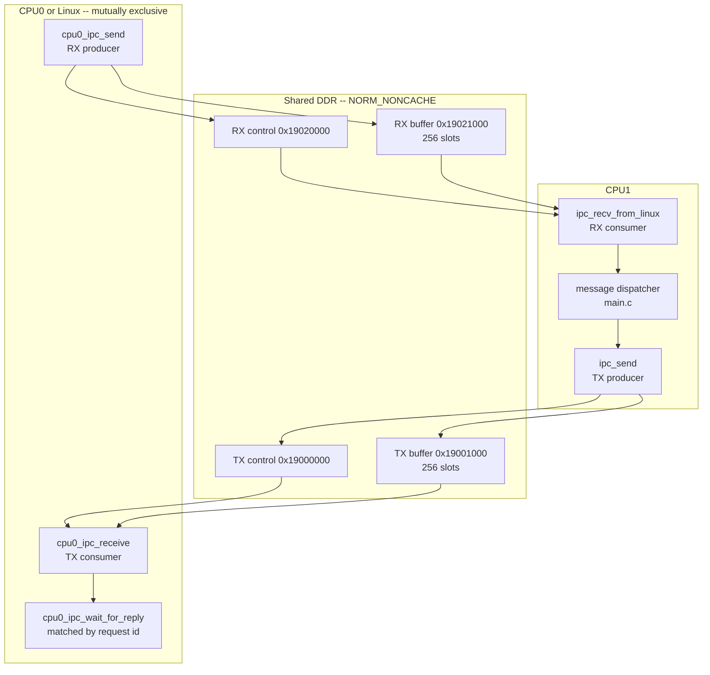
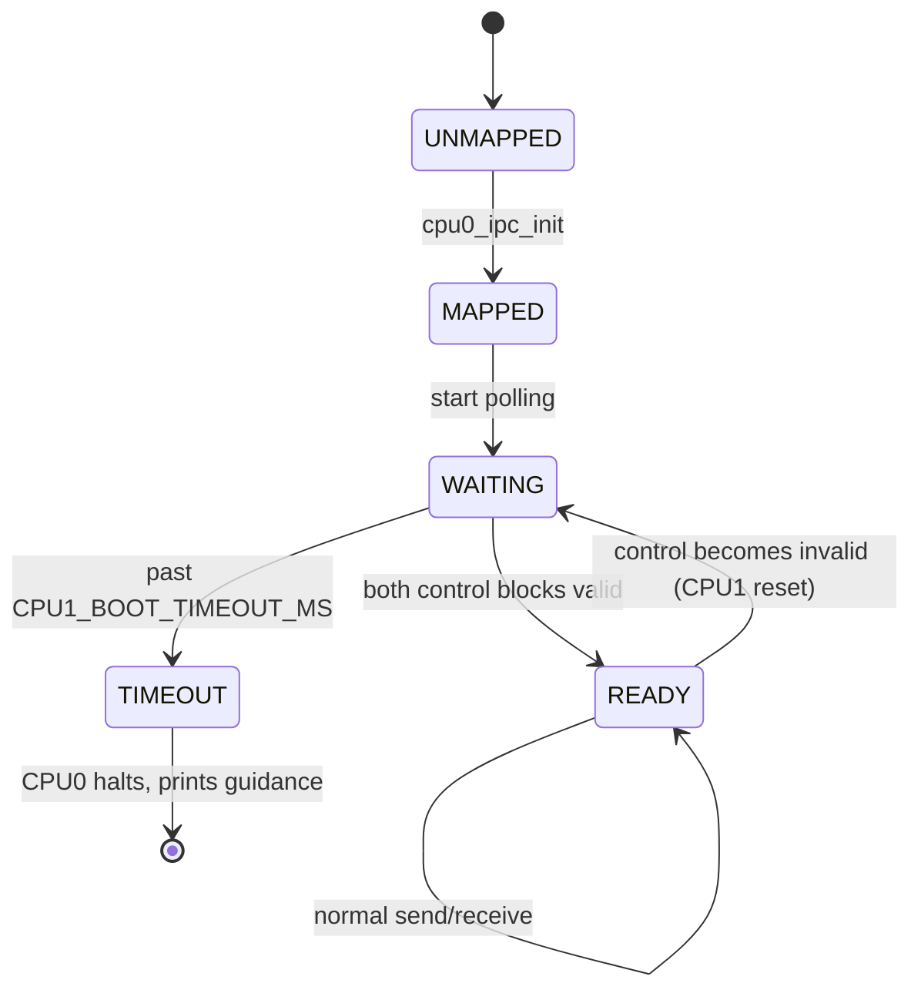
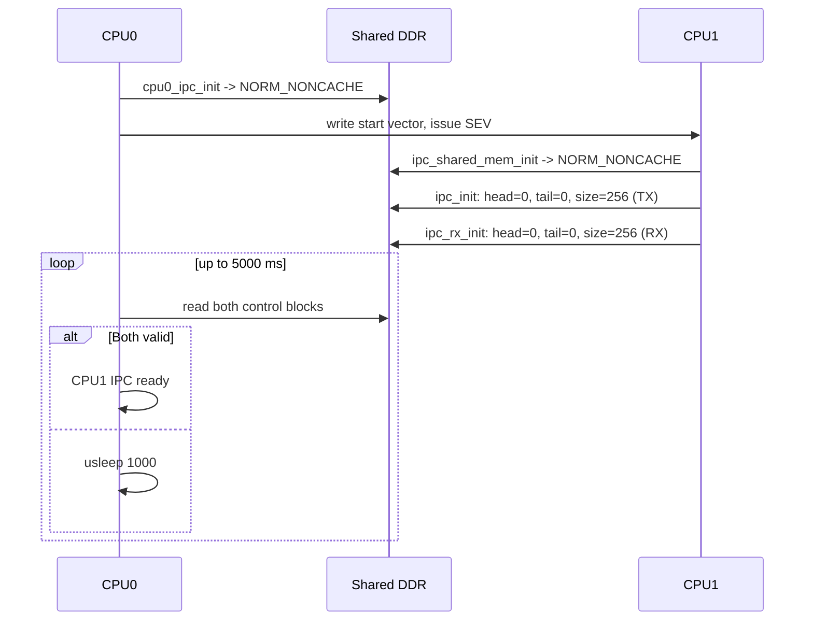
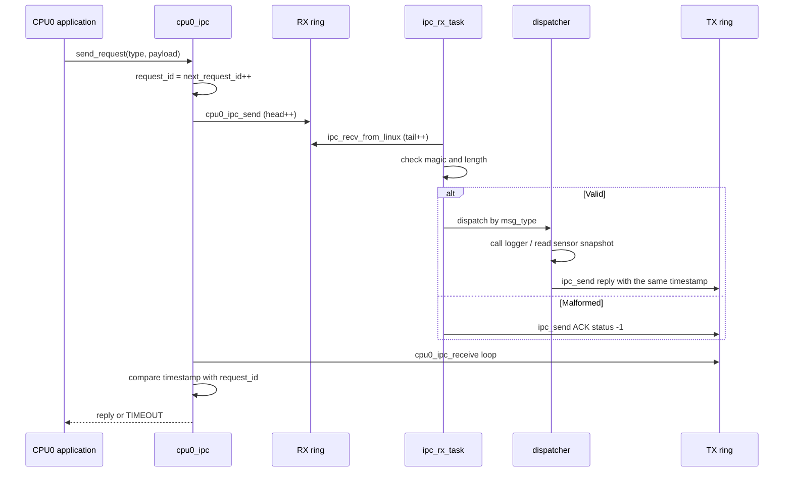
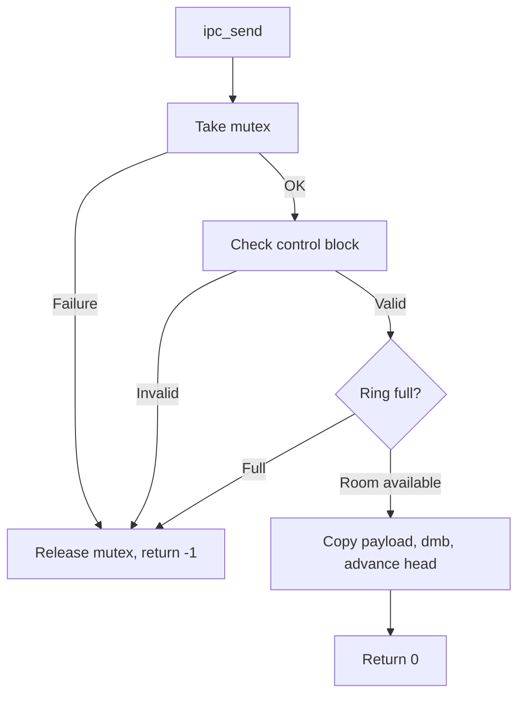

# SDD_04 — IPC ABI v2: shared data ring (CMP-IPC2-001)

**Document ID:** ZMPIO-SDD-04
**Component:** CMP-IPC2-001
**Level:** L2
**Source:** `common/zmpio_ipc_layout.h`, `common/zmpio_protocol.h`,
`firmware/app_freertos/src/zmpio_ipc_logic.{c,h}`, `ipc_shared_mem.{c,h}`,
`firmware/cpu0_application/src/cpu0_ipc.{c,h}`, and the message dispatcher in CPU1's `main.c`

---

## 1. Purpose

This component carries the main data and control traffic between CPU1 and the outside world (CPU0
bare-metal today, Linux at production target) over shared DDR, without relying on any
synchronization primitive that crosses the core boundary.

Correctness rests on exactly three properties, and nothing else:

1. Every field has **exactly one** writer.
2. The payload is written **before** the index is updated, separated by a `dmb`.
3. The memory window is **non-cacheable**, so there is no such thing as a "flush" that could
   corrupt that ordering.

Drop any one of these three properties and the system fails in a non-reproducible way.

## 2. Responsibility

### MUST

- Map the shared window as `NORM_NONCACHE` on both cores, before any access.
- Initialize and validate the control block of both rings.
- Provide one-directional, non-blocking, lossless send/receive for 256-byte messages.
- Validate `magic` and `length` on every received message before processing it.
- Reply to **every** request with a message whose `timestamp` matches.
- Discard and count any mismatched reply instead of treating it as a result.

### MUST NOT

- MUST NOT overwrite a slot that has not yet been consumed.
- MUST NOT allow two simultaneous producers on the same ring.
- MUST NOT rely on manual cache maintenance.
- MUST NOT block indefinitely while waiting for a reply.
- MUST NOT assume the ring is intact — it must be validated before every operation.

## 3. Non-Responsibilities

| Not owned by this component | Owned by |
|---|---|
| The command/response channel with CRC | CMP-IPC3-001 (SDD_05) |
| Business semantics of each `msg_type` | CMP-STO-001, CMP-SEN-001 |
| Waking the other side | CMP-DB-001 (SDD_10) |
| Bulk data transfer | not supported — each message caps payload at 240 bytes |

## 4. Dependencies



Three independent implementations (CPU1, CPU0, Linux) each include **exactly** the same two headers
in `common/`. That is why a change in `common/` affects all three sites at once and must be treated
as an ABI change.

## 5. Architecture



**Two fully independent rings**, not one duplex channel. They share no status field whatsoever.
Consequence: one ring becoming full or corrupted only affects that direction.

**The interaction model is strict request/response.** There is no asynchronous push stream. This
is a design decision, not a limitation: it means a stalled host process **cannot** fill CPU1's ring,
because CPU1 only sends when asked.

## 6. Module Structure

| Module | ID | File | Role |
|---|---|---|---|
| Shared layout | MOD-IPC2-001 | `zmpio_ipc_layout.h` | addresses, `ipc_control_t`, static asserts |
| Shared protocol | MOD-IPC2-002 | `zmpio_protocol.h` | message, payload, error codes |
| CPU1-side ring | MOD-IPC2-003 | `zmpio_ipc_logic.c` | send/receive, TX mutex |
| MMU mapping | MOD-IPC2-004 | `ipc_shared_mem.c` | non-cacheable setup |
| CPU0-side ring | MOD-IPC2-005 | `cpu0_ipc.c` | send/receive, reply matching |
| Message dispatcher | MOD-IPC2-006 | `main.c` (CPU1) | branches on `msg_type` |

## 7. File Structure

### FILE-IPC2-001 — `zmpio_ipc_logic.c`

| Field | Value |
|---|---|
| Layer | transport |
| Runtime owner | CPU1; TX from multiple tasks, RX only from `ipc_rx_task` |

**MUST**

- Protect the TX ring with a mutex — multiple CPU1 tasks send.
- Check `control_is_valid()` before EVERY operation.
- Place `dmb` at exactly three points: before reading the index, after writing the payload, after
  writing the index.
- Refuse to start if the `end` linker symbol exceeds `SHARED_MEM_BASE`.

**MUST NOT**

- MUST NOT call any cache-maintenance function (`Xil_DCacheFlushRange` and its relatives).
- MUST NOT write the TX ring's `tail` or the RX ring's `head` — those fields belong to the other
  side.
- MUST NOT block inside `ipc_recv_from_linux()`.

### FILE-IPC2-002 — `ipc_shared_mem.c`

**MUST** run before any ring access; **MUST** cover the entire `SHARED_MEM_SIZE` by iterating over
each 1 MiB section; **MUST** end with a `dsb`.

**MUST NOT** map this region as `DEVICE` memory — the `memcpy()` and unaligned accesses in
`ipc_v3.c`/`zmpio_ipc_logic.c` require Normal-memory semantics. `NORM_NONCACHE` is Normal, not
Device; this is a subtle but mandatory distinction.

### FILE-IPC2-003 — `cpu0_ipc.c`

**MUST** use `volatile` for every pointer into shared memory; **MUST** count every wait (including
discarded, mismatched messages) against the timeout budget.

**MUST NOT** assume replies arrive in request order — matching is done by `timestamp`.

## 8. Interfaces

### 8.1 CPU1-side API

| Function | Thread-safe | ISR-safe | Blocking | Returns |
|---|---|---|---|---|
| `ipc_init(size)` | no (call once) | no | no | 0 / -1 |
| `ipc_rx_init(size)` | no (call once) | no | no | void |
| `ipc_send(msg)` | **YES** (mutex) | no | only while holding the mutex | 0 / -1 |
| `ipc_recv_from_linux(msg)` | no | no | **NO** | 0 / -1 |
| `ipc_shared_mem_init()` | no (call once) | no | no | void |

### 8.2 CPU0-side API

| Function | Blocking | Returns |
|---|---|---|
| `cpu0_ipc_init()` | no | void |
| `cpu0_ipc_wait_for_cpu1_ready(timeout_ms)` | YES, bounded | `OK` / `TIMEOUT` |
| `cpu0_ipc_send(msg)` | no | `OK` / `FULL` / `NOT_READY` |
| `cpu0_ipc_receive(msg)` | no | `OK` / `EMPTY` / `NOT_READY` |
| `cpu0_ipc_wait_for_reply(id, reply, timeout_ms)` | YES, bounded | `OK` / `TIMEOUT` / `NOT_READY` |

### 8.3 FUNC-IPC2-001 — `ipc_send()`

**Identity**

| Field | Value |
|---|---|
| Signature | `int ipc_send(const ipc_message_t *message)` |
| File | `zmpio_ipc_logic.c` |
| Thread-safe | **YES** — uses `tx_mutex` |
| Reentrant | NO |
| ISR-safe | NO |
| Blocking | only under mutex contention (`portMAX_DELAY`) |

**Purpose:** place a 256-byte message on the TX ring for the host to consume.

**Parameters**

| Parameter | Type | Direction | Required | Constraint | Ownership |
|---|---|---|---|---|---|
| `message` | `const ipc_message_t *` | IN | YES | not `NULL`, exactly 256 bytes | **caller-owned** — content is copied |

**Preconditions**

```text
- ipc_shared_mem_init() has run (the window is non-cacheable)
- ipc_init() succeeded (tx_mutex exists)
- message != NULL and points to a complete ipc_message_t
- Called from task context
```

**State Preconditions**

| State | Allowed | Result |
|---|---|---|
| `ipc_init()` not yet called (`tx_mutex == NULL`) | NO | `-1` |
| control block invalid | NO | `-1` |
| ring full | NO | `-1` |
| normal | YES | `0` |

**Processing Steps**

```text
Step 1 -- Validate the parameter and take the mutex
  Condition: message != NULL, tx_mutex != NULL, xSemaphoreTake OK
  Failure: return -1 immediately, WITHOUT holding the mutex

Step 2 -- dmb, then check control_is_valid(tx_control)
  Checks: size == 256 and head < size and tail < size
  Failure: release the mutex, return -1
  Why check every time: shared memory can be overwritten by the other
  core or by JTAG

Step 3 -- Compute the next index
  next_head = (head + 1) % size

Step 4 -- Check for full
  If next_head == tail: ring is full -> release the mutex, return -1
  DO NOT overwrite. An unconsumed slot is unread data.

Step 5 -- Copy the message into the slot at head
  memcpy 256 bytes

Step 6 -- dmb   <- MOST IMPORTANT ORDERING BOUNDARY
  Ensures the payload is present in DDR before the index points to it

Step 7 -- Write head = next_head

Step 8 -- dmb, release the mutex, return 0
```

**Decision Table**

| `message` | `tx_mutex` | control valid | ring full | Action | Return |
|---|---|---|---|---|---|
| `NULL` | any | — | — | reject | `-1` |
| valid | `NULL` | — | — | reject | `-1` |
| valid | OK | no | — | release mutex, reject | `-1` |
| valid | OK | yes | yes | release mutex, reject | `-1` |
| valid | OK | yes | no | write + commit | `0` |

**Return Contract**

| Value | Category | Meaning | Caller MUST |
|---|---|---|---|
| `0` | success | message is visible to the consumer | continue |
| `-1` | ambiguous | bad parameter, not initialized, corrupted control, OR ring full | **cannot be distinguished** — see limitation |

**Known limitation (LIM-IPC2-001):** a `-1` return conflates four distinct causes: a caller error
(`NULL`), a state error (not initialized), an integrity error (corrupted control), and a retryable
condition (ring full). By the standard in §19, this is an incomplete return contract. Every current
caller uses `(void)ipc_send(...)`, so this has no observed consequence yet, but it blocks any
intelligent retry policy.

**Postconditions**

```text
Success:
  - An independent copy of the message sits in the ring slot
  - head has advanced by one position
  - Ring is consistent: a consumer that sees the new head sees the full payload
  - Mutex released

Failure:
  - Ring UNCHANGED (no slot written, head unchanged)
  - Caller's message is not modified
  - Mutex released (every exit path goes through the release label)
```

**Side Effects**

| May be modified | Must not be modified |
|---|---|
| the TX ring slot at `head` | the TX ring's `tail` (owned by the consumer) |
| `tx_control->head` | anything belonging to the RX ring |
| mutex state | caller's message |

**Concurrency:** thread-safe via `tx_mutex` with `portMAX_DELAY`. No deadlock risk, since no other
lock is taken inside the critical section and the critical section calls no blocking function.

**Timing:** dominated by a 256-byte `memcpy` into non-cacheable memory, plus three `dmb`
instructions. Upper-bounded by mutex contention; since every holder keeps the mutex for only a few
µs, actual wait time is negligible.

**Given / When / Then**

| Scenario | Given | When | Then |
|---|---|---|---|
| IPC2-001-01 normal | empty ring, initialized | send an ACK | returns `0`, `head` +1, the consumer reads back an identical message |
| IPC2-001-02 bad parameter | `message = NULL` | send | returns `-1`, ring unchanged |
| IPC2-001-03 wrong state | `ipc_init()` not called | send | returns `-1`, shared memory untouched |
| IPC2-001-04 boundary | ring has 255/256 slots full | send | returns `0` — the ring can hold `size-1` elements |
| IPC2-001-05 resource exhaustion | ring completely full | send | returns `-1`, **no overwrite**, `head` unchanged |
| IPC2-001-06 integrity corrupted | JTAG writes `size = 0` | send | returns `-1`, no divide-by-zero, no crash |
| IPC2-001-07 concurrent | three tasks send simultaneously | 300 sends | 300 distinct messages, no interleaving, none lost |
| IPC2-001-08 wraparound | `head = 255` | send | `head` wraps to 0, no write past the buffer |

**Caller Responsibilities**

| Result | Caller must do |
|---|---|
| `0` | continue |
| `-1` | treat as a lost reply; **do not** retry in a tight loop (cause cannot be distinguished) |

### 8.4 FUNC-IPC2-002 — `cpu0_ipc_wait_for_reply()`

**Signature**

```c
int cpu0_ipc_wait_for_reply(uint32_t request_id, ipc_message_t *reply, uint32_t timeout_ms);
```

**Purpose:** poll the TX ring until a message with `header.timestamp == request_id` is found.

**Parameters**

| Parameter | Type | Direction | Constraint | Notes |
|---|---|---|---|---|
| `request_id` | u32 | IN | nonzero | placed into the request's `header.timestamp` |
| `reply` | `ipc_message_t *` | OUT | not `NULL` | written even for a discarded message (used as scratch) |
| `timeout_ms` | u32 | IN | > 0 | each loop iteration counts as 1 ms regardless of the reason |

**Processing Steps**

```text
Step 1 -- Loop until elapsed_ms >= timeout_ms

Step 2 -- cpu0_ipc_receive(reply)
  EMPTY     -> usleep(1000), ++elapsed_ms, loop
  NOT_READY -> return NOT_READY immediately (waiting cannot help)
  OK        -> Step 3

Step 3 -- Validate
  Bad magic or length > 240:
      print "discarded malformed", ++elapsed_ms, loop
  timestamp != request_id:
      print "discarded unmatched", ++elapsed_ms, loop
  Both pass: return OK

Step 4 -- Time up -> return TIMEOUT
```

**Key design point in Step 3:** a discarded message still **counts** toward the timeout budget.
Otherwise, a continuous stream of mismatched traffic would keep this function running forever —
exactly the failure class this design exists to eliminate. The code comment states this explicitly.

**Return Contract**

| Value | Meaning | Caller MUST |
|---|---|---|
| `CPU0_IPC_OK` | `*reply` is a matched, valid reply | process it |
| `CPU0_IPC_TIMEOUT` | no matching reply arrived in time | treat as lost; **may** retry with a new id |
| `CPU0_IPC_NOT_READY` | control block invalid (CPU1 not yet up, or has died) | wait for CPU1 to become ready again |

**Given / When / Then**

| Scenario | Given | When | Then |
|---|---|---|---|
| IPC2-002-01 normal | CPU1 replies within 10 ms | wait 2000 ms | returns `OK`, `reply` matches |
| IPC2-002-02 timeout | CPU1 never replies | wait 2000 ms | returns `TIMEOUT` after ~2000 ms, not much earlier |
| IPC2-002-03 id mismatch | ring holds 5 stale replies | wait | 5 logged discards, then a match — if time remains |
| IPC2-002-04 malformed | slot has a bad magic | wait | discarded, logged, continues |
| IPC2-002-05 CPU1 dies | CPU1 resets mid-wait | wait | returns `NOT_READY` as soon as the control block becomes invalid |
| IPC2-002-06 boundary | reply arrives right at the deadline | wait | returns `OK` (the receive check happens before the time check) |

## 9. Data Structures

Full layout is in `ARCHITECTURE_DETAIL.md` §3. Only invariants are listed here.

### `ipc_control_t` — invariants

```text
INV-1: size == IPC_BUFFER_SIZE (256) for the entire lifetime
INV-2: 0 <= head < size
INV-3: 0 <= tail < size
INV-4: head == tail          <=>  ring empty
INV-5: (head+1) % size == tail <=>  ring full
INV-6: The maximum number of elements is size-1 (one slot always kept
       empty to distinguish empty from full)
INV-7: Producer writes only head; consumer writes only tail. Never the
       reverse.
```

INV-6 is the price of distinguishing empty from full without a separate counter — a counter would
need atomic updates from both sides, i.e. a lock spanning both cores, i.e. something that does not
exist.

### `ipc_message_t` — invariants

```text
INV-8:  sizeof == 256 (enforced by _Static_assert)
INV-9:  magic == IPC_MAGIC on every valid message
INV-10: length <= IPC_PAYLOAD_SIZE (240)
INV-11: a reply's timestamp == the corresponding request's timestamp
```

## 10. State Machine

### STATE-IPC2-001 — Channel readiness, as seen from CPU0



| Current | Event | Guard | Action | Next |
|---|---|---|---|---|
| `MAPPED` | poll | both controls valid | — | `READY` |
| `WAITING` | poll | past 5000 ms | print guidance on the ELF load address | `TIMEOUT` |
| `READY` | operation | control becomes invalid | return `NOT_READY` | `WAITING` |

**Notable point:** CPU0 halts entirely on timeout rather than continuing. This is a test-controller
choice — it favors a clear diagnostic over trying to limp along. A production system would need a
different policy.

## 11. Runtime Sequence

### 11.1 Startup handshake



**Using `control_is_valid()` itself as the readiness signal** is a deliberate minimalist choice: no
separate "ready" flag is needed, since `size == 256` can only appear after CPU1 has initialized.
Trade-off: DDR not cleared from a previous run could in theory already contain a value that looks
valid — never observed in practice, and ABI v3 uses a `magic` value to rule this out entirely.

### 11.2 A complete request/response transaction



### 11.3 Message dispatcher branch table

| `msg_type` | Check | Action | Reply |
|---|---|---|---|
| `RAW_DATA`, `LOG_DATA` | — | `logger_submit(LOG_SOURCE_LINUX)` | ACK with `detail = queue_depth`, or error `-2` |
| `LOG_START/STOP/FLUSH` | — | `logger_send_command()` | ACK `0` or error `-2` |
| `LOG_STATUS` | — | `logger_get_status()` | `ipc_logger_status_t` |
| `LOG_DIAGNOSTIC` | `length == 0` | `logger_get_diagnostic()` | `ipc_logger_diagnostic_t`, or error `-1` |
| `SENSOR_DATA` | `length == 0` | `read_sensor_snapshot()` | `ipc_sensor_data_t`, or error `-4` if no sample yet |
| `HEARTBEAT` | — | — | ACK with `detail = 2` |
| other | — | — | error `-3`, `detail` = the offending `type` |

**Why `SENSOR_DATA` and `LOG_DIAGNOSTIC` require `length == 0`:** to leave room for future
extension. If any payload were accepted today, adding parameters to these two requests later would
be unable to distinguish an old client from a new one.

## 12. Algorithms

### ALG-IPC2-001 — Lock-free single-producer single-consumer ring

**Problem:** transfer data between two cores with no shared synchronization primitive.

**Solution:** exactly one writer per index, plus memory barriers in the right places.

```text
PRODUCER                              CONSUMER
--------                              --------
dmb                                   dmb
read head (own), tail (other's)       read head (other's), tail (own)
if (head+1)%size == tail: FULL        if head == tail: EMPTY
write payload to slot[head]           read payload from slot[tail]
dmb            <- critical            dmb
head = (head+1)%size                  tail = (tail+1)%size
dmb                                   dmb
```

**Sketch of a correctness proof**

| Property | Argument |
|---|---|
| No data loss | The producer never writes when `(head+1)%size == tail`, so it can never overwrite a slot the consumer hasn't read |
| No garbage reads | The consumer only reads when `head != tail`; `head` only advances **after** the payload is fully written, separated by a `dmb` |
| No torn reads | The producer's `dmb` between steps 5 and 6 guarantees the payload is present before the index is |
| No atomic operations needed | Each index is an aligned 32-bit word with a single writer -> the write is atomic by the architecture |
| No cache maintenance needed | The window is non-cacheable (ADR-008) |

**Why `dmb` suffices without `dsb`:** `dmb` orders memory accesses as seen by other observers —
exactly what is needed here. `dsb` is stronger (waits for all operations to complete, including
non-memory ones) and is unnecessary on the hot path. `ipc_shared_mem_init()` uses `dsb` because it
changes the MMU mapping, which must complete before execution continues.

### ALG-IPC2-002 — Non-cacheable mapping

```text
for offset in 0, 1 MiB, 2 MiB, 3 MiB:
    Xil_SetTlbAttributes(SHARED_MEM_BASE + offset, NORM_NONCACHE)
dsb
```

`Xil_SetTlbAttributes()` rewrites one 1 MiB MMU section per call, and internally flushes the
D-cache and invalidates the TLB — so any cache line this core still held for that window is dropped
before the ring is first touched.

Full analysis of why manual cache maintenance **cannot** be correct here: `ARCHITECTURE_DETAIL.md`
§1.2 and ADR-008.

## 13. Error Handling

| Error | Class | Detection | Action | Recovery |
|---|---|---|---|---|
| Ring full | E3 | `(head+1)%size == tail` | reject, return error | consumer drains |
| Control invalid | E7 | `control_is_valid()` | reject every operation | other side reinitializes |
| Bad magic | E1 | compare `IPC_MAGIC` | send ACK `-1` | sender fixes |
| `length` too large | E1 | compare to 240 | send ACK `-1` | sender fixes |
| Unknown message type | E1 | `default` in the switch | send ACK `-3` with `type` | client uses the correct type |
| No sensor sample | E2 | `available` flag | send ACK `-4` | retry later |
| Reply timeout | E4 | loop counter | return `TIMEOUT` | new request |
| Mismatched reply id | E5 | compare `timestamp` | discard + log, counts toward timeout | continue polling |
| Firmware overlaps shared region | E7 | `&end > SHARED_MEM_BASE` | `ipc_init()` returns `-1` | build must be fixed |

**Sender-side error flow**



## 14. Concurrency

| Context | TX ring | RX ring |
|---|---|---|
| `ipc_rx_task` (CPU1) | writes via `ipc_send` | reads via `ipc_recv_from_linux` |
| other CPU1 tasks | can write via `ipc_send` | do not touch |
| CPU0 | reads | writes |
| Linux | reads | writes |

**Synchronization**

| Boundary | Mechanism |
|---|---|
| Between CPU1 tasks on the TX ring | `tx_mutex` (`portMAX_DELAY`) |
| Between CPU1 and CPU0 | one writer per field + `dmb` + non-cacheable |
| RX ring, CPU1 side | no lock needed — only `ipc_rx_task` reads |

**Unenforced exclusion constraint:** CPU0 standalone and Linux must not simultaneously act as
producer of the RX ring. Both are capable of writing, and no hardware or software mechanism
prevents it. This is an implementation-level constraint (LIM-IPC2-003).

## 15. Timing

| Quantity | Value | Notes |
|---|---:|---|
| `ipc_send()` | a few µs | 256-byte non-cacheable `memcpy` + 3 `dmb` |
| `ipc_recv_from_linux()` | a few µs | non-blocking |
| `ipc_rx_task` idle poll cadence | 10 ms | `vTaskDelay` |
| CPU0 poll cadence | 1000 µs | `usleep` |
| Reply wait timeout (CPU0) | 2000 ms | |
| Reply wait timeout (Linux) | 2000 ms | |
| Wait for CPU1 ready timeout | 5000 ms | |

**Round-trip latency of a request:**

```text
T_round ≈ T_poll_CPU1 (0..10 ms) + T_process (< 1 ms) + T_poll_CPU0 (0..1 ms)
        ≈ 1..12 ms typical
```

The dominant term is CPU1's 10 ms poll cadence. This is exactly the latency that the doorbell
(SDD_10) reduces for ABI v3 — and also why ABI v2 does not need a doorbell: its transactions are
not latency-sensitive.

## 16. Resource / Memory Usage

| Resource | Usage |
|---|---|
| Shared DDR (v2) | 2 x (12 B control + 64 KiB buffer) = ~128 KiB |
| Mutex | 1 (FreeRTOS heap) |
| Stack for a local `ipc_message_t` | 256 B per frame holding a message |
| Static pointers | 4 constant pointers per side |

The 256-byte `ipc_message_t` on the stack appears in `ipc_rx_task` (one for the received message,
one for the reply inside each `send_*` function) — contributing to that task's 3072-word stack
requirement.

## 17. Configuration

| Constant | Value | Effect of changing |
|---|---:|---|
| `SHARED_MEM_BASE` | `0x19000000` | must match all three implementations and Linux's device tree |
| `SHARED_MEM_SIZE` | 4 MiB | must be enough for v2 + v3, enforced by `_Static_assert` |
| `IPC_BUFFER_SIZE` | 256 | each ring costs +64 KiB if doubled |
| `IPC_MESSAGE_SIZE` | 256 | changing this breaks the ABI |
| `IPC_PAYLOAD_SIZE` | 240 | = 256 minus a 16-byte header |
| `IPC_PROTOCOL_VERSION` | 2 | returned in the heartbeat ACK |
| `CPU1_BOOT_TIMEOUT_MS` | 5000 | how long CPU0 waits for CPU1 |
| `CPU1_REPLY_TIMEOUT_MS` | 2000 | per-transaction timeout |

## 18. Logging / Debug

| Log line | Side | Meaning |
|---|---|---|
| `IPC ring size %lu invalid, using 256` | CPU1 | someone passed the wrong size |
| `firmware end 0x... overlaps IPC memory` | CPU1 | a build error, not a runtime one |
| `IPC TX mutex allocation failed` | CPU1 | heap exhausted |
| `CPU1 did not initialize IPC within %lu ms` | CPU0 | CPU1 did not boot — check the ELF load address |
| `discarded malformed CPU1 message` | CPU0 | corrupted or overwritten slot |
| `discarded unmatched CPU1 reply (id=%lu)` | CPU0 | a stale reply to an old request |

**Debugging over JTAG:** since the window is non-cacheable, everything read via `mrd` is the real
value — no cached copy exists anywhere. This is an important side benefit of ADR-008 for
troubleshooting.

| Address | Content |
|---|---|
| `0x19000000` | TX ring's `head`, `tail`, `size` |
| `0x19020000` | same, for the RX ring |
| `0x19001000 + n*256` | TX slot number `n` |

## 19. Verification

| Test | Checks | Evidence |
|---|---|---|
| TEST-IPC-001 | ring works correctly | heartbeat/status/sensor transactions |
| TEST-IPC-002 | non-cacheable | no index loss under stress |
| TEST-IPC-009 | full ring never overwrites | force full, verify data |
| TEST-IPC-010 | reply matching by id | force a mismatched reply |
| TEST-IPC-011 | malformed message rejected | write a bad magic via JTAG |

## 20. Known Limitations

| ID | Limitation | Impact | Mitigation |
|---|---|---|---|
| LIM-IPC2-001 | `ipc_send()`'s `-1` return conflates four causes | no intelligent retry possible | every current caller ignores the return value |
| LIM-IPC2-002 | No CRC in ABI v2 | corrupted slots only caught via `magic`/`length` | ABI v3 has full CRC |
| LIM-IPC2-003 | CPU0/Linux exclusion not enforced | two simultaneous producers would corrupt the ring | implementation-level constraint |
| LIM-IPC2-004 | No asynchronous push | host must poll to receive data | deliberate — prevents ring flooding |
| LIM-IPC2-005 | Cannot detect a falsely-valid `size` left over in un-cleared DDR | could in theory be mistaken for readiness | never observed; ABI v3 uses `magic` |
| LIM-IPC2-006 | `timestamp` is really a request id | misleading name | cannot change without breaking the ABI; documented in `ARCHITECTURE_DETAIL.md` |
| LIM-IPC2-007 | Maximum payload of 240 bytes | cannot transfer large blocks | designed for control messages |

## 21. Traceability

| REQ | Design | FUNC | TEST |
|---|---|---|---|
| REQ-IPC-001 | §9, §12 ALG-IPC2-001 | FUNC-IPC2-001 | TEST-IPC-001 |
| REQ-IPC-002 | §12 ALG-IPC2-002, ADR-008 | — | TEST-IPC-002 |
| REQ-SYS-002 | §14 | — | TEST-SYS-002 |
| REQ-SYS-004 | ADR-003 | — | TEST-SYS-004 |
| REQ-RT-002 | §15 | FUNC-IPC2-002 | TEST-RT-002 |
