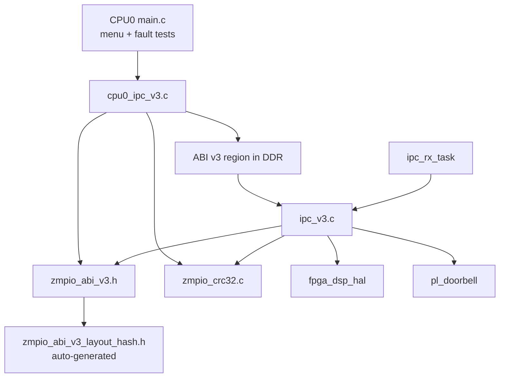
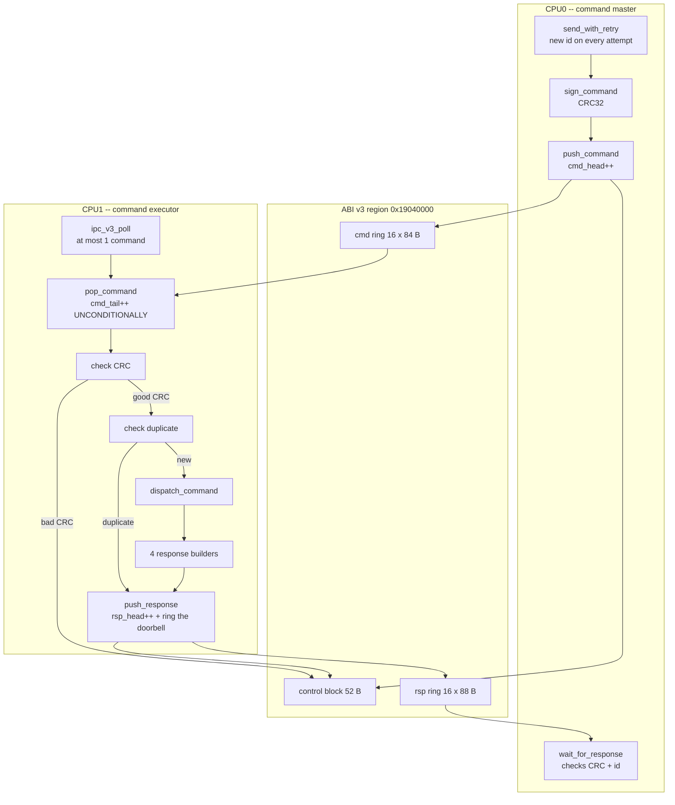
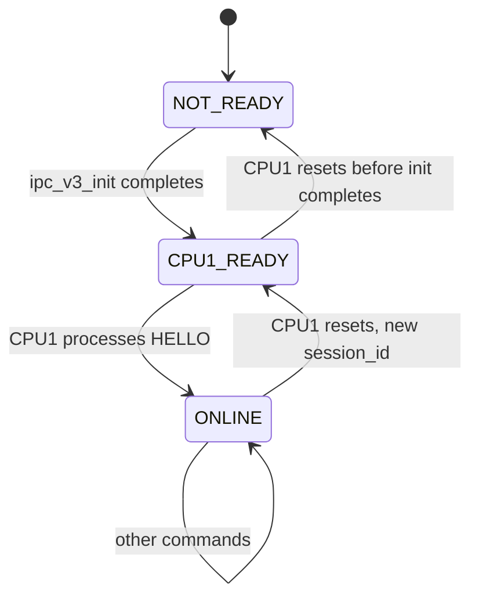
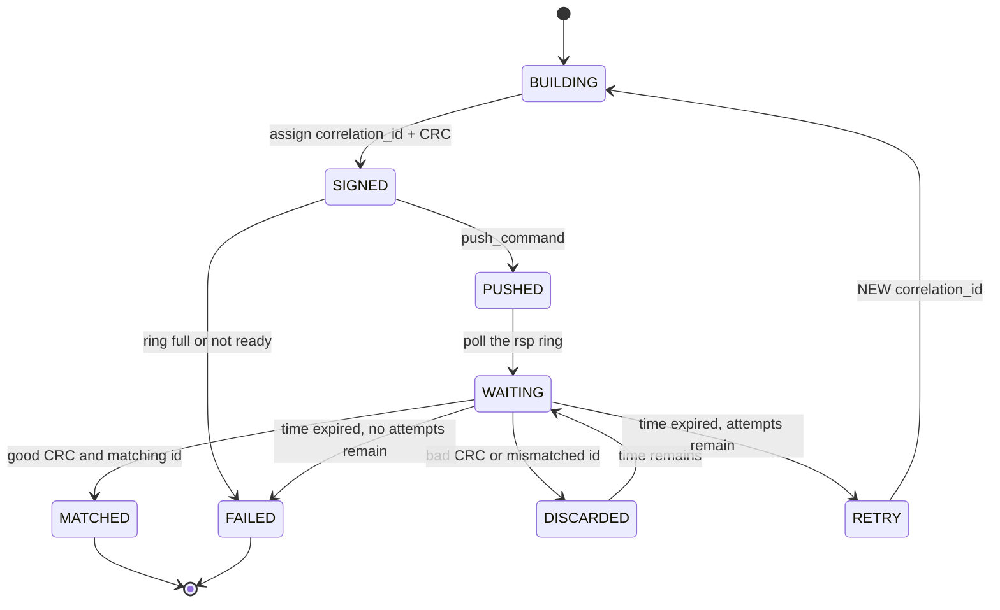
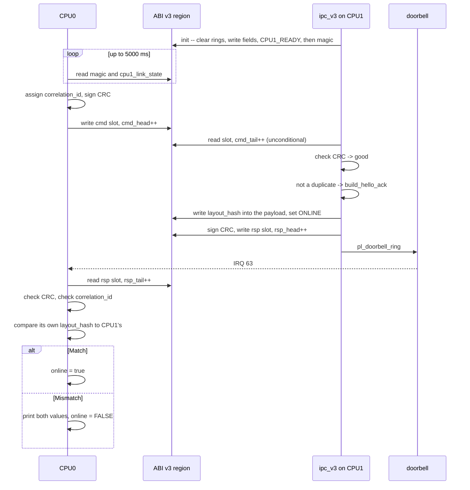
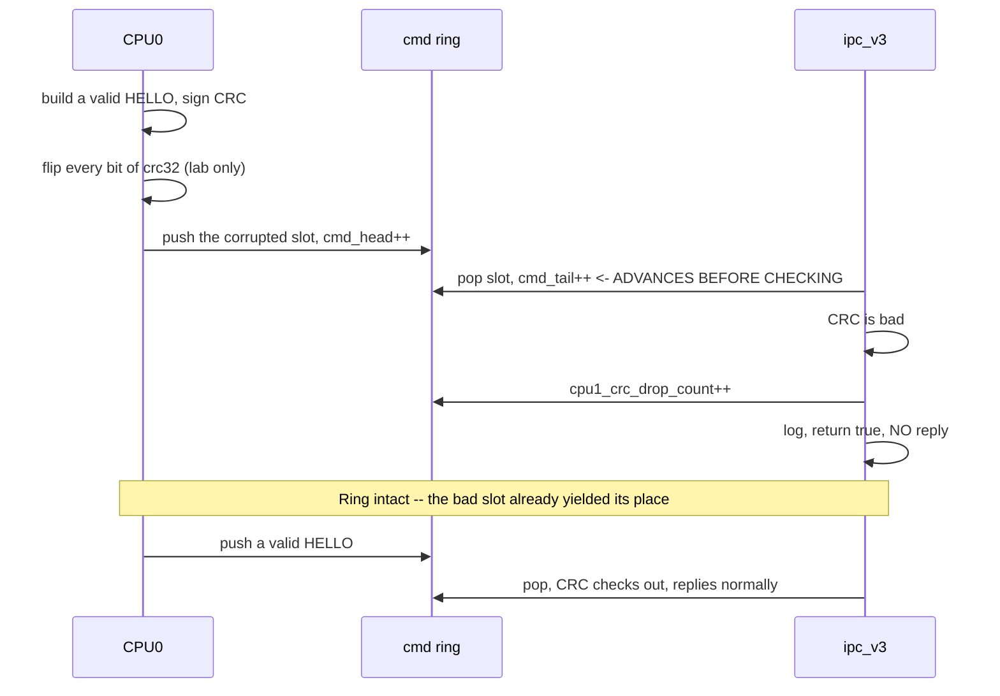
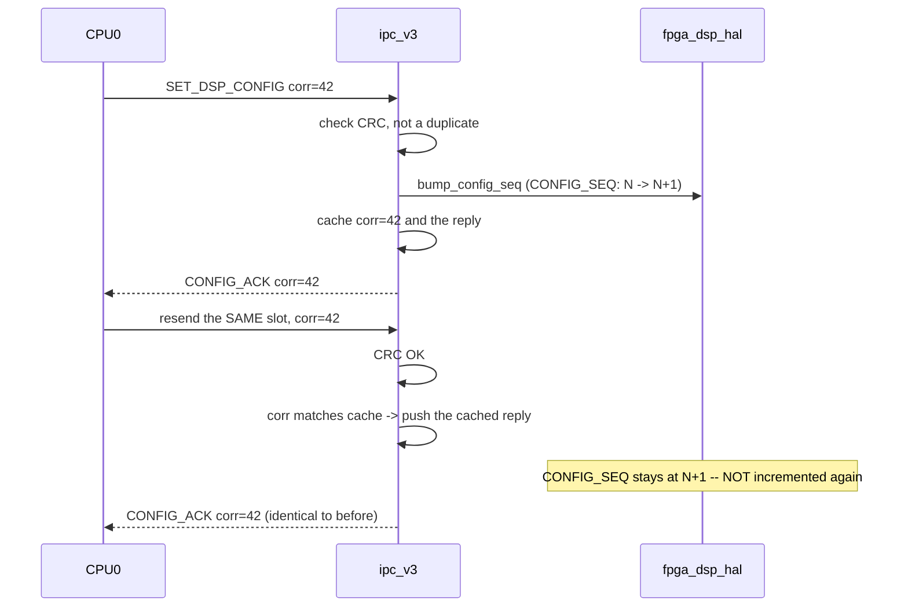
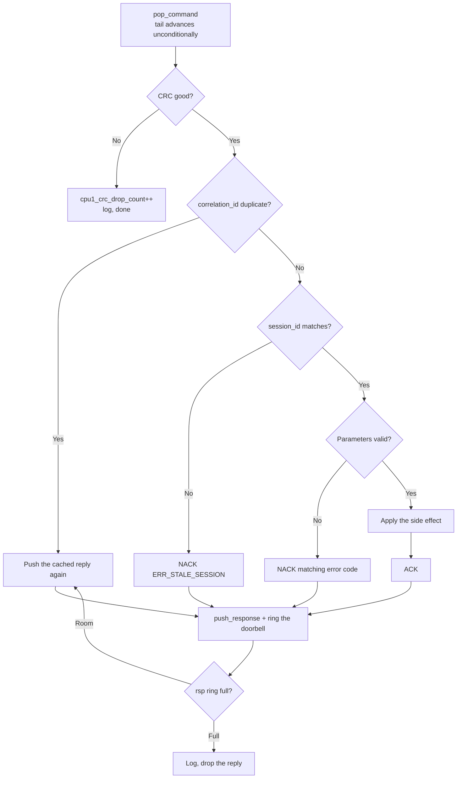

# SDD_05 — IPC ABI v3: command/response channel (CMP-IPC3-001)

**Document ID:** ZMPIO-SDD-05
**Component:** CMP-IPC3-001
**Level:** L2
**Source:** `common/zmpio_abi_v3.h`, `common/zmpio_abi_v3_layout_hash.h`, `common/zmpio_crc32.{c,h}`,
`firmware/app_freertos/src/ipc_v3.{c,h}`, `firmware/cpu0_application/src/cpu0_ipc_v3.{c,h}`

---

## 1. Purpose

ABI v2 (SDD_04) is sufficient to move data, but not to issue **commands**. A command differs from a
data packet in four respects:

| Question | Can ABI v2 answer it? | ABI v3 answers with |
|---|---|---|
| Is this slot's content still intact? | no | `crc32` |
| Which of my commands does this reply belong to? | partially (`timestamp`) | `correlation_id` |
| Is the other side still the boot session I shook hands with? | no | `session_id` |
| Do both sides agree on the data layout? | no | `layout_hash` |

This component adds those four layers, in a memory region **fully separate** from ABI v2, so that
the already-running v2 stream is not put at risk while v3 is brought up.

## 2. Responsibility

### MUST

- Provide a command/response ring pair with per-slot CRC32 integrity checking.
- Generate a new `session_id` on every CPU1 boot.
- Exchange and cross-check `layout_hash` during the handshake.
- Release a slot with a bad CRC from the ring (**never leave the ring stalled**), counting it only.
- Answer a repeated command from cache instead of re-executing its side effects.
- Issue a NEW `correlation_id` for every retry.
- Discard and record any reply with a mismatched `correlation_id`.
- Pop at most **one** command per poll call.

### MUST NOT

- MUST NOT share any state field with ABI v2.
- MUST NOT apply a side effect before CRC and `session_id` have been confirmed.
- MUST NOT let a corrupted slot block `cmd_tail`.
- MUST NOT add a doorbell/IRQ to this layer itself — that is a separate component (SDD_10) and must
  remain optional.
- MUST NOT reuse a `correlation_id` for a retry.

## 3. Non-Responsibilities

| Not owned by this component | Owned by |
|---|---|
| Waking CPU0 | CMP-DB-001 (SDD_10) |
| Writing PL registers | CMP-HAL-001 (SDD_08) |
| The main data stream | CMP-IPC2-001 (SDD_04) |
| MMU mapping of the shared region | CMP-IPC2-001 (`ipc_shared_mem.c` also covers the v3 region) |

## 4. Dependencies



The dependency on `pl_doorbell` is **one-directional and optional**: `ipc_v3.c` calls
`pl_doorbell_ring()` after pushing a reply, but ignores the result and behaves the same whether or
not CPU0 has the doorbell IRQ enabled.

## 5. Architecture



**The order of these checks is mandatory and load-bearing:**

```text
1. Pop from the ring (tail advances UNCONDITIONALLY)  <- the ring never stalls
2. Check CRC                                            <- integrity
3. Check duplicate                                      <- not applied twice
4. Check session_id (inside each builder)               <- not talking to a stale session
5. Check parameters (inside each builder)               <- business-level validity
6. Apply the side effect                                <- state changes only here
```

Step 1 preceding step 2 is the single most important design decision in the whole component: if CRC
were checked before `tail` advances, a corrupted slot would block the ring forever.

## 6. Module Structure

| Module | ID | File | Role |
|---|---|---|---|
| ABI definitions | MOD-IPC3-001 | `zmpio_abi_v3.h` | structs, enums, addresses, static asserts |
| Layout hash | MOD-IPC3-002 | `zmpio_abi_v3_layout_hash.h` | auto-generated constant |
| Shared CRC | MOD-IPC3-003 | `zmpio_crc32.{c,h}` | one implementation for both cores |
| CPU1-side slave | MOD-IPC3-004 | `ipc_v3.c` | poll, validate, dispatch, reply |
| CPU0-side master | MOD-IPC3-005 | `cpu0_ipc_v3.c` | sign, send, retry, reply matching |
| Lab scenarios | MOD-IPC3-006 | `cpu0_ipc_v3.c` | corruption, duplicate, wraparound stress |

## 7. File Structure

### FILE-IPC3-001 — `ipc_v3.c`

| Field | Value |
|---|---|
| Layer | transport + dispatch |
| Runtime owner | CPU1, `ipc_rx_task` only |

**MUST**

- Write `magic` **last** in `ipc_v3_init()`, after every other field is already valid.
- Advance `cmd_tail` before checking CRC.
- Sign every reply with CRC32 before pushing it.
- Cache the `correlation_id` and reply of the command just processed.
- Check `session_id` inside **each** builder, not once in a central location.

**MUST NOT**

- MUST NOT apply a side effect before every check has passed.
- MUST NOT pop more than one command per call.
- MUST NOT treat the duplicate cache differently for `HELLO` than for other commands — it shares
  the same mechanism.

### FILE-IPC3-002 — `cpu0_ipc_v3.c`

**MUST** issue a new `correlation_id` on every retry inside `send_with_retry()`; **MUST** count
every discarded reply against the timeout budget; **MUST** advance `rsp_tail` even for a reply with
a bad CRC.

**MUST NOT** set `online = true` when `layout_hash` differs, even if `HELLO_ACK` is otherwise
completely valid.

### FILE-IPC3-003 — `zmpio_abi_v3.h`

**MUST** keep every `_Static_assert` about struct sizes and about regions not overlapping.

**MUST NOT** contain any field without a documented, single writer noted in a comment. This
convention is what makes the cache-line analysis in `ARCHITECTURE_DETAIL.md` §1.2 verifiable.

## 8. Interfaces

### 8.1 CPU1-side API

| Function | Thread-safe | Blocking | Returns |
|---|---|---|---|
| `ipc_v3_init()` | no (call once) | no | 0 / -1 |
| `ipc_v3_poll()` | no (`ipc_rx_task` only) | no | `true` if the ring advanced |

### 8.2 CPU0-side API

| Function | Blocking | Purpose |
|---|---|---|
| `cpu0_ipc_v3_wait_for_cpu1_ready(timeout_ms)` | bounded | wait for `magic` + `link_state` |
| `cpu0_ipc_v3_hello(attempts, timeout, out_link)` | bounded | handshake + hash check |
| `cpu0_ipc_v3_set_dsp_config(...)` | bounded | configuration command |
| `cpu0_ipc_v3_dsp_soft_reset(...)` | bounded | fault injection |
| `cpu0_ipc_v3_fifo_full_inject(...)` | bounded | fault injection |
| `cpu0_ipc_v3_debug_send_corrupt_command()` | no | lab only |
| `cpu0_ipc_v3_debug_resend_last(...)` | bounded | lab only |
| `cpu0_ipc_v3_debug_wrap_stress(count, timeout)` | bounded | lab only |
| `cpu0_ipc_v3_get_counters(...)` | no | read drop counters |

### 8.3 FUNC-V3-001 — `ipc_v3_init()`

**Identity**

| Field | Value |
|---|---|
| Signature | `int ipc_v3_init(void)` |
| Thread-safe | NO — called exactly once from `main()` |
| Blocking | NO |

**Preconditions**

```text
- ipc_shared_mem_init() has run (the v3 region lies inside the mapped window)
- platform_time_init() has run (needed for session_id)
- Called before vTaskStartScheduler()
```

**Processing Steps**

```text
Step 1 -- Zero both rings, then dmb
  Why zero them: DDR may still hold data from a previous boot; a stale
  slot could coincidentally have a valid CRC and be mistaken for a new
  command.

Step 2 -- Write ring indices and sizes
  cmd_head = cmd_tail = rsp_head = rsp_tail = 0
  cmd_ring_size = rsp_ring_size = 16
  both CRC drop counters = 0
  abi_version = 3
  layout_hash = ZMPIO_ABI_V3_EFFECTIVE_LAYOUT_HASH

Step 3 -- Generate session_id
  session_id = (uint32)platform_time_us()
  Only needs to differ from the previous boot's value with overwhelming
  probability; cryptographic uniqueness is not required. Kept as an
  integer (no float), per CLAUDE.md section 6.

Step 4 -- dmb, then write cpu1_link_state = CPU1_READY

Step 5 -- dmb, then write magic = ZMPIO_ABI_V3_MAGIC     <- LAST

Step 6 -- dmb; clear the duplicate cache; log session_id and layout_hash
```

**Why `magic` must be written last:** CPU0 uses `magic` as the flag meaning "this entire block is
now valid." If it were written early, CPU0 could read `cmd_ring_size == 0` and perform a
divide-by-zero — a fault on CPU0 caused by a race condition on CPU1.

**Return Contract**

| Value | Meaning | Caller MUST |
|---|---|---|
| `0` | channel ready to accept commands | continue booting |
| `-1` | does not occur in the current implementation | — |

The function currently has no real error path (every operation is a memory write). The `int` return
type is kept for consistency with `ipc_init()` and to leave room for future checks.

**Postconditions**

```text
- Both rings empty and clean
- control->magic == ZMPIO_ABI_V3_MAGIC
- control->cpu1_link_state == CPU1_READY (not yet ONLINE)
- session_id differs from the previous boot's value
- last_correlation_valid == false
```

**Given / When / Then**

| Scenario | Given | When | Then |
|---|---|---|---|
| V3-001-01 normal | clean boot | call | returns 0, CPU0 sees `magic` and `CPU1_READY` |
| V3-001-02 reboot | CPU1 resets while CPU0 is running | call | **new** `session_id`; CPU0's old command is NACKed as stale |
| V3-001-03 dirty DDR | v3 region holds stale data | call | the ring is cleared, no stale command is ever executed |
| V3-001-04 ordering | CPU0 polls mid-init | call | CPU0 either sees no `magic` yet, or sees every field already valid — never an intermediate state |

### 8.4 FUNC-V3-002 — `ipc_v3_poll()`

**Identity**

| Field | Value |
|---|---|
| Signature | `bool ipc_v3_poll(void)` |
| Thread-safe | NO — `ipc_rx_task` only |
| ISR-safe | NO |
| Blocking | NO |

**Purpose:** pop at most one command, validate it, execute it, and reply.

**Processing Steps**

```text
Step 1 -- pop_command()
  dmb; if cmd_head == cmd_tail: return false (nothing to do)
  copy the slot at cmd_tail into a local variable
  cmd_tail = (cmd_tail + 1) % cmd_ring_size     <- UNCONDITIONAL
  dmb
  Why unconditional: a corrupted slot MUST yield its place; the ring
  must never be blocked (this is what the Step 4 gate "CRC error
  injected does not stall the ring" verifies)

Step 2 -- Check CRC
  Copy the slot into a 128-byte scratch buffer, zero the 4 bytes at the
  crc32 offset, recompute, compare.
  Mismatch: cpu1_crc_drop_count++, dmb, log, return TRUE
  (returns true because the ring DID advance -- "handled" means
   progress was made, not necessarily success)

Step 3 -- dispatch_command()
  3a. If correlation_id matches the previously processed command: push
      the cached reply again, WITHOUT re-running the builder. Done.
  3b. Select a builder by type.
  3c. The builder checks session_id and parameters itself, and applies
      its own side effect.
  3d. sign_response() -- CRC32 with the crc32 field set to 0.
  3e. Store correlation_id + reply in the cache.
  3f. push_response().

Step 4 -- Return true
```

**Decision Table**

| Ring empty | CRC | Duplicate | `session_id` | Parameters | Action | Return |
|---|---|---|---|---|---|---|
| yes | — | — | — | — | do nothing | `false` |
| no | bad | — | — | — | count drop, discard | `true` |
| no | good | duplicate | — | — | push cached reply | `true` |
| no | good | new | mismatch | — | NACK `ERR_STALE_SESSION` | `true` |
| no | good | new | match | invalid | NACK with the matching error code | `true` |
| no | good | new | match | valid | apply + ACK | `true` |
| no | good | new | — | unknown `type` | NACK `ERR_UNKNOWN_COMMAND` | `true` |

**Return Contract**

| Value | Meaning | Caller MUST |
|---|---|---|
| `true` | the ring advanced (ACK, NACK, or drop) | continue the loop; **do not** retry |
| `false` | no command was pending | move on to other work |

The "handled = ring advanced" semantics (not "handled = succeeded") is stated explicitly in the
header. This is deliberate: the caller (`ipc_rx_task`) only needs to know whether to move on to
other work, not whether the command itself succeeded or failed.

**Postconditions**

```text
Returns true, good CRC, not a duplicate:
  - Exactly one reply was pushed (unless the response ring is full)
  - cmd_tail advanced by one
  - Any side effect was applied EXACTLY ONCE
  - Duplicate cache updated

Returns true, bad CRC:
  - cmd_tail still advances
  - NO reply is produced
  - NO side effect occurs
  - cpu1_crc_drop_count increments by 1

Returns false:
  - Nothing changed
```

**Side Effects (by command type)**

| Command | Side effect on ACK |
|---|---|
| `HELLO` | `cpu1_link_state = ONLINE` |
| `SET_DSP_CONFIG` | `fpga_dsp_hal_bump_config_seq()` |
| `DSP_SOFT_RESET` | `fpga_dsp_hal_soft_reset_pulse()` -- **a real hardware reset** |
| `FIFO_FULL_INJECT` | `fpga_dsp_hal_fault_inject_stall_arm()` |

Three of the four commands have side effects that cannot be undone. That is precisely why the
duplicate cache exists: a repeated `DSP_SOFT_RESET` would reset the pipeline twice, corrupting the
evidence of a fault-injection run.

**Timing**

```text
T_poll ≈ T_dmb + T_memcpy(84B) + T_crc32(84B, bit-serial) + T_builder + T_push
```

The most expensive part is the bit-serial CRC32 over 84 bytes = 672 bit iterations, run **twice**
(once for the incoming command, once for the outgoing reply). At `-O0`, this is why `ipc_rx_task`
is the single largest consumer of CPU1 time outside of I2C.

**Given / When / Then**

| Scenario | Given | When | Then |
|---|---|---|---|
| V3-002-01 normal | a valid `HELLO` is pending | poll | `HELLO_ACK` with `layout_hash`, `link_state = ONLINE` |
| V3-002-02 empty | no command pending | poll | returns `false`, nothing changes |
| V3-002-03 corrupted CRC | slot has a bit-flipped CRC | poll | `cpu1_crc_drop_count` +1, `cmd_tail` **still advances**, no reply |
| V3-002-04 ring still usable after a bad CRC | right after V3-002-03 | send a valid `HELLO` | replies normally -- the ring is not stalled |
| V3-002-05 duplicate | the same `correlation_id` is resent | poll | identical reply, `CONFIG_SEQ` does **not** increment a second time |
| V3-002-06 stale session | CPU1 has reset | send a command with the old session | NACK `ERR_STALE_SESSION`, no side effect |
| V3-002-07 bad parameter | `feature_mask = 0x400` | poll | NACK `ERR_BAD_FEATURE_MASK` |
| V3-002-08 unknown command | `type = 99` | poll | NACK `ERR_UNKNOWN_COMMAND` |
| V3-002-09 wraparound | 35 consecutive commands (ring of 16) | poll each | every command answered, no slot cross-contamination |
| V3-002-10 response ring full | CPU0 is not draining it | poll | logs "response ring full", the command is still consumed |

### 8.5 FUNC-V3C0-001 — `send_with_retry()`

**Signature**

```c
static int send_with_retry(zmpio_v3_cmd_slot_t *cmd, uint32_t max_attempts,
                           uint32_t timeout_ms, zmpio_v3_rsp_slot_t *out_response);
```

**Parameters**

| Parameter | Type | Direction | Constraint | Notes |
|---|---|---|---|---|
| `cmd` | `zmpio_v3_cmd_slot_t *` | INOUT | `type`, `session_id`, payload already filled in | the function **overwrites** `correlation_id` and `crc32` on every attempt |
| `max_attempts` | u32 | IN | >= 1 | 0 is coerced to 1 |
| `timeout_ms` | u32 | IN | > 0 | per attempt, not a total budget |
| `out_response` | `zmpio_v3_rsp_slot_t *` | OUT | not `NULL` | valid only when the return is `OK` |

**Parameter Interaction:** the maximum total wait is `max_attempts x timeout_ms`. With the defaults,
5 x 500 ms = 2500 ms.

**Processing Steps**

```text
for attempt in 0 .. max_attempts-1:
    cmd->correlation_id = next_correlation_id++      <- a NEW id each attempt
    sign_command(cmd)                                 <- re-sign since the id changed
    last_sent_command = *cmd                          <- saved for the duplicate test
    status = push_command(cmd)
    if status != OK:  return status                   <- ring full/not ready:
                                                        fail IMMEDIATELY, no retry
    status = wait_for_response(cmd->correlation_id, out_response, timeout_ms)
    if status == OK:  return OK
return TIMEOUT
```

**Why a new ID on every attempt -- and why that does not conflict with the duplicate cache:**

```text
If a retry reused the old id:
   CPU1 would find it in the duplicate cache and return the OLD reply.
   But that old reply is exactly the one CPU0 never received (which is
   why it timed out in the first place).
   -> the retry becomes MEANINGLESS: it never triggers new processing.

With a NEW id:
   CPU1 treats this as an entirely new command and processes it again.
   The duplicate cache now only catches TRUE duplicates (same id,
   whether CPU0 intentionally resent or a slot was duplicated) -- exactly
   as intended.
```

These two mechanisms are only compatible when both rules are honored together — this is an
inseparable pair, and must be documented on both sides.

**Why a `push_command()` failure is never retried:** a full ring or a missing `magic` is a condition
that will not self-correct within the span of a single retry. Retrying immediately just burns
timeout budget without increasing the odds of success.

**Return Contract**

| Value | Category | Meaning | Caller MUST |
|---|---|---|---|
| `CPU0_IPC_V3_OK` | success | `*out_response` is a matched, CRC-valid reply | check the reply's `type` and `status` |
| `CPU0_IPC_V3_TIMEOUT` | recoverable | no matching reply after every attempt | **cannot know whether CPU1 executed it** — must handle the ambiguity |
| `CPU0_IPC_V3_RING_FULL` | recoverable | CPU1 is not consuming fast enough | wait, then retry later |
| `CPU0_IPC_V3_NOT_READY` | state error | `magic` not observed | wait for CPU1 to become ready |

**Warning about `TIMEOUT`:** this is a genuinely **ambiguous** result, in the classic
distributed-systems sense. The command may have executed and only the reply was lost. This matters
for `DSP_SOFT_RESET` (a real hardware reset): the caller must not assume a timeout means "definitely
did not happen."

### 8.6 FUNC-V3C0-002 — `cpu0_ipc_v3_hello()`

**Purpose:** establish a session and confirm both sides agree on one ABI layout.

**Processing Steps**

```text
Step 1 -- Build a HELLO command: type = HELLO, session_id = 0 (unknown yet), empty payload
Step 2 -- send_with_retry
Step 3 -- Check type == HELLO_ACK and payload_len == 4
          If not: return TIMEOUT (a malformed reply is treated as no reply)
Step 4 -- Take session_id from the reply
Step 5 -- Take layout_hash from the payload
Step 6 -- Compare against CPU0's own ZMPIO_ABI_V3_EFFECTIVE_LAYOUT_HASH
          Mismatch: print both values, online = false, return LAYOUT_MISMATCH
Step 7 -- online = true, log ONLINE
```

**State Transition:** `link.online` transitions `false -> true` **only at Step 7**, i.e. only when
all four conditions hold: a reply arrived, its type is correct, its payload length is correct, and
the hashes match.

**Given / When / Then**

| Scenario | Given | When | Then |
|---|---|---|---|
| V3C0-002-01 normal | CPU1 READY, same build | call | returns `OK`, `online = true`, logs session + hash |
| V3C0-002-02 CPU1 not up | CPU1 hasn't booted | call | returns `NOT_READY` or `TIMEOUT`, `online = false` |
| V3C0-002-03 version mismatch | CPU1 built with a different hash | call | returns `LAYOUT_MISMATCH`, `online = **false**`, both values printed |
| V3C0-002-04 malformed reply | `HELLO_ACK` with `payload_len = 0` | call | returns `TIMEOUT`, `online = false` |
| V3C0-002-05 recovery | CPU1 resets then comes back up | call again | returns `OK` with a **new** `session_id` |
| V3C0-002-06 timeout then success | the first 2 attempts are lost | call with 5 attempts | returns `OK`, using 3 distinct `correlation_id` values |

## 9. Data Structures

Full layout: `ARCHITECTURE_DETAIL.md` §4. Only invariants and design rationale are given here.

### Channel invariants

```text
INV-1: control->magic == ZMPIO_ABI_V3_MAGIC  <=>  every other field is valid
INV-2: every field has exactly one writer (table in 03_INTERFACES.md §6)
INV-3: cmd_tail advances for EVERY slot popped, including bad ones
INV-4: rsp_tail advances for EVERY slot read, including bad ones
INV-5: correlation_id is unique within a session (monotonically increasing
       from CPU0)
INV-6: crc32 covers the whole slot with the field itself treated as 0
INV-7: A command with the same correlation_id as the one just processed
       NEVER produces a side effect a second time
INV-8: session_id does not change during a single CPU1 boot session
```

### Duplicate cache

| Field | Type | Purpose |
|---|---|---|
| `last_correlation_id` | u32 | id of the last processed command |
| `last_correlation_valid` | bool | false right after `ipc_v3_init()` |
| `last_response` | `zmpio_v3_rsp_slot_t` | full copy to resend |

**A cache depth of 1 is deliberate.** It catches exactly the scenarios that occur in practice: the
same slot read twice, or a deliberate resend by CPU0. It does **not** catch a duplicate separated by
several other commands — but that scenario does not exist in this design, since CPU0 is a single
sequential master sending one command at a time. Recorded as LIM-IPC3-002.

## 10. State Machine

### STATE-IPC3-001 — Link state



| Current | Event | Guard | Action | Next |
|---|---|---|---|---|
| `NOT_READY` | `ipc_v3_init()` completes | — | write `CPU1_READY` then `magic` | `CPU1_READY` |
| `CPU1_READY` | receives `HELLO` | good CRC | reply `HELLO_ACK`, set `ONLINE` | `ONLINE` |
| `ONLINE` | receives a command | `session_id` matches | execute | `ONLINE` |
| `ONLINE` | receives a command | `session_id` mismatch | NACK `ERR_STALE_SESSION` | `ONLINE` |
| any | CPU1 resets | — | reinitialize, new `session_id` | `CPU1_READY` |

**Important:** `cpu1_link_state` is state owned by **CPU1**; `link.online` is state owned by
**CPU0**. The two can legitimately diverge in two cases: (a) a `layout_hash` mismatch — CPU1 sets
`ONLINE` but CPU0 keeps `online = false`; (b) CPU1 resets — CPU1 falls back to `CPU1_READY` while
CPU0 does not yet know. Case (b) is detected via a stale-session NACK.

### STATE-IPC3-002 — Lifecycle of a command, as seen from CPU0



## 11. Runtime Sequence

### 11.1 Full handshake



### 11.2 Corrupted CRC — proof the ring does not stall



### 11.3 Duplicate — proof a side effect is never applied twice



## 12. Algorithms

### ALG-IPC3-001 — CRC32 with a self-excluding field

**Problem:** the CRC must cover the entire slot, but the CRC field itself lives inside that slot.

```text
SENDER:
  slot.crc32 = 0
  copy slot -> scratch[128]
  zero the 4 bytes at offsetof(crc32) in scratch   (redundant here, but explicit)
  slot.crc32 = zmpio_crc32(scratch, sizeof(slot))

RECEIVER:
  copy slot -> scratch[128]
  zero the 4 bytes at offsetof(crc32) in scratch
  valid <=> zmpio_crc32(scratch, sizeof(slot)) == slot.crc32
```

The fixed 128-byte scratch buffer is protected by a `_Static_assert` that both slot types are
<=128 bytes — if someone enlarges a slot, the build breaks instead of overflowing the buffer at
runtime.

**Why `offsetof()` instead of a hard-coded offset:** the two struct types have `crc32` at different
positions (80 and 84). Using `offsetof()` means adding a field in the middle of a struct cannot
silently break the CRC.

### ALG-IPC3-002 — Popping the ring never stalls

```text
pop_command():
    dmb
    if cmd_head == cmd_tail:  return false
    tail = cmd_tail
    dmb
    memcpy(out, &ring[tail], sizeof(slot))
    cmd_tail = (tail + 1) % cmd_ring_size      <- BEFORE any check
    dmb
    return true
```

**Proof it cannot stall:** every popped slot advances `cmd_tail`, unconditionally. So with
`cmd_head` fixed, after at most `cmd_ring_size` calls, `cmd_tail` will catch up to `cmd_head` and the
ring becomes empty again. No input sequence exists that keeps the ring non-empty forever.

If the order were reversed (check CRC first, advance `tail` second), a corrupted slot would be read
over and over and the ring would never advance — exactly the failure the Step 4 gate "CRC error
injected does not stall the ring" verifies against.

### ALG-IPC3-003 — Session id generation

```text
session_id = (uint32)platform_time_us()
```

**Requirement:** only needs to differ from the previous boot's value with overwhelming probability.

**Why that is sufficient:** `platform_time_us()` counts time since the global timer started
(typically since the first power-on). Two CPU1 boots are always separated by at least a few hundred
milliseconds, i.e. at least a few hundred thousand µs units — the odds of a 32-bit collision are
negligible in practice.

**Why not a persistent incrementing counter:** there is no non-volatile memory available to CPU1 in
the current architecture.

**Why not a random number:** there is no entropy source, and the requirement is not
unpredictability, only non-repetition.

## 13. Error Handling

| Error | Class | Detection | Action | Result | Recovery |
|---|---|---|---|---|---|
| Bad command CRC | E5 | CRC compare | `cmd_tail` still advances, counted | no reply | CPU0 times out, retries with a new id |
| Bad response CRC | E5 | CRC compare | `rsp_tail` still advances, counted | counts toward timeout | same as above |
| `correlation_id` mismatch | E5 | id compare | discard, log | counts toward timeout | continue polling |
| `session_id` mismatch | E2 | session compare | NACK `-4` | no side effect | CPU0 resends `HELLO` |
| `layout_hash` mismatch | E7 | hash compare | `online = false` | `LAYOUT_MISMATCH` | rebuild and reflash both sides |
| Invalid parameter | E1 | validation | NACK `-1..-3` | no side effect | fix the sender |
| Unknown `type` | E1 | `default` case | NACK `-5` | no side effect | fix the sender |
| Command ring full | E3 | `next == tail` | returns `RING_FULL` | not sent | wait for CPU1 to drain it |
| Response ring full | E3 | `next == tail` | log, drop the reply | command is **still** consumed | CPU0 times out |
| Timeout | E4 | loop counter | retry with a new id | `TIMEOUT` after all attempts | **ambiguous** |

**Error flow**



**The "response ring full" path is a deliberate asymmetry:** the command was already consumed and
its side effect already applied, but the reply is lost. CPU0 will time out and retry with a new id,
causing the side effect to run a **second time**. Harmless for `SET_DSP_CONFIG` (`CONFIG_SEQ` is
just scratch state); meaningful for `DSP_SOFT_RESET`. Recorded as LIM-IPC3-004.

## 14. Concurrency

| Context | Touches | Synchronization |
|---|---|---|
| `ipc_rx_task` (CPU1) | `ipc_v3_poll()` and all v3 state | none needed — single task |
| `main()` (CPU1) | `ipc_v3_init()` | runs before the scheduler starts |
| main loop (CPU0) | every v3 API | none needed — single-threaded bare-metal |
| doorbell ISR (CPU0) | does not touch v3, only sets a flag | — |

**Properties**

| Function | Thread-safe | ISR-safe | Blocking |
|---|---|---|---|
| `ipc_v3_poll` | NO | NO | NO |
| `ipc_v3_init` | NO | NO | NO |
| `cpu0_ipc_v3_*` | NO | NO | bounded |

There is no locking anywhere in this component. Cross-core synchronization relies entirely on
single-writer fields + `dmb` + non-cacheable memory, exactly as in ABI v2.

**Note on `fault_inject_stall_*`:** `ipc_v3.c` (running inside `ipc_rx_task`) writes this variable,
and `fpga_result_task` reads it. It is an aligned `volatile` word with a single writer — sufficient
without a lock.

## 15. Timing

| Quantity | Value | Notes |
|---|---:|---|
| CPU1 poll cadence | every `ipc_rx_task` iteration | up to 10 ms when the v2 ring is empty |
| CPU0 poll cadence | 1000 µs | `usleep` |
| Per-attempt timeout | 500 ms | `ZMPIO_V3_*_TIMEOUT_MS` |
| Maximum attempts | 5 | |
| Worst-case total time | 2500 ms | 5 x 500 |
| Wait for CPU1 ready | 5000 ms | |
| HELLO retry cadence | 2000 ms | CPU0's main loop |

**Per-command latency**

```text
Without doorbell: T ≈ T_poll_CPU1 (0..10 ms) + T_process (< 1 ms) + T_poll_CPU0 (0..1 ms)
With doorbell:     T_poll_CPU0 shrinks to nearly 0 (CPU0 is woken up)
                   T_poll_CPU1 is UNCHANGED -- the doorbell is one-directional
```

The doorbell only improves the second half of the round trip. The first half (CPU1 noticing a new
command) is still polling, and that is the inherent limit of the one-directional design (ADR-013).

## 16. Resource / Memory Usage

| Resource | Usage |
|---|---|
| Shared DDR | 52 B control + 1344 B cmd ring + 1408 B rsp ring ≈ 2.8 KiB |
| Reserved region | 256 KiB (~1% used) |
| Duplicate cache | 88 B static on CPU1 |
| `last_sent_command` | 84 B static on CPU0 |
| CRC scratch | 128 B stack, per computation |
| Stack for a local slot | 84-88 B per frame |

Total contribution to `ipc_rx_task`'s stack: one `zmpio_v3_cmd_slot_t` (84 B) in `ipc_v3_poll()`,
plus one `zmpio_v3_rsp_slot_t` (88 B) in `dispatch_command()`, plus the 128 B scratch buffer, plus
each builder's own struct. At `-O0` no slot is reused — this is the direct reason this task's stack
was raised to 3072 words.

## 17. Configuration

| Constant | Value | Defined in | Effect of changing |
|---|---:|---|---|
| `ZMPIO_ABI_V3_BASE` | `0x19040000` | `zmpio_abi_v3.h` | must lie after the v2 ring, enforced by an assert |
| `ZMPIO_ABI_V3_SIZE` | 256 KiB | same | reserved for expansion |
| `ZMPIO_ABI_V3_CMD_SLOTS` / `RSP_SLOTS` | 16 / 16 | same | changing this changes `layout_hash` |
| `ZMPIO_ABI_V3_*_PAYLOAD_SIZE` | 64 / 64 | same | same |
| `APP_ZMPIO_V3_COEFF_SET_ID_VALID` | 0 | `app_config.h` | only one coefficient set is loaded into the PL |
| `APP_ZMPIO_V3_FFT_SCALE_SHIFT_MAX` | 7 | `app_config.h` | |
| `APP_ZMPIO_V3_FEATURE_MASK_VALID` | `0x3FF` | `app_config.h` | 10 fields of FeatureFrameV2 |
| `ZMPIO_V3_HELLO_MAX_ATTEMPTS` | 5 | CPU0 `main.c` | |
| `ZMPIO_V3_HELLO_TIMEOUT_MS` | 500 | CPU0 `main.c` | |
| `ZMPIO_V3_HELLO_RETRY_PERIOD_MS` | 2000 | CPU0 `main.c` | retry cadence in the main loop |
| `ZMPIO_ABI_V3_TEST_FORCE_HASH_MISMATCH` | undefined | `UserConfig.cmake` | **lab only** — enable on exactly one side |

## 18. Logging / Debug

| Log line | Side | Meaning |
|---|---|---|
| `ABI v3 ready, session_id=... layout_hash=...` | CPU1 | init done; session logged for cross-referencing |
| `ABI v3 command CRC mismatch, dropped (total=%lu)` | CPU1 | a corrupted slot; cumulative count |
| `ABI v3 SET_DSP_CONFIG applied/rejected corr=... status=...` | CPU1 | per-command result |
| `ABI v3 response ring full, dropping reply` | CPU1 | CPU0 not draining fast enough |
| `ABI v3 ONLINE session_id=... layout_hash=...` | CPU0 | handshake succeeded |
| `ABI v3 layout_hash MISMATCH local=... remote=...` | CPU0 | **binary mismatch** — both values printed |
| `ABI v3 discarded unmatched reply corr=... (want ...)` | CPU0 | a stale reply |

**Debugging over JTAG** (the region is non-cacheable, so values read are real):

| Address | Content |
|---|---|
| `0x19040000` | `magic` |
| `0x19040008` | `layout_hash` |
| `0x1904000C` | `cpu1_link_state` |
| `0x19040010` | `session_id` |
| `0x19040014` .. `0x19040020` | `cmd_head`, `cmd_tail`, `rsp_head`, `rsp_tail` |
| `0x1904002C` / `0x19040030` | the two CRC drop counters |

**Diagnostic decision tree**

| Symptom | Likely cause |
|---|---|
| `magic` never appears | CPU1 never reached `ipc_v3_init()` |
| `magic` present but `link_state` stays 1 | CPU0 cannot send `HELLO`, or `ipc_rx_task` isn't running yet |
| `cmd_head` climbing, `cmd_tail` stuck | `ipc_rx_task` is blocked elsewhere |
| `cpu1_crc_drop_count` climbing steadily | memory corruption or a missing barrier |
| `LAYOUT MISMATCH` | only one side was rebuilt — reflash both |
| ONLINE but every command NACKs `-4` | CPU1 has reset; resend `HELLO` |

## 19. Verification

| Test | Checks | Evidence |
|---|---|---|
| TEST-IPC-003 | handshake + basic commands | UART0 + UART1 logs |
| TEST-IPC-004 | bad CRC does not stall the ring | keys `K` then `V` then `H` |
| TEST-IPC-005 | duplicate not applied twice | keys `C` then `U`, check `CONFIG_SEQ` |
| TEST-IPC-006 | retry uses a new id | correlation id logs |
| TEST-IPC-007 | hash mismatch is detected | enable `TEST_FORCE_HASH_MISMATCH` on one side |
| TEST-IPC-008 | stale session NACKed | reset CPU1 while CPU0 is running |
| TEST-IPC-012 | ring wraparound | key `W`: 35 commands on a 16-slot ring |
| TEST-IPC-013 | 1-hour soak | runs automatically, periodic logging |

## 20. Known Limitations

| ID | Limitation | Impact | Mitigation |
|---|---|---|---|
| LIM-IPC3-001 | `SET_DSP_CONFIG` does not yet change PL behavior | the command only validates + bumps `CONFIG_SEQ` | documented in GAP-003 and in code comments |
| LIM-IPC3-002 | Duplicate cache depth of 1 | does not catch duplicates separated by other commands | CPU0 is a single sequential master |
| LIM-IPC3-003 | `TIMEOUT` is an ambiguous result | cannot know whether the command executed | inherent to distributed systems; the caller must handle it |
| LIM-IPC3-004 | A full response ring causes a side effect to run twice on retry | harmless for config, meaningful for soft reset | the 16-slot ring is far larger than typical demand |
| LIM-IPC3-005 | No authentication of the command source | anyone who can write DDR can issue commands | RISK-006; trusted lab environment |
| LIM-IPC3-006 | `SPEC` in `gen_layout_hash.py` must be kept in sync manually | forgetting to update it leaves the hash unchanged despite an ABI change | `_Static_assert` catches most cases |
| LIM-IPC3-007 | No CPU0-to-CPU1 doorbell | the first half of the latency remains polling-based | explained in ADR-013 |
| LIM-IPC3-008 | Lab test code lives inside production firmware | must remember to disable the macro after collecting evidence | wrapped in `#if defined(...)` |

## 21. Traceability

| REQ | Design | FUNC | TEST |
|---|---|---|---|
| REQ-IPC-003 | §9, `ARCHITECTURE_DETAIL.md` §4 | FUNC-V3-001 | TEST-IPC-003 |
| REQ-IPC-004 | §12 ALG-IPC3-002 | FUNC-V3-002 | TEST-IPC-004 |
| REQ-IPC-005 | §11.3 | FUNC-V3-002 | TEST-IPC-005 |
| REQ-IPC-006 | §8.5 | FUNC-V3C0-001 | TEST-IPC-006 |
| REQ-IPC-007 | §8.6, ADR-009 | FUNC-V3C0-002 | TEST-IPC-007 |
| REQ-IPC-008 | §12 ALG-IPC3-003 | FUNC-V3-001 | TEST-IPC-008 |
| REQ-IPC-002 | inherited from SDD_04 | — | TEST-IPC-002 |
| REQ-OPS-002 | ADR-009 | — | TEST-IPC-007 |
