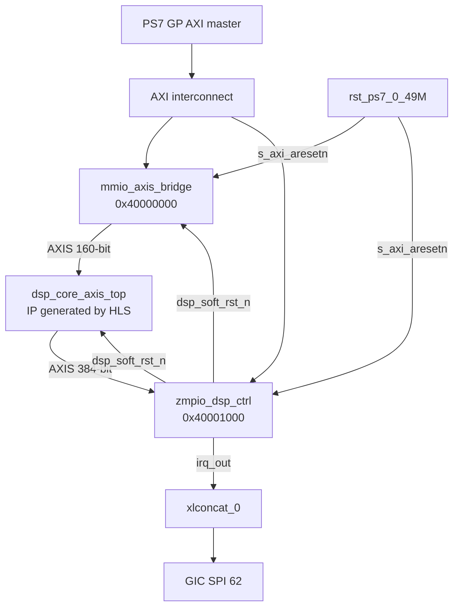
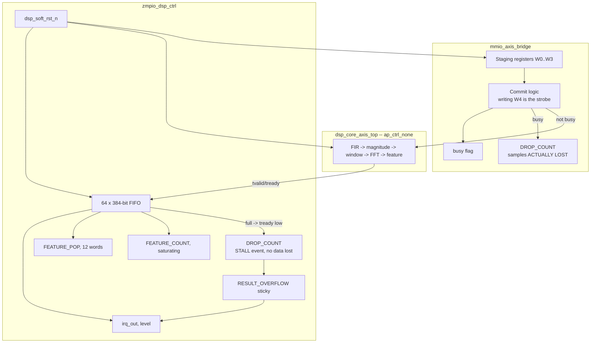
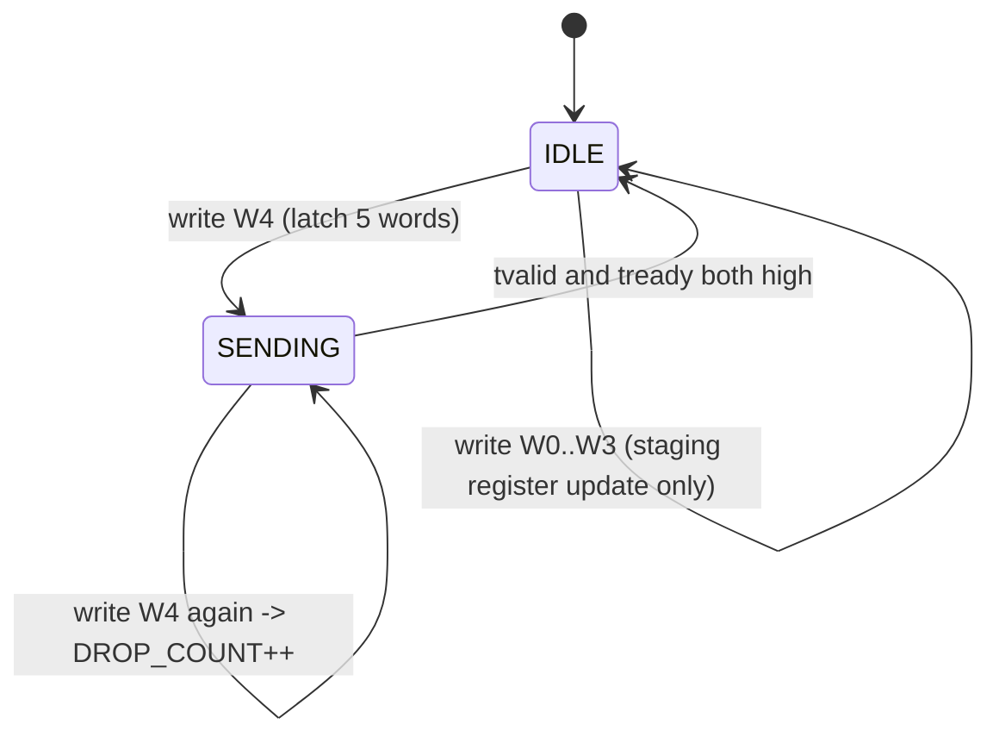
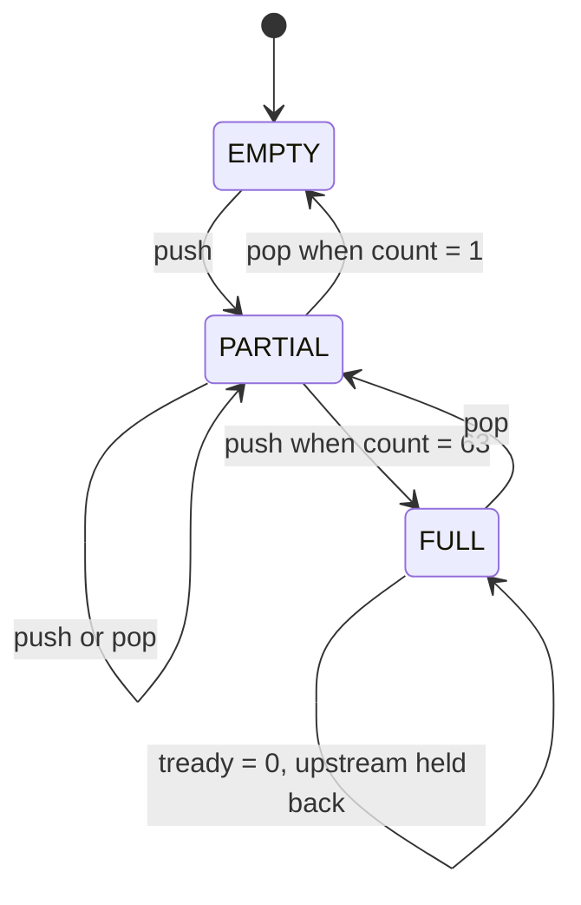
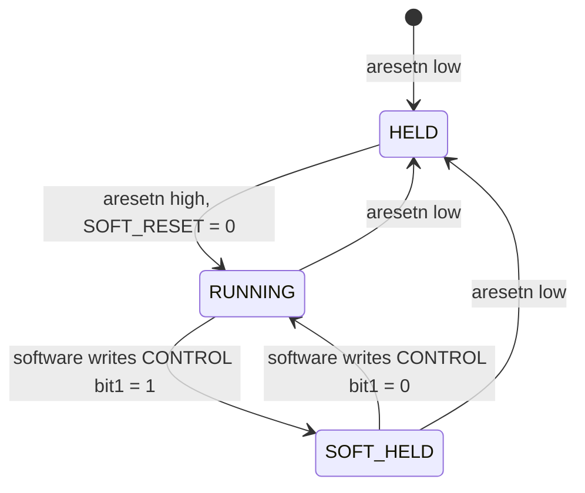
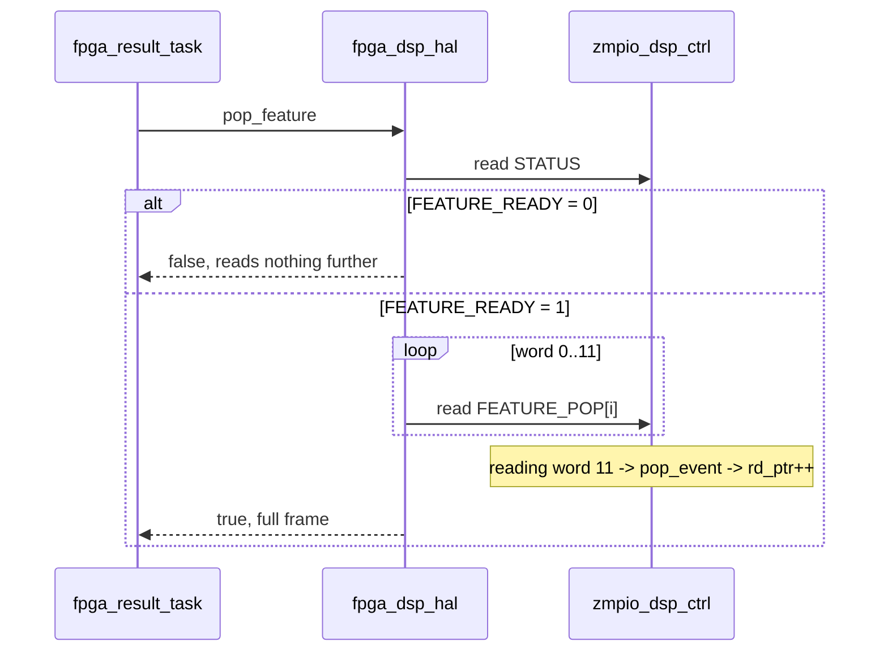
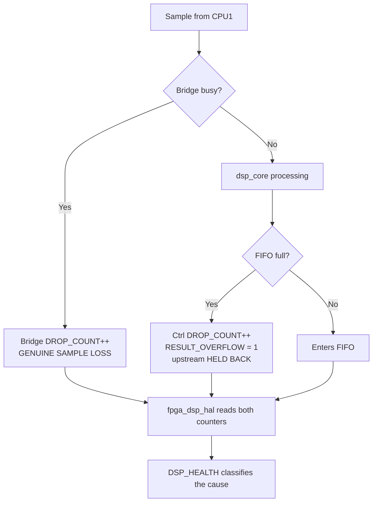

# SDD_06 — PL DSP Shell: bridge, FIFO, control, reset (CMP-PL-001)

**Document ID:** ZMPIO-SDD-06
**Component:** CMP-PL-001
**Level:** L2
**Source:** `hardware/rtl/src/mmio_axis_bridge.v`, `hardware/rtl/src/zmpio_dsp_ctrl.v`,
`hardware/rtl/dsp_core/hls/dsp_core_axis_top.{h,cpp}`, `hardware/rtl/bd/*.tcl`

---

## 1. Purpose

`dsp_core_axis_top` (SDD_07) is a pure AXI4-Stream block: samples in, features out. It knows nothing
about the CPU, registers, or interrupts. This component is the **shell** that makes that block usable
from a bare-metal CPU with no DMA engine:

| Problem | Solution in the shell |
|---|---|
| CPU1 has no AXI-Stream master | `mmio_axis_bridge`: 5 register writes → 1 AXIS beat |
| CPU1 cannot poll at PL speed | 64-deep FIFO + level-sensitive IRQ |
| CPU1 must read a 48-byte feature over a 32-bit bus | 12 `FEATURE_POP` registers; the last word read pops |
| Need to reset the DSP without killing I2C | `dsp_soft_rst_n` — a separate reset domain |
| Need evidence of data loss | two counters with two distinct semantics |

## 2. Responsibility

### MUST

- Atomically latch the 5 register words into a single 160-bit AXIS beat if and only if `SAMPLE_W4`
  is written.
- Drop a new sample (and count it) when the previous beat has not yet been accepted; **never**
  corrupt a beat that is in flight.
- Buffer up to 64 feature frames and apply real back-pressure via `s_axis_tready` when full.
- Drive `irq_out` as a level = `IRQ_ENABLE && (FEATURE_READY || RESULT_OVERFLOW)`.
- Advance the FIFO if and only if the last word of `FEATURE_POP` is read.
- Drive `dsp_soft_rst_n` to reset the DSP pipeline without touching its own AXI interface.
- Saturate `FEATURE_COUNT` instead of wrapping.

### MUST NOT

- MUST NOT reset `control_reg` or the AXI4-Lite interface via `SOFT_RESET`.
- MUST NOT silently drop an AXIS beat inside `zmpio_dsp_ctrl` — it must back-pressure instead.
- MUST NOT return any `BRESP`/`RRESP` other than `OKAY` — there is no address-decode trap.
- MUST NOT let `irq_out` self-clear on ISR entry — it is level-sensitive by design.

## 3. Non-Responsibilities

| Not owned by this component | Owned by |
|---|---|
| DSP algorithms | CMP-DSP-001 (SDD_07) |
| GIC discipline, ISR, watchdog | CMP-HAL-001 (SDD_08) |
| Meaning of a feature | CMP-ANO-001 (SDD_09) |
| CPU1 → CPU0 doorbell | CMP-DB-001 (SDD_10) |

## 4. Dependencies



Note the deliberate dependency loop: `zmpio_dsp_ctrl` both receives data from `dsp_core_axis_top` and
supplies its reset. This is safe because `dsp_soft_rst_n` is registered and does not create a
combinational loop.

## 5. Architecture



**The single most important architectural point — two data-loss points with fundamentally different
semantics:**

| Point | Mechanism | Data lost | Counter |
|---|---|---|---|
| Bridge → core | drops the sample while `BUSY` | **YES** — the sample vanishes | `mmio_axis_bridge.DROP_COUNT` |
| Core → ctrl | de-asserts `tready` when the FIFO is full | **NO** — upstream is held back | `zmpio_dsp_ctrl.DROP_COUNT` |

Confusing these two numbers leads to a completely inverted diagnosis. For that reason both appear
separately in `fpga_dsp_hal_counters_t` and in the `DSP_HEALTH` record, and are never summed.

## 6. Module Structure

| Module | ID | File | Role |
|---|---|---|---|
| MMIO → AXIS bridge | MOD-PL-001 | `mmio_axis_bridge.v` | latches samples, commits, counts lost samples |
| Control + FIFO | MOD-PL-002 | `zmpio_dsp_ctrl.v` | registers, FIFO, IRQ, soft reset |
| HLS shell | MOD-PL-003 | `dsp_core_axis_top.{h,cpp}` | packs/unpacks bits around `DspCore` |
| Block design integration | MOD-PL-004 | `hardware/rtl/bd/*.tcl` | IP-XACT packaging, wiring, address assignment |

## 7. File Structure

### FILE-PL-001 — `mmio_axis_bridge.v`

| Field | Value |
|---|---|
| Layer | RTL, AXI4-Lite slave + AXI4-Stream master |
| Clock | `s_axi_aclk` = `FCLK_CLK0` = 50 MHz |
| Reset | `s_axi_aresetn` (shared network) **and** `dsp_soft_rst_n` |

**MUST**

- Latch a beat only when the `SAMPLE_W4` write is received and `busy == 0`.
- Take `sample_sequence` directly from `s_axi_wdata` of the W4 write itself, **without** passing
  through a staging register.
- Hold `m_axis_tdata` unchanged while `busy` — a beat in flight is inviolable.
- Expose an `m_axis_aclk` port even though it is unused in the logic.

**MUST NOT**

- MUST NOT implement address-decode error trapping — every write/read returns `OKAY`.
- MUST NOT buffer more than one sample. This is a deliberate decision: deeper buffering would mask
  real overload conditions.

**Note on `m_axis_aclk`:** it exists **solely** to satisfy the Vivado IP-Integrator naming
convention (`<busif-prefix>_aclk`), which auto-associates the `m_axis` bus with a clock. Without it,
`create_bd_cell` only associates `s_axi_aclk` with the AXI4-Lite bus and leaves `m_axis` unclocked,
causing `validate_bd_design` to fail; and the `ASSOCIATED_BUSIF` attribute — the usual fix — is
read-only on an auto-inferred module reference. This is a tooling artifact, not a design detail, but
it explains a port that otherwise looks redundant.

### FILE-PL-002 — `zmpio_dsp_ctrl.v`

**MUST**

- Keep `control_reg` and the AXI channel FSMs **outside** the `SOFT_RESET` reset domain.
- Count a stall event once per **occurrence**, not once per cycle (using `fifo_full_prev`).
- Register `dsp_soft_rst_n` (not combinationally derive it directly from `control_reg[1]`).
- Saturate `feature_count` at `0xFFFFFFFF`.

**MUST NOT**

- MUST NOT advance the FIFO on any word read other than the last word of `FEATURE_POP`.
- MUST NOT reset `control_reg` using its own bit — that would lock software out of itself.

### FILE-PL-003 — `dsp_core_axis_top.cpp`

**MUST** keep `#pragma HLS INTERFACE ap_ctrl_none port = return` (a free-running block) and
`#include` Step 1's `dsp_core.h` rather than copying the code.

**MUST NOT** add an `s_axilite` interface — all control belongs to `zmpio_dsp_ctrl`.

## 8. Interfaces

Full register map: `ARCHITECTURE_DETAIL.md` §7–§9. What follows here is the behavioral contract.

### 8.1 IF-PL-001 — Sample write contract

```text
Required sequence:
    write W0, W1, W2, W3   (any order, may be rewritten multiple times)
    write W4               <- COMMIT

Invariants:
  - W0..W3 are staging registers with no side effects
  - only writing W4 creates a beat
  - sample_sequence is NOT latched into a staging register; it flows
    directly from s_axi_wdata of the W4 write itself into the beat
```

`sample_sequence` bypassing the staging registers is deliberate: it guarantees the sequence number
in a beat is always the sequence number of **this exact** commit, and can never be a stale value
left over from a previous one.

### 8.2 IF-PL-002 — Feature read contract

```text
Required sequence:
    read FEATURE_POP[0]  (offset 0x18)
    read FEATURE_POP[1]  (offset 0x1C)
    ...
    read FEATURE_POP[11] (offset 0x44)   <- this read advances the FIFO

Violations and consequences:
  - Partial read (stopping before word 11): the FIFO does NOT advance;
    the next read returns the SAME frame again -> infinite repeat if
    software does not correct it
  - Over-read (continuing past word 11): reads INTO the NEXT frame,
    mixing data
  - Out-of-order read: still returns the correct word (idempotent read
    address), but only word 11 advances the FIFO
```

### 8.3 FUNC-PL-001 — Bridge commit logic

**Identity:** the `always @(posedge s_axi_aclk)` block driving `busy`/`drop_count`/`m_axis_*`.

**Inputs:** `write_commit_pulse` (= `wready && wvalid && addr == W4`), `busy`, `m_axis_tready`.

**Decision Table**

| `write_commit_pulse` | `busy` | `tvalid && tready` | Action | Result |
|---|---|---|---|---|
| 0 | 0 | 0 | no-op | idle |
| 0 | 1 | 0 | wait for downstream | beat still in flight |
| 0 | 1 | 1 | `tvalid <- 0`, `busy <- 0` | beat has been accepted |
| 1 | 0 | — | latch 5 words, `tvalid <- 1`, `tlast <- 1`, `busy <- 1` | sample accepted |
| 1 | 1 | 0 | `drop_count <- drop_count + 1` | **sample lost** |
| 1 | 1 | 1 | `drop_count + 1` **and** `tvalid <- 0`, `busy <- 0` | sample lost, prior beat just completed |

**The last row is a subtle edge case:** if a new commit lands on exactly the same cycle the
downstream side accepts the old beat, the new sample is still dropped (because `busy` is still 1
when evaluated), and the bridge returns to idle the following cycle. This is conservative and
correct behavior — no beat is ever corrupted — but it means `DROP_COUNT` can increment even when the
downstream side is not actually slow. At a 100 Hz sample rate against a 50 MHz clock, the probability
of this exact-cycle collision is negligible.

**Postconditions**

```text
Sample accepted:
  - m_axis_tdata holds the full 5 words of THIS sample
  - tvalid = 1, tlast = 1, busy = 1
  - drop_count unchanged

Sample dropped:
  - m_axis_tdata UNCHANGED (the in-flight beat remains intact)
  - drop_count increments by exactly 1
  - busy unchanged
```

**Given / When / Then**

| Scenario | Given | When | Then |
|---|---|---|---|
| PL-001-01 normal | idle, downstream ready | write W0..W4 | one 160-bit beat with correct data, `tlast = 1` |
| PL-001-02 rewritten staging register | write W0 three times then W4 | commit | beat carries the **last** W0 value written |
| PL-001-03 edge: W4 only | W0..W3 hold stale values | write W4 | a beat is generated from stale data — **no** validation |
| PL-001-04 back-pressure | downstream holds `tready = 0` | write a second sample set | `DROP_COUNT` +1, first beat intact |
| PL-001-05 recovery | after PL-001-04, downstream accepts | write a third sample set | accepted normally |
| PL-001-06 reset | during `busy = 1` | assert `dsp_soft_rst_n` | `busy = 0`, `tvalid = 0`, `drop_count = 0` |

**Note on PL-001-03:** the bridge does **not** track whether W0..W3 have been written for the current
sample. Software that writes only W4 produces a protocol-valid beat carrying stale data. This is a
known limitation (LIM-PL-002); in the current system it never occurs because there is exactly one
write path (`fpga_dsp_hal_push_sample()`) and it always writes all 5 words.

### 8.4 FUNC-PL-002 — `zmpio_dsp_ctrl` FIFO logic

**Identity:** the `always` block driving `wr_ptr`/`rd_ptr`/`fifo_count`/counters.

**Inputs:** `push_event` (= `s_axis_tvalid && s_axis_tready`), `pop_event` (a one-cycle pulse when
word 11 is read), `soft_reset_active`.

**Processing Steps (every clock cycle)**

```text
Step 1 - If reset (aresetn low OR soft_reset_active):
         clear all pointers, counters, and sticky flags. End cycle.

Step 2 - If push_event:
         fifo_mem[wr_ptr] <= s_axis_tdata
         wr_ptr++
         feature_count++ (saturates at 0xFFFFFFFF)

Step 3 - If pop_event && !fifo_empty:
         rd_ptr++

Step 4 - Update fifo_count per the {push, pop} table:
         10 -> +1,  01 -> -1,  11 or 00 -> unchanged

Step 5 - Detect a stall (rising edge of "full and a beat waiting"):
         if (s_axis_tvalid && fifo_full && !fifo_full_prev):
             drop_count++
             result_overflow <= 1      <- NOTE: a stall also sets this sticky bit
         fifo_full_prev <= s_axis_tvalid && fifo_full

Step 6 - If STATUS is written with bit1 = 1: clear result_overflow
```

**Three critical algorithmic details**

1. **`fifo_count` handles concurrent push and pop correctly.** The `11` case leaves the count
   unchanged — correct, since one enters and one leaves. If implemented as two separate `if`
   statements, two non-blocking assignments to the same register would cause one of them to be lost.

2. **`fifo_full_prev` turns "continuously full" into "a single event."** Without it, `DROP_COUNT`
   would increment every clock cycle (50 million times per second) for as long as the FIFO stays
   full, rendering the diagnostic counter meaningless. With it, a stall of any duration counts as
   exactly **one**.

3. **A stall event also sets `RESULT_OVERFLOW`.** This is the RTL's actual behavior and it is
   meaningful: that sticky bit means "something abnormal has happened since your last check," and a
   FIFO-full event is abnormal. Software consequence: `fpga_dsp_hal_update_health()` classifies the
   error as `RESULT_OVERFLOW` (code 3) rather than `CTRL_FIFO_DROP` (code 1) whenever both occur
   together, because it checks `result_overflow` first. This is documented here because it affects
   how the `DSP_HEALTH` record should be read.

**Given / When / Then**

| Scenario | Given | When | Then |
|---|---|---|---|
| PL-002-01 normal | FIFO empty | one beat arrives | `fifo_count = 1`, `FEATURE_COUNT` +1, `FEATURE_READY = 1` |
| PL-002-02 pop | FIFO has 1 entry | read all 12 words | `fifo_count = 0`, `FEATURE_READY = 0` |
| PL-002-03 partial pop | FIFO has 1 entry | read 11 words then stop | `fifo_count` **still 1** — FIFO does not advance |
| PL-002-04 full boundary | 64 entries | another beat arrives | `tready = 0`, `DROP_COUNT` +1, `RESULT_OVERFLOW = 1` |
| PL-002-05 prolonged stall | full for 1000 cycles | — | `DROP_COUNT` increments by exactly **1**, not 1000 |
| PL-002-06 simultaneous push+pop | FIFO has N entries | both in the same cycle | `fifo_count` stays N, no entry lost |
| PL-002-07 write-1-to-clear | `RESULT_OVERFLOW = 1` | write STATUS bit1 = 1 | bit clears to 0 |
| PL-002-08 soft reset | FIFO holds data, counters nonzero | assert `SOFT_RESET` | everything clears, `control_reg` **unchanged** |
| PL-002-09 saturation | `FEATURE_COUNT = 0xFFFFFFFF` | another beat arrives | stays at `0xFFFFFFFF`, does not wrap to 0 |

## 9. Data Structures (hardware registers)

### `mmio_axis_bridge`

| Register | Reset by `aresetn` | Reset by `dsp_soft_rst_n` | Notes |
|---|---|---|---|
| `sample_w0..w3` | yes | yes | staging registers |
| `busy` | yes | yes | |
| `drop_count` | yes | yes | genuine sample loss |
| `m_axis_tdata/tvalid/tlast` | yes | yes | |

### `zmpio_dsp_ctrl`

| Register | Reset by `aresetn` | Reset by `SOFT_RESET` | Reason |
|---|---|---|---|
| `control_reg` | yes | **NO** | resetting it would lock software out of itself |
| `config_seq_reg` | yes | **NO** | scratch register, owned by software |
| AXI channel FSMs | yes | **NO** | resetting mid-transaction would hang the bus |
| `fifo_mem`, `wr_ptr`, `rd_ptr`, `fifo_count` | yes | yes | DSP state |
| `feature_count`, `drop_count` | yes | yes | DSP state |
| `result_overflow`, `fifo_full_prev` | yes | yes | DSP state |
| `dsp_soft_rst_n_r` | yes (to 0) | — | it is itself the output |

This table **is** the IF-PL-005 contract at its most detailed level. It should be read before
changing anything in the module.

## 10. State Machine

### STATE-PL-001 — Bridge



### STATE-PL-002 — `zmpio_dsp_ctrl` FIFO



| Current | Event | Guard | Action | Next |
|---|---|---|---|---|
| `EMPTY` | push | — | write mem, `wr_ptr++`, `FEATURE_COUNT++`, `FEATURE_READY = 1` | `PARTIAL` |
| `PARTIAL` | pop | `!fifo_empty` | `rd_ptr++` | `PARTIAL` or `EMPTY` |
| `PARTIAL` | push | `count == 63` | as above | `FULL` |
| `FULL` | `tvalid` from upstream | rising edge of `fifo_full_prev` | `DROP_COUNT++`, `RESULT_OVERFLOW = 1` | `FULL` |
| any | `SOFT_RESET` | — | clear everything | `EMPTY` |

### STATE-PL-003 — Reset domain



**`SOFT_RESET` is level-sensitive, not pulsed.** The hardware holds reset **for as long as** the bit
is set. Software produces a pulse via two consecutive writes (`fpga_dsp_hal_soft_reset_pulse()`).
Consequence: if software sets the bit and forgets to clear it, the DSP stays frozen indefinitely
while the AXI interface keeps responding normally — a silent failure mode, documented as LIM-PL-004.

## 11. Runtime Sequence

### 11.1 A sample traversing the full pipeline

```mermaid
sequenceDiagram
    participant HAL as fpga_dsp_hal
    participant BR as mmio_axis_bridge
    participant CORE as dsp_core_axis_top
    participant CT as zmpio_dsp_ctrl
    participant GIC as GIC SPI 62

    HAL->>BR: write W0, W1, W2, W3
    Note over BR: staging registers only, no effect yet
    HAL->>BR: write W4 = sample_sequence
    BR->>BR: busy = 0? -> latch 160 bits, tvalid = 1
    BR->>CORE: AXIS beat, tlast = 1
    CORE->>BR: tready
    BR->>BR: busy = 0
    Note over CORE: accumulates; 64 new samples per feature
    CORE->>CT: 384-bit AXIS beat (only when a frame is due)
    CT->>CT: push into FIFO, FEATURE_COUNT++
    CT->>GIC: irq_out asserted high (FIFO not empty)
```

### 11.2 CPU1 pops a feature



### 11.3 Fault injection: PL reset mid-run

```mermaid
sequenceDiagram
    participant V3 as ipc_v3 on CPU1
    participant HAL as fpga_dsp_hal
    participant CT as zmpio_dsp_ctrl
    participant BR as mmio_axis_bridge
    participant CORE as dsp_core
    participant IIC as axi_iic_0

    V3->>HAL: soft_reset_pulse
    HAL->>CT: write CONTROL = SOFT_RESET
    CT->>CT: clear FIFO, pointers, counters
    CT->>BR: dsp_soft_rst_n low
    CT->>CORE: dsp_soft_rst_n low
    Note over IIC: UNAFFECTED -- lives on the shared reset network
    HAL->>CT: write CONTROL = RUN | IRQ_ENABLE
    CT->>BR: dsp_soft_rst_n high
    CT->>CORE: dsp_soft_rst_n high
    Note over CORE: restarts from an empty window; frame_sequence back to 0
```

## 12. Algorithms

### ALG-PL-001 — Atomic commit latching

**Problem:** a 160-bit sample must cross a 32-bit bus as 5 transactions, but the downstream side
must receive it as a single intact unit.

**Solution:** 4 side-effect-free staging registers plus 1 write address that acts as a strobe.
Because the hardware latches at exactly one clock edge, there is no "half-sample" state that
downstream could ever observe.

**Why not a separate "valid" bit:** a valid bit would require an extra write transaction (6 instead
of 5) and would introduce the possibility of software setting valid while forgetting to write the
data. Using the final write itself as the strobe eliminates that intermediate state entirely.

### ALG-PL-002 — Edge-triggered stall detection

```text
stall_event = s_axis_tvalid && fifo_full && !fifo_full_prev
fifo_full_prev <= s_axis_tvalid && fifo_full
```

**Complexity:** O(1) per cycle, one flip-flop.

**Boundary conditions**

| Situation | Result |
|---|---|
| FIFO full for 1000 cycles, upstream holds `tvalid` | exactly 1 increment |
| FIFO full, upstream releases `tvalid` then reasserts it | 2 increments — correct, that is two distinct occurrences |
| FIFO full but upstream has nothing to send | 0 increments — correct, no real congestion |

### ALG-PL-003 — Pop-on-read-address

```text
if read_word_addr in [ADDR_POP_BASE, ADDR_POP_BASE + 12):
    rdata <= fifo_head[(read_word_addr - ADDR_POP_BASE) * 32 +: 32]
    if read_word_addr == ADDR_POP_BASE + 11:
        pop_event <= 1     (one-cycle pulse)
```

**Why the pop is tied to the final read rather than a dedicated POP register:** it saves one AXI
transaction per frame and, more importantly, makes "reading a frame" and "consuming a frame" a
single, inseparable action. With a separate POP register, software could read without popping
(infinite repeat) or pop without reading (frame loss).

**The cost:** software is forced to read all 12 words in the correct order. This contract is
documented at IF-PL-002 and correctly implemented in `fpga_dsp_hal_pop_feature()`.

### ALG-PL-004 — Pack/unpack in the HLS shell

```text
unpack_sample(beat):
    accel_x         = (int16)(uint16)beat.data.range(15, 0)
    ...
    sample_sequence = (uint32)beat.data.range(159, 128)

pack_feature(frame):
    data.range(31, 0)   = frame.frame_sequence
    ...
    data.range(383,352) = frame.band_energy_q32_0[3]
    beat.keep = -1;  beat.strb = -1;  beat.user = 1;  beat.last = 1
```

Casting through `uint16` before casting to `int16` is required for correct sign extension — the same
reasoning as `decode_be_i16()` in SDD_02.

**Top-level function body:**

```c
static zmpio::step1::DspCore core;          // state persists across invocations
if (!sample_axis_in.empty()) core.push(unpack_sample(sample_axis_in.read()));
if (core.pop(frame))         feature_axis_out.write(pack_feature(frame));
```

With `ap_ctrl_none`, HLS turns this function into a free-running block that is called repeatedly.
The `static DspCore` becomes persistent hardware state (the rings, the window counters). This is the
standard HLS idiom for a stateful streaming block.

## 13. Error Handling

| Error | Detection | Hardware action | What software sees |
|---|---|---|---|
| Sample arrives while bridge is busy | `busy` at commit time | drop sample, `DROP_COUNT++` | `bridge_drop_count` increments |
| FIFO full | `fifo_count == 64` | de-assert `tready`, count the event | `ctrl_drop_count` + `result_overflow` |
| `FEATURE_POP` read while FIFO empty | no protection | returns stale `fifo_head` contents | software must check `STATUS` first |
| Write to a read-only register | no trap | ignored, returns `OKAY` | no error response |
| Read of a nonexistent address | no trap | returns `0`, `OKAY` | no error response |

**Design decision: no address-decode trap.** Every access returns `OKAY`. Rationale: an `SLVERR` on
AXI4-Lite would turn into a Data Abort on CPU1 — turning a small programming error into a system
crash. With a peripheral that has exactly one driver, that cost outweighs the benefit. Trade-off:
software address errors fail silently (LIM-PL-003).

**Error flow — the two distinct data-loss paths**



## 14. Concurrency

The entire component lives in a single clock domain (`FCLK_CLK0` = 50 MHz). `m_axis_aclk` and
`s_axis_aclk` are wired to the same source as `s_axi_aclk` in the block design, so **there is no
clock-domain crossing** and no synchronizer is needed.

This is an important simplification: every ordering argument in this document is an argument within
a single synchronous clock domain.

| Concurrent path | Handling |
|---|---|
| AXI4-Lite write and AXIS push | two separate `always` blocks, coupled only through `busy` |
| Simultaneous FIFO push and pop | `case ({push, pop})` handles all 4 combinations |
| Writing `CONTROL` and resetting the FIFO | `soft_reset_active` is combinational from `control_reg[1]`, taking effect the following cycle |
| Simultaneous read and write | the AXI read and write channels are fully independent |

## 15. Timing

| Quantity | Value | Notes |
|---|---:|---|
| PL clock | 50 MHz (20 ns) | timing closed |
| Commit-to-beat latency | 1 cycle | 20 ns |
| Push-to-`FEATURE_READY` latency | 1 cycle | |
| Word-11-read-to-`rd_ptr++` latency | 1 cycle | `pop_event` is a one-cycle pulse |
| Sample cadence | 100 Hz | 500,000 cycles between samples |
| Feature output cadence | ~1.56 Hz | 32,000,000 cycles between frames |
| FIFO capacity | 64 frames ≈ 41 s | |

**Margin analysis**

```text
Cycle budget per sample  = 50 MHz / 100 Hz    = 500,000 cycles
Cycle budget per frame   = 50 MHz / 1.56 Hz   = 32,000,000 cycles
Actual demand per frame (128-point FFT, one
    multiplier/cycle from the ALLOCATION constraint) ~ a few tens of thousands of cycles
Margin: roughly three orders of magnitude
```

This large margin is what justifies the `#pragma HLS ALLOCATION ... limit = 1` constraint — trading
throughput for resources is entirely reasonable when throughput headroom is three orders of magnitude.

**FIFO fill time when draining stops:** 64 frames ÷ 1.56 frames/s ≈ **41 seconds**. This figure sets
the parameter for the "FIFO full" fault-injection test: CPU0 holds it for 60 s to give a ~46% margin
over the 41 s figure.

## 16. Resource / Memory Usage

| Resource | Usage | Notes |
|---|---:|---|
| Feature FIFO | 64 × 384 bit = 3 KiB | BRAM |
| Bridge staging registers | 5 × 32 bit | FF |
| Counters | 3 × 32 bit | FF |
| DSP48E1 (part of `dsp_core`) | 25 / 220 (~11%) | bounded by the ALLOCATION pragma |
| Address space | 3 × 4 KiB | `0x40000000`, `0x40001000`, `0x40002000` |

## 17. Configuration

| Parameter | Value | Location | Effect of changing |
|---|---:|---|---|
| `C_S_AXI_ADDR_WIDTH` (bridge) | 5 | module parameter | enough for 7 registers |
| `C_S_AXI_ADDR_WIDTH` (ctrl) | 7 | module parameter | required for 12 POP words up to offset `0x44` |
| `FIFO_DEPTH` | 64 | `zmpio_dsp_ctrl.v` | changes fill time and the fault-injection parameter |
| `POP_WORDS` | 12 | `zmpio_dsp_ctrl.v` | must match `sizeof(FeatureFrameV2)/4` |
| Base address | see above | Vivado address editor | must match `fpga_dsp_hal.h` and `pl_doorbell.h` |
| GIC SPI | 62 | position on `xlconcat_0` | derived from `pl.dtsi`, see `ARCHITECTURE_DETAIL.md` §2.1 |

**Block-design integration scripts**

| Script | Role |
|---|---|
| `package_zmpio_user_ip.tcl` | packages the hand-written modules as IP-XACT |
| `add_zmpio_dsp_shell.tcl` | adds the bridge + core + ctrl into the block design |
| `wire_dsp_soft_reset.tcl` | wires `dsp_soft_rst_n` to the bridge and the core |
| `run_step3_dsp_soft_reset.tcl` | runs the full build for the soft-reset change |
| `add_zmpio_doorbell.tcl`, `run_step5_doorbell.tcl` | see SDD_10 |
| `repackage_dsp_shell_ip.tcl` | re-packages IP after RTL edits |
| `suppress_ooc_io_drc.tcl` | disables a DRC rule not applicable to out-of-context synthesis |

## 18. Logging / Debug

The RTL has no logging. All observability lives in the registers, and they were designed to answer
specific diagnostic questions:

| Register | Answers the question |
|---|---|
| `FEATURE_COUNT` | is the pipeline alive? |
| Bridge `DROP_COUNT` | is CPU1 pushing faster than the PL can accept? |
| Ctrl `DROP_COUNT` | is CPU1 popping slower than the PL is producing? |
| `RESULT_OVERFLOW` | has anything abnormal happened since the last check? |
| `STATUS.FEATURE_READY` | is there work pending? (used for fallback polling) |
| `CONFIG_SEQ` | how many configuration cycles has software run? |

**Diagnostic table**

| Observation | Conclusion |
|---|---|
| `FEATURE_COUNT` stalled, bridge `DROP` stalled | CPU1 is not pushing samples — check `sensor_task` |
| `FEATURE_COUNT` rising, no IRQ | a GIC issue — see SDD_08, BUG-006 |
| Bridge `DROP` rising | CPU1 is pushing faster than the core can process — should not happen at 100 Hz |
| Ctrl `DROP` rising | CPU1 is not popping fast enough — or a deliberate fault injection |
| `FEATURE_COUNT` resets to 0 mid-run | a `SOFT_RESET` occurred |
| `CONTROL` writes have no effect | `SOFT_RESET` may be stuck at 1 |

**Evidence via JTAG:** reading `0x4000_100C` (`FEATURE_COUNT`) repeatedly a few seconds apart is the
fastest way to confirm the PL pipeline is alive — entirely independent of whether the IRQ path is
working. This exact technique is what separated "PL is broken" from "the GIC is broken" during the
investigation of BUG-006.

## 19. Verification

| Test | Checks | Evidence |
|---|---|---|
| TEST-PL-001 | commit strobe works | `FEATURE_COUNT` increments live |
| TEST-PL-002 | lost samples counted, no tearing | bridge `DROP` = 0 under normal operation |
| TEST-PL-003 | FIFO back-pressure | FIFO-full fault injection |
| TEST-PL-004 | level-IRQ discipline | no hang at sample #128 |
| TEST-PL-005 | soft reset isolation | I2C/SD survive `DSP_SOFT_RESET` |
| TEST-PL-006 | timing closes at 50 MHz | Vivado timing report |
| TEST-PL-007 | resource budget met | utilization report: 25/25 DSP48E1 |

## 20. Known Limitations

| ID | Limitation | Impact | Mitigation |
|---|---|---|---|
| LIM-PL-001 | Two registers share the name `DROP_COUNT` with different meanings | easy to misdiagnose | documented everywhere and in RTL comments |
| LIM-PL-002 | Bridge does not verify W0..W3 were written | a W4-only write produces stale data | a single push function in software |
| LIM-PL-003 | No address-decode trap | software address errors fail silently | deliberate — avoids a Data Abort |
| LIM-PL-004 | `SOFT_RESET` is level-sensitive | forgetting to clear the bit freezes the DSP while AXI still reports OK | only one function ever generates the pulse |
| LIM-PL-005 | No configuration write path into the PL | `SET_DSP_CONFIG` cannot change the FIR/FFT | GAP-003 |
| LIM-PL-006 | A stall event also sets `RESULT_OVERFLOW` | error classification biased toward code 3 | documented in §8.4 |
| LIM-PL-007 | Bridge buffers only one sample | cannot absorb sample bursts | deliberate — exposes real overload |
| LIM-PL-008 | Reading `FEATURE_POP` while empty returns stale data | software must check `STATUS` itself | `fpga_dsp_hal_pop_feature()` always checks first |

## 21. Traceability

| REQ | Design | FUNC | TEST |
|---|---|---|---|
| REQ-PL-001 | §8.1, §12 ALG-PL-001 | FUNC-PL-001 | TEST-PL-001 |
| REQ-PL-002 | §8.3 | FUNC-PL-001 | TEST-PL-002 |
| REQ-PL-003 | §8.4, §12 ALG-PL-002 | FUNC-PL-002 | TEST-PL-003 |
| REQ-PL-004 | §10 STATE-PL-002, ADR-011 | — | TEST-PL-004 |
| REQ-PL-005 | §9, §10 STATE-PL-003, ADR-012 | — | TEST-PL-005 |
| REQ-DSP-007 | §12 ALG-PL-004 | — | TEST-DSP-007 |
| REQ-DSP-004 | §12 ALG-PL-004 | — | TEST-DSP-004 |
