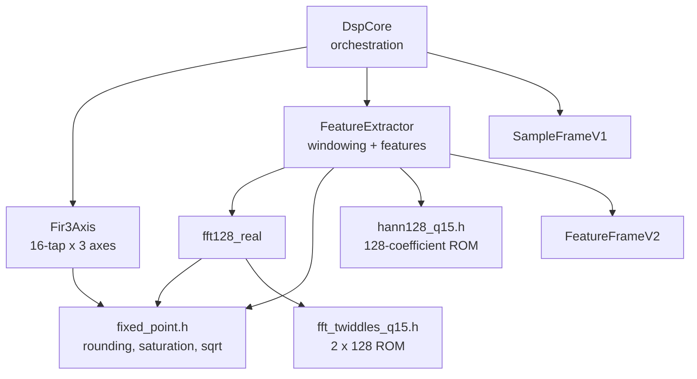
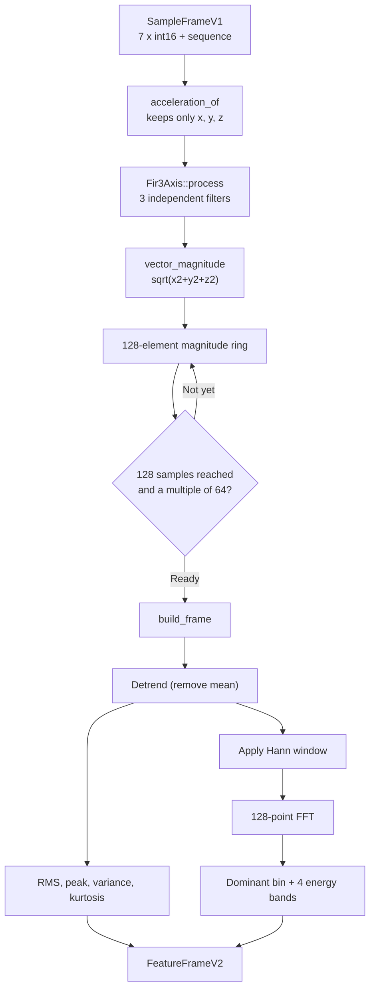
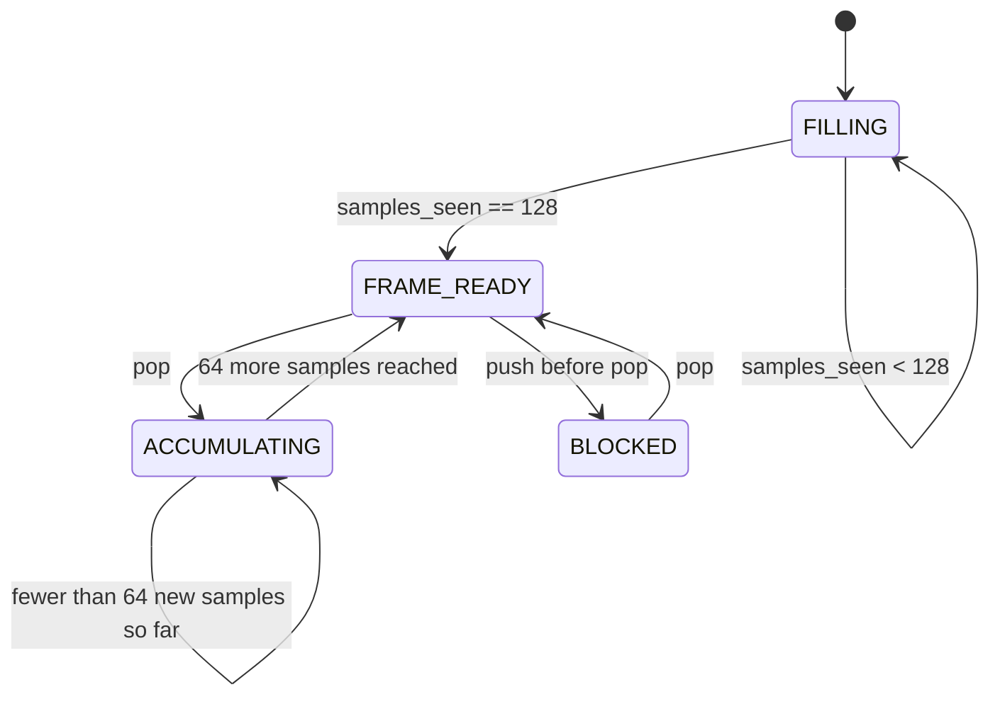
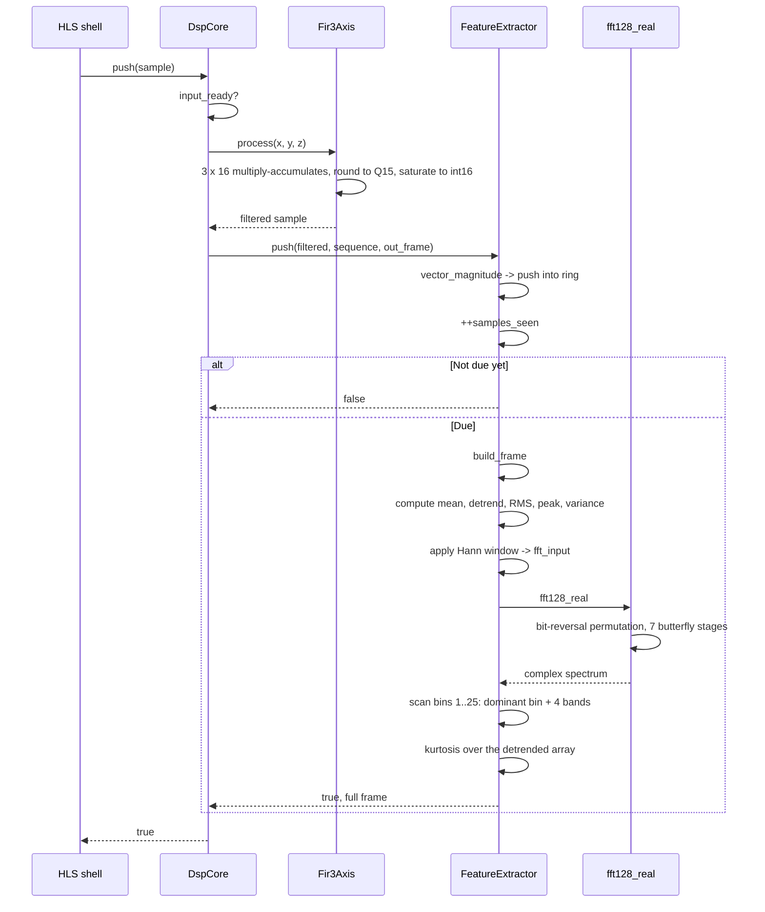

# SDD_07 — DSP Core and Algorithms (CMP-DSP-001)

**Document ID:** ZMPIO-SDD-07
**Component:** CMP-DSP-001
**Level:** L2 + L3 (Behavioral / Algorithm Design, per §28 of the standard)
**Source:** `dsp_host_sim/fpga/dsp_core/src/{dsp_core,fir3_axis,fft128_real,feature_extract}.{h,cpp}`,
`fixed_point.h`, `sample_frame_v1.h`, `feature_frame_v2.h`, `hann128_q15.h`, `fft_twiddles_q15.h`

---

## 1. Purpose

This component turns 100 raw acceleration samples per second into 1.56 feature vectors per second —
a 64:1 data reduction that preserves the information needed for anomaly detection.

What sets this component apart from an ordinary DSP library: **the same C++ source runs on a PC to
generate golden vectors and is synthesized by HLS into RTL running on the FPGA**, and both sides must
produce results that match bit-for-bit. Every design choice below is driven by that constraint.

## 2. Responsibility

### MUST

- Filter each acceleration axis with a 16-tap Q15 FIR filter.
- Reduce the three axes to a single scalar vector-magnitude sequence.
- Maintain a 128-sample sliding window with a 64-sample hop.
- Detrend the window (remove the mean) before analysis.
- Compute 10 features at exactly the specified fixed-point scales.
- Produce a `FeatureFrameV2` of exactly 48 bytes for every completed window.
- Produce bit-exact results between the host simulation and the RTL.

### MUST NOT

- MUST NOT use floating point.
- MUST NOT use dynamic allocation, recursion, or loops with data-dependent bounds.
- MUST NOT overflow silently — every reduction must saturate.
- MUST NOT depend on anything external (time, registers, I/O).

## 3. Non-Responsibilities

| Not owned by this component | Owned by |
|---|---|
| AXI-Stream transport | CMP-PL-001 (SDD_06) |
| Bit packing/unpacking | the HLS shell in SDD_06 §12 ALG-PL-004 |
| Anomaly evaluation | CMP-ANO-001 (SDD_09) |
| Threshold selection | CMP-ANO-001 |
| Model training | host-side tooling, out of scope |

## 4. Dependencies



**No external dependencies whatsoever.** No `<chrono>`, no I/O, no allocation. This is a necessary
condition both for HLS synthesis and for reproducibility of the host simulation.

## 5. Architecture



**Three noteworthy structural decisions:**

1. **The three axes are reduced to a single scalar right after the FIR.** The entire spectral
   analysis runs on the vector magnitude, not per-axis. Trade-off: directional information is lost,
   in exchange for a threefold reduction in FFT resources and a feature set that is invariant to
   sensor mounting orientation — appropriate for vibration monitoring, where the sensor may be
   mounted in any orientation.

2. **Windowing happens after the FIR, not before.** This lets the FIR run at the (cheap) sample rate
   instead of having to re-run over the whole window.

3. **`DspCore` holds only ONE pending frame.** `input_ready()` returns `false` when a frame has been
   produced but not yet consumed. With a 64-sample hop (640 ms) and the PL's consumption rate, this
   never creates real back-pressure — but it makes the contract explicit rather than implicit.

## 6. Module Structure

| Module | ID | File | Role |
|---|---|---|---|
| Orchestration | MOD-DSP-001 | `dsp_core.{h,cpp}` | wires FIR + feature extraction, holds the pending frame |
| Filter | MOD-DSP-002 | `fir3_axis.{h,cpp}` | 16-tap FIR × 3 |
| Feature extraction | MOD-DSP-003 | `feature_extract.{h,cpp}` | windowing, statistics, spectrum |
| FFT | MOD-DSP-004 | `fft128_real.{h,cpp}` | in-place radix-2 DIT |
| Fixed-point arithmetic | MOD-DSP-005 | `fixed_point.h` | rounding, saturation, square root |
| Constant tables | MOD-DSP-006 | `hann128_q15.h`, `fft_twiddles_q15.h` | ROM |

## 7. File Structure

### FILE-DSP-001 — `feature_extract.cpp`

| Field | Value |
|---|---|
| Layer | algorithm |
| Runtime owner | the PL fabric (post-HLS) and the host process (simulation) |

**MUST**

- Keep every loop statically bounded (`kFeatureWindow`, `kFftSize`, the constant 25).
- Apply `#pragma HLS ALLOCATION operation instances = mul limit = 1` inside `#ifdef __SYNTHESIS__`
  for every function with heavy multiplication.
- Saturate every value before writing it into `FeatureFrameV2`.

**MUST NOT**

- MUST NOT use `float`, `new`, `malloc`, recursion, or function pointers.
- MUST NOT contain a loop whose iteration count depends on data, **except** the scale-normalization
  loop in `kurtosis_q16_16()` — that loop is structurally bounded to at most 25 iterations and HLS
  can unroll it (see ALG-DSP-004).

### FILE-DSP-002 — `fft128_real.cpp`

**MUST** perform the FFT in place on the output array so that no second temporary buffer is needed.

**MUST NOT** use a precomputed bit-reversal table — `reverse_seven_bits()` is recomputed on every
call. At `N` = 128, this cost is smaller than a 128-entry ROM.

### FILE-DSP-003 — `fixed_point.h`

**MUST** keep every function `inline` and stateless.

**MUST NOT** use arithmetic right-shift on negative numbers to perform rounding — that behavior is
implementation-defined. Every function here handles negative numbers by taking the absolute value,
rounding, then negating the result back.

## 8. Interfaces

### 8.1 `DspCore` API

| Function | Purpose | Returns |
|---|---|---|
| `reset()` | clear all state | void |
| `input_ready()` | is there room for a new sample | bool |
| `push(sample)` | feed a sample; may produce a frame | bool — whether it was accepted |
| `output_valid()` | is a frame pending | bool |
| `output()` | read the pending frame without consuming it | const reference |
| `pop(frame)` | consume the pending frame | bool |
| `accepted_samples()` / `produced_frames()` | diagnostic counters | u64 |

### 8.2 FUNC-DSP-001 — `DspCore::push()`

**Identity**

| Field | Value |
|---|---|
| Signature | `bool DspCore::push(const SampleFrameV1 &sample)` |
| Thread-safe | NO — the object is stateful |
| Reentrant | NO |
| Blocking | NO |

**Parameters**

| Parameter | Type | Direction | Constraint | Notes |
|---|---|---|---|---|
| `sample` | `const SampleFrameV1 &` | IN | any bit pattern is valid | only `accel_x/y/z` and `sample_sequence` are used |

**Preconditions:** none. The function is valid for any state and any input.

**State Preconditions**

| State | Allowed | Result |
|---|---|---|
| `pending_valid == true` | NO | returns `false`, the sample is **dropped** |
| `pending_valid == false` | YES | the sample is accepted |

**Processing Steps**

```text
Step 1 - Check input_ready()
  if pending_valid == true -> return false immediately, do NOT count
  the sample, do NOT filter it
  (This is the back-pressure mechanism: the consumer must pop first)

Step 2 - ++accepted_samples_

Step 3 - Filter: fir_.process(acceleration_of(sample))
  Only x, y, z are used; temperature/gyro/flags pass through unused

Step 4 - features_.push(filtered, sample.sample_sequence, pending_)
  Returns true if and only if the window just completed

Step 5 - If Step 4 returned true:
  pending_valid_ = true
  ++produced_frames_

Step 6 - Return true (the sample was accepted, regardless of whether a
  frame was produced)
```

**Decision Table**

| `pending_valid` | Window complete | Action | Returns | `pending_valid` after |
|---|---|---|---|---|
| true | — | reject, no-op | `false` | true |
| false | no | filter + push into ring | `true` | false |
| false | yes | filter + push into ring + build frame | `true` | true |

**Return Contract**

| Value | Meaning | Caller MUST |
|---|---|---|
| `true` | the sample was accepted and processed | continue; check `output_valid()` for a new frame |
| `false` | the sample was **dropped** because the previous frame has not been consumed | call `pop()` before pushing again |

**Postconditions**

```text
Returns true:
  - FIR state advanced by one sample
  - the magnitude ring advanced by one position
  - accepted_samples_ incremented by 1
  - if the window completed: pending_ holds a new frame,
    produced_frames_ incremented by 1

Returns false:
  - NOTHING changed (no count, no filtering, no ring push)
  - the sample is permanently lost
```

**Side Effects:** mutates `fir_`, `features_`, `pending_`, and three counters. No side effects
outside the object.

**Timing:** 3 axes × 16 taps = 48 multiply-accumulates for the FIR; one `integer_sqrt_u64` for the
magnitude. When the window completes, add the cost of `build_frame()` (see ALG-DSP-003).

**Given / When / Then**

| Scenario | Given | When | Then |
|---|---|---|---|
| DSP-001-01 normal | freshly reset | push sample 1 | returns `true`, `output_valid() == false` |
| DSP-001-02 first frame | 127 samples pushed | push sample 128 | returns `true`, `output_valid() == true`, `frame_sequence == 0` |
| DSP-001-03 hop cadence | frame 0 already produced | push 64 more samples (popping mid-way) | frame 1 appears exactly at sample 192 |
| DSP-001-04 back-pressure | frame not yet popped | push a sample | returns `false`, counters **unchanged** |
| DSP-001-05 boundary | every sample is `INT16_MIN` | push 128 samples | no overflow, no UB, values saturate |
| DSP-001-06 constant signal | every sample is identical | push 128 samples | RMS = 0, peak = 0, variance = 0 (detrending clears everything) |
| DSP-001-07 recovery | after `reset()` | push again from the start | `frame_sequence` restarts from 0 |

## 9. Data Structures

### `SampleFrameV1` — input, 20 bytes

Layout: `ARCHITECTURE_DETAIL.md` §5.1. Guarded by four `static_assert`s: 20-byte size, `flags` at offset 14,
`sample_sequence` at offset 16, and the type must be trivially copyable.

**Only 3 of 9 fields are used.** `temperature`, `gyro_*`, and `flags` pass through unused so that the
layout matches `ipc_mpu6050_sample_t` and to leave room for future extension.

### `FeatureFrameV2` — output, 48 bytes

Layout and scaling: `ARCHITECTURE_DETAIL.md` §5.2. Guarded by four `static_assert`s: 48-byte size,
`band_energy_q32_0` at offset 32, standard layout, trivially copyable.

The **standard layout** requirement exists because this same layout is read by C code (not C++) on
CPU1 (`fpga_feature_frame_t`) and by Python on the host.

### Internal state

| Structure | Size | Module |
|---|---:|---|
| `Fir3Axis::history_` | 3 × 16 × 16 bit = 96 bytes | history ring |
| `FeatureExtractor::magnitude_ring_` | 128 × 32 bit = 512 bytes | window |
| `detrended` (local) | 128 × 32 bit = 512 bytes | inside `build_frame` |
| `fft_input` (local) | 128 × 32 bit = 512 bytes | inside `build_frame` |
| `spectrum` (local) | 128 × 2 × 32 bit = 1024 bytes | inside `build_frame` |

The three local arrays in `build_frame()` are all live simultaneously — 2 KiB total. On the PL these
become BRAM; on the host they live on the stack.

## 10. State Machine

### STATE-DSP-001 — Window lifecycle



**Frame-generation condition** (from `FeatureExtractor::push()`):

```text
generate_frame <=> samples_seen >= 128  AND  (samples_seen - 128) % 64 == 0
```

| `samples_seen` | Generates a frame? | `frame_sequence` |
|---:|---|---:|
| 1..127 | no | — |
| 128 | **yes** | 0 |
| 129..191 | no | — |
| 192 | **yes** | 1 |
| 256 | **yes** | 2 |

Frame `n` covers samples `[64n, 64n+127]` — i.e. consecutive windows overlap by 50%. A 50% overlap is
the standard choice for sliding spectral analysis: it guarantees every event appears near the center
of at least one window, where the Hann window's weighting is highest.

## 11. Runtime Sequence



---

## 12. Algorithms

The four algorithms below follow the standard's §28 structure.

## ALG-DSP-001 — 16-tap Q15 FIR on three axes

### 1. Purpose

Remove high-band noise from each acceleration axis before computing the magnitude, so that
quantization and electrical noise do not corrupt the spectral features.

### 2. Inputs

| Input | Type | Range | Source |
|---|---|---|---|
| `sample.x/y/z` | int16 | `-32768..32767` | MPU6050, ±8 g range |
| `kFirCoefficientsQ15[16]` | int16 | Q15 | compile-time constant |
| `history_[3][16]` | int16 | | internal state |

### 3. Outputs

Three int16 values, filtered, at the same scale as the input.

### 4. Assumptions

- Input is sampled uniformly at 100 Hz.
- Coefficients are symmetric (linear phase) -> no phase distortion between the three axes.
- Coefficient sum ≈ 1.0 in Q15 -> DC gain ≈ 1, no normalization needed.

### 5. Mathematical Model

```text
y[n] = Sum(k=0..15) h[k] * x[n-k]

where:
  h[k] = kFirCoefficientsQ15[k] / 32768   (Q15)
  x[n] = input sample
  y[n] = filtered sample
```

Actual coefficients:

```text
{ -90, 82, 427, -58, -1742, -995, 5570, 13190,
  13190, 5570, -995, -1742, -58, 427, 82, -90 }
```

Symmetric about the center (`h[k] == h[15-k]`) -> linear-phase response, constant group delay of 7.5
samples = 75 ms at 100 Hz. Sum = 32,768 -> DC gain exactly 1.0 in Q15.

### 6. Processing Steps

```text
Step 1 - Push the new sample into the axis's ring at write_index_
Step 2 - For each axis (3 iterations):
           accumulator = 0 (int64)
           for tap in 0..15:
               index = (write_index_ + 16 - tap) % 16
               accumulator += history_[axis][index] * h[tap]
Step 3 - Round to Q15: round_shift_q15(accumulator)
Step 4 - Saturate to int16: saturate_i16(...)
Step 5 - write_index_ = (write_index_ + 1) % 16
```

### 7. Pseudocode

```text
process(sample):
    input = [sample.x, sample.y, sample.z]
    for axis in 0..2:
        history[axis][write_index] = input[axis]
        acc = 0                              # int64
        for tap in 0..15:
            idx = (write_index + 16 - tap) mod 16
            acc += history[axis][idx] * coeff[tap]
        output[axis] = saturate_i16(round_shift_q15(acc))
    write_index = (write_index + 1) mod 16
    return output
```

### 8. Boundary Conditions

| Condition | Behavior |
|---|---|
| First 15 samples | the ring is zero-initialized -> transient response; the first few frames are slightly affected, not an error |
| Every sample = `INT16_MAX` | acc = 32767 x 32768 = 2^30, fits within int64; output saturates at 32767 |
| Every sample = `INT16_MIN` | similarly, saturates at -32768 |
| After `reset()` | ring cleared to 0, `write_index_` back to 0 |

### 9. Error Conditions

None. The function is total: every input produces a valid output. No error codes, no exceptions.

### 10. Complexity

```text
Time:   O(taps x axes) = O(48) multiply-accumulates per sample, constant
Memory: O(taps x axes) = 96 bytes, constant
```

On the PL, `#pragma HLS ALLOCATION ... limit = 1` forces the 48 multiplications to share a single
multiplier -> 48 cycles per sample, against a budget of 500,000 cycles. Four orders of magnitude of
margin.

### 11. Numerical Considerations

| Issue | Handling |
|---|---|
| Accumulator overflow | uses int64: `16 x 32767 x 32768 ~ 1.7 x 10^13` << `9.2 x 10^18` |
| Rounding | `round_shift_q15` — round half away from zero, symmetric about 0 |
| Negative numbers | handled via absolute value then negation, avoiding the implementation-defined behavior of right-shifting negative numbers |
| Saturation | `saturate_i16` clamps instead of wrapping |
| Fixed-point | Q15 for coefficients; input/output are raw integers |

### 12. Verification Method

Golden-vector comparison between the host simulation and the HLS C-simulation. Additional check: an
impulse input must reproduce the coefficient sequence exactly; a constant DC input must reproduce
itself (DC gain = 1).

### 13. Example / Golden Vector

```text
Input: unit impulse x = [32767, 0, 0, ...]
Expected output: y[n] = round_shift_q15(32767 x h[n])
                 ~ [-90, 82, 427, -58, -1742, -995, 5570, 13190, ...]
```

---

## ALG-DSP-002 — 128-point radix-2 DIT FFT

### 1. Purpose

Provide the magnitude spectrum used to determine the dominant frequency and four energy bands.

### 2. Inputs

| Input | Type | Notes |
|---|---|---|
| `input[128]` | int32 | detrended and Hann-windowed |
| `kTwiddleRealQ15[128]`, `kTwiddleImagQ15[128]` | int16 Q15 | ROM |

### 3. Outputs

`output[128]` of `ComplexFixed{int32 real, int32 imag}`. Only bins 1..25 are used downstream.

### 4. Assumptions

- The input is real-valued (imaginary part = 0). The algorithm still uses a full complex FFT rather
  than a real-input optimization — a deliberate trade of simplicity against resources (see §11).
- `N` = 128 = 2^7, fixed at compile time.

### 5. Mathematical Model

```text
X[k] = Sum(n=0..127) x[n] * e^(-j2*pi*k*n/N)

Decimation-in-time decomposition:
  X[k]       = E[k] + W_N^k * O[k]
  X[k + N/2] = E[k] - W_N^k * O[k]

where E = FFT of even indices, O = FFT of odd indices,
      W_N^k = cos(2*pi*k/N) - j*sin(2*pi*k/N)
```

### 6. Processing Steps

```text
Step 1 - Bit-reversal permutation
  for n in 0..127:
      output[reverse_7_bits(n)] = {input[n], 0}

Step 2 - Seven butterfly stages (span = 2, 4, 8, 16, 32, 64, 128)
  for span in the values above:
      half = span / 2
      stride = 128 / span
      for base in 0, span, 2*span, ...:
          for offset in 0..half-1:
              even = output[base + offset]
              odd  = multiply_twiddle(output[base + offset + half],
                                      offset * stride)
              output[base + offset]        = round_half(even + odd)
              output[base + offset + half] = round_half(even - odd)
```

### 7. Pseudocode — twiddle multiplication

```text
multiply_twiddle(v, idx):
    real = v.real * Wr[idx] - v.imag * Wi[idx]     # int64
    imag = v.real * Wi[idx] + v.imag * Wr[idx]     # int64
    return { round_shift_q15(real), round_shift_q15(imag) }
```

### 8. Boundary Conditions

| Condition | Behavior |
|---|---|
| Input all zero | spectrum is all zero; downstream returns `dominant_frequency = 0` |
| Constant input | already detrended to zero beforehand -> effectively the same case |
| Largest magnitude | `round_half` at every stage prevents overflow (see §11) |
| Twiddle `idx` | always within `[0, 127]` by construction, no check needed |

### 9. Error Conditions

None. The function is total.

### 10. Complexity

```text
Time:   O(N log N) = 128 x 7 / 2 = 448 butterflies
        each butterfly = 4 multiplications
        total ~ 1792 multiplications
Memory: O(N) in place = 1024 bytes for the spectrum + 512 bytes twiddle ROM
```

With `ALLOCATION limit = 1`, roughly 1792 cycles per frame against a budget of 32,000,000. Four
orders of magnitude of margin.

### 11. Numerical Considerations

**This is the most delicate part of the entire component.**

| Issue | Handling | Consequence |
|---|---|---|
| Magnitude growth | `round_half` (divide-by-2 with rounding) at **every** stage | a cumulative divide by 2^7 = 128 |
| Why the division is needed | each butterfly stage can double the magnitude; 7 stages -> up to 128x | without it, int32 would overflow |
| The cost | up to 7 bits of precision lost on weak signals | acceptable given 16-bit ADC input |
| Twiddle multiply overflow | accumulated in int64 before reducing to Q15 | safe |
| Rounding of negative numbers | `round_half` and `round_shift_q15` are both symmetric about 0 | deterministic, implementation-independent |
| Bit-exactness | every operation is integer arithmetic with explicit rounding | host and RTL produce identical results |

**Effective scaling:** the FFT output is scaled down by 128 relative to the mathematical DFT
definition. Because this is consistent across every bin, it does **not** affect dominant-bin
selection or relative comparisons between bands. It only affects the absolute value of
`dominant_power` and `band_energy` — meaning those values are meaningful only in **relative**
comparison to each other, not as a physical unit. This is an important property of the data
contract and is documented here because it is not apparent from the field names.

### 12. Verification Method

Golden-vector comparison against a floating-point reference FFT implementation on the host, with a
tolerance derived from the known 7-bit precision loss. Additional check: a single-tone sine input
must produce a peak at the corresponding bin.

### 13. Example / Golden Vector

```text
Input: 10 Hz sine sampled at 100 Hz, N = 128
Expected bin: 10 / 0.78125 = 12.8 -> energy concentrated in bins 12 and 13
             (10 Hz does not fall exactly on a bin center, so spectral
              leakage occurs -- this is exactly why the Hann window
              is needed)
```

---

## ALG-DSP-003 — Feature extraction

### 1. Purpose

Reduce a 128-sample window to 10 scalar values that capture the amplitude, shape, and frequency
distribution of the vibration.

### 2. Inputs

`magnitude_ring_[128]` (int32), `write_index_`, the `sample_sequence` of the last sample.

### 3. Outputs

`FeatureFrameV2` — 10 fields, see `ARCHITECTURE_DETAIL.md` §5.2.

### 4. Assumptions

- The window is fully populated with 128 samples.
- The ring is read starting at `write_index_` to preserve correct time order (oldest element first).
- The DC component carries no information (removed by detrending).

### 5. Mathematical Model

```text
Magnitude:  m[n] = sqrt(x[n]^2 + y[n]^2 + z[n]^2)
Mean:       mu   = (1/128) Sum m[n]
Detrend:    d[n] = m[n] - mu
RMS:        rms  = sqrt((1/128) Sum d[n]^2)
Peak:       peak = max |d[n]|
Variance:   var  = (1/128) Sum d[n]^2            (equal to rms^2)
Window:     w[n] = d[n] * hann[n] / 32768
Spectrum:   X    = FFT(w)
Power:      P[k] = Re(X[k])^2 + Im(X[k])^2
Dominant:   k*   = argmax(P[k]), k in [1, 25]
Frequency:  f    = k* * 100 / 128  Hz
Band:       B[b] = Sum P[k] for k in band b
```

### 6. Processing Steps

```text
Step 1 - Compute the sum and mean
  sum = Sum magnitude_ring_[(write_index_ + i) % 128]
  mean = sum / 128

Step 2 - A single pass computing four quantities together
  for i in 0..127:
      value = ring[(write_index_ + i) % 128] - mean
      detrended[i] = value
      peak = max(peak, |value|)
      sum_square += value^2
      fft_input[i] = round_shift_q15(value x hann[i])

Step 3 - mean_square = sum_square / 128;  rms = integer_sqrt(mean_square)

Step 4 - fft128_real(fft_input, spectrum)

Step 5 - Scan bins 1..25
  for bin in 1..25:
      power = fft_power_saturated(spectrum[bin])
      if power > dominant_power: update dominant_power, dominant_bin
      band = min((bin - 1) / 6, 3)
      band_energy[band] += power

Step 6 - Pack with scaling and saturation
  frame_sequence = frame_sequence_++
  window_end_sample_sequence = sample_sequence
  rms_q24_8      = saturate_u32(rms << 8)
  peak_q24_8     = saturate_u32(peak << 8)
  variance_q32_0 = saturate_u32(mean_square)
  kurtosis_q16_16 = kurtosis_q16_16(detrended, peak)      # ALG-DSP-004
  dominant_frequency_q16_16 = (dominant_power == 0) ? 0 : frequency_q16_16(dominant_bin)
  dominant_power_q32_0 = dominant_power
  band_energy_q32_0[b] = saturate_u32(band_energy[b])
```

**Step 2 combines four computations into a single loop** — not for speed (the margin is already
three orders of magnitude) but because HLS produces a much simpler pipeline when the window is
traversed only once.

### 7. Pseudocode — band mapping

```text
band(bin) = min((bin - 1) / 6, 3)

bin 1..6   -> band 0
bin 7..12  -> band 1
bin 13..18 -> band 2
bin 19..24 -> band 3
bin 25     -> (25-1)/6 = 4 -> min(4, 3) = 3   <- folded into band 3
```

Bin 25 falls into band 3 via the `min` operation, making band 3 span 7 bins while the other three
span 6 each. This is a consequence of mapping 25 bins onto 4 bands; it is **not** a bug, but must be
understood when interpreting `band_energy[3]`.

### 8. Boundary Conditions

| Condition | Behavior |
|---|---|
| Constant signal | `mean` equals that value, every `d[n]` = 0 -> RMS = peak = variance = 0, `dominant_power` = 0, frequency = 0 |
| Window all zero | same as above |
| `dominant_power == 0` | `dominant_frequency` is forced to 0 instead of returning the default bin 1 — avoids reporting a false frequency |
| Extreme magnitude | every field saturates, no wrap-around |
| `frame_sequence` overflow | wraps at 2^32 ~ 872 years at 1.56 Hz — not a concern |

### 9. Error Conditions

No error codes. Every abnormal condition is represented by a valid value (zero or saturated).

### 10. Complexity

```text
Time:   O(N) for Steps 1-3 + O(N log N) for the FFT + O(25) for the scan
        dominated by the FFT
Memory: 3 parallel 128-element arrays = 2 KiB
```

### 11. Numerical Considerations

| Quantity | Scale | Reason for the choice |
|---|---|---|
| `rms_q24_8` | Q24.8 | `<< 8` preserves 8 fractional bits; a 2^24 integer range is enough for a 16-bit amplitude |
| `peak_q24_8` | Q24.8 | same scale as RMS to allow direct comparison |
| `variance_q32_0` | u32 | already a squared quantity, no fractional bits needed |
| `kurtosis_q16_16` | Q16.16 | dimensionless, typically in `[1, 20]`; needs fractional bits |
| `dominant_frequency_q16_16` | Q16.16 Hz | bin resolution is 0.78 Hz; needs a fraction |
| `band_energy_q32_0` | u32 | total power, saturated |

**Why `variance` is exactly `rms^2`:** both are computed from the same `mean_square`. Both are kept
because they exist at **two different scales** (Q24.8 after the square root, versus raw u32), and
different consumers need different forms. This is not wasteful redundancy, but it does mean the two
fields are **not statistically independent** — a model that uses both as separate features is fooling
itself.

### 12. Verification Method

Golden vectors for synthetic signals (sine, impulse, white noise, constant) and for real captured
data.

### 13. Example / Golden Vector

```text
Input: constant m[n] = 1000 for all n
Expected: mean = 1000, every d[n] = 0
          rms_q24_8 = 0, peak_q24_8 = 0, variance = 0
          kurtosis = 0 (maximum branch == 0)
          dominant_power = 0, dominant_frequency = 0
          every band_energy = 0
```

---

## ALG-DSP-004 — Kurtosis with dynamic scale normalization

### 1. Purpose

Measure the "peakedness" of the amplitude distribution. High kurtosis indicates rare short pulses —
the signature of impacts, cracks, or bearing damage.

### 2. Inputs

`values[128]` (the detrended array), `maximum` (the same `peak` already computed in ALG-DSP-003).

### 3. Outputs

`kurtosis_q16_16` (u32).

### 4. Assumptions

- `maximum` is the largest absolute value in `values`.
- The consumer understands this to be an **un-normalized** kurtosis (see §11).

### 5. Mathematical Model

```text
kurtosis = N * Sum d[i]^4 / (Sum d[i]^2)^2

Result multiplied by 65536 to yield Q16.16.
```

For a Gaussian distribution, this quantity is ~3.0 (i.e., 196,608 in Q16.16).

### 6. Processing Steps

```text
Step 1 - If maximum == 0: return 0 immediately (constant signal)

Step 2 - Find the shift so every |d[i]| >> shift <= 127
  shift = 0
  while (maximum >> shift) > 127: ++shift

Step 3 - Compute two sums over the SCALED-DOWN values
  for each value:
      m      = |value| >> shift          # <= 127
      square = m * m                     # <= 16129
      sum2  += square                    # <= 128 x 16129 ~ 2.1e6
      sum4  += square * square           # <= 128 x 2.6e8 ~ 3.3e10

Step 4 - If sum2 == 0: return 0

Step 5 - denominator = sum2^2                  # <= 4.3e12
         numerator   = sum4 x 128 x 65536       # <= 2.8e20  <- see warning
         return saturate_u32((numerator + denominator/2) / denominator)
```

### 7. Pseudocode

See Processing Steps — the algorithm is already presented as near-pseudocode.

### 8. Boundary Conditions

| Condition | Behavior |
|---|---|
| `maximum == 0` | returns 0 (not 3.0) — a convention, not a mathematical value |
| `sum2 == 0` | returns 0 |
| All values equal | kurtosis ~ 1.0 -> 65536 |
| Gaussian | ~ 3.0 -> ~196,608 |
| A single pulse in noise | very high, potentially saturating |
| Result > `UINT32_MAX` | clamped by `saturate_u32` |

### 9. Error Conditions

No error codes. Two degenerate cases return 0.

### 10. Complexity

```text
Time:   O(N) for the summation loop + O(log(max)) for the shift search
        (at most 25 iterations since maximum <= 2^32)
Memory: O(1)
```

### 11. Numerical Considerations

**This is the numerically most fragile algorithm in the entire component.**

The scale normalization in Step 2 is mandatory: without it, `d[i]^4` for a `d[i]` around 32,767 would
be `1.15 x 10^18` for **a single** element, and the sum over 128 elements would overflow `uint64`. By
scaling down to <= 127 first, `sum4` is bounded to roughly `3.3 x 10^10`.

Because kurtosis is a **ratio** of two quantities of the same order, the scaling cancels out exactly:

```text
Sum (d/2^s)^4 / (Sum (d/2^s)^2)^2  =  (Sum d^4 / 2^4s) / (Sum d^2 / 2^2s)^2
                                    =  (Sum d^4 / 2^4s) / (Sum d^2)^2 / 2^4s
                                    =  Sum d^4 / (Sum d^2)^2         <- unchanged
```

**The cost:** loss of precision. Scaling down to <= 127 preserves only 7 bits per value. For a signal
with a wide dynamic range, small values round down to 0 and contribute to neither `sum2` nor `sum4`.
The result is a kurtosis that is **biased high** for wide-dynamic-range signals — exactly the kind of
signal kurtosis is meant to detect. This is a known limitation (LIM-DSP-003).

**Warning on `numerator`:** `sum4 x 128 x 65536` can reach `2.8 x 10^20`, which **exceeds**
`UINT64_MAX` (`1.8 x 10^19`) in the theoretical worst case. With real data (128 values already scaled
down to <= 127, rarely all simultaneously at the maximum) this does not occur in practice, but it is
**not** guarded by any explicit check. Documented as LIM-DSP-004.

### 12. Verification Method

Compared against a floating-point reference formula on the host, with a tolerance derived from the
known 7-bit precision loss.

### 13. Example / Golden Vector

```text
Input: Gaussian noise, std = 1000
Expected: kurtosis ~ 3.0 -> approximately 196,608 in Q16.16, deviating
          according to sample-size dilution

Input: 127 values equal to 0 and 1 value equal to 30000
Expected: very high kurtosis (~ N = 128 -> ~8,388,608)
```

---

## ALG-DSP-005 — 64-bit integer square root

### Purpose, model, and pseudocode

Computes `floor(sqrt(v))` for `v` as a `uint64`, without floating point.

```text
integer_sqrt_u64(value):
    result = 0
    bit = 1 << 62
    while bit > value: bit >>= 2
    while bit != 0:
        if value >= result + bit:
            value -= result + bit
            result = (result >> 1) + bit
        else:
            result >>= 1
        bit >>= 2
    return (uint32)result
```

This is the classic "digit-by-digit" algorithm, the binary equivalent of manual long-hand square
root extraction.

### Boundary Conditions

| Input | Result |
|---|---|
| 0 | 0 |
| 1 | 1 |
| `UINT64_MAX` | `0xFFFFFFFF` (exactly fits u32) |
| a perfect square | exact value |
| not a perfect square | the integer part (rounded down) |

### Complexity

`O(32)` iterations, constant. No multiplication, no division — only addition, subtraction, shifts,
and comparisons. This is precisely why this algorithm was chosen: it synthesizes into cheap logic on
an FPGA, unlike a division or a lookup table.

### Numerical Considerations

The result is truncated. For `magnitude` and `rms`, the maximum error is 1 LSB — negligible compared
to the sensor's own noise floor.

### Verification Method

Exhaustive check over `[0, 2^20]` plus random sampling across the full u64 range, compared against
`sqrtl()` on the host.

---

## 13. Error Handling

This component has **no error codes at all**. Every function is total: every input produces a valid
output.

This is a design decision, not an omission:

| Reason | Explanation |
|---|---|
| Synthesizability | error codes require a control path; `ap_ctrl_none` has no place to return one |
| Nothing to recover | an incorrect computation cannot be "retried" into correctness |
| Meaningful degenerate cases | 0 for a constant signal is the correct answer, not an error |

Abnormal conditions are represented by **values** rather than error codes:

| Condition | Representation |
|---|---|
| Constant signal | every feature = 0 |
| No dominant bin | `dominant_frequency = 0`, `dominant_power = 0` |
| Out-of-range | saturated value |
| Back-pressure | `push()` returns `false` |

**How "wrongness" is detected upstream:** via `DSP_HEALTH` (SDD_09) and the hardware counters
(SDD_06), not via any return value from these algorithms.

## 14. Concurrency

None. The component is single-threaded by design:

| Context | State |
|---|---|
| On the PL | one free-running hardware block, one data stream |
| On the host | called from a single thread in the regression suite |
| Shared state | none — all state lives inside the object |

`DspCore` is **not** thread-safe and does not need to be: its contract is a single producer, single
consumer, sequential relationship.

## 15. Timing

| Quantity | Value |
|---|---:|
| Budget per sample | 500,000 cycles (50 MHz / 100 Hz) |
| FIR cost per sample | ~48 cycles |
| Magnitude cost per sample | ~32 cycles |
| Budget per frame | 32,000,000 cycles |
| FFT cost per frame | ~1792 cycles |
| Statistics + kurtosis cost | ~a few hundred cycles |
| FIR group delay | 7.5 samples = 75 ms |
| Window delay | up to 128 samples = 1.28 s |

**End-to-end latency for an event:**

```text
T = fir_delay + window_delay + fifo_delay + task_delay
  ~ 75 ms   + up to 1280 ms + usually 0 + up to 10 ms
  ~ 0.1 .. 1.4 s
```

This latency is **inherent to the algorithm**, not an implementation cost: a 128-sample window cannot
complete before the 128th sample arrives. This system monitors vibration trends, not real-time
protection — a 1.4 s latency is acceptable for that purpose and must be clearly stated to anyone
considering it for a different use case.

## 16. Resource / Memory Usage

| Resource | Usage | Notes |
|---|---:|---|
| DSP48E1 | 25 / 220 (~11%) | bounded by `ALLOCATION limit = 1` |
| Persistent state | 608 bytes | 96 bytes FIR ring + 512 bytes magnitude ring |
| Scratch memory | 2 KiB | `detrended` + `fft_input` + `spectrum` |
| ROM | 640 bytes | 256 bytes Hann + 512 bytes twiddle (actually compressed by the tool) |
| Frequency | 50 MHz | timing closed |

## 17. Configuration

**Every configuration parameter is a compile-time constant.** None can be changed at runtime.

| Constant | Value | Effect of changing |
|---|---:|---|
| `kFirTaps` | 16 | changes the filter response and group delay |
| `kFirCoefficientsQ15` | 16 values | same as above |
| `kFeatureWindow` | 128 | changes FFT size, frequency resolution, and latency |
| `kFeatureHop` | 64 | changes the frame cadence and the overlap |
| `kSampleRateHz` | 100 | must match `APP_SENSOR_RATE_HZ` — **no cross-check mechanism exists** |
| `kFftSize` | 128 | must equal `kFeatureWindow` |
| Bin scan limit | 25 | hard-coded in `build_frame()` |
| Number of bands | 4 | hard-coded |

**Warning about `kSampleRateHz`:** this constant is used only to convert a bin index to Hz. If
someone changes `APP_SENSOR_RATE_HZ` on CPU1 and forgets to change it here, `dominant_frequency_q16_16`
will be **silently wrong** — no `static_assert` or runtime check catches this, because the two
constants live in entirely separate build trees. This is the most fragile linkage in the entire
system (LIM-DSP-005).

**Why `SET_DSP_CONFIG` cannot change any of these:** they are baked into the bitstream at synthesis
time. Runtime configuration would require adding a write path from the PL into the coefficient
tables — which does not yet exist (GAP-003).

## 18. Logging / Debug

The component has no logging. Observability comes from three sources:

| Source | When used |
|---|---|
| `accepted_samples()` / `produced_frames()` counters | on the host; **not** exposed through the PL |
| `FEATURE_V2` ZLOG record | every frame is stored; the primary diagnostic data |
| Golden vectors | bit-exact comparison between host and RTL |

**Algorithm debugging workflow** (this is the main benefit of ADR-006):

```text
1. Capture ZLOG on the actual board
2. Extract raw samples (LOG_SOURCE_MPU6050) with parse_zlog.py
3. Replay those exact samples through the host simulation
4. Compare the host's FeatureFrameV2 against FEATURE_V2 in the ZLOG
5. If they mismatch -> an integration bug (packing, HLS, RTL)
   If they match -> an algorithm bug, debug on the PC with a full debugger
```

Step 5 is what makes the investment in bit-exactness worthwhile: it bisects the bug search space with
a single comparison.

## 19. Verification

| Test | Checks | Evidence |
|---|---|---|
| TEST-DSP-001 | FIR correctness | golden-vector impulse response |
| TEST-DSP-002 | window/hop cadence | `frame_sequence` against sample count |
| TEST-DSP-003 | FFT + bin selection | single-tone sine golden vector |
| TEST-DSP-004 | ABI size and layout | `static_assert` on all three sides |
| TEST-DSP-005 | no floating point used | code review + HLS report |
| TEST-DSP-006 | bit-exact host <-> RTL | golden-vector comparison |
| TEST-DSP-007 | resources and timing | Vivado report: 25/25 DSP48E1, timing closed at 50 MHz |

## 20. Known Limitations

| ID | Limitation | Impact | Mitigation |
|---|---|---|---|
| LIM-DSP-001 | 7 bits of precision lost in the FFT | weak signals sink below the quantization floor | inherent to fixed-point FFT with per-stage division |
| LIM-DSP-002 | Only acceleration is used; gyro and temperature are discarded | cannot detect anomalies visible only in gyro data | deliberate for this version |
| LIM-DSP-003 | Kurtosis scaled down to 7 bits | biased high for wide-dynamic-range signals | documented in ALG-DSP-004 §11 |
| LIM-DSP-004 | Kurtosis `numerator` can theoretically overflow u64 | incorrect result in an extreme edge case | does not occur with real data; no explicit check yet |
| LIM-DSP-005 | `kSampleRateHz` and `APP_SENSOR_RATE_HZ` are not linked | changing one without the other -> silently wrong frequency | documentation convention only |
| LIM-DSP-006 | Bin 25 folds into band 3, making that band 7 bins wide | slight skew when comparing band energies | documented in ALG-DSP-003 §7 |
| LIM-DSP-007 | `variance` = `rms^2`, not independent | a model using both as separate features is fooling itself | documented in ALG-DSP-003 §11 |
| LIM-DSP-008 | Not runtime-configurable | changing the algorithm requires a bitstream rebuild | GAP-003 |
| LIM-DSP-009 | Inherent latency up to 1.4 s | unsuitable for real-time protection | stated in §15 |
| LIM-DSP-010 | `dominant_power` and `band_energy` have no physical unit | meaningful only in relative comparison | documented in ALG-DSP-002 §11 |

## 21. Traceability

| REQ | Design | ALG | TEST |
|---|---|---|---|
| REQ-DSP-001 | §12 | ALG-DSP-001 | TEST-DSP-001 |
| REQ-DSP-002 | §10, §12 | ALG-DSP-003 | TEST-DSP-002 |
| REQ-DSP-003 | §12 | ALG-DSP-002, ALG-DSP-003 | TEST-DSP-003 |
| REQ-DSP-004 | §9 | — | TEST-DSP-004 |
| REQ-DSP-005 | §12 in full, ADR-005 | ALG-DSP-005 | TEST-DSP-005 |
| REQ-DSP-006 | ADR-006, §18 | — | TEST-DSP-006 |
| REQ-DSP-007 | SDD_06 §12 ALG-PL-004 | — | TEST-DSP-007 |
