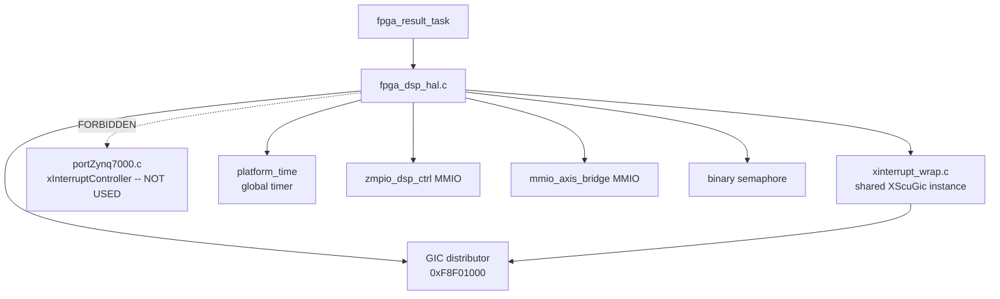
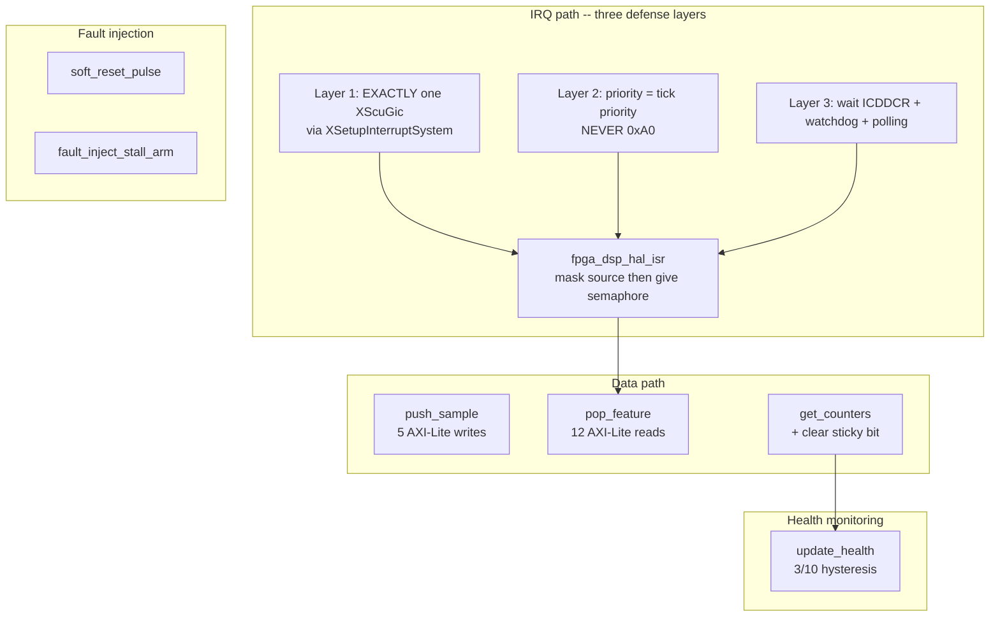
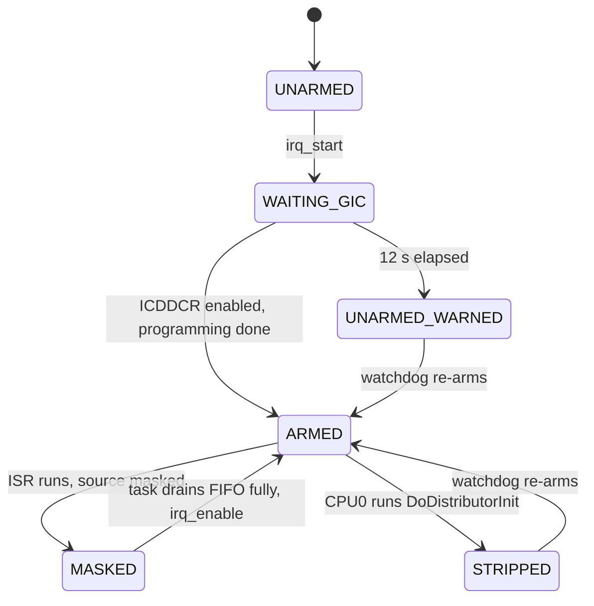
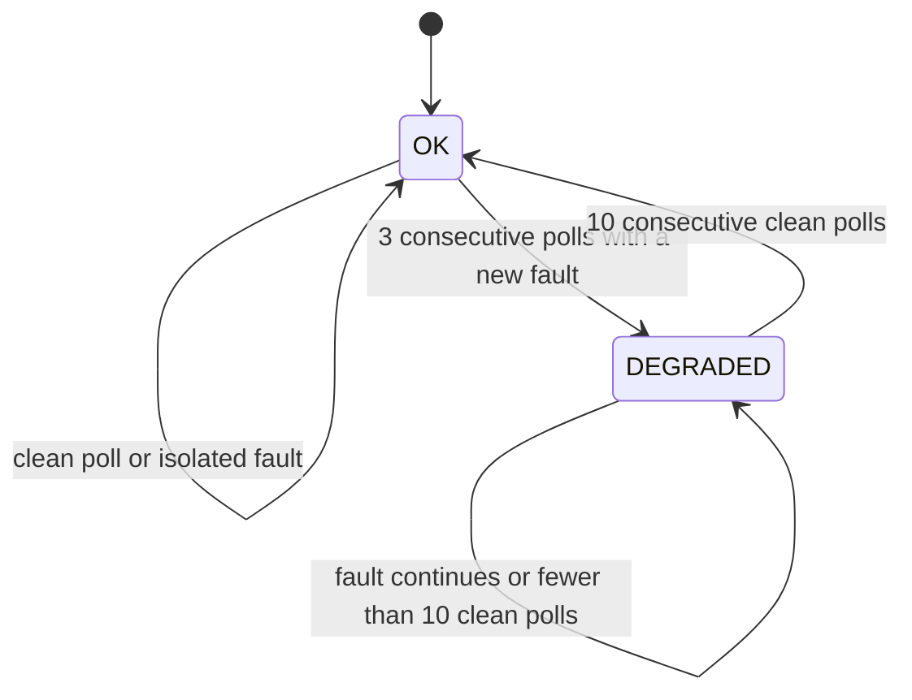
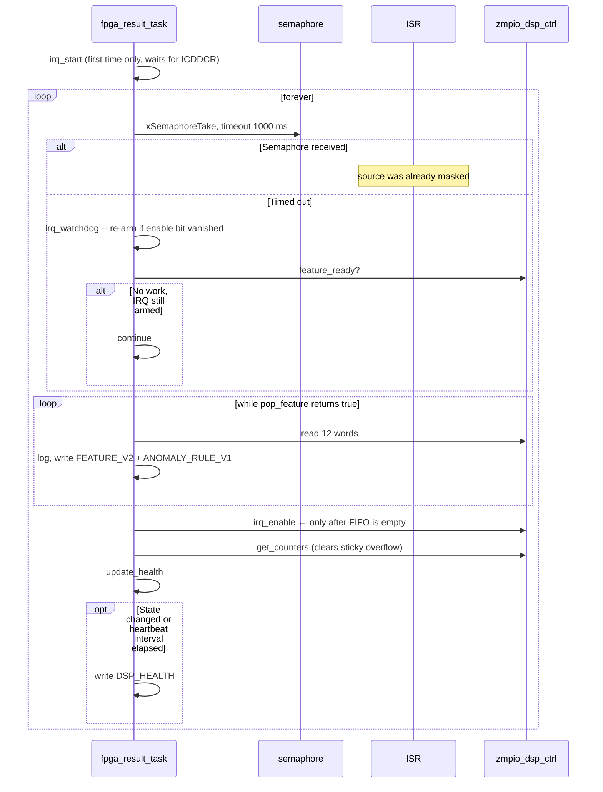
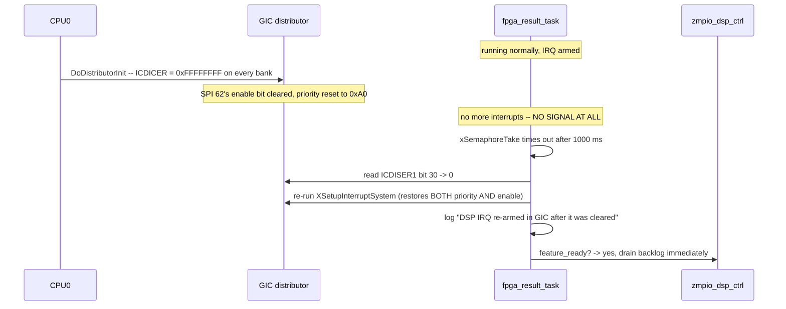
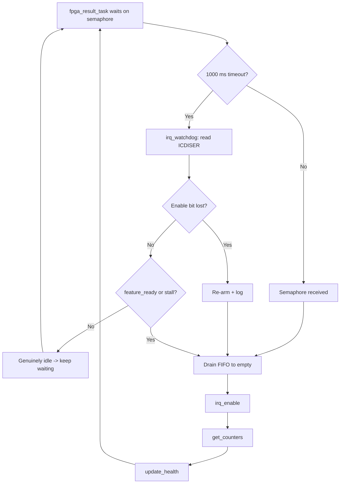

# SDD_08 — FPGA DSP HAL and GIC Discipline (CMP-HAL-001)

**Document ID:** ZMPIO-SDD-08
**Component:** CMP-HAL-001
**Level:** L2
**Source:** `firmware/app_freertos/src/fpga_dsp_hal.{c,h}`, and the body of `fpga_result_task` in `main.c`

---

## 1. Purpose

This component is the bridge between `zmpio_dsp_ctrl` (SDD_06) and CPU1 software. Functionally it is
very small: push a sample, pop a feature, read the counters.

Most of this document is not about that function, but about **three layers of defense around the
GIC**. Three independent bugs on the same interrupt path were found on real hardware, each surfacing
as a symptom that had nothing obviously to do with its root cause:

| Bug | Surface symptom | Actual root cause |
|---|---|---|
| BUG-004a | MPU6050 "never comes up" | two `XScuGic` instances → `xTickCount` frozen |
| BUG-004b | board freezes exactly at sample #128 | level IRQ not masked → IRQ storm |
| BUG-006 | "FIFO full" fault injection looks like a failure | CPU0 clears SPI 62's enable bit |

None of these bugs was found by code review or by simulation. That is why this component carries more
defensive layers than it would otherwise appear to need.

## 2. Responsibility

### MUST

- Push samples through `mmio_axis_bridge` with `SAMPLE_W4` written last.
- Pop a feature by reading all 12 words in order, with the last word being `0x44`.
- Mask the IRQ at the source inside the ISR, **before** anything else.
- Use exactly **one** `XScuGic` instance — the one in `xinterrupt_wrap.c`, via `XSetupInterruptSystem()`.
- Set IRQ 62's priority equal to the tick timer's priority, never the BSP default.
- Wait for `ICDDCR` to be enabled before the first arm, using a busy-wait on the global timer.
- Provide a watchdog that re-arms the IRQ, plus a fallback polling path.
- Capture the counters and clear the sticky `RESULT_OVERFLOW` bit in a single operation.
- Apply hysteresis to health state transitions.

### MUST NOT

- MUST NOT call `xPortInstallInterruptHandler()` or `XScuGic_InterruptMaptoCpu()` — they create a
  second `XScuGic` instance.
- MUST NOT use `XINTERRUPT_DEFAULT_PRIORITY` (`0xA0`) for IRQ 62.
- MUST NOT arm the IRQ from `main()` before `vTaskStartScheduler()`.
- MUST NOT call `vTaskDelay()` inside the `ICDDCR` wait loop.
- MUST NOT re-enable the IRQ before the FIFO has been drained.

## 3. Non-Responsibilities

| Not owned by this component | Owned by |
|---|---|
| PL register behavior | CMP-PL-001 (SDD_06) |
| Feature semantics | CMP-DSP-001, CMP-ANO-001 |
| Writing features to the card | CMP-STO-001 |
| The `fpga_result_task` loop | CMP-RT-001 (constrained by this component) |
| Reading PL registers from CPU0 | not permitted — ADR-002 |

## 4. Dependencies



The dashed edge to `portZynq7000.c` is a **deliberate prohibition**, not an oversight. See §12
ALG-HAL-001.

## 5. Architecture



## 6. Module Structure

| Module | ID | Role |
|---|---|---|
| Data path | MOD-HAL-001 | `push_sample`, `pop_feature`, `feature_ready` |
| IRQ management | MOD-HAL-002 | `irq_start`, `irq_watchdog`, `irq_enable/disable`, ISR |
| Counters and health | MOD-HAL-003 | `get_counters`, `update_health` |
| Fault injection | MOD-HAL-004 | `soft_reset_pulse`, `fault_inject_stall_*` |
| Configuration | MOD-HAL-005 | `bump_config_seq` |

## 7. File Structure

### FILE-HAL-001 — `fpga_dsp_hal.c`

| Field | Value |
|---|---|
| Layer | HAL |
| Runtime owner | CPU1; `fpga_result_task`, `ipc_rx_task`, `sensor_task`, and ISR context |

**MUST**

- Define register offsets that match `mmio_axis_bridge.v` and `zmpio_dsp_ctrl.v` **exactly**.
- Read `ICDDCR` and `ICDISER` directly — the Xilinx driver has no "is this IRQ still enabled" query.
- Keep all health state as static variables local to `update_health()` (only one task calls it).
- Use `volatile` for the two fault-injection variables (written by one task, read by another).

**MUST NOT**

- MUST NOT create its own `XScuGic` instance.
- MUST NOT expose PL registers outside the component — CPU0 obtains figures via ABI v3.

## 8. Interfaces

### 8.1 Public API

| Function | Call context | Thread-safe | ISR-safe | Blocking |
|---|---|---|---|---|
| `fpga_dsp_hal_init()` | `main()` | no | no | no |
| `fpga_dsp_hal_set_result_semaphore()` | `main()`, before init | no | no | no |
| `fpga_dsp_hal_irq_start()` | **task context only, after scheduler start** | no | no | **YES, up to 12 s** |
| `fpga_dsp_hal_irq_watchdog()` | `fpga_result_task` | no | no | no |
| `fpga_dsp_hal_irq_enable/disable()` | task + ISR | no | **YES** | no |
| `fpga_dsp_hal_feature_ready()` | task | yes (read-only) | yes | no |
| `fpga_dsp_hal_push_sample()` | `sensor_task` | no | no | no |
| `fpga_dsp_hal_pop_feature()` | `fpga_result_task` | no | no | no |
| `fpga_dsp_hal_get_counters()` | `fpga_result_task`, `ipc_rx_task` | **no** | no | no |
| `fpga_dsp_hal_update_health()` | `fpga_result_task` only | no | no | no |
| `fpga_dsp_hal_soft_reset_pulse()` | any task | no | no | no |
| `fpga_dsp_hal_fault_inject_stall_arm()` | `ipc_rx_task` | no | no | no |
| `fpga_dsp_hal_fault_inject_stall_active()` | `fpga_result_task` | yes | yes | no |
| `fpga_dsp_hal_bump_config_seq()` | `ipc_rx_task` | no | no | no |

**Warning about `get_counters()`:** it **clears** the sticky `RESULT_OVERFLOW` bit as a side effect.
Two tasks call it (`fpga_result_task` for health, `ipc_rx_task` for fault-injection ACK), so an
overflow event can be "eaten" by one task before the other observes it. Documented as LIM-HAL-003.

### 8.2 FUNC-HAL-001 — `fpga_dsp_hal_irq_start()`

**Identity**

| Field | Value |
|---|---|
| Signature | `void fpga_dsp_hal_irq_start(void)` |
| Thread-safe | NO |
| ISR-safe | NO |
| Blocking | **YES** — busy-wait up to `APP_DSP_IRQ_GIC_WAIT_MS` = 12,000 ms |

**Purpose:** connect, set priority, and enable IRQ 62 — after confirming CPU0 has brought the GIC
distributor up.

**Preconditions (all mandatory; violation causes silent failure)**

```text
- vTaskStartScheduler() has run
- Called from task context (not main(), not ISR)
- The tick timer has already run its own XSetupInterruptSystem()
  (this guarantees the shared XScuGicInstance is IsReady)
- platform_time_init() has run
```

**Processing Steps**

```text
Step 1 — Compute the wait budget
  budget = platform_time_us_to_counts(12,000,000)
  start  = platform_time_counter()

Step 2 — Busy-wait for ICDDCR
  while (ICDDCR & 0x3) == 0 and (counter - start) < budget:
      spin
  MUST busy-wait, MUST NOT vTaskDelay():
      while ICDDCR is still 0, the distributor forwards NO interrupt at all,
      including the tick -- a vTaskDelay() here would wait FOREVER.

Step 3 — Program the IRQ
  XSetupInterruptSystem(NULL, isr, IRQ_LOCAL_ID=30,
                        GIC_DIST_BASE=0xF8F01000,
                        priority = portLOWEST_USABLE_INTERRUPT_PRIORITY << portPRIORITY_SHIFT)
  One call does all four things: connect + priority + trigger + enable.

Step 4 — Verify
  Read ICDISER1 bit 30. If still 0: log a warning with the ICDDCR value,
  but do NOT fail -- the watchdog will retry.
```

**Decision Table**

| `ICDDCR` enabled within budget | `ICDISER` after programming | Action | Outcome |
|---|---|---|---|
| yes | yes | — | IRQ works normally |
| yes | no | log warning | watchdog will re-arm |
| no (12 s elapsed) | yes | program anyway | may work if CPU0 boots late |
| no (12 s elapsed) | no | log warning | watchdog + polling keep the system running |

**No path is a fatal error.** The function returns `void` by design: every outcome is recoverable via
the watchdog and the polling path.

**Postconditions**

```text
- IRQ 62 has been programmed with the CORRECT priority (not 0xA0)
- The handler is registered with the SHARED XScuGicInstance
- If ICDDCR was enabled: IRQ is enabled and routed to CPU1
- If not: a warning has been logged; the watchdog will handle it
- NO second XScuGic instance was created
```

**Timing**

| Case | Time |
|---|---:|
| CPU0 already enabled the GIC (warm restart) | ~0 ms |
| Normal boot sequence | ~6000 ms (observed on board) |
| CPU0 never boots | 12,000 ms, then continues |

**Why 12,000 ms:** board measurements show CPU0 enables `ICDDCR` roughly 6 s after CPU1 boots, so
5000 ms would be too short — arming early would still get wiped by CPU0 and would rely on the
watchdog to recover. 12,000 gives roughly 2x margin over the observed value while staying well under
the ~16 s wrap period of the 32-bit global timer at `CPU_3x2x` = 266.64 MHz. This is a cross-file
constraint linking two constants defined in different places.

**Given / When / Then**

| Scenario | Given | When | Then |
|---|---|---|---|
| HAL-001-01 normal | CPU0 enables GIC at t=6 s | called at t=0 | waits ~6 s, arms successfully, no warning |
| HAL-001-02 GIC already ready | warm restart, `ICDDCR` = 1 | called | returns almost immediately |
| HAL-001-03 CPU0 never boots | only CPU1 loaded | called | waits 12 s, logs warning, **does not hang**, task continues |
| HAL-001-04 CPU0 clears after arm | CPU0 runs `DoDistributorInit()` afterward | — | watchdog detects and re-arms within ≤ 1000 ms |
| HAL-001-05 called from wrong context | called from `main()` before scheduler | — | **silent failure** — undetectable; enforced by documentation |
| HAL-001-06 boundary | `ICDDCR` enabled exactly as budget expires | called | still programs; outcome depends on timing |

### 8.3 FUNC-HAL-002 — `fpga_dsp_hal_pop_feature()`

**Signature:** `bool fpga_dsp_hal_pop_feature(fpga_feature_frame_t *out)`

**Parameters**

| Parameter | Type | Direction | Constraint |
|---|---|---|---|
| `out` | `fpga_feature_frame_t *` | OUT | non-`NULL`, ≥ 48 bytes; **written only when returning `true`** |

**Processing Steps**

```text
Step 1 — Read STATUS
  (status & FEATURE_READY) == 0 -> return false, read NO further words
  MANDATORY: reading FEATURE_POP while the FIFO is empty returns stale
  content (SDD_06 LIM-PL-008)

Step 2 — Read all 12 words from 0x18 to 0x44 in ascending order
  Reading word 11 (0x44) is what advances the FIFO -- see SDD_06 ALG-PL-003

Step 3 — Copy the 12 words into out's fields in the correct order

Step 4 — Return true
```

**Return Contract**

| Value | Meaning | Caller MUST |
|---|---|---|
| `true` | `*out` is a valid frame; FIFO has advanced | process the frame; may call again to drain more |
| `false` | FIFO empty; `*out` **not** touched | stop draining |

**Postconditions**

```text
Returns true:  FIFO advances by one element; *out fully populated (12 fields)
Returns false: FIFO unchanged; *out untouched
```

**Given / When / Then**

| Scenario | Given | When | Then |
|---|---|---|---|
| HAL-002-01 normal | FIFO has 1 frame | called | `true`, `*out` correct, FIFO empty |
| HAL-002-02 empty | FIFO empty | called | `false`, `*out` unchanged, `FEATURE_POP` not read |
| HAL-002-03 drain | FIFO has 5 frames | called in a `while` loop | `true` 5 times, then `false` once |
| HAL-002-04 ordering | FIFO has 3 frames | drained | `frame_sequence` increases monotonically — the FIFO is a real FIFO |
| HAL-002-05 after soft reset | FIFO has data | reset, then called | `false` — FIFO was cleared |

### 8.4 FUNC-HAL-003 — `fpga_dsp_hal_isr()`

**Identity**

| Field | Value |
|---|---|
| Context | ISR, GIC priority `0xF0` |
| Execution time | must be extremely short |

**Processing Steps**

```text
Step 1 — fpga_dsp_hal_irq_disable()      ← BEFORE ANYTHING ELSE
         Write CONTROL = RUN (clears IRQ_ENABLE)

Step 2 — If result_semaphore != NULL: xSemaphoreGiveFromISR

Step 3 — portYIELD_FROM_ISR(higher_priority_task_woken)
```

**Why Step 1 must come first:** `irq_out` is level-triggered and stays asserted for as long as the
FIFO is non-empty. Without masking the source, the GIC would immediately re-enter the ISR right after
EOI, forever — because only `fpga_result_task` can drain the FIFO, and it never gets to run. This is
exactly BUG-004b: the board froze **precisely at sample #128**, i.e. the DSP window size, i.e. the
first moment the FIFO became non-empty.

**Postconditions**

```text
- zmpio_dsp_ctrl's IRQ_ENABLE = 0 (source masked)
- Semaphore given (if it exists)
- Context switch requested if a higher-priority task just became ready
```

**Contract with `fpga_result_task`:** the task MUST call `fpga_dsp_hal_irq_enable()` after draining the
FIFO to empty, and only then. If it forgets, the IRQ never re-enables and the system falls entirely
back to the watchdog's polling path — still functional, but with latency up to 1000 ms.

### 8.5 FUNC-HAL-004 — `fpga_dsp_hal_update_health()`

**Signature**

```c
void fpga_dsp_hal_update_health(const fpga_dsp_hal_counters_t *counters,
                                fpga_dsp_hal_health_t *out);
```

**Parameters**

| Parameter | Direction | Constraint |
|---|---|---|
| `counters` | IN | snapshot from `get_counters()` in the same loop iteration |
| `out` | OUT | non-`NULL` |

**State Preconditions:** the function keeps 6 static variables. It MUST be called only from
`fpga_result_task` — calling it from another task corrupts the streak logic with no warning.

**Processing Steps**

```text
Step 1 — Classify the fault (priority order is meaningful)
  if counters->result_overflow:        fault_now = true, last_fault = 3
  elif ctrl_drop_count != prev:         fault_now = true, last_fault = 1
  elif bridge_drop_count != prev:       fault_now = true, last_fault = 2
  else:                                 fault_now = false

  Why compare against the PREVIOUS value rather than 0:
    a counter that increased long ago but did not increase FURTHER
    is not a new fault.

  Ordering note: a FIFO-stall event also sets RESULT_OVERFLOW in the RTL
  (SDD_06 §8.4), so it will be classified as code 3, not code 1.

Step 2 — Save the current counters as "previous" for next time

Step 3 — Update streak and hysteresis
  if fault_now:
      ++fault_streak; ok_streak = 0
      if state == OK and fault_streak >= 3:   state = DEGRADED, state_changed = true
  else:
      ++ok_streak; fault_streak = 0
      if state == DEGRADED and ok_streak >= 10: state = OK, state_changed = true

Step 4 — Write out->state, out->last_fault, out->consecutive_fault_count
```

**Decision Table**

| State | `fault_now` | `fault_streak` | `ok_streak` | Result |
|---|---|---:|---:|---|
| OK | no | 0 | increments | stays OK, `state_changed = false` |
| OK | yes | 1 | 0 | stays OK (not yet 3) |
| OK | yes | 3 | 0 | → DEGRADED, `state_changed = true` |
| DEGRADED | yes | increments | 0 | stays DEGRADED |
| DEGRADED | no | 0 | 5 | stays DEGRADED (not yet 10) |
| DEGRADED | no | 0 | 10 | → OK, `state_changed = true` |

**The 3-up / 10-down asymmetry is deliberate:** entering the degraded state quickly (to catch faults
early) but leaving it slowly (to avoid declaring recovery prematurely). This is a standard pattern for
a failure detector.

**Given / When / Then**

| Scenario | Given | When | Then |
|---|---|---|---|
| HAL-004-01 normal | no faults | 20 polls | stays OK throughout, no state change |
| HAL-004-02 isolated fault | 1 drop, then none | continues polling | **still OK** — hysteresis absorbs it |
| HAL-004-03 sustained fault | 3 consecutive polls with a new drop | 3rd poll | → DEGRADED, `state_changed = true` exactly once |
| HAL-004-04 recovery | DEGRADED, then 10 clean polls | 10th poll | → OK, `state_changed = true` |
| HAL-004-05 near-miss recovery | DEGRADED, 9 clean polls then 1 fault | polled | still DEGRADED, `ok_streak` resets to 0 |
| HAL-004-06 simultaneous faults | overflow **and** ctrl drop | polled | `last_fault = 3` (overflow takes priority) |
| HAL-004-07 boundary | counters saturated, no longer incrementing | polled | `fault_now = false` — **silent blind spot**, see LIM-HAL-005 |

## 9. Data Structures

### `fpga_feature_frame_t`

A plain-C copy of `zmpio::step1::FeatureFrameV2` (`app_freertos` compiles as C, not C++).
`_Static_assert(sizeof(...) == 48)` in `zlog_feature_v2.h` enforces that the two sides match.

There are **three parallel definitions** of the same layout: C++ in `dsp_host_sim`, C here, and Python
in the host tooling. Only the size is enforced automatically via `static_assert`; field ordering is
not checked automatically anywhere (LIM-HAL-006).

### `fpga_dsp_hal_counters_t`

| Field | Source | Semantics |
|---|---|---|
| `feature_count` | `zmpio_dsp_ctrl.FEATURE_COUNT` | total beats pushed into the FIFO, saturating |
| `ctrl_drop_count` | `zmpio_dsp_ctrl.DROP_COUNT` | number of stall **episodes**, **no data lost** |
| `bridge_drop_count` | `mmio_axis_bridge.DROP_COUNT` | number of samples **actually lost** |
| `result_overflow` | `STATUS` bit1, sticky | an anomaly occurred since the last read |

### `fpga_dsp_hal_health_t`

`state` and `last_fault` deliberately use the **same numeric codes** as `zlog_dsp_health_state_t` and
`zlog_dsp_fault_t` in `zlog_feature_v2.h`, so `main.c` can copy them directly into the ZLOG record.
In exchange, this header stays fully independent of the ZLOG layer.

### Static state

| Variable | Scope | Written by | Read by | Protection |
|---|---|---|---|---|
| `result_semaphore` | file scope | `main()`, before scheduler | ISR | written before the ISR can ever run |
| `fault_inject_stall_until_tick` | file scope, `volatile` | `ipc_rx_task` | `fpga_result_task` | aligned word, single writer |
| `fault_inject_stall_hold_ms_applied` | file scope, `volatile` | `ipc_rx_task` | `ipc_rx_task` | same as above |
| 6 variables in `update_health()` | function-static | `fpga_result_task` only | same | single-task invariant |
| `config_seq` in `bump_config_seq()` | function-static | `ipc_rx_task` only | same | single-task invariant |

## 10. State Machine

### STATE-HAL-001 — IRQ lifecycle



| Current | Event | Guard | Action | Next |
|---|---|---|---|---|
| `WAITING_GIC` | `ICDDCR` enabled | within budget | `XSetupInterruptSystem` | `ARMED` |
| `WAITING_GIC` | timeout | — | program anyway, log | `UNARMED_WARNED` |
| `ARMED` | FIFO non-empty | — | ISR masks source, gives semaphore | `MASKED` |
| `MASKED` | task finishes draining | FIFO empty | `irq_enable` | `ARMED` |
| `ARMED` | CPU0 re-inits GIC | — | (silent — no event fires) | `STRIPPED` |
| `STRIPPED` | watchdog timeout | `ICDISER` bit = 0 | re-`irq_program` | `ARMED` |

**The `ARMED → STRIPPED` transition is silent.** No interrupt, no flag, no signal at all. The only
symptom is the **absence** of interrupts. That is exactly why the watchdog must be periodic polling
rather than an event-driven reaction.

### STATE-HAL-002 — DSP health



## 11. Runtime Sequence

### 11.1 Normal loop



### 11.2 Watchdog recovers a cleared IRQ



**Why re-arming uses the EXACT SAME call as the initial arm:** a distributor re-init does not just
clear the enable bit — it also resets the interrupt's priority to the BSP default `0xA0`, a value that
outranks the tick timer and would recreate the tick-starvation hazard (BUG-004a).
`XSetupInterruptSystem()` restores **both** at once, and it never re-runs the destructive body of
`XScuGic_CfgInitialize()` once the instance is already ready (`xinterrupt_wrap.c` returns early when
`InstancePtr->IsReady`).

### 11.3 FIFO-full fault injection

```mermaid
sequenceDiagram
    participant V3 as ipc_v3
    participant HAL as fpga_dsp_hal
    participant T as fpga_result_task
    participant PL as zmpio_dsp_ctrl

    V3->>HAL: fault_inject_stall_arm(60000)
    HAL->>HAL: clamp to <= 120000, compute deadline in ticks
    V3->>V3: read counters before arming -> include in ACK
    loop while stall_active
        T->>HAL: stall_active? -> true
        T->>T: SKIP drain loop, vTaskDelay 50 ms
        Note over PL: DSP keeps producing; FIFO fills up; DROP_COUNT increases
    end
    T->>T: log "hold expired, draining backlog"
    loop drain entire backlog
        T->>PL: pop_feature
    end
    T->>PL: irq_enable
    T->>T: log counters after draining
```

**This is a purely software fault injection** — no PL register is touched. What fills the FIFO is the
PL's own ongoing production, exactly as it would be during a real backlog.

## 12. Algorithms

### ALG-HAL-001 — Use exactly one `XScuGic` instance

**Problem (root cause of BUG-004a):**

This BSP contains **two** independent, uncoordinated `XScuGic` objects describing **one** physical
GIC:

| Instance | Location | Used by |
|---|---|---|
| `xInterruptController` | `portZynq7000.c` | `xPortInstallInterruptHandler()`, `XScuGic_InterruptMaptoCpu()` |
| `XScuGicInstance` (file-static) | `xinterrupt_wrap.c` | tick timer, via `XSetupInterruptSystem()` |

`XScuGic_CfgInitialize()` only skips its destructive body (`XScuGic_Stop()` + `CPUInitialize()`, two
functions that reprogram the running CPU-interface/distributor hardware) when **its own**
`InstancePtr->IsReady` flag is already set. The tick timer's `CfgInitialize()` call never touches
`xInterruptController`'s `IsReady` flag — they are two different C structs.

**Consequence:** calling `xPortInstallInterruptHandler()` (which internally calls
`XScuGic_CfgInitialize(&xInterruptController, ...)` for the first time) **ALWAYS** re-runs that
destructive init on the real GIC, no matter how late it is called.

**Observed evidence:** reading `xTickCount` over JTAG showed it incrementing **exactly once** after
`vTaskStartScheduler()` and then freezing permanently. That froze every `vTaskDelay()` in the system —
including the two calls inside `mpu6050_configure()`. That was the real reason MPU6050 traffic never
appeared; not a sensor fault, not an I2C bus fault. A separate Arduino rig confirmed the sensor was
fully healthy.

**Solution:**

```text
NEVER create a second XScuGic instance.
Go through XSetupInterruptSystem() -- the same instance the tick timer
already fully initialized before any task ever runs.
This call only does Connect + set priority/trigger + Enable.
XScuGic_Enable() targets the calling CPU automatically; no separate
MaptoCpu is needed.
```

### ALG-HAL-002 — Choosing the priority for a level IRQ

```text
ZMPIO_DSP_IRQ_PRIORITY = portLOWEST_USABLE_INTERRUPT_PRIORITY << portPRIORITY_SHIFT
                       = 0xF0
```

**Why NOT `XINTERRUPT_DEFAULT_PRIORITY` (`0xA0`):**

```text
On ARM's GIC, a SMALLER number means HIGHER priority.

FreeRTOS's tick (SCU private timer, portZynq7000.c) runs at 0xF0 -- the
LOWEST usable level on this GIC (configUNIQUE_INTERRUPT_PRIORITIES = 32),
deliberately chosen so nothing can outrank it.

0xA0 < 0xF0  →  the default priority OUTRANKS the tick.

zmpio_dsp_ctrl's irq_out is LEVEL-triggered, staying asserted for as long
as the FIFO isn't drained. At 0xA0, it wins every arbitration on this GIC
and starves xTickCount/vTaskDelay system-wide.

Using exactly the tick's priority value eliminates that possibility. On a
tie, the lower GIC ID wins -- the tick is ID 29, this IRQ is 62, so the
tick still wins.
```

### ALG-HAL-003 — Waiting for `ICDDCR` via busy-wait

```text
budget = platform_time_us_to_counts(APP_DSP_IRQ_GIC_WAIT_MS × 1000)
start  = platform_time_counter()
while !(ICDDCR & 0x3) and (uint32)(platform_time_counter() - start) < budget:
    spin
```

**Why busy-wait instead of `vTaskDelay()`:** while `ICDDCR` is still 0, the distributor forwards no
interrupt **to any CPU** — including the tick. A `vTaskDelay()` here would wait forever.

**Why the global timer instead of the tick:** same reason — it is a free-running counter independent
of interrupts. This is the same primitive used by `iic_polled.c`.

**Board evidence for BUG-006 (2026-09-06, 09:44):** CPU1 printed three pre-scheduler lines at 09:44:30
and then went completely silent until 09:44:37 — it had no FreeRTOS tick at all, because `ICDDCR` was
still 0 — and only resumed once CPU0 booted at 09:44:32. It was CPU0's own call that both enabled the
distributor and wiped IRQ 62's enable bit at the same time.

This failure is **deterministic, not intermittent**: it fails every time the GIC starts from a reset
state (fresh power-up, or `rst -system` in the DAP recovery script) and "works" whenever a prior CPU0
run had already left `ICDDCR = 1`, because in that case `DistributorInit()` sees the distributor
already enabled and skips the clearing step.

### ALG-HAL-004 — Watchdog and fallback polling path

```text
Inside fpga_result_task's loop:

if xSemaphoreTake(sem, 1000 ms) != pdTRUE:
    irq_rearmed = fpga_dsp_hal_irq_watchdog()
    if irq_rearmed: log
    if !irq_rearmed and !feature_ready() and !stall_active():
        continue          # genuinely idle
    # otherwise: DRAIN ANYWAY -- the polling path does not depend on the GIC
```

**Three branches, three different situations:**

| `irq_rearmed` | `feature_ready` | Interpretation | Action |
|---|---|---|---|
| false | false | genuinely idle | keep waiting |
| **true** | either | GIC was just wiped and has been recovered | drain backlog immediately |
| false | **true** | work pending but the IRQ never arrived | drain via polling |

The third branch turns "lost IRQ" from a fatal failure into a performance degradation: the system
still drains the FIFO, just with latency up to 1000 ms instead of immediate.

`fpga_dsp_hal_irq_watchdog()` is cheap when everything is normal — exactly **one** MMIO read
(`ICDISER1 & bit30`). That is why calling it on **every** timeout is acceptable.

### ALG-HAL-005 — Wrap-safe deadline for fault injection

```text
arm(hold_ms):
    clamped = min(hold_ms, APP_FIFO_FULL_INJECT_MAX_HOLD_MS)
    until_tick = xTaskGetTickCount() + pdMS_TO_TICKS(clamped)

active():
    return (int32)(until_tick - xTaskGetTickCount()) > 0
```

Casting to **signed** and comparing against 0 is the correct way to handle wraparound for a 32-bit
`TickType_t`: it works across the wrap boundary as long as the interval is less than half the range
(~248 days at 100 Hz tick rate). The 120,000 ms cap sits far below that threshold.

## 13. Error Handling

| Error | Category | Detection | Action | Recovery | Escalation |
|---|---|---|---|---|---|
| `ICDDCR` never enables | E6 | budget exhausted | log, program anyway | watchdog + polling | none |
| Enable bit cleared | E6 | `ICDISER` = 0 at timeout | re-arm | automatic, ≤ 1000 ms | none |
| Level IRQ not masked | E7 | (eliminated by design) | ISR masks immediately | — | — |
| Two `XScuGic` instances | E7 | (eliminated by design) | never create a second one | — | — |
| FIFO full | E3 | `ctrl_drop_count` increases | counted | drained | DSP_HEALTH |
| Sample dropped by bridge | E3 | `bridge_drop_count` increases | counted | — | DSP_HEALTH |
| `RESULT_OVERFLOW` | E7 | `STATUS` bit1 | cleared via W1C | — | DSP_HEALTH |
| Pop while FIFO empty | E1 | check `STATUS` first | returns `false` | — | — |
| `XSetupInterruptSystem` fails | E6 | `configASSERT` | **system halt** | none | assert |

**The `configASSERT` inside `fpga_dsp_hal_irq_program()` is the component's only hard failure point.**
If programming the GIC fails, the system halts. Rationale: every other outcome is recoverable, whereas
a GIC that cannot be programmed means the BSP or hardware is in a state where no assumption still
holds.

**Error flow**



## 14. Concurrency

| Context | Calls | Risk |
|---|---|---|
| `sensor_task` | `push_sample` | none — write-only, no read-modify-write |
| `fpga_result_task` | `pop_feature`, `get_counters`, `update_health`, `irq_enable`, `irq_watchdog` | primary owner |
| `ipc_rx_task` | `get_counters`, `soft_reset_pulse`, `fault_inject_stall_arm`, `bump_config_seq` | **yes** — see below |
| ISR | `irq_disable`, `xSemaphoreGiveFromISR` | none — a single MMIO write |

**Three concurrency concerns worth flagging:**

1. **`get_counters()` is called from two tasks.** It clears the sticky `RESULT_OVERFLOW` bit. If
   `ipc_rx_task` calls it first, `fpga_result_task` will miss that event and DSP_HEALTH misses a fault
   (LIM-HAL-003).

2. **`irq_disable()` is called from both the ISR and a task.** Both are just one `Xil_Out32()` write of
   a constant — atomic at the architecture level. There is no read-modify-write.

3. **`soft_reset_pulse()` from `ipc_rx_task` while `fpga_result_task` is draining the FIFO.** This is
   a real race: the FIFO can be cleared while `pop_feature()` is mid-read of the 12 words, producing a
   frame spliced from two sources. In practice `SOFT_RESET` is used only for fault injection, where
   data accuracy is not required at that moment — but it is an unguarded race nonetheless
   (LIM-HAL-004).

**Per-function properties**

| Function | Thread-safe | ISR-safe | Notes |
|---|---|---|---|
| `push_sample` | no | no | writes staging registers + strobe |
| `pop_feature` | no | no | 12 reads, not atomic |
| `get_counters` | **no** | no | has a side effect (W1C) |
| `update_health` | no | no | static state |
| `irq_enable/disable` | yes | **yes** | single constant write |
| `feature_ready` | yes | yes | single read |
| `fault_inject_stall_active` | yes | yes | reads a `volatile` |

## 15. Timing

| Quantity | Value | Notes |
|---|---:|---|
| `ICDDCR` wait | up to 12,000 ms | once, at startup only |
| Watchdog period | 1000 ms | `APP_DSP_IRQ_WATCHDOG_POLL_MS` |
| Fault-injection poll period | 50 ms | `APP_FIFO_FULL_INJECT_POLL_MS` |
| Max hold | 120,000 ms | `APP_FIFO_FULL_INJECT_MAX_HOLD_MS` |
| Heartbeat cadence while DEGRADED | 5000 ms | |
| `push_sample` | ~5 MMIO writes | a few µs |
| `pop_feature` | 1 + 12 MMIO reads | a few µs |
| ISR latency | a few µs | one write + give semaphore |
| Feature cadence | 640 ms | |
| Latency when IRQ lost | up to 1000 ms | polling path |

**Hidden timing constraint:** `APP_DSP_IRQ_GIC_WAIT_MS` = 12,000 ms must stay below the ~16 s wrap
period of `platform_time_counter()`. These two constants live in different files, and **no automated
check** links them.

## 16. Resource / Memory Usage

| Resource | Usage |
|---|---:|
| Static state | ~30 bytes |
| Stack in `pop_feature` | 48 bytes (`words[12]`) |
| MMIO | 2 PL regions + 2 GIC registers |
| GIC | 1 SPI (ID 62) |
| Semaphore | 1 (allocated in `main.c`) |

## 17. Configuration

| Constant | Value | Location | Effect of change |
|---|---:|---|---|
| `FPGA_DSP_HAL_MMIO_BRIDGE_BASEADDR` | `0x40000000` | `fpga_dsp_hal.h` | must match `pl.dtsi` |
| `FPGA_DSP_HAL_DSP_CTRL_BASEADDR` | `0x40001000` | same | same |
| `FPGA_DSP_HAL_IRQ_ID` | 62 | same | derived from position on `xlconcat_0` |
| `ZMPIO_DSP_IRQ_PRIORITY` | `0xF0` | `fpga_dsp_hal.c` | **must not** be changed to `0xA0` |
| `APP_DSP_IRQ_GIC_WAIT_MS` | 12,000 | `app_config.h` | must stay below the ~16 s wrap period |
| `APP_DSP_IRQ_WATCHDOG_POLL_MS` | 1000 | `app_config.h` | determines latency when IRQ is lost |
| `APP_DSP_HEALTH_FAULT_STREAK_TO_DEGRADED` | 3 | `app_config.h` | lower would be overly sensitive |
| `APP_DSP_HEALTH_OK_STREAK_TO_RECOVER` | 10 | `app_config.h` | |
| `APP_DSP_HEALTH_DEGRADED_LOG_INTERVAL_MS` | 5000 | `app_config.h` | prevents flooding the log path |
| `APP_FIFO_FULL_INJECT_MAX_HOLD_MS` | 120,000 | `app_config.h` | caps excessive requests |
| `APP_FIFO_FULL_INJECT_POLL_MS` | 50 | `app_config.h` | |

**After any block-design rebuild:** base addresses and the GIC ID must be re-checked against
`firmware/platform_dual/hw/sdt/pl.dtsi`. There is no automated check — a wrong address reads back as
0 and looks exactly like "PL not running."

## 18. Logging / Debug

| Log line | Meaning |
|---|---|
| `DSP IRQ %u not enabled in GIC after arm (ICDDCR=0x...)` | GIC wasn't ready when arming; watchdog will handle it |
| `DSP IRQ re-armed in GIC after it was cleared` | **caught BUG-006 happening live** |
| `DSP feature #%lu rms_q24_8=%lu dom_freq_q16_16=%lu` | pipeline is alive |
| `DSP counters feature=... ctrl_drop=... bridge_drop=... overflow=...` | printed when an anomaly is present |
| `DSP health -> DEGRADED/OK fault=%d` | state transition |
| `ABI v3 FIFO_FULL_INJECT holding drain hold_ms=...` | fault injection in progress |

**Diagnostic table**

| Symptom | Diagnosis | How to confirm |
|---|---|---|
| No `DSP feature` lines at all | PL not producing, or IRQ dead | read `FEATURE_COUNT` over JTAG |
| `FEATURE_COUNT` increasing but no log | IRQ dead, watchdog also dead | read `ICDISER1` bit 30 |
| `re-armed` appears periodically | something keeps re-initing the GIC | look for `XSetupInterruptSystem` calls on CPU0 |
| CPU1 completely silent after its first three lines | `ICDDCR` = 0, no tick at all | read `0xF8F01000` over JTAG |
| Freeze exactly at sample #128 | level IRQ not masked | check whether the ISR calls `irq_disable` first |
| `xTickCount` increments once then stalls | two `XScuGic` instances | search for `xPortInstallInterruptHandler` |

**The single most valuable JTAG technique:** read `0x4000_100C` (`FEATURE_COUNT`) repeatedly, seconds
apart. It separates "PL is broken" from "GIC is broken" with one measurement — and that measurement is
exactly what resolved BUG-006.

## 19. Verification

| Test | Verifies | Evidence |
|---|---|---|
| TEST-PL-004 | level-IRQ masking discipline | runs past sample #128 without freezing |
| TEST-RT-003 | priority never outranks tick | `xTickCount` increments steadily |
| TEST-RT-004 | tolerates GIC re-init | `re-armed` log line |
| TEST-RT-005 | soft reset doesn't kill I2C/SD | fault injection |
| TEST-RT-006 | FIFO-full recovery | fault injection |
| TEST-ANO-004 | health hysteresis | force drops, observe transitions |

## 20. Known Limitations

| ID | Limitation | Impact | Mitigation |
|---|---|---|---|
| LIM-HAL-001 | `ICDDCR` wait is a 12 s busy-wait | blocks `fpga_result_task` at startup | one-time only; other tasks keep running |
| LIM-HAL-002 | 12 s and the wrap period aren't automatically linked | increasing this constant could break the deadline | documented in §15 and §17 |
| LIM-HAL-003 | `get_counters()` clears the sticky bit, called from two tasks | can miss one overflow event | `ipc_rx_task` calls it very infrequently |
| LIM-HAL-004 | `soft_reset_pulse()` races `pop_feature()` | a frame spliced from two sources | used only for fault injection |
| LIM-HAL-005 | Saturated counters blind `update_health()` | no new-fault detection past `0xFFFFFFFF` | saturation needs ~87 years at the current rate |
| LIM-HAL-006 | Three parallel definitions of `FeatureFrameV2` | only the size is checked automatically | field order must be checked by eye |
| LIM-HAL-007 | Calling `irq_start()` from the wrong context fails silently | undetectable at runtime | enforced via documentation and comments |
| LIM-HAL-008 | Hardcoded base addresses | a wrong address looks like "PL not running" | must be cross-checked against `pl.dtsi` after every rebuild |

## 21. Traceability

| REQ | Design | FUNC | TEST |
|---|---|---|---|
| REQ-PL-001 | §8 | — | TEST-PL-001 |
| REQ-PL-004 | §8.4, §12 ALG-HAL-002, ADR-011 | FUNC-HAL-003 | TEST-PL-004 |
| REQ-RT-003 | §12 ALG-HAL-002 | — | TEST-RT-003 |
| REQ-RT-004 | §12 ALG-HAL-003, ALG-HAL-004, ADR-014 | FUNC-HAL-001 | TEST-RT-004 |
| REQ-RT-005 | §11.3 | — | TEST-RT-005, TEST-RT-006 |
| REQ-ANO-004 | §8.5, §10 STATE-HAL-002 | FUNC-HAL-004 | TEST-ANO-004 |
| REQ-PL-005 | §11.3, ADR-012 | — | TEST-PL-005 |
