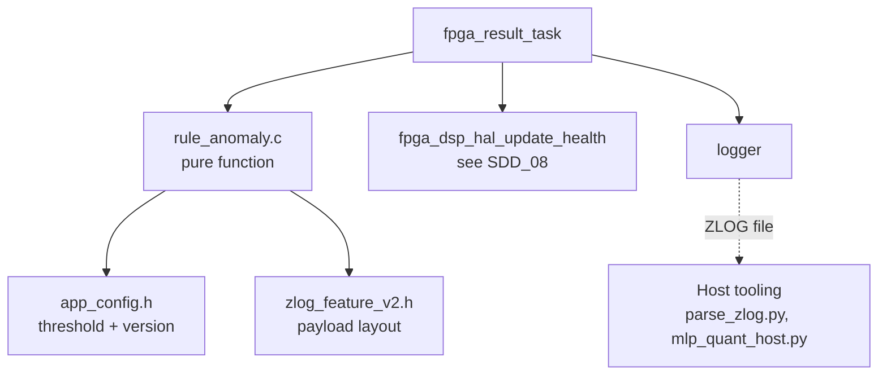
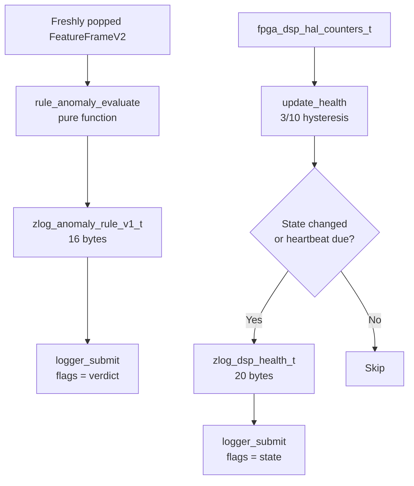
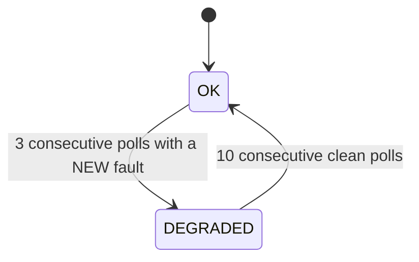
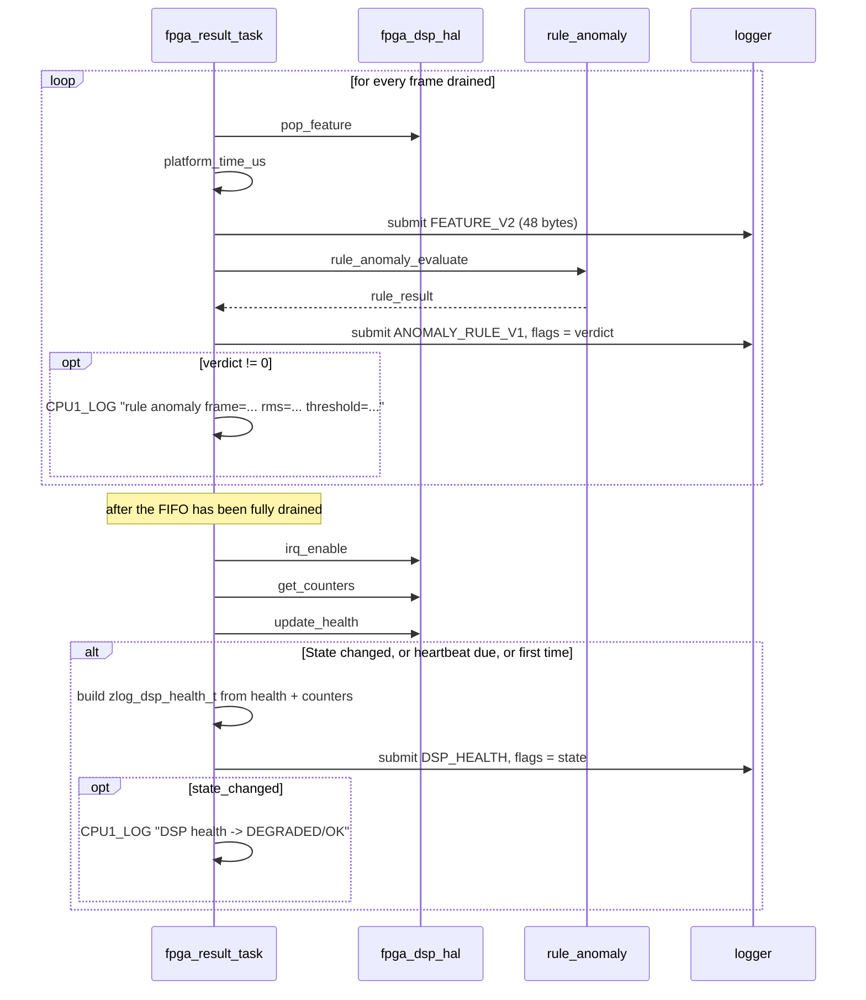

# SDD_09 — Anomaly Rule and DSP Health (CMP-ANO-001)

**Document ID:** ZMPIO-SDD-09
**Component:** CMP-ANO-001
**Level:** L2 + L3
**Source:** `firmware/app_freertos/src/rule_anomaly.{c,h}`, `zlog_feature_v2.h`,
`app_config.h` (threshold and hysteresis constants), the body of `fpga_result_task` in `main.c`,
`fpga_dsp_hal_update_health()` (details in SDD_08)

---

## 1. Purpose

This component answers two different questions about two different subjects, and **not** conflating
them is the single most important design point:

| Question | About | Mechanism | Record |
|---|---|---|---|
| Is this vibration abnormal? | **the monitored machine** | RMS threshold rule | `ANOMALY_RULE_V1` |
| Is the DSP path itself healthy? | **the measurement system** | hysteresis on hardware counters | `DSP_HEALTH` |

A system that conflates these two signals will report "the machine is broken" when the truth is "my
sensor is broken" — the worst failure mode a monitoring system can have.

## 2. Responsibility

### MUST

- Evaluate the rule on **every** `FeatureFrameV2`, in task context.
- Produce **exactly one** `ANOMALY_RULE_V1` record per frame, including when verdict = 0.
- Embed the threshold in effect into **every** record.
- Version the rule's behavior independently of the record layout version.
- Track DSP health with hysteresis and a rate-limited heartbeat log.
- Use pure integer arithmetic.

### MUST NOT

- MUST NOT run inside an ISR.
- MUST NOT write conditionally (i.e. only when an anomaly occurs).
- MUST NOT carry state between frames inside the rule — it must be a pure function.
- MUST NOT use DSP health to filter the rule's verdict, or vice versa.
- MUST NOT run ML inference on CPU1.

## 3. Non-Responsibilities

| Not owned by this component | Owned by |
|---|---|
| Feature extraction | CMP-DSP-001 (SDD_07) |
| Reading hardware counters | CMP-HAL-001 (SDD_08) |
| Writing records to the card | CMP-STO-001 (SDD_03) |
| Model training | host tooling |
| ML inference | Linux service, does not exist yet (GAP-004) |
| Threshold selection | offline analysis; the component only **applies** a constant |

## 4. Dependencies



`rule_anomaly.c` has no dependency on FreeRTOS, no dependency on hardware, and holds no state. It can
be compiled and tested on the host without any simulation.

## 5. Architecture



**The two branches are entirely independent.** They only meet in that they run within the same task
loop and both write through `logger`. There is no data flow between them.

**The asymmetry in write frequency is deliberate:**

| Record | Frequency | Reason |
|---|---|---|
| `ANOMALY_RULE_V1` | **every frame**, unconditionally | replay needs a 1:1 pairing with `FEATURE_V2`; conditional writes would drop negative samples and make the false-positive rate uncomputable |
| `DSP_HEALTH` | only on state change + a 5 s heartbeat while degraded | a PL stuck in DEGRADED must not be allowed to flood the logging path |

## 6. Module Structure

| Module | ID | File | Role |
|---|---|---|---|
| Rule evaluation | MOD-ANO-001 | `rule_anomaly.{c,h}` | pure, stateless function |
| Payload definition | MOD-ANO-002 | `zlog_feature_v2.h` | struct + version constants |
| Threshold constants | MOD-ANO-003 | `app_config.h` | values + full derivation rationale |
| Health monitoring | MOD-ANO-004 | `fpga_dsp_hal.c` | hysteresis (details in SDD_08) |
| Write orchestration | MOD-ANO-005 | `main.c` | decides when to write |

## 7. File Structure

### FILE-ANO-001 — `rule_anomaly.c`

| Field | Value |
|---|---|
| Layer | business logic |
| Runtime owner | CPU1, `fpga_result_task` only |

**MUST**

- Be a pure function: same inputs always produce the same outputs, no side effects.
- Write the currently applied threshold into the output record.
- Populate every field of the struct, including `reserved0`.

**MUST NOT**

- MUST NOT retain state between calls.
- MUST NOT call FreeRTOS APIs, read the clock, or log.
- MUST NOT use floating point.

The entire file is 15 lines. That smallness is a design property, not an oversight: it makes the
function testable on the host, safe to call from anywhere, and structurally unable to become the
source of a state-dependent bug.

### FILE-ANO-002 — `zlog_feature_v2.h`

**MUST** keep three `_Static_assert`s on size (48 / 16 / 20 bytes), each with an error message that
**names** the host tool that must be updated alongside it.

**MUST NOT** put any logic here — it is purely a layout definition.

The assert message for `FeatureFrameV2` reads: *"update ml/models/v1/mlp_quant_host.py and
software/linux/parse_zlog.py alongside it."* This is the only place in the project that ties a C
change to the Python tools that depend on it — not a perfect mechanism (it's just text), but it
appears exactly where and when the person making the change will read it.

## 8. Interfaces

### 8.1 Public API

| Function | Thread-safe | Reentrant | ISR-safe | Blocking |
|---|---|---|---|---|
| `rule_anomaly_evaluate()` | **YES** (pure function) | **YES** | **technically YES** | NO |

The function is technically safe to call from an ISR (no state, no locking, no blocking), but
REQ-ANO-001 still forbids it. The reason is not technical safety but architectural discipline: calling
it from an ISR would drag `logger_submit()` — which is **not** ISR-safe — into that same context.

### 8.2 FUNC-ANO-001 — `rule_anomaly_evaluate()`

**Identity**

| Field | Value |
|---|---|
| Signature | `void rule_anomaly_evaluate(const fpga_feature_frame_t *frame, zlog_anomaly_rule_v1_t *out)` |
| File | `rule_anomaly.c` |
| Thread-safe | YES |
| Reentrant | YES |
| ISR-safe | YES (but forbidden by REQ-ANO-001) |
| Blocking | NO |

**Purpose:** apply a single-variable threshold rule to a feature frame and produce the corresponding
ZLOG record.

**Parameters**

| Parameter | Type | Direction | Required | Constraint | Ownership |
|---|---|---|---|---|---|
| `frame` | `const fpga_feature_frame_t *` | IN | YES | non-`NULL`; **not checked** | caller-owned |
| `out` | `zlog_anomaly_rule_v1_t *` | OUT | YES | non-`NULL`, ≥ 16 bytes; **not checked** | caller-owned |

**Parameter Interaction:** only two fields of `frame` are read — `frame_sequence` and `rms_q24_8`. The
other eight fields are entirely ignored by this version of the rule.

**Preconditions**

```text
- frame != NULL, out != NULL
  NOT CHECKED -- passing NULL causes a Data Abort.
  This is deliberate: the function has exactly ONE call site, and adding
  a check would make it something other than a trivial pure function.
```

**State Preconditions:** none. The function is valid in every system state.

**Processing Steps**

```text
Step 1 — out->rule_version    = APP_RULE_ANOMALY_VERSION   (currently 2)
Step 2 — out->metric_id       = ZLOG_RULE_METRIC_RMS       (1)
Step 3 — out->frame_sequence  = frame->frame_sequence      (pairing key)
Step 4 — out->value_q24_8     = frame->rms_q24_8
Step 5 — out->threshold_q24_8 = APP_RULE_ANOMALY_RMS_THRESHOLD_Q24_8  (2351)
Step 6 — out->verdict         = (rms > threshold) ? 1 : 0
Step 7 — out->reserved0       = 0
```

**Decision Table**

| `rms_q24_8` vs. threshold | `verdict` | Interpretation |
|---|---:|---|
| `< 2351` | 0 | normal |
| `== 2351` | 0 | **strict comparison** — exactly at the threshold is normal |
| `> 2351` | 1 | anomalous |

Using `>` rather than `>=` is documented here because it is an arbitrary choice that affects exactly
one value. It must stay consistent with the host analysis script — if the host uses `>=`, the two
sides will disagree precisely on frames sitting exactly on the threshold.

**Return Contract:** the function returns `void`. The result lives in `*out`, which is **always**
fully populated.

**Postconditions**

```text
Always (no failure path):
  - All 7 fields of *out have been written
  - out->frame_sequence == frame->frame_sequence
  - out->threshold_q24_8 == the compile-time constant currently in effect
  - *frame is NOT modified
  - No global state changes
```

**Side Effects:** none. That is the entire value of this design.

**Concurrency:** safe to call concurrently from multiple contexts, each with its own `out` pointer.

**Timing:** a handful of assignments and one comparison. No branch is expensive. Runtime is
deterministic.

**Given / When / Then**

| Scenario | Given | When | Then |
|---|---|---|---|
| ANO-001-01 normal | `rms = 1000` | called | `verdict = 0`, all fields correctly populated |
| ANO-001-02 anomalous | `rms = 5000` | called | `verdict = 1` |
| ANO-001-03 just below | `rms = 2350` | called | `verdict = 0` |
| ANO-001-04 exact boundary | `rms = 2351` | called | `verdict = 0` — strict comparison |
| ANO-001-05 just above | `rms = 2352` | called | `verdict = 1` |
| ANO-001-06 extreme | `rms = 0xFFFFFFFF` | called | `verdict = 1`, no overflow |
| ANO-001-07 dead signal | `rms = 0` | called | `verdict = 0` |
| ANO-001-08 traceability | any frame | called | `out->frame_sequence` matches, `out->threshold` = the value in use |
| ANO-001-09 purity | same frame | called twice | bit-for-bit identical results |

**Caller Responsibilities**

| Outcome | Caller MUST |
|---|---|
| always | write the record via `logger_submit()` with `flags = verdict` — **unconditionally** |
| `verdict = 1` | may additionally log to UART; **must not** skip writing the record when `verdict = 0` |

## 9. Data Structures

### `zlog_anomaly_rule_v1_t` (16 bytes)

| Offset | Field | Type | Why it exists |
|---:|---|---|---|
| 0 | `rule_version` | u8 | distinguishes older captures from newer ones when the threshold changes |
| 1 | `metric_id` | u8 | reserved for a future multi-metric rule |
| 2 | `verdict` | u8 | the result |
| 3 | `reserved0` | u8 | alignment |
| 4 | `frame_sequence` | u32 | **pairing key** with `FEATURE_V2` |
| 8 | `value_q24_8` | u32 | the value used for the decision |
| 12 | `threshold_q24_8` | u32 | the threshold used for the decision |

**Both `value` and `threshold` are written into every record**, even though `value` duplicates
`rms_q24_8` from `FEATURE_V2` and `threshold` is a constant. This redundancy is deliberate:

1. A rule record is **self-explanatory** without needing the paired feature record nearby.
2. An older capture can still state which threshold it used, even after the firmware has changed.
3. If `value` in the rule record diverges from `rms_q24_8` in the feature record sharing the same
   `frame_sequence`, that is direct evidence of data corruption.

### `zlog_dsp_health_t` (20 bytes)

Layout: `ARCHITECTURE_DETAIL.md` §6.5.

**Three hardware counters are embedded directly in the record** (`feature_count`, `ctrl_drop_count`,
`bridge_drop_count`), not just the derived state. This lets offline analysis recompute the health
decision from raw data — meaning the hysteresis logic itself can be independently verified rather than
simply trusted.

### Version table

| Constant | Value | Covers | Bump when |
|---|---:|---|---|
| `LOG_FORMAT_VERSION` | 1 | container | header layout changes |
| `ZLOG_ANOMALY_RULE_V1_VERSION` | 1 | rule payload **layout** | struct fields change |
| `APP_RULE_ANOMALY_VERSION` | **2** | rule **behavior** | any numeric parameter changes |
| `ZLOG_DSP_HEALTH_VERSION` | 1 | health payload layout | struct fields change |

Separating layout from behavior is what makes "which threshold did this capture use" answerable
without consulting git log. `APP_RULE_ANOMALY_VERSION` went from 1 to 2 when the threshold moved from
a 37,425 placeholder to the derived value 2351.

## 10. State Machine

### STATE-ANO-001 — Rule: stateless

`rule_anomaly_evaluate()` is a pure function. There is no state machine.

This is a design statement, not an absence of documentation: a stateful rule (moving average, debounce
filter) would make the same feature sequence produce different verdicts depending on history —
breaking host replay reproducibility and the ability to verify against a dataset.

### STATE-ANO-002 — DSP health

Full state machine: SDD_08 §10 STATE-HAL-002. Summarized here because the record belongs to this
component:



**Write policy (decided in `main.c`):**

| Condition | Write `DSP_HEALTH`? |
|---|---|
| `state_changed == true` | **yes** — always written |
| first occurrence after boot | **yes** — establishes the baseline |
| `state == DEGRADED` and 5000 ms have elapsed since the last write | **yes** — heartbeat |
| `state == OK` and unchanged | no |

The heartbeat branch is what prevents a PL stuck in DEGRADED from flooding the logging path, while
still letting offline analysis measure how long a degraded window lasted.

## 11. Runtime Sequence



**Write ordering within the loop matters:** `FEATURE_V2` is written **before** `ANOMALY_RULE_V1` for
the same frame. Since `storage_task` consumes the queue in FIFO order, this ordering is preserved on
the card. The replay tooling relies on that property to pair records without a lookahead pass.

## 12. Algorithms

### ALG-ANO-001 — Single-variable threshold rule

#### 1. Purpose

Classify a feature frame as normal or anomalous with a single comparison.

#### 2. Inputs

| Input | Source |
|---|---|
| `frame->rms_q24_8` | `FeatureFrameV2` |
| `APP_RULE_ANOMALY_RMS_THRESHOLD_Q24_8` = 2351 | compile-time constant |

#### 3. Outputs

`verdict` ∈ {0, 1}, together with the full context needed to reproduce the decision.

#### 4. Assumptions

- Normal-vibration RMS is distributed tightly enough for a fixed threshold to separate it.
- The threshold was derived from representative data.

The second assumption holds only **partially** for the current dataset — see §8 and LIM-ANO-002.

#### 5. Mathematical Model

```text
verdict = 1  ⟺  rms > μ + N·σ

where μ and σ are the mean and standard deviation of RMS over labeled
NORMAL data, and N = 2.0.

This is the same formula and coefficient N used by rule_baseline_report()
in dsp_host_sim/tools/train_real_pipeline.py.
```

This is a **fixed constant**, not a running estimate: CPU1 stays pure-integer and stateless.

#### 6. Processing Steps

See FUNC-ANO-001 §8.2.

#### 7. Pseudocode

```text
evaluate(frame, out):
    out.rule_version    = 2
    out.metric_id       = RMS
    out.frame_sequence  = frame.frame_sequence
    out.value_q24_8     = frame.rms_q24_8
    out.threshold_q24_8 = 2351
    out.verdict         = (frame.rms_q24_8 > 2351) ? 1 : 0
    out.reserved0       = 0
```

#### 8. Boundary Conditions

| Condition | Behavior |
|---|---|
| `rms == threshold` | `verdict = 0` (strict comparison) |
| `rms == 0` | `verdict = 0` |
| `rms == UINT32_MAX` | `verdict = 1`, no overflow |
| `frame_sequence` wraps | copied verbatim; pairing remains locally correct |

#### 9. Error Conditions

None. The function is total over every non-`NULL` input.

#### 10. Complexity

`O(1)` time, `O(1)` memory. No multiplication, no division, no loop.

#### 11. Numerical Considerations

Both the value and the threshold are in Q24.8, so direct comparison is valid without conversion.
Comparison is unsigned, so there is no sign issue.

#### 12. Verification Method

Host replay: run `mlp_quant_host.py` against a captured ZLOG file and confirm the recomputed verdict
matches the recorded `ANOMALY_RULE_V1` verdict 100%.

#### 13. Threshold derivation — real data

This section records **how** the value 2351 was derived, because a threshold with no provenance is a
threshold that cannot be trusted.

**Dataset** (captured 2026-09-06, real board, one continuous power-on session ~22 minutes,
`evidence/step3_dataset_normal_moderate_severe_20260906_1512_LOG00126.BIN`):

| Segment | Duration | Label |
|---|---|---|
| Quiet baseline | ~7 min | NORMAL |
| Moderate hand shaking | ~4.5 min | FAULT_MODERATE |
| Severe hand shaking | ~3 min | FAULT_SEVERE |

All within the same `session_id`/mount, so `frame_sequence` and `timestamp_us` are directly
comparable.

**Labeling method:** by wall-clock timestamps recorded during the run, mapped to `timestamp_us` via a
matching UART log line (`frame_sequence` 1020, `rms` = 88,064, printed at 15:22:58).

**A 20-second guard band after each shaking stop — the most important detail:** raw data shows
15-20 seconds of genuine mechanical settling after the hand actually stopped (RMS still in the tens of
thousands). Without excluding those frames, they would be mislabeled NORMAL and would **inflate the
NORMAL standard deviation by roughly 150x** — rendering the threshold useless.

**Clean NORMAL statistics** (n = 1292, guard band excluded):

```text
mean = 1221
std  = 565
max  = 8448
threshold = mean + 2·std = 1221 + 1130 = 2351
```

**Measured performance on that same dataset:**

| Class | n | Detected | Notes |
|---|---:|---:|---|
| FAULT_SEVERE | 309 | 92.2% | |
| FAULT_MODERATE | 411 | 64.2% | 35.8% read as normal — moderate shaking includes zero-crossing and startup frames sitting close to the noise floor |
| NORMAL | 1292 | 1.8% false positives (23/1292) | |

**Why there is a 1.8% false-positive rate:** the Gaussian `mean + 2·std` formula does not capture the
NORMAL distribution's heavier-than-Gaussian tail — the observed `max` was 8448, nearly four times the
2351 threshold. This is a **known limitation of a single-variable rule**, not a bug.

**A misconception to rule out:** `APP_DSP_HEALTH_FAULT_STREAK_TO_DEGRADED = 3` does **not** smooth the
rule's false-positive rate. It is an entirely different signal (DSP hardware health, not a per-frame
verdict). `ANOMALY_RULE_V1` is written every frame **with no debouncing whatsoever**.

### ALG-ANO-002 — DSP health hysteresis

Full algorithm: SDD_08 §8.5 and §12. Recorded here is **why** the two numbers were chosen:

| Parameter | Value | Rationale |
|---|---:|---|
| Threshold into DEGRADED | 3 polls | a single isolated drop is noise, not a fault; three in a row is a trend |
| Threshold back to OK | 10 polls | leaving is slower than entering — avoid declaring recovery prematurely |
| Heartbeat cadence | 5000 ms | sparse enough not to flood the card, dense enough to measure the degraded window's duration |

A poll happens on every FIFO drain, roughly every 640 ms at normal cadence. So 3 polls ≈ 2 s, and 10
polls ≈ 6.4 s.

## 13. Error Handling

This component has no error codes.

| Condition | Handling |
|---|---|
| `NULL` pointer | **not checked** — causes a Data Abort; constrained by having only one call site |
| Extreme `rms` | unsigned comparison handles the full range |
| Corrupted frame from PL | not detectable at this layer; the storage layer's ZLOG CRC catches it |
| Record write fails | `logger_submit()` returns `false`; the caller **ignores** that value |

**Known limitation:** `main.c` uses `(void)logger_submit(...)` for all three record types. If the
queue is full, the rule record is silently dropped and the `FEATURE_V2` ↔ `ANOMALY_RULE_V1` pairing
breaks. The replay tool **does** detect this (it counts missing pairs), but the firmware does not
(LIM-ANO-004).

## 14. Concurrency

| Property | `rule_anomaly_evaluate()` | `update_health()` |
|---|---|---|
| Thread-safe | YES | NO (static state) |
| Reentrant | YES | NO |
| ISR-safe | technically YES, forbidden by REQ | NO |
| Blocking | NO | NO |

**REQ-ANO-001 ("the rule runs in task context") is satisfied trivially**, since `fpga_result_task`
never runs inside an ISR. This is precisely why the component needs no dedicated task or queue of its
own — a meaningful simplification over an alternative design.

`update_health()` holds 6 static variables and MUST be called only from `fpga_result_task`. Calling it
from anywhere else corrupts the streak logic with no warning.

## 15. Timing

| Quantity | Value |
|---|---:|
| Rule evaluation cadence | every frame, ~640 ms |
| Rule execution time | a few dozen CPU cycles |
| Health poll cadence | every FIFO drain |
| Time to enter DEGRADED | ≥ 3 polls ≈ 2 s |
| Time to leave DEGRADED | ≥ 10 polls ≈ 6.4 s |
| Heartbeat cadence | 5000 ms |

**Contribution to `fpga_result_task`'s budget:** each frame costs two `logger_submit()` calls (one for
the rule, one for the feature) plus a third when a health record is written. Each call computes a
bit-serial CRC32 over the payload — 128 bit-cycles for the 16-byte rule payload, 384 for the 48-byte
feature payload. At `-O0` this is the most expensive part of the loop.

## 16. Resource / Memory Usage

| Resource | Usage |
|---|---:|
| Code | ~15 lines, a few dozen bytes of machine code |
| Static state | **0** for the rule; 6 variables for health (belongs to SDD_08) |
| Stack | `zlog_anomaly_rule_v1_t` 16 bytes + `zlog_dsp_health_t` 20 bytes in the task's stack frame |
| Write bandwidth | ~44 bytes/frame for the rule ≈ 69 bytes/s |

## 17. Configuration

| Constant | Value | Meaning | Rule for changing |
|---|---:|---|---|
| `APP_RULE_ANOMALY_VERSION` | 2 | behavior version | **MUST** be bumped when the threshold or formula changes |
| `APP_RULE_ANOMALY_RMS_THRESHOLD_Q24_8` | 2351 | threshold | must be derived from a labeled dataset; record its provenance |
| `ZLOG_ANOMALY_RULE_V1_VERSION` | 1 | layout version | bump when struct fields change |
| `ZLOG_DSP_HEALTH_VERSION` | 1 | layout version | same |
| `APP_DSP_HEALTH_FAULT_STREAK_TO_DEGRADED` | 3 | enter DEGRADED | |
| `APP_DSP_HEALTH_OK_STREAK_TO_RECOVER` | 10 | return to OK | |
| `APP_DSP_HEALTH_DEGRADED_LOG_INTERVAL_MS` | 5000 | heartbeat cadence | |

**Mandatory procedure when changing the threshold:**

```text
1. Capture a new labeled dataset on real hardware
2. Recompute mean/std over NORMAL data with the guard band excluded
3. Update the threshold constant
4. BUMP APP_RULE_ANOMALY_VERSION
5. Record the full provenance in an app_config.h comment:
   which dataset, sample count, mean/std/max, measured recall/false-positive rate
6. Re-run the host replay to confirm agreement
```

Step 5 is what turns `app_config.h` into documentation rather than just a list of numbers — and is why
that file is unusually long.

## 18. Logging / Debug

| Channel | Content | When |
|---|---|---|
| ZLOG `ANOMALY_RULE_V1` | every frame | always |
| ZLOG `DSP_HEALTH` | state change + heartbeat | conditional |
| UART1 | `rule anomaly frame=... rms=... threshold=...` | only when `verdict != 0` |
| UART1 | `DSP health -> DEGRADED/OK fault=%d` | only on state change |

**The asymmetry between ZLOG and UART is deliberate:** ZLOG carries **every** frame (needed for
statistical analysis); UART carries only events (enough for live monitoring without flooding the
console).

**Host analysis workflow**

```text
1. parse_zlog.py FILE.BIN → CSV
2. Pair FEATURE_V2 with ANOMALY_RULE_V1 by frame_sequence
3. Check every frame has exactly one pair -- a missing pair means a lost record
4. Recompute the verdict from the rms and threshold stored in the record itself
5. Compare against the recorded verdict → must match 100%
6. If labeled: compute recall and false-positive rate
```

Step 5 verifies the firmware itself. Any mismatch is evidence of data corruption or a firmware bug —
there is no benign explanation.

**Diagnostic table**

| Observation | Diagnosis |
|---|---|
| No `ANOMALY_RULE_V1` records at all | `fpga_result_task` isn't draining frames |
| More `FEATURE_V2` than `ANOMALY_RULE_V1` | the log queue filled up — check `sensor_dropped` |
| `verdict` always 1 | threshold too low, or sensor mounted wrong / high ambient vibration |
| `verdict` always 0 despite real vibration | threshold too high, or the DSP path is stalled (check `FEATURE_COUNT`) |
| `rule_version` varies within one file | should not be possible — it's a compile-time constant |
| `DSP_HEALTH` always DEGRADED | check the three counters embedded in that same record |

## 19. Verification

| Test | Verifies | Evidence |
|---|---|---|
| TEST-ANO-001 | rule runs in task context | code review |
| TEST-ANO-002 | one record per frame | count pairs in a real ZLOG file |
| TEST-ANO-003 | threshold derived from data | derivation documented in §12 + dataset |
| TEST-ANO-004 | health hysteresis | force drops, observe transitions |
| TEST-ANO-005 | no ML on CPU1 | code review |
| TEST-ANO-006 | replay agreement | `mlp_quant_host.py` against a real capture |

## 20. Known Limitations

| ID | Limitation | Impact | Mitigation |
|---|---|---|---|
| LIM-ANO-001 | Single-variable rule, RMS only | cannot detect anomalies visible only in spectrum or kurtosis | `FEATURE_V2` still records all 10 fields for offline analysis |
| LIM-ANO-002 | Threshold derived from a **single** shaking session | not yet representative of real mechanical faults (bearing wear, imbalance, looseness) | GAP-005; must be re-derived once a multi-mode dataset exists |
| LIM-ANO-003 | 1.8% false-positive rate on NORMAL | false alarms | inherent to Gaussian `mean + 2·std` on a heavy-tailed distribution |
| LIM-ANO-004 | Lost records not detected by firmware | broken pairing | detected by host tooling; ignored by firmware |
| LIM-ANO-005 | No `NULL` check | passing `NULL` causes a Data Abort | only one call site |
| LIM-ANO-006 | `ANOMALY_ML_V1` has no producer | no ML verdict on target | GAP-004 |
| LIM-ANO-007 | No per-frame debouncing | a single spike produces a single isolated verdict | deliberate — keeps the rule pure and reproducible |
| LIM-ANO-008 | The MLP model has never seen a real anomaly sample | replay agrees only 36.3% / 8.1% on FAULT_MODERATE / FAULT_SEVERE | a known Step1 dataset limitation, **not a bug**; 100% agreement on NORMAL |

## 21. Traceability

| REQ | Design | FUNC/ALG | TEST |
|---|---|---|---|
| REQ-ANO-001 | §14 | FUNC-ANO-001 | TEST-ANO-001 |
| REQ-ANO-002 | §5, §11 | — | TEST-ANO-002 |
| REQ-ANO-003 | §12 ALG-ANO-001 §13, §17 | — | TEST-ANO-003 |
| REQ-ANO-004 | §10, §12 ALG-ANO-002 | — | TEST-ANO-004 |
| REQ-ANO-005 | §3, ADR-004 | — | TEST-ANO-005 |
| REQ-LOG-001 | §9 | — | TEST-LOG-001 |
| REQ-OPS-003 | §12 | — | TEST-DSP-005 |
