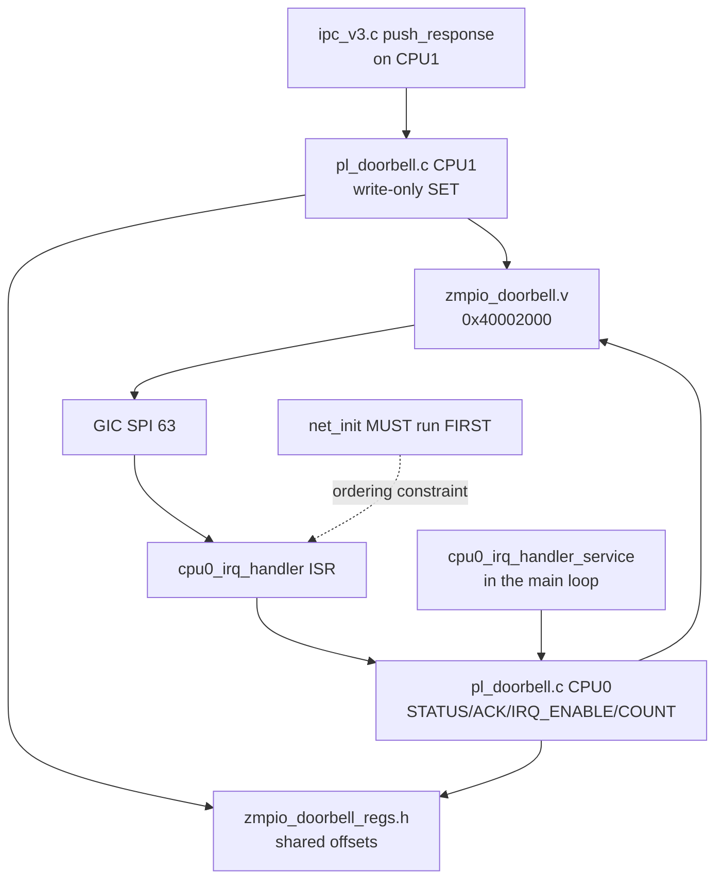
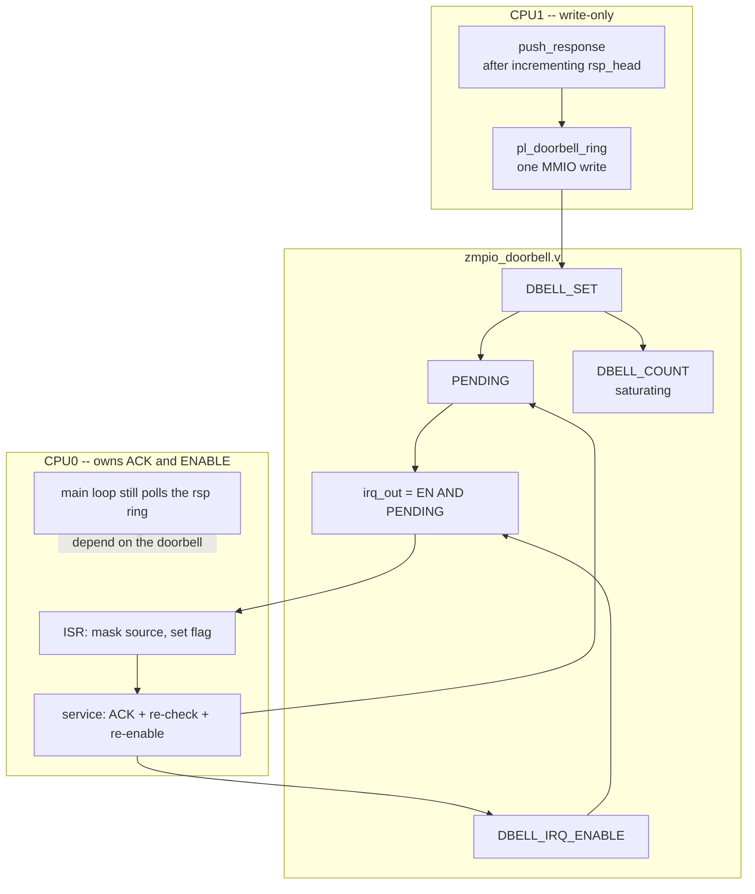
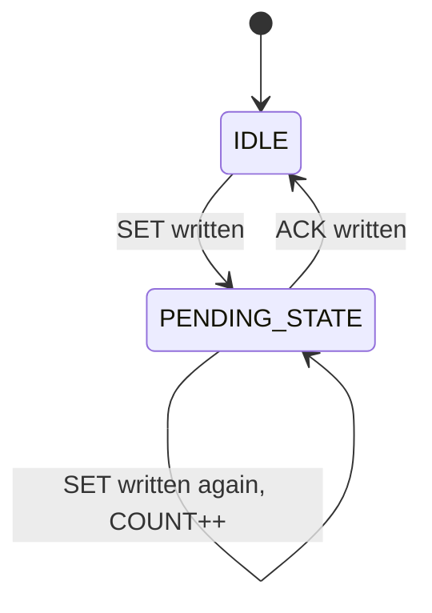
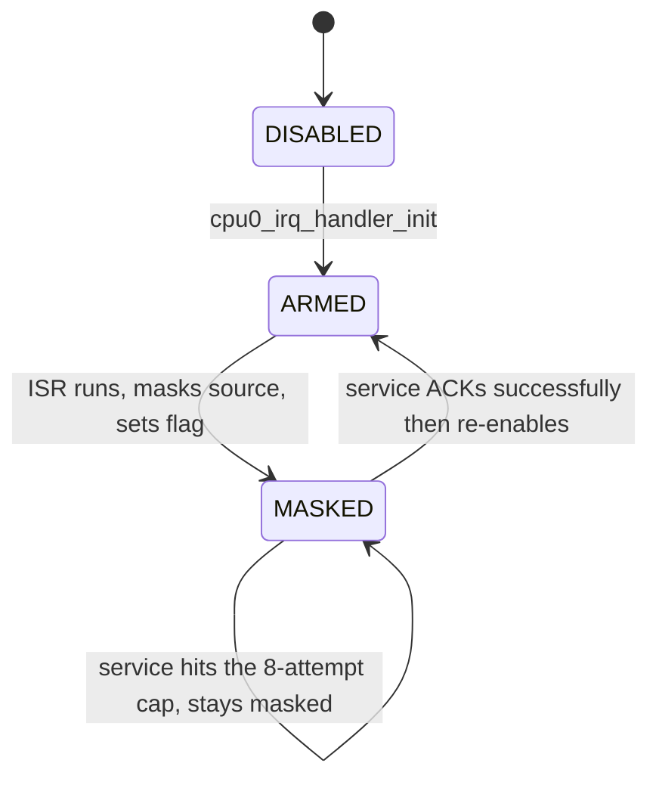
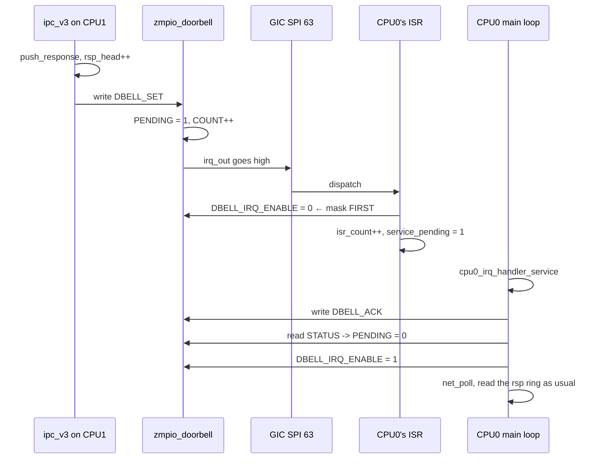
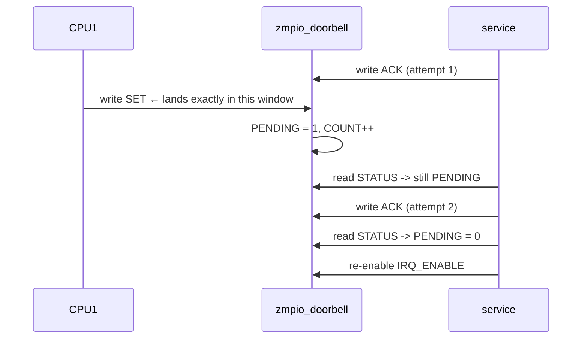
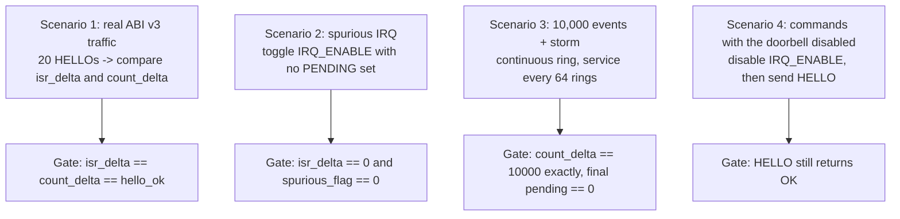
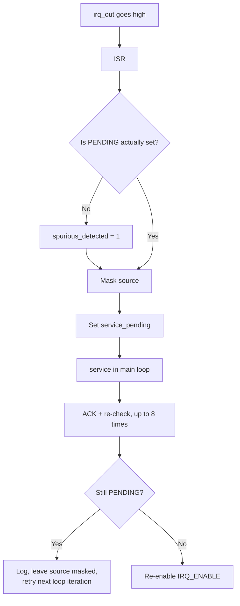

# SDD_10 — One-Way PL Doorbell, CPU1 → CPU0 (CMP-DB-001)

**Document ID:** ZMPIO-SDD-10
**Component:** CMP-DB-001
**Level:** L2
**Source:** `hardware/rtl/ip_repo/zmpio_doorbell/src/zmpio_doorbell.v`,
`common/zmpio_doorbell_regs.h`, `firmware/app_freertos/src/pl_doorbell.{c,h}`,
`firmware/cpu0_application/src/pl_doorbell.{c,h}`, `cpu0_irq_handler.{c,h}`

---

## 1. Purpose

ABI v3 (SDD_05) operates entirely by polling. This component adds a hardware wake-up path so that
CPU0 learns about a new response immediately instead of waiting for the next poll.

Three defining properties:

| Property | Why |
|---|---|
| **One-way** (CPU1 → CPU0) | the reverse direction would require CPU1 to enable an additional SPI on a GIC that CPU0 owns — exactly the bug class behind BUG-006 |
| **Carries no data** | data already has its own channel; the doorbell only says "something happened" |
| **Optional** | disabling it leaves the system correct, just slower |

The third property is a mandatory test gate, not just a design claim.

## 2. Responsibility

### MUST

- Provide a `SET` register CPU1 can write, a `PENDING` flag, and a level IRQ targeting CPU0.
- Count **every** write to `SET`, into `DBELL_COUNT`, even when `PENDING` is already set.
- Saturate `DBELL_COUNT` instead of wrapping.
- Let `SET` win over `ACK` when both land in the same cycle.
- Mask the source in CPU0's ISR before doing anything else.
- ACK, then re-check `PENDING`, with a bounded number of retries.
- Keep the command path fully functional when `DBELL_IRQ_ENABLE = 0`.

### MUST NOT

- MUST NOT carry any data.
- MUST NOT make any data path depend on it.
- MUST NOT let CPU1 touch `ACK` or `IRQ_ENABLE`.
- MUST NOT arm the IRQ before CPU0's own first `DoDistributorInit()`.
- MUST NOT block the main loop when ACK repeatedly fails.

## 3. Non-Responsibilities

| Not owned by this component | Owned by |
|---|---|
| Response content | CMP-IPC3-001 (SDD_05) |
| Waking CPU1 | does not exist — ADR-013 |
| Interrupts from `zmpio_dsp_ctrl` | CMP-HAL-001 (SDD_08) |
| Data transfer | every other channel |

## 4. Dependencies



`zmpio_doorbell_regs.h` is shared **purely to keep the two sides from drifting apart**. It
deliberately does **not** define the base address: the base is instance-specific (assigned by
Vivado's address editor), so each side has its own `*_BASEADDR` macro, filled in from `pl.dtsi` after
the block design is rebuilt — the same convention as `FPGA_DSP_HAL_DSP_CTRL_BASEADDR`.

This is **not** part of the ABI v3 contract (`layout_hash`); it is only an MMIO register map and
carries no version of its own.

## 5. Architecture



**The dashed edge is the crux of the entire design.** CPU0's main loop still polls `rsp_ring` exactly
as it did before the doorbell existed. The doorbell only makes that loop run **sooner**, not run
**more correctly**. Disabling the doorbell slows the system down; it does not make it wrong.

## 6. Module Structure

| Module | ID | File | Role |
|---|---|---|---|
| Doorbell RTL | MOD-DB-001 | `zmpio_doorbell.v` | 5 registers + level IRQ |
| Shared offsets | MOD-DB-002 | `zmpio_doorbell_regs.h` | prevents drift between the two sides |
| Ring side (CPU1) | MOD-DB-003 | `pl_doorbell.{c,h}` CPU1 | a single function |
| Receive side (CPU0) | MOD-DB-004 | `pl_doorbell.{c,h}` CPU0 | STATUS/ACK/ENABLE/COUNT + test ring |
| IRQ management (CPU0) | MOD-DB-005 | `cpu0_irq_handler.{c,h}` | ISR + service, diagnostic counters |

## 7. File Structure

### FILE-DB-001 — `zmpio_doorbell.v`

**MUST**

- Apply `ACK` **before** `SET` within the `always` block, so that a `SET`+`ACK` in the same cycle
  leaves `PENDING` = 1 with `DBELL_COUNT` already incremented.
- Increment `DBELL_COUNT` on every `SET` write with bit0 = 1, regardless of `PENDING`.
- Saturate `DBELL_COUNT` at `0xFFFFFFFF`.
- Read `DBELL_SET` and `DBELL_ACK` back as 0.

**MUST NOT**

- MUST NOT auto-clear `PENDING` when the IRQ is taken — only `ACK` clears it.
- MUST NOT have any address decoding trap.

**Why `ACK` is applied before `SET`:** a doorbell ring should never lose to a simultaneous
acknowledgment. In practice the two masters are serialized by the interconnect so this situation
cannot actually occur, but defining the behavior anyway is cheap and closes off an open question.

### FILE-DB-002 — `pl_doorbell.c` (CPU1)

The entire file is a single function that writes one register. **MUST NOT** touch `ACK`,
`IRQ_ENABLE`, or read `STATUS` — those belong to CPU0.

### FILE-DB-003 — `cpu0_irq_handler.c`

**MUST**

- Mask the source (`pl_doorbell_irq_disable()`) inside the ISR before anything else.
- Only set a flag inside the ISR; the real work happens in `service()`.
- Cap the number of ACK retries (`CPU0_IRQ_DOORBELL_MAX_ACK_ATTEMPTS` = 8).
- Run **after** `net_init()`.

**MUST NOT**

- MUST NOT be the first call on CPU0 to touch the GIC — it must not be what triggers
  `DoDistributorInit()`.
- MUST NOT block inside `service()`; when retries run out, leave the source masked for one more
  cycle rather than ever hanging.

## 8. Interfaces

### 8.1 CPU1-side API

| Function | Thread-safe | ISR-safe | Blocking |
|---|---|---|---|
| `pl_doorbell_ring()` | YES (one MMIO write) | YES | NO |

### 8.2 CPU0-side API

| Function | Called by | Notes |
|---|---|---|
| `pl_doorbell_pending()` | ISR, service | reads `STATUS` bit0 |
| `pl_doorbell_count()` | tests | reads `DBELL_COUNT` |
| `pl_doorbell_ack()` | service | writes `ACK` |
| `pl_doorbell_irq_enable/disable()` | init, ISR, service | writes `IRQ_ENABLE` |
| `pl_doorbell_test_ring()` | **lab use only** | CPU0 rings itself — see below |
| `cpu0_irq_handler_init()` | `main()`, after `net_init()` | arms the IRQ |
| `cpu0_irq_handler_service()` | every main-loop iteration | ACK + re-check + re-enable |
| `cpu0_irq_handler_get_isr_count()` | tests | number of ISR entries |
| `cpu0_irq_handler_get_spurious_detected()` | tests | sticky flag |

**On `pl_doorbell_test_ring()`:** this function is valid because `zmpio_doorbell_0`'s AXI4-Lite slave
is reachable from **both** cores over the same PS7 GP AXI path — the hardware doesn't distinguish
which core writes. It lets stress gates exercise the PL + GIC + ISR mechanism in isolation, independent
of CPU1 firmware correctness. **It must never be called from production code** — CPU1 is the only real
ringer.

### 8.3 FUNC-DB-001 — `pl_doorbell_ring()` (CPU1)

**Identity**

| Field | Value |
|---|---|
| Signature | `void pl_doorbell_ring(void)` |
| Thread-safe | YES |
| Reentrant | YES |
| ISR-safe | YES |
| Blocking | NO |

**Purpose:** notify CPU0 that a new ABI v3 response is available.

**Parameters:** none — the component carries no data.

**Preconditions:** the block design must have `zmpio_doorbell_0` at `PL_DOORBELL_BASEADDR`. If not,
this write lands in unmapped address space. On the PS7 GP AXI, a write to an unmapped address may
hang until the interconnect times out — this is not checked (LIM-DB-005).

**Processing Steps**

```text
Step 1 — Xil_Out32(BASE + 0x04, 1)
Done.
```

**Return Contract:** returns `void`. No error is detectable — CPU1 **cannot** know whether CPU0
received the interrupt, and deliberately does not need to.

**Postconditions**

```text
- PENDING = 1 in hardware
- DBELL_COUNT incremented by 1 (unless already saturated)
- If CPU0 has IRQ_ENABLE = 1: irq_out goes high
- If CPU0 has IRQ_ENABLE = 0: no interrupt fires -- and this is VALID
- No ABI v3 state is touched
```

**Side Effects:** exactly one MMIO write. No shared DDR touched, no CPU1 variable touched.

**Timing:** one AXI4-Lite transaction, tens of ns. Called exactly once per successful
`push_response()`.

**Given / When / Then**

| Scenario | Given | When | Then |
|---|---|---|---|
| DB-001-01 normal | CPU0 has armed the IRQ | ring | `COUNT` +1, `PENDING` = 1, CPU0 enters ISR |
| DB-001-02 IRQ disabled | `IRQ_ENABLE = 0` | ring | `COUNT` +1, `PENDING` = 1, **no** interrupt — valid |
| DB-001-03 already pending | `PENDING` already 1 | ring | `COUNT` +1 (**still increments**), `PENDING` stays 1 |
| DB-001-04 boundary | `COUNT = 0xFFFFFFFF` | ring | unchanged, does not wrap to 0 |
| DB-001-05 burst | ring 1000 times back-to-back | — | `COUNT` +1000; ISR entry count **may be lower** — correct |
| DB-001-06 CPU0 dead | CPU0 not running | ring | `COUNT` still increments; CPU1 unaffected |

**Scenario DB-001-05 is the component's most important semantic:** a level IRQ can coalesce multiple
`SET`s into fewer ISR entries if they occur while the source is masked. This is **correct behavior**,
not a lost wakeup. Only `DBELL_COUNT` proves the PL silently dropped no event.

### 8.4 FUNC-DB-002 — `cpu0_irq_handler_service()`

**Identity**

| Field | Value |
|---|---|
| Signature | `void cpu0_irq_handler_service(void)` |
| Context | CPU0's main loop, same cadence as `net_poll()` |
| Blocking | NO |

**Purpose:** finish servicing a doorbell interrupt: clear `PENDING`, confirm it cleared, re-enable the
source.

**Preconditions:** `cpu0_irq_handler_init()` has run.

**Processing Steps**

```text
Step 1 — If !doorbell_service_pending: return immediately (no-op)

Step 2 — doorbell_service_pending = 0

Step 3 — Bounded ACK loop
  attempts = 0
  do:
      pl_doorbell_ack()
      ++attempts
  while pl_doorbell_pending() and attempts < 8

Step 4 — If attempts >= 8:
      print a warning
      doorbell_service_pending = 1        ← retried next loop iteration
      return WITHOUT re-enabling the source  ← source stays masked
      (never hangs -- only delays)

Step 5 — pl_doorbell_irq_enable()
```

**Decision Table**

| `pending` flag | `PENDING` after ACK | `attempts` | Action | Source afterward |
|---|---|---:|---|---|
| false | — | — | no-op | unchanged |
| true | 0 | 1 | re-enable | **enabled** |
| true | 1, then 0 | 2..7 | ACK again, then re-enable | **enabled** |
| true | still 1 | 8 | log, reset the flag | **still masked** |

**Why the ACK loop may need more than one iteration:** between writing `ACK` and re-reading `STATUS`,
CPU1 may ring again, setting `PENDING` back to 1. The loop handles that race window. The cap of 8 is
**not** a timeout — it is an upper bound on how many genuinely consecutive `SET`s could reasonably
land in that tiny window before something else has clearly gone wrong.

**Why hitting the cap does NOT re-enable the source:** if `PENDING` keeps sticking, re-enabling the
IRQ would immediately trigger an interrupt storm. Leaving the source masked for one more loop
iteration is graceful degradation: the system slows down, it does not crash.

**Postconditions**

```text
Success path:
  - PENDING = 0
  - IRQ_ENABLE = 1
  - doorbell_service_pending = 0

Cap-hit path:
  - PENDING may still be 1
  - IRQ_ENABLE STILL 0 (source masked)
  - doorbell_service_pending = 1 -> retried next loop iteration
  - A warning has been logged
```

**Given / When / Then**

| Scenario | Given | When | Then |
|---|---|---|---|
| DB-002-01 normal | ISR just ran | called | ACK once, re-enable IRQ |
| DB-002-02 nothing to do | flag = 0 | called | returns immediately, no MMIO touched |
| DB-002-03 race | a new `SET` lands exactly between ACK and re-check | called | ACKs a second time, then re-enables |
| DB-002-04 stuck `PENDING` | hardware fault | called | 8 attempts, logs, **leaves masked**, does not hang |
| DB-002-05 storm | 10,000 rings with no wait | called periodically | does not crash, eventually `PENDING` = 0 |
| DB-002-06 spurious | ISR ran but `PENDING` = 0 | called | harmless ACK, re-enable, `spurious_detected` = 1 |

## 9. Data Structures (hardware registers)

| Register | Offset | Access | Reset | Invariant |
|---|---:|---|---|---|
| `DBELL_STATUS` | `0x00` | R | 0 | mirrors `PENDING` |
| `DBELL_SET` | `0x04` | W | — | reads back as 0 |
| `DBELL_ACK` | `0x08` | W | — | reads back as 0 |
| `DBELL_IRQ_ENABLE` | `0x0C` | R/W | 0 | `irq_out` mask |
| `DBELL_COUNT` | `0x10` | R | 0 | saturating, monotonically increasing |

**Hardware invariants**

```text
INV-1: irq_out = DBELL_IRQ_ENABLE AND PENDING            (level, not self-clearing)
INV-2: Every SET write with bit0=1 increments COUNT, EVEN WHEN PENDING is already 1
INV-3: COUNT saturates at 0xFFFFFFFF, never wraps
INV-4: SET and ACK in the same cycle -> PENDING = 1 and COUNT already incremented (SET wins)
INV-5: PENDING returns to 0 only via an ACK write with bit0 = 1
INV-6: COUNT is monotonic -> the delta between two reads is never negative
```

INV-3 and INV-6 together guarantee that a delta computation in a test never produces a wrong result —
this is what makes `DBELL_COUNT` a usable ground truth.

**CPU0 software state**

| Variable | Type | Written by | Read by |
|---|---|---|---|
| `doorbell_service_pending` | `volatile int` | ISR and `service()` | `service()` |
| `doorbell_isr_count` | `volatile uint32_t` | ISR | tests |
| `doorbell_spurious_detected` | `volatile int` | ISR | tests |

All three are `volatile` because they are written inside the ISR and read in the main loop. On a
single-threaded bare-metal target with aligned word accesses, `volatile` is sufficient — no locking is
needed.

## 10. State Machine

### STATE-DB-001 — Hardware



### STATE-DB-002 — CPU0 side



| Current | Event | Guard | Action | Next |
|---|---|---|---|---|
| `DISABLED` | `init()` | after `net_init()` | `XSetupInterruptSystem`, enable `IRQ_ENABLE` | `ARMED` |
| `ARMED` | `irq_out` goes high | — | mask source, `isr_count++`, set flag | `MASKED` |
| `MASKED` | `service()` | ACK done, `PENDING` = 0 | re-enable | `ARMED` |
| `MASKED` | `service()` | still `PENDING` after 8 attempts | log, keep flag | `MASKED` |
| `ARMED` | ISR fires with `PENDING` = 0 | — | `spurious_detected = 1`, stays masked | `MASKED` |

## 11. Runtime Sequence

### 11.1 Normal path



**Note:** the ISR **never** touches shared DDR and **never** reads the response. It only wakes CPU0.
Reading the response is still the main loop's job, exactly as it is without the doorbell.

### 11.2 ACK race window



The bounded loop correctly handles exactly this window. Without it, a leftover `PENDING` would raise
`irq_out` the moment the IRQ is re-enabled — not wrong, but an extra ISR entry every time the race
occurs.

### 11.3 Four test scenarios



**Scenario 3 uses `pl_doorbell_test_ring()`** — CPU0 rings itself — instead of generating 10,000 real
ABI v3 transactions. That keeps this test focused on the **PL + GIC + ISR mechanism**, isolated from
CPU1 firmware correctness (already covered by scenario 1's real traffic).

**Scenario 3's gate is `count_delta`, not `isr_delta`.** `isr_delta` is informational only: a level
IRQ can validly coalesce multiple `SET`s into fewer ISR entries. `DBELL_COUNT` is what proves no `SET`
was ever dropped by the PL register itself.

## 12. Algorithms

### ALG-DB-001 — Bounded ACK-and-recheck

```text
attempts = 0
do:
    write ACK
    ++attempts
while PENDING and attempts < 8

if attempts >= 8:
    log a warning
    leave the source masked
    reset the flag to retry next loop iteration
else:
    re-enable the source
```

**Property:** the loop always terminates within at most 8 iterations. No input makes it run forever.
Hitting the cap slows the system down; it does not hang it.

**Why 8:** a genuine consecutive `SET` landing inside the few-dozen-nanosecond window between an ACK
and its re-read is extremely rare; eight in a row is practically impossible unless something else has
already gone wrong. This number is a diagnostic ceiling, not a performance parameter.

### ALG-DB-002 — Event counting as ground truth

```text
In RTL:
    if SET written with bit0 = 1:
        PENDING <= 1
        if COUNT != 0xFFFFFFFF: COUNT <= COUNT + 1
```

**Why count even while already `PENDING`:** `PENDING` answers "is there unhandled work"; `COUNT`
answers "how many events have there been." Those are two different questions, and the tests need the
second one.

This follows the same principle as `zmpio_dsp_ctrl`'s `FEATURE_COUNT` — which is exactly what kept the
truth visible while the interrupt-distribution mechanism itself was broken (BUG-006). A monotonic,
saturating hardware counter independent of the interrupt path is the single most valuable diagnostic
tool in this entire design.

**Why saturate instead of wrap:** a delta computation in a test must never produce a negative or
falsely small result. Saturation loses information past `0xFFFFFFFF` events, but at realistic rates
that takes decades.

### ALG-DB-003 — Boot ordering constraint

```text
main():
    ...
    net_init()                 ← CPU0's FIRST XSetupInterruptSystem call
                                 → runs the full DoDistributorInit
    cpu0_irq_handler_init()    ← doorbell is armed only here
    ...
```

**Why:** `cpu0_irq_handler_init()` deliberately does **not** want to be the call that triggers CPU0's
first `DoDistributorInit()`. Coming after `net_init()` guarantees every GIC-touching call on CPU0
follows its own distributor init, so it never has to depend on that destructive full-reset path
running a second time.

**This does NOT fix BUG-006** — there is no cross-core enable-bit race here analogous to that bug,
since SPI 63 is only ever enabled by CPU0 itself. This is a precautionary decision, and the distinction
is documented here so no one mistakes the doorbell for being immune to that bug class.

## 13. Error Handling

| Error | Category | Detection | Action | Recovery |
|---|---|---|---|---|
| ISR runs with `PENDING` = 0 | E7 | check `pl_doorbell_pending()` | set `spurious_detected`, keep source masked | normal |
| Stuck `PENDING` | E6 | 8 ACK attempts fail | log, leave source masked | retried next loop iteration |
| `XSetupInterruptSystem` fails | E6 | return code | log, **return without enabling the IRQ** | none — doorbell stays silent |
| CPU0 doesn't service it | E4 | (undetectable) | — | `COUNT` still increments; CPU1 unaffected |
| Doorbell storm | E3 | (by design) | coalesced — correct behavior | `COUNT` preserves the truth |
| Wrong base address | E7 | (undetectable) | — | none — writes go into the void |

**The spurious check follows a "trust the register, not the assumption" philosophy.** Per the RTL,
`irq_out = IRQ_ENABLE && PENDING`, so the ISR should never in theory run with `PENDING` = 0. But that
exact kind of assumption is what collapsed in BUG-006, so the check is included anyway — and it also
provides a test gate for free (scenario 2).

**`init()`'s failure path is a known limitation:** if `XSetupInterruptSystem()` fails, the function
logs and returns, leaving the doorbell permanently unarmed. There is no retry, no escalation. The
system still runs correctly (just slower), but nothing detects this condition afterward (LIM-DB-004).

**Error flow**



## 14. Concurrency

| Context | Touches | Synchronization |
|---|---|---|
| `ipc_rx_task` (CPU1) | writes `SET` | not needed — one MMIO write |
| ISR (CPU0) | writes `IRQ_ENABLE`, reads `STATUS`, writes 3 `volatile` variables | not needed — bare-metal |
| Main loop (CPU0) | writes `ACK`/`IRQ_ENABLE`, reads `STATUS`, reads/writes flags | `volatile` |
| Hardware | every register | serialized by the interconnect |

**No locking anywhere.** This is possible because:

1. CPU1 only writes **one** register and never reads.
2. On CPU0, the ISR and main loop never run concurrently (single-threaded bare-metal).
3. Every MMIO access is a single, aligned word.
4. The interconnect serializes writes coming from the two cores.

Point 4 is worth emphasizing: the two cores **can** logically write at the same instant, but the AXI
interconnect turns that into a sequence. The RTL still defines behavior for `SET`+`ACK` in the same
cycle (INV-4) because doing so is cheap and closes off an open question.

## 15. Timing

| Quantity | Value |
|---|---:|
| `pl_doorbell_ring()` | one AXI4-Lite write, tens of ns |
| Ring → ISR latency | a few µs (GIC routing) |
| `service()` cadence | every main-loop iteration, ~50 ms |
| ACK loop | up to 8 MMIO read/write pairs |
| Main-loop poll cadence | `UART_POLL_INTERVAL_MS` = 50 ms |

**What the doorbell improves:**

```text
Without the doorbell: CPU0 detects a response within 0..50 ms (main-loop cadence)
With the doorbell:    the ISR runs within a few µs, but reading the response
                      STILL happens in the main loop -> the real-world
                      improvement depends on how quickly the main loop
                      reacts once woken
```

In the current bare-metal architecture, the ISR only sets a flag, so the practical benefit is modest.
The doorbell's full value only appears once CPU0 runs Linux and can **block** waiting for the
interrupt instead of polling — that is its real purpose from Step 6 onward.

**The doorbell does NOT improve the first half of the round trip.** CPU1 still detects new commands
purely by polling (up to 10 ms). There is no reverse-direction doorbell (ADR-013).

## 16. Resource / Memory Usage

| Resource | Usage |
|---|---:|
| Address space | 4 KiB at `0x40002000` |
| RTL registers | `PENDING` 1 bit, `COUNT` 32 bits, `IRQ_ENABLE` 1 bit + AXI FSM |
| GIC | 1 SPI (ID 63) |
| CPU1 code | one function |
| CPU0 code | ~100 lines |
| CPU0 state | 3 `volatile` variables, 12 bytes |

## 17. Configuration

| Constant | Value | Location | Notes |
|---|---:|---|---|
| `PL_DOORBELL_BASEADDR` | `0x40002000` | both `pl_doorbell.h` files | from `pl.dtsi` after rebuilding the BD |
| `PL_DOORBELL_IRQ_ID` | 63 | `pl_doorbell.h` (CPU0) | `<0 31 4>` → 31 + 32 = 63 |
| `ZMPIO_DOORBELL_REG_*` | 0x00..0x10 | `zmpio_doorbell_regs.h` | shared, prevents drift |
| `CPU0_IRQ_DOORBELL_MAX_ACK_ATTEMPTS` | 8 | `cpu0_irq_handler.c` | diagnostic ceiling |
| `C_S_AXI_ADDR_WIDTH` | 5 | module parameter | enough for 5 registers |
| `APP_DOORBELL_FAULT_TEST` | off in the committed build | `UserConfig.cmake` | enable to re-run the gate |
| `APP_DOORBELL_STRESS_EVENT_COUNT` | 10,000 | CPU0 `main.c` | scenario 3's scale |

**Deriving the GIC ID:** `zmpio_doorbell_0` in `pl.dtsi` has `interrupts = <0 31 4>`, i.e. SPI 31 →
GIC ID 63 (UG585 Table B-1). This matches the position on `xlconcat_0` that
`add_zmpio_doorbell.tcl` expects: `axi_iic_0` at In0 = 61, `zmpio_dsp_ctrl_0` at In1 = 62,
`zmpio_doorbell_0` at In2 = 63.

## 18. Logging / Debug

| Log line | Side | Meaning |
|---|---|---|
| `doorbell IRQ armed (GIC SPI 63)` | CPU0 | init succeeded |
| `doorbell XSetupInterruptSystem failed (status=%d)` | CPU0 | arming failed — doorbell stays silent |
| `doorbell still PENDING after 8 ACK attempts` | CPU0 | hardware fault or abnormal traffic |
| `DOORBELLTEST: ...` | CPU0 | results of the four test scenarios |

**Debugging over JTAG**

| Address | Content |
|---|---|
| `0x40002000` | `PENDING` |
| `0x4000200C` | `IRQ_ENABLE` |
| `0x40002010` | `DBELL_COUNT` |

**Diagnostic table**

| Observation | Diagnosis |
|---|---|
| `COUNT` increases, `isr_count` doesn't | IRQ not routed — check `IRQ_ENABLE` and the GIC |
| `COUNT` doesn't increase | CPU1 isn't ringing — check whether `push_response()` runs |
| `PENDING` = 1 forever | `service()` isn't running, or stuck at the ACK cap |
| `isr_count` spikes | interrupt storm — check whether the ISR masks the source |
| `spurious_detected` = 1 | GIC sent an incorrect interrupt — investigate at the register level |
| `COUNT` = `0xFFFFFFFF` | already saturated (takes decades at real rates) |

## 19. Verification

| Test | Verifies | Gate |
|---|---|---|
| TEST-DB-001 | real ABI v3 traffic wakes CPU0 | `isr_delta == count_delta == hello_ok` |
| TEST-DB-002 | no spurious IRQs | `isr_delta == 0`, `spurious_flag == 0` |
| TEST-DB-003 | 10,000 events + storm | `count_delta == 10000` exactly, final `pending` = 0 |
| TEST-DB-004 | commands work with the doorbell disabled | `HELLO` still returns `CPU0_IPC_V3_OK` |

TEST-DB-004 is the most architecturally important gate: it proves the doorbell is an **optimization**,
not a **dependency**.

## 20. Known Limitations

| ID | Limitation | Impact | Mitigation |
|---|---|---|---|
| LIM-DB-001 | One-way only | cannot wake CPU1 | ADR-013; CPU1 keeps polling |
| LIM-DB-002 | ISR only sets a flag | modest latency benefit on bare-metal | full value once CPU0 runs Linux |
| LIM-DB-003 | Event coalescing | ISR entry count < number of `SET`s | correct by design; `COUNT` is ground truth |
| LIM-DB-004 | A failed `init()` is permanently silent | doorbell never works | logs one line at boot |
| LIM-DB-005 | A wrong base address is undetectable | writes go into the void, possibly hanging until interconnect timeout | must be cross-checked against `pl.dtsi` after every rebuild |
| LIM-DB-006 | `pl_doorbell_test_ring()` ships in the production binary | CPU0 could ring itself | gated behind a macro; never called on the production path |
| LIM-DB-007 | No timeout for a stuck `PENDING` | could stay masked for multiple loop iterations | retried every iteration; never hangs |
| LIM-DB-008 | `COUNT` saturation loses information past `2^32` events | — | takes decades at real rates |

## 21. Traceability

| REQ | Design | FUNC | TEST |
|---|---|---|---|
| REQ-IPC-009 | §5, ADR-013 | FUNC-DB-001 | TEST-DB-004 |
| REQ-IPC-010 | §9 INV-2/3/6, §12 ALG-DB-002 | — | TEST-DB-003 |
| REQ-PL-004 | §8.4, §10 STATE-DB-002, ADR-011 | FUNC-DB-002 | TEST-DB-002 |
| REQ-SYS-002 | §8 (CPU1 only writes `SET`) | — | TEST-SYS-002 |
