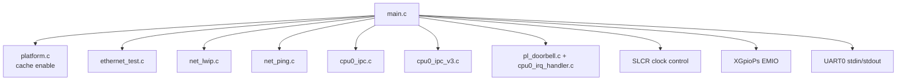
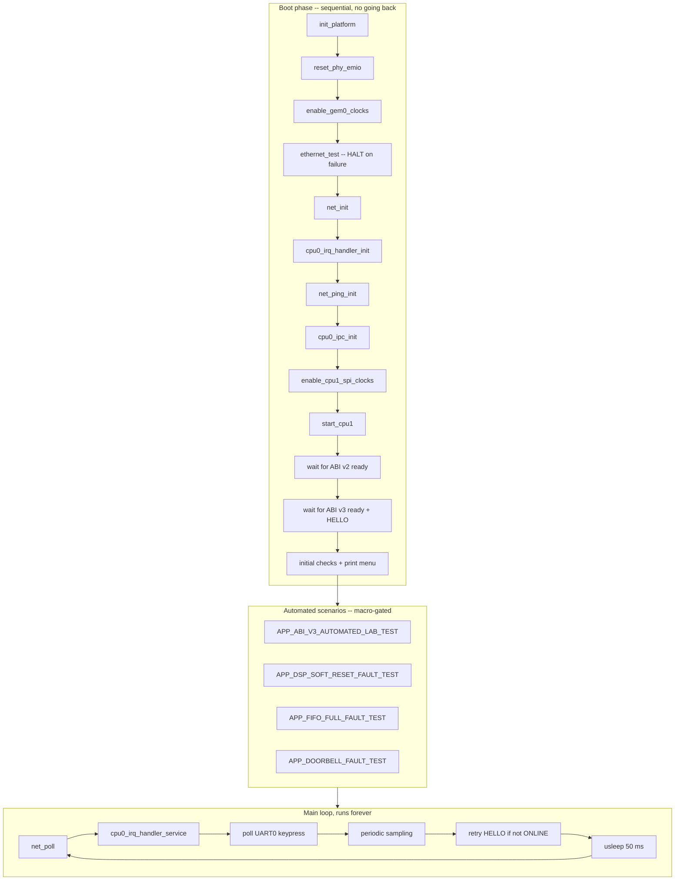
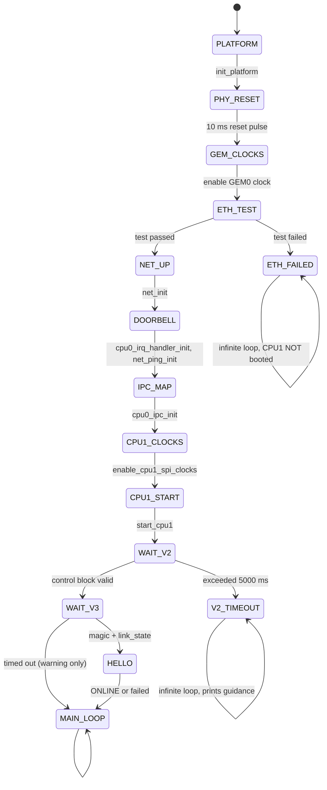
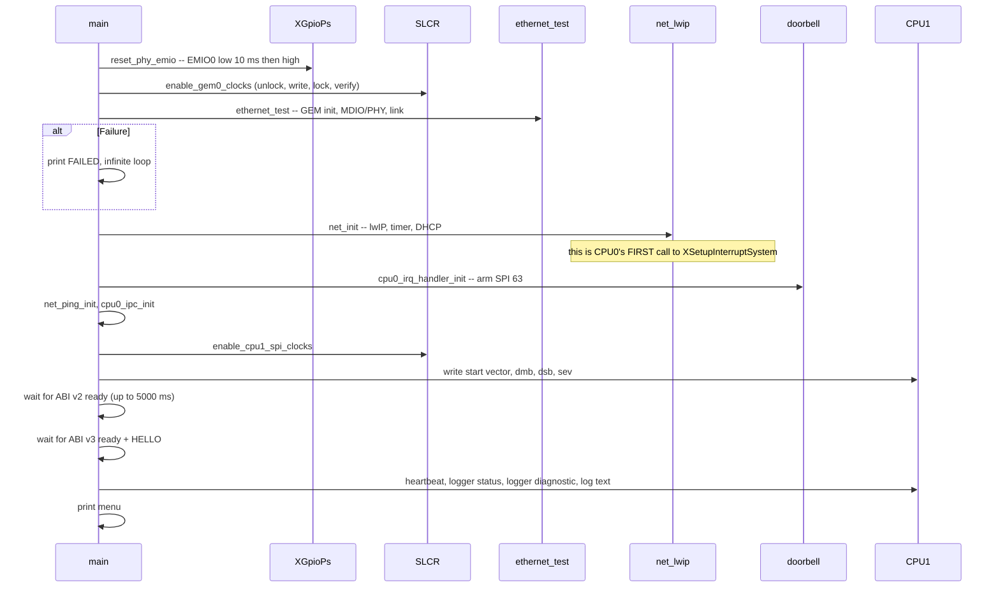
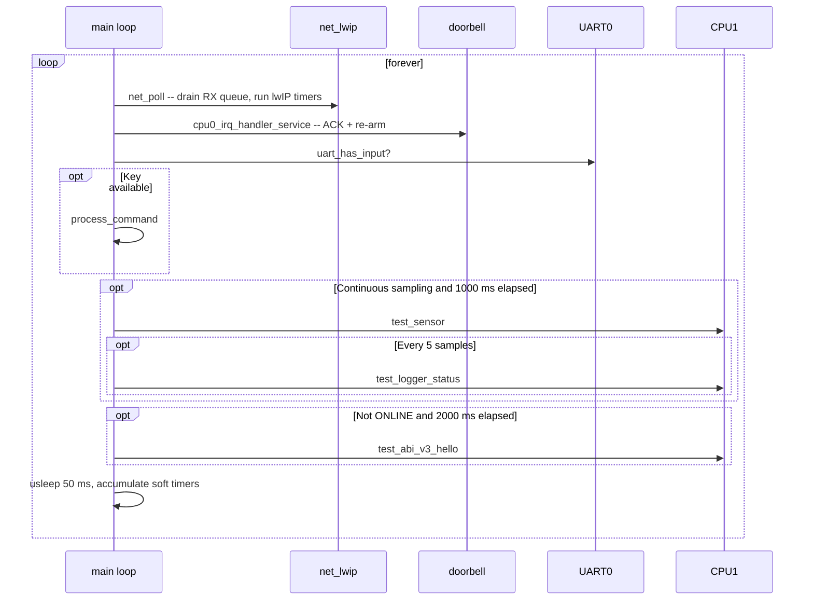
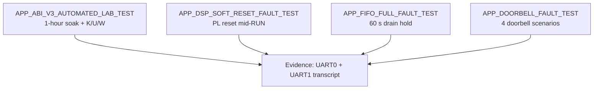
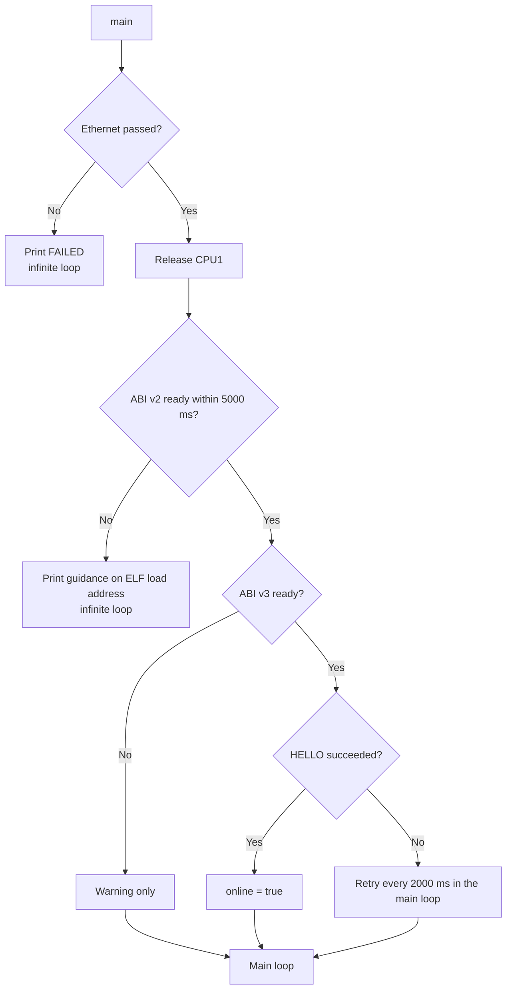

# SDD_11 — CPU0 Test Controller (CMP-C0-001)

**Document ID:** ZMPIO-SDD-11
**Component:** CMP-C0-001
**Level:** L2
**Source:** `firmware/cpu0_application/src/main.c`, `platform.c`

---

## 1. Purpose

In the target architecture, CPU0 runs Linux. This component **stands in** for Linux while the rest
of the system is developed and validated.

It performs four jobs that Linux will eventually do:

1. Enable peripheral clocks and boot CPU1.
2. Own the GIC distributor and the network stack.
3. Act as the host side of ABI v2 and ABI v3.
4. Provide an operator interface for issuing commands and reading status.

And one job that Linux will **not** do: run the automated fault-injection scenarios that generate
evidence for the acceptance gates.

## 2. Responsibility

### MUST

- Reset the PHY, enable the GEM0 clocks, and run the Ethernet test before anything else.
- Enable the SPI0 clock for CPU1 **before** releasing CPU1.
- Boot CPU1 via start-vector write + `SEV`.
- Wait for ABI v2 to become ready, then ABI v3, then perform the `HELLO` handshake.
- Periodically retry `HELLO` while not ONLINE.
- Match every ABI v2 reply by request id and discard mismatched ones.
- Service the doorbell every iteration of the main loop.
- Provide a command menu on UART0.
- Run fault-injection scenarios when enabled via macro.

### MUST NOT

- MUST NOT touch `axi_iic_0`, `spi0`, or the `zmpio_dsp_ctrl` MMIO.
- MUST NOT proceed when the Ethernet test fails.
- MUST NOT treat a timeout as proof a command was never executed.
- MUST NOT call anything that touches the GIC before `net_init()`.

## 3. Non-Responsibilities

| Not owned by this component | Owned by |
|---|---|
| Register-level Ethernet bring-up | CMP-NET-001 (SDD_12) |
| Ring semantics | CMP-IPC2-001, CMP-IPC3-001 |
| Doorbell registers | CMP-DB-001 (SDD_10) |
| All real-time peripherals | CMP-SEN-001, CMP-STO-001 (owned by CPU1) |

## 4. Dependencies



## 5. Architecture



**The order within the boot phase is not arbitrary.** Four real constraints apply:

| Constraint | Why |
|---|---|
| `reset_phy_emio()` before `ethernet_test()` | the PHY needs a reset pulse to leave its undefined state |
| `cpu0_irq_handler_init()` after `net_init()` | `net_init()` is CPU0's first call to `DoDistributorInit()` |
| `enable_cpu1_spi_clocks()` before `start_cpu1()` | without the clock, CPU1's memory card never answers CMD0 |
| ABI v2 waited on before ABI v3 | v2 is a precondition for every subsequent check |

## 6. Module Structure

| Module | ID | Role |
|---|---|---|
| Clock control | MOD-C0-001 | SLCR unlock, SPI0, GEM0, reset |
| CPU1 boot | MOD-C0-002 | start vector + `SEV` |
| ABI v2 client | MOD-C0-003 | `send_request`, `test_*` |
| ABI v3 client | MOD-C0-004 | `test_abi_v3_*` |
| User interface | MOD-C0-005 | menu, line reader, key dispatch |
| Diagnostic printing | MOD-C0-006 | translates codes to names |
| Automated scenarios | MOD-C0-007 | soak, fault injection, doorbell |

## 7. File Structure

### FILE-C0-001 — `main.c` (CPU0)

| Field | Value |
|---|---|
| Layer | application / composition root |
| Runtime owner | CPU0, bare-metal, single thread |

**MUST**

- Unlock SLCR right before, and re-lock immediately after, each clock change.
- Verify the clock bit after writing it and warn on mismatch.
- Halt entirely when Ethernet fails (do not proceed to CPU1/IPC).
- Assign a fresh `request_id` to every ABI v2 request.
- Wrap every test scenario in `#if defined(...)`.

**MUST NOT**

- MUST NOT touch CPU1's peripherals.
- MUST NOT leave SLCR unlocked.
- MUST NOT call `usleep()` with a large argument — see §12 ALG-C0-002.

## 8. Interfaces

### 8.1 UART0 command menu

| Key | Action | Channel |
|---|---|---|
| `h` | heartbeat | ABI v2 |
| `s` | one sensor sample | ABI v2 |
| `c` | toggle continuous sampling | local |
| `a` | logger status | ABI v2 |
| `d` | logger diagnostic | ABI v2 |
| `1` / `0` / `f` | LOG_START / STOP / FLUSH | ABI v2 |
| `l` | send an arbitrary log text | ABI v2 |
| `n` | network status | local |
| `g` | ping a host (IPv4 or hostname) | lwIP |
| `V` | ABI v3 link status | ABI v3 |
| `H` | re-run `HELLO` handshake | ABI v3 |
| `C` | valid `SET_DSP_CONFIG` (expects ACK) | ABI v3 |
| `X` | invalid `SET_DSP_CONFIG` (expects NACK) | ABI v3 |
| `K` | send a command with a corrupted CRC | ABI v3 lab |
| `U` | resend a stale `correlation_id` | ABI v3 lab |
| `W` | ring-wrap stress | ABI v3 lab |
| `?` | print menu | local |

**The four keys `K`/`U`/`W`/`X` are verification tools, not features.** They exist to demonstrate
four ABI v3 properties that cannot otherwise be observed: a corrupted CRC does not hang the ring,
duplicates are not applied twice, ring wrap works, and invalid parameters are correctly rejected.

### 8.2 FUNC-C0-001 — `send_request()`

**Identity**

| Field | Value |
|---|---|
| Signature | `static int send_request(msg_type_t type, const void *payload, uint32_t payload_length, ipc_message_t *reply)` |
| Blocking | YES, up to `CPU1_REPLY_TIMEOUT_MS` = 2000 ms |

**Parameters**

| Parameter | Direction | Constraint | Note |
|---|---|---|---|
| `type` | IN | `msg_type_t` | |
| `payload` | IN | non-`NULL` if `payload_length > 0` | copied |
| `payload_length` | IN | ≤ 240 | |
| `reply` | OUT | non-`NULL` | also used as scratch for discarded messages |

**Processing Steps**

```text
Step 1 -- Validate parameters
  payload_length > 240, or (length != 0 and payload == NULL)
  -> return CPU0_IPC_NOT_READY, send nothing

Step 2 -- Build message
  magic = IPC_MAGIC
  timestamp = next_request_id++          <- this IS the request id
  length = payload_length

Step 3 -- cpu0_ipc_send
  On failure -> return that error code immediately

Step 4 -- cpu0_ipc_wait_for_reply(request_id, reply, 2000 ms)
```

**Return Contract**

| Value | Meaning | Caller MUST |
|---|---|---|
| `CPU0_IPC_OK` | `*reply` is the matched reply | check the reply's `type` and `length` |
| `CPU0_IPC_TIMEOUT` | no reply within 2000 ms | report an error; **whether CPU1 processed it is unknown** |
| `CPU0_IPC_FULL` | RX ring is full | CPU1 is not consuming fast enough |
| `CPU0_IPC_NOT_READY` | bad parameters or CPU1 not up yet | fix the call or wait |

**Given / When / Then**

| Scenario | Given | When | Then |
|---|---|---|---|
| C0-001-01 normal | CPU1 running | send heartbeat | `OK`, ACK with `detail = 2` |
| C0-001-02 oversized payload | `length = 300` | send | `NOT_READY`, no transaction sent |
| C0-001-03 CPU1 dead | CPU1 halted | send | `TIMEOUT` after ~2000 ms |
| C0-001-04 stale reply | ring holds a stale reply | send | discarded with a log entry, then matched correctly |
| C0-001-05 boundary | `length = 240` | send | `OK` |
| C0-001-06 CPU1 resets mid-flight | reset after send | wait | `NOT_READY` once the control block loses validity |

### 8.3 FUNC-C0-002 — `enable_cpu1_spi_clocks()`

**Purpose:** enables the SPI0 clock that Linux would normally enable on its behalf (via
`clk_ignore_unused` and the `zmpio-enable-cpu1-clocks` service).

**Processing Steps**

```text
Step 1 -- Write the unlock key (0xDF0D) to SLCR_UNLOCK
Step 2 -- Read SPI_CLK_CTRL and APER_CLK_CTRL
Step 3 -- Set the SPI CLKACT bit and the SPI0 aperture bit
Step 4 -- Write the lock key (0x767B) to SLCR_LOCK
Step 5 -- Read both back and print the values
Step 6 -- If any bit is not set: print a WARNING (do not halt)
```

**Postconditions**

```text
Success: SPI0 has a clock; CPU1's memory card will answer CMD0
Failure: warning printed; CPU1 is still released, but the card will not come up
         -> the symptom will surface on the CPU1 side as an apparent card fault
```

**Why a warning only, not a halt:** the memory card is not a precondition for the rest of the system
to run. The trade-off: a fault mode that is easy to misdiagnose as a card or wiring problem. The
warning line is the only mitigation in place (LIM-C0-003).

### 8.4 FUNC-C0-003 — `start_cpu1()`

**Signature:** `static void start_cpu1(void)`

**Preconditions**

```text
- CPU1's ELF has ALREADY been loaded to 0x18000000 by Vitis/XSCT
  NOT VERIFIED HERE -- if not loaded, CPU1 will jump into garbage memory
- SPI0 clock is enabled
- BootROM is holding CPU1 in WFE
```

**Processing Steps**

```text
Step 1 -- Xil_Out32(0xFFFFFFF0, 0x18000000)
Step 2 -- dmb    (ensures the start-vector write reaches DDR before SEV)
Step 3 -- dsb
Step 4 -- sev    (wakes CPU1 from WFE)
```

**The three barrier instructions are required, not redundant:** `dmb` orders the write relative to
other observers; `dsb` guarantees it has completed; only then does `sev` signal the wakeup. If `sev`
were reordered ahead of the write, CPU1 would wake up and read a stale start vector.

**Postconditions:** CPU1 leaves `WFE` and jumps to `0x18000000`. There is no confirmation — the only
evidence is ABI v2 becoming valid within `CPU1_BOOT_TIMEOUT_MS`.

## 9. Data Structures

| Structure | Role |
|---|---|
| `next_request_id` | monotonic counter for the ABI v2 `header.timestamp` |
| `v3_link` (`cpu0_ipc_v3_link_t`) | `session_id`, `remote_layout_hash`, `online` |
| `continuous_sensor_enabled` | switch for periodic sampling |
| `elapsed_since_sample_ms`, `elapsed_since_v3_hello_ms` | soft timers, accumulated 50 ms per loop |
| `log_line[241]`, `ping_target[64]` | static input buffers |

**The soft timers are estimates, not a clock.** They add `UART_POLL_INTERVAL_MS` per loop iteration
without accounting for how long the operations within that iteration actually took. A blocking
`net_ping_host()` call that takes several seconds will make them drift behind wall-clock time.
Acceptable for a test controller (LIM-C0-004).

## 10. State Machine

### STATE-C0-001 — Boot lifecycle



**Two permanent halts and one warning-only path — the distinction is deliberate:**

| Condition | Behavior | Reason |
|---|---|---|
| Ethernet fails | **halt permanently** | isolates Ethernet from CPU1/IPC/SPI; continuing would let an Ethernet fault masquerade as an IPC fault |
| ABI v2 not ready | **halt permanently** | every subsequent check depends on it; prints guidance to check the ELF load address |
| ABI v3 not ready | **warning only** | v3 is additive; v2 must still work on its own |

## 11. Runtime Sequence

### 11.1 Full boot sequence



### 11.2 Main loop



**Why `HELLO` is retried periodically:** the boot-time `HELLO` is a single attempt. If CPU1 has not
progressed far enough through its own boot to reply within that window — or if it crashes or resets
afterward — `v3_link.online` would otherwise stay `false` forever, with nothing to retry it short of
manually pressing `H`. This matters in particular for the outer retry loop of the JTAG bring-up
script, which only resets and reloads CPU1 without reloading CPU0.

### 11.3 Three fault-injection scenarios



All four run **after** the menu is printed and **before** the main loop, sequentially. Each scenario
prints its own delta — that is the evidence, not a self-reported pass/fail summary.

**The `FIFO_FULL_INJECT` scenario requires a 60 s hold** because the 64-deep FIFO needs roughly 41 s
to fill at a production rate of ~1.56 frames/s (SDD_06 §15). 60 s gives about a 46% margin.

## 12. Algorithms

### ALG-C0-001 — SLCR clock-change sequence

```text
write 0xDF0D to SLCR_UNLOCK
read current value
write value | bit_to_enable
write 0x767B to SLCR_LOCK
read back and verify
if mismatch: print WARNING
```

**Three required properties:**

1. **Read-modify-write**, never overwrite the whole register — other bits belong to other
   peripherals.
2. **Re-lock immediately**, do not leave SLCR unlocked across other operations.
3. **Verify after writing** — SLCR silently ignores writes while locked, so without verification a
   sequencing bug would be completely invisible.

### ALG-C0-002 — Chunked `usleep`

```text
sleep_seconds_chunked(seconds):
    for i in 0..seconds-1:
        usleep(1000 x 1000)
```

**Why this exists:** a single `usleep()` call with a large argument (e.g. the 300 s soak step =
300,000,000 µs) was observed on real hardware to **never return**. One full ~65-minute soak run
produced exactly one AUTOTEST log line (the first, printed before the first `usleep(300 s)` call),
and the ABI v3 command ring made no further progress for the rest of that hour — even though ONLINE
remained true throughout.

Splitting the delay into many short calls avoids some precision/overflow limitation of `usleep()` on
this platform. **The root cause has not been identified**; this is a verified workaround, not a fix
(LIM-C0-005).

Two other fault-test functions repeat this loop inline rather than calling the helper, because the
helper is defined behind the `APP_ABI_V3_AUTOMATED_LAB_TEST` macro and they must be able to run
independently.

### ALG-C0-003 — Diagnostic code translation

CPU0 contains four lookup tables that translate numeric codes into human-readable names:

| Table | Entries | Source |
|---|---:|---|
| `logger_diagnostic_stage_name` | 18 | `ipc_logger_diagnostic_stage_t` |
| `fatfs_result_name` | 20 | FatFs `FRESULT` |
| `sd_spi_diagnostic_name` | 14 | `sd_spi_diagnostic_t` |
| `sd_spi_detail_reason_name` | 6 | `ipc_sd_spi_detail_reason_t` |

Each table bounds-checks the index before the lookup and returns `"unknown"` past the boundary — so
a newer CPU1 ELF with additional codes prints `"unknown"` rather than reading out of bounds.

**These are four hand-maintained copies of the enums in `common/`.** No mechanism keeps them in
sync. Adding an enum value without updating the corresponding table makes the diagnostic print
`"unknown"` — a graceful degradation, but still drift (LIM-C0-002).

## 13. Error Handling

| Error | Class | Detection | Action | Recovery |
|---|---|---|---|---|
| Ethernet fails | E6 | return code | print FAILED, **infinite loop** | none — requires intervention |
| CPU1 does not come up | E4 | 5000 ms timeout | print guidance, **infinite loop** | none |
| ABI v3 not ready | E4 | 5000 ms timeout | warning only | periodic `HELLO` retry |
| `HELLO` fails | E4/E7 | return code | log | retry every 2000 ms |
| `layout_hash` mismatch | E7 | hash comparison | print both values, `online = false` | both sides must be rebuilt |
| ABI v2 timeout | E4 | 2000 ms timeout | print error code | manual retry |
| Mismatched reply | E5 | id comparison | discard with log | continue polling |
| Clock verification fails | E6 | readback | print WARNING, **continue** | none |
| `XGpioPs` init fails | E6 | return code | print WARNING, return | none |

**Boot-phase error flow**



**Why Ethernet is a hard gate:** a comment in the code states it plainly — *"CPU1/IPC is
intentionally NOT started yet. This isolates Ethernet from CPU1/IPC/SPI."* If both ran while
Ethernet was broken, the symptoms would blend together and diagnosis would become much harder. The
cost: CPU1 cannot be tested while Ethernet is broken (LIM-C0-001).

## 14. Concurrency

CPU0 is **bare-metal, single-threaded**. There are only two execution contexts:

| Context | Runs | Synchronization |
|---|---|---|
| Main loop | everything | none needed |
| Doorbell ISR | sets three `volatile` variables | `volatile`, aligned word |
| lwIP timer ISR | increments the tick counter, sets TCP flags | `volatile` |

There are no locks, and none are needed. The only barrier sequence is the one in `start_cpu1()`.

**Two blocking paths worth knowing about:**

| Function | Blocks for | Effect |
|---|---|---|
| `net_ping_host()` | up to `count x 1000 ms` | blocks the menu and doorbell servicing |
| `uart_read_line()` | until a newline arrives | blocks **everything** |

`uart_read_line()` is a genuinely blocking loop: it spins waiting for characters and never calls
`net_poll()` or `cpu0_irq_handler_service()`. While a user is typing, the network goes unserviced.
Acceptable for a test controller, but worth knowing (LIM-C0-006).

## 15. Timing

| Quantity | Value |
|---|---:|
| Main loop cadence | 50 ms |
| Sampling period | 1000 ms |
| Status print period | every 5 samples = 5000 ms |
| `HELLO` retry cadence | 2000 ms |
| ABI v2 reply timeout | 2000 ms |
| ABI v3 timeout per attempt | 500 ms x 5 attempts |
| CPU1 wait timeout | 5000 ms |
| PHY reset pulse | 10 ms |
| Soak step | 300 s (default) |
| Total soak duration | 3600 s |

## 16. Resource / Memory Usage

| Resource | Usage |
|---|---:|
| Static input buffers | 241 + 64 bytes |
| `ipc_message_t` on stack | 256 bytes per frame |
| `v3_link` | 12 bytes |
| MMIO | SLCR, GPIO, UART0, GEM0, doorbell |
| GIC | SPI 63 (doorbell) + SCU timer (lwIP) |

## 17. Configuration

| Constant | Value | Meaning |
|---|---:|---|
| `CPU1_ENTRY_ADDR` | `0x18000000` | must match CPU1's linker script |
| `CPU1_BOOT_TIMEOUT_MS` | 5000 | wait for CPU1 |
| `CPU1_REPLY_TIMEOUT_MS` | 2000 | per v2 transaction |
| `SENSOR_PERIOD_MS` | 1000 | sampling cadence |
| `STATUS_PERIOD_SAMPLES` | 5 | status print cadence |
| `UART_POLL_INTERVAL_MS` | 50 | main loop cadence |
| `PHY_RESET_EMIO_PIN` | 0 | EMIO0 = ETH_nRST |
| `PHY_RESET_LOW_MS` | 10 | pulse width |
| `ZMPIO_V3_*_MAX_ATTEMPTS` / `_TIMEOUT_MS` | 5 / 500 | v3 retry |
| `ZMPIO_V3_HELLO_RETRY_PERIOD_MS` | 2000 | retry cadence in the main loop |
| `GEM0_CLK_VAL` | `0x00100141` | matches `ps7_init_gpl.c` |
| `APP_ABI_V3_SOAK_TOTAL_S` / `_STEP_S` | 3600 / 300 | overridable for smoke testing |
| `APP_*_FAULT_TEST` | disabled in the committed build | enabled when collecting evidence |

**Operational rule:** every `APP_*_FAULT_TEST` macro must be **disabled again** after evidence has
been collected. A production build that leaves them enabled will run fault injection on every boot.

## 18. Logging / Debug

All logging goes to UART0, tagged by source:

| Prefix | Meaning |
|---|---|
| `CPU0:` | normal operation |
| `NET:` | lwIP |
| `ETH:` | Ethernet test |
| `PING:` | ICMP/DNS |
| `AUTOTEST[...]:` | automated soak scenario |
| `FAULTTEST:` | fault injection |
| `DOORBELLTEST:` | doorbell scenario |

**Diagnostic table**

| Symptom | Diagnosis |
|---|---|
| Halts at `Ethernet test FAILED` | wiring, PHY, or GEM0 clock |
| Halts at `CPU1 did not initialize IPC` | CPU1 ELF not loaded, wrong address, or an early CPU1 crash |
| `ABI v3 CPU1_READY not observed` | CPU1 is running but `ipc_v3_init()` has not finished |
| `layout_hash MISMATCH` | only one side was rebuilt |
| `WARNING SPI0 clock enable verification failed` | SLCR was re-locked too early, or a register mismatch |
| Persistent `mounted=0` in logger status | a memory-card issue on the CPU1 side — press `d` for diagnostics |
| `unknown` in a diagnostic stage name | CPU0's lookup table is out of sync with the enum |

## 19. Verification

| Test | Verifies | Evidence |
|---|---|---|
| TEST-SYS-003 | CPU1 boot | ABI v2 becomes valid |
| TEST-IPC-001 | v2 transactions | heartbeat/status/sensor |
| TEST-IPC-003..008 | v3 properties | keys `V/H/C/X/K/U/W` |
| TEST-IPC-013 | 1-hour soak | AUTOTEST log |
| TEST-RT-005, TEST-RT-006 | fault injection | FAULTTEST log + UART1 |
| TEST-DB-001..004 | doorbell | DOORBELLTEST log |
| TEST-NET-001 | network | keys `n`, `g` |

## 20. Known Limitations

| ID | Limitation | Impact | Mitigation |
|---|---|---|---|
| LIM-C0-001 | Ethernet is a hard gate | CPU1 cannot be tested while the network is broken | deliberate — isolates diagnosis |
| LIM-C0-002 | Four lookup tables are hand-maintained enum copies | drift when new codes are added | prints `"unknown"`, graceful degradation |
| LIM-C0-003 | Clock failure is warning-only | symptom surfaces late, on the CPU1 side, as an apparent card fault | warning line |
| LIM-C0-004 | Soft timers are estimates | drift under long blocking operations | acceptable for a test controller |
| LIM-C0-005 | `usleep` with a large argument never returns | root cause unidentified | chunking (ALG-C0-002) |
| LIM-C0-006 | `uart_read_line()` blocks everything | network unserviced while typing | interactive input only |
| LIM-C0-007 | CPU1 ELF load is not verified | `SEV` into garbage memory if not loaded | caught by the ABI v2 timeout |
| LIM-C0-008 | Test code lives in the production binary | must remember to disable macros | wrapped in `#if defined(...)` |
| LIM-C0-009 | Not Linux | GAP-001 — the production branch still differs | ABI is stable enough for the transition |

## 21. Traceability

| REQ | Design | FUNC | TEST |
|---|---|---|---|
| REQ-SYS-003 | §11.1 | FUNC-C0-002, FUNC-C0-003 | TEST-SYS-003 |
| REQ-SYS-002 | §2 MUST NOT | — | TEST-SYS-002 |
| REQ-IPC-001 | §8.2 | FUNC-C0-001 | TEST-IPC-001 |
| REQ-IPC-006 | delegated to SDD_05 | — | TEST-IPC-006 |
| REQ-IPC-007 | §13 | — | TEST-IPC-007 |
| REQ-RT-005 | §11.3 | — | TEST-RT-005, TEST-RT-006 |
| REQ-IPC-009 | §11.2 | — | TEST-DB-004 |
| REQ-NET-001 | §11.1 | — | TEST-NET-001 |
| REQ-OPS-001 | §11.3, §18 | — | all |
