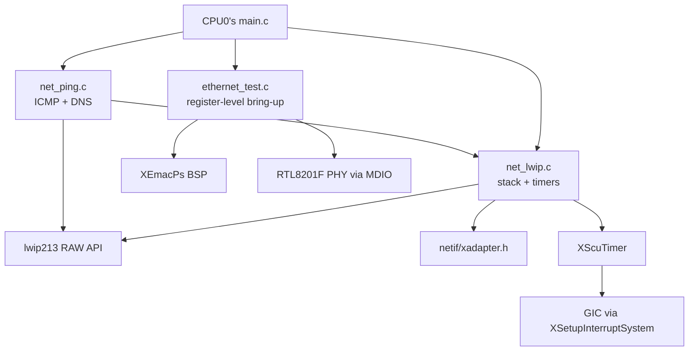
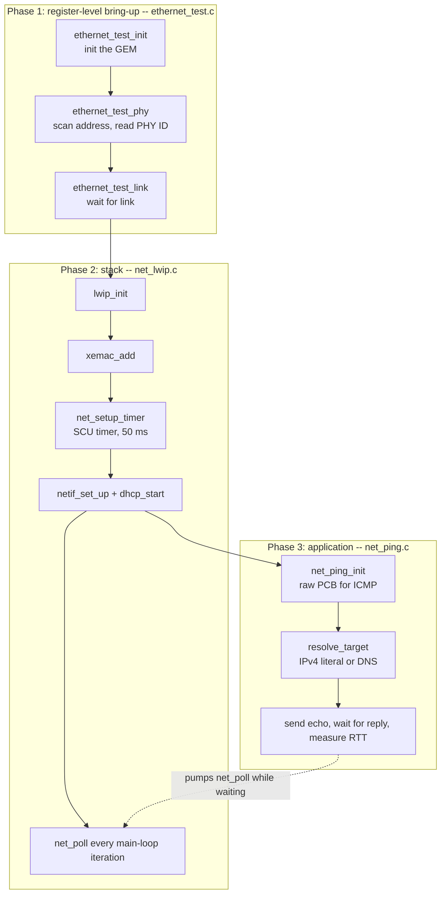
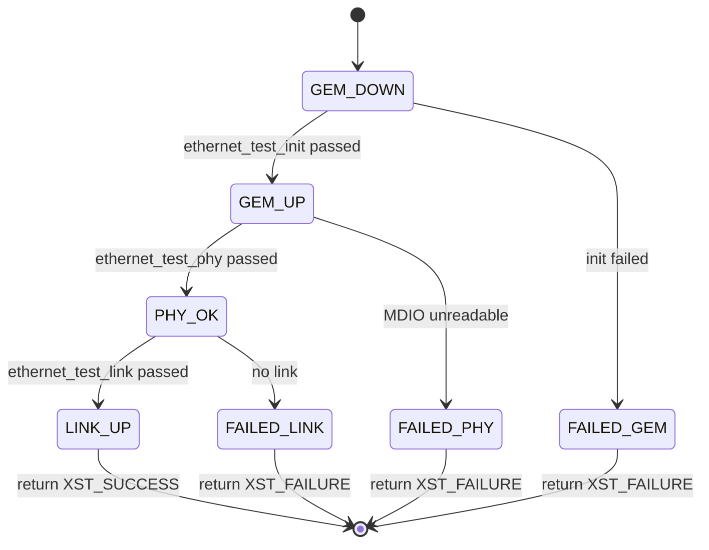
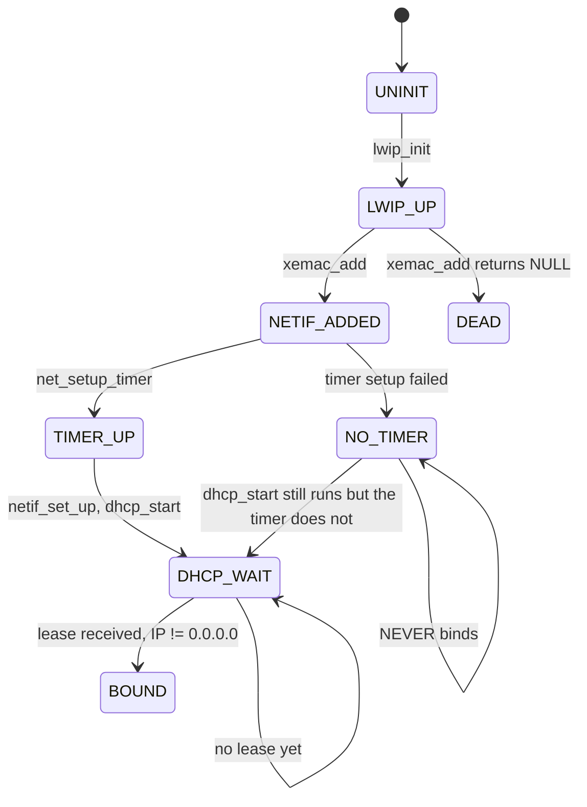
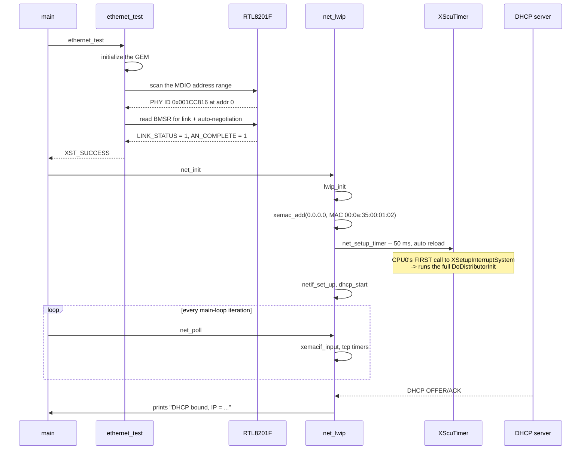
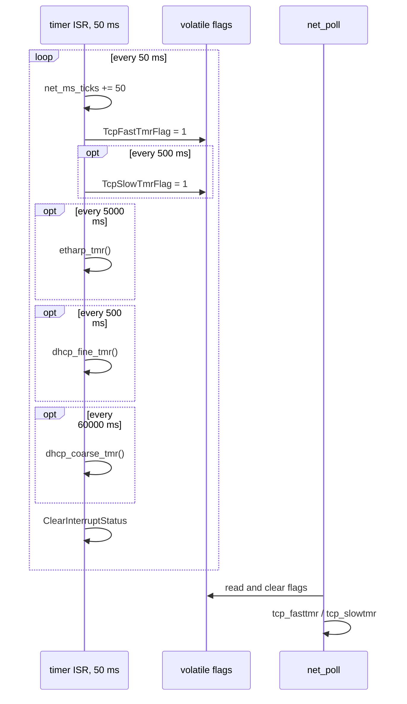
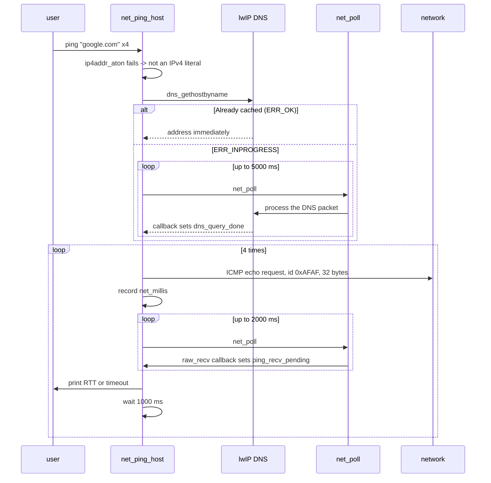
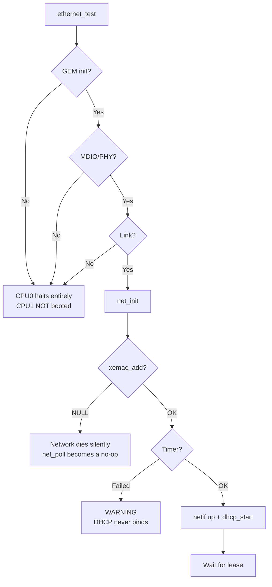

# SDD_12 — Ethernet GEM0, RTL8201F PHY, and lwIP (CMP-NET-001)

**Document ID:** ZMPIO-SDD-12
**Component:** CMP-NET-001
**Level:** L2
**Source:** `firmware/cpu0_application/src/ethernet_test.{c,h}`, `net_lwip.{c,h}`, `net_ping.{c,h}`

---

## 1. Purpose

This component brings up GEM0 and the RTL8201F PHY to link, runs the lwIP stack in RAW API mode
with DHCP, and provides ICMP echo with DNS resolution.

In the target architecture, all of this is Linux's job. This component exists for two reasons:

1. **To prove the hardware path works** — MDIO, PHY, RMII, MAC DMA — before PetaLinux enters the
   picture. A fault at this layer is very hard to isolate from a Linux driver fault if both are new
   at the same time.
2. **To act as a system-wide gate** in CPU0's `main.c`: if the network is broken, CPU1 is not
   booted, so symptoms do not blend together.

## 2. Responsibility

### MUST

- Initialize GEM0 and verify that MDIO can read/write PHY registers.
- Scan for the real PHY address rather than trusting the schematic strap.
- Bring the link up and confirm it via the PHY's status register.
- Initialize the lwIP RAW API, attach `xemac`, and run DHCP.
- Drive lwIP's periodic timers itself (this port has no `sys_check_timeouts()`).
- Provide ICMP echo with RTT measurement and DNS resolution.

### MUST NOT

- MUST NOT proceed to the rest of the system when the test fails.
- MUST NOT assume a PHY address.
- MUST NOT block the main loop longer than the duration a user command requests.
- MUST NOT make any GIC-touching call other than the timer's `XSetupInterruptSystem()`.

## 3. Non-Responsibilities

| Not owned by this component | Owned by |
|---|---|
| Upper-layer protocols (TCP server, HTTP) | does not exist |
| Streaming ZLOG data over the network | does not exist yet (GAP-006) |
| Ethernet under PetaLinux | out of scope here |
| Boot orchestration | CMP-C0-001 (SDD_11) |

## 4. Dependencies



**`net_init()` is CPU0's first call to `XSetupInterruptSystem()`** — the call that runs the full
`DoDistributorInit()`. That is why `cpu0_irq_handler_init()` must come after it (SDD_10 §12
ALG-DB-003), and it is also the direct root cause of BUG-006 as seen from the CPU1 side.

## 5. Architecture



**Separating hardware bring-up from the software stack is the main structural decision.**
`ethernet_test.c` knows nothing about lwIP; it only proves MDIO/PHY/link works. If it passes and
lwIP still has no IP, the fault is necessarily at the software layer — one test cuts the search
space in half.

## 6. Module Structure

| Module | ID | File | Role |
|---|---|---|---|
| Hardware bring-up | MOD-NET-001 | `ethernet_test.c` | GEM init, MDIO, PHY scan, link |
| Stack and timers | MOD-NET-002 | `net_lwip.c` | lwIP, `xemac`, periodic timers, DHCP |
| ICMP and DNS | MOD-NET-003 | `net_ping.c` | echo, RTT measurement, name resolution |

## 7. File Structure

### FILE-NET-001 — `ethernet_test.c`

**MUST**

- Scan the entire MDIO address range for the real PHY, not trust the schematic strap.
- Read `PHYID1`/`PHYID2` and print them for identification.
- Check `BMSR.LINK_STATUS` and `BMSR.AN_COMPLETE` rather than just waiting a fixed time.
- Return immediately at the first failing step, with a message identifying which step.

**MUST NOT**

- MUST NOT initialize lwIP or anything belonging to the software layer.
- MUST NOT proceed to the next step once a step has failed.

**Note embedded in the code:** `ETH_PHY_ADDR = 0` carries the comment *"confirmed via MDIO scan
2026-08-16: PHY ID 0x001CC816 at addr 0, not 1 as schematic strap implied"*. This is precisely why
the scanning routine exists — the schematic was wrong, and only an actual scan could catch it.

### FILE-NET-002 — `net_lwip.c`

**MUST**

- Drive `tcp_fasttmr`, `tcp_slowtmr`, `etharp_tmr`, `dhcp_fine_tmr`, `dhcp_coarse_tmr` itself.
- Only set flags inside the timer ISR; the actual work happens in `net_poll()`.
- Provide `net_millis()` as the time source for the modules above.

**MUST NOT**

- MUST NOT call heavy lwIP functions from inside an ISR (exception: `etharp_tmr()` and
  `dhcp_*_tmr()` are called directly — see LIM-NET-003).

**Why the timers must be driven manually:** this build of the lwip213 RAW API port
(`sys_arch_raw.c`) does **not** implement `sys_now()`/`sys_check_timeouts()`. The application is
expected to drive lwIP's periodic timers itself. The pattern follows Xilinx's reference
`platform_zynq.c`, adapted to the SDT interrupt API (`XSetupInterruptSystem`) this project uses
instead of the classic `XScuGic_DeviceInitialize` flow.

### FILE-NET-003 — `net_ping.c`

**MUST** pump `net_poll()` in every wait loop (both the reply wait and the DNS wait); **MUST** apply
a timeout to both.

**MUST NOT** block longer than `count x PING_INTERVAL_MS` plus the timeout.

## 8. Interfaces

### 8.1 Public API

| Function | Blocking | Returns |
|---|---|---|
| `ethernet_test()` | YES, up to a few seconds | `XST_SUCCESS` / `XST_FAILURE` |
| `ethernet_test_init/phy/link()` | YES | as above |
| `net_init()` | no | void |
| `net_poll()` | NO | void |
| `net_print_status()` | no | void |
| `net_get_netif()` | no | `struct netif *` or `NULL` |
| `net_millis()` | no | `u32_t` |
| `net_ping_init()` | no | void |
| `net_ping_host(target, count)` | **YES**, up to `count` seconds + timeout | number of replies received |

### 8.2 FUNC-NET-001 — `ethernet_test()`

**Identity**

| Field | Value |
|---|---|
| Signature | `int ethernet_test(void)` |
| Blocking | YES |
| Context | CPU0's `main()`, before everything else |

**Purpose:** proves the Ethernet hardware path works, through three isolated steps.

**Preconditions**

```text
- reset_phy_emio() has run (PHY has left reset)
- enable_gem0_clocks() has run (GEM0 has a clock and reset has been released)
```

**Processing Steps**

```text
Step 1 -- ethernet_test_init: initialize the GEM
  Failure: print "GEM initialization FAILED", return immediately
  Meaning: the MAC controller did not come up -> clock or configuration fault

Step 2 -- ethernet_test_phy: MDIO and PHY registers
  Scan addresses, read PHYID1/PHYID2
  Failure: print "PHY / MDIO test FAILED", return immediately
  Meaning: the MAC came up but cannot talk to the PHY -> MDIO fault,
           PHY power, or PHY reset issue

Step 3 -- ethernet_test_link: wait for link
  Check BMSR.LINK_STATUS and AN_COMPLETE
  Failure: print "LINK test FAILED", return immediately
  Meaning: the PHY came up but has no link -> cable, switch, or the far end

Step 4 -- print "ETHERNET BASIC TEST PASS"
```

**The three isolated steps are the whole diagnostic value of this function.** Each step rules out
one class of cause, so the failure message is itself a diagnosis, not just an error report.

**Return Contract**

| Value | Meaning | Caller MUST |
|---|---|---|
| `XST_SUCCESS` | all three steps passed | proceed to `net_init()` |
| `XST_FAILURE` | one step failed (which step was printed) | **halt entirely** — do not boot CPU1 |

**Given / When / Then**

| Scenario | Given | When | Then |
|---|---|---|---|
| NET-001-01 normal | cable plugged in, switch active | call | `XST_SUCCESS`, prints PASS |
| NET-001-02 cable unplugged | no link | call | fails at step 3, prints "LINK test FAILED" |
| NET-001-03 PHY unpowered | dead PHY | call | fails at step 2, prints "PHY / MDIO test FAILED" |
| NET-001-04 GEM0 clock not enabled | forgot `enable_gem0_clocks()` | call | fails at step 1 |
| NET-001-05 PHY at a different address | PHY at an unexpected address | call | scan finds it, step 2 still passes |

### 8.3 FUNC-NET-002 — `net_setup_timer()`

**Purpose:** configures the SCU private timer as a 50 ms tick source for lwIP's periodic timers.

**Processing Steps**

```text
Step 1 -- XScuTimer_LookupConfig, CfgInitialize
Step 2 -- EnableAutoReload
Step 3 -- LoadTimer((XPAR_CPU_CORE_CLOCK_FREQ_HZ / 8) x 50 / 250)
Step 4 -- XSetupInterruptSystem for the timer's callback
Step 5 -- EnableInterrupt, Start
```

**Reload formula:** the SCU private timer runs at `CPU_CLK/2` (ARM Cortex-A9 MPCore TRM).
`XPAR_CPU_CORE_CLOCK_FREQ_HZ / 8` is exactly `(CPU_CLK/2) x 0.25 s` — the 250 ms divisor already
proven in Xilinx's reference `platform_zynq.c`. The formula here scales that ratio down to
`NET_TIMER_PERIOD_MS` = 50 ms.

**Why CPU0's SCU timer rather than the global timer:** the global timer is a resource shared with
CPU1 and Linux (SDD_01 §15.1). The SCU private timer is per-core, so using it introduces no
cross-core constraint.

**Postconditions**

```text
Success: net_ms_ticks advances every 50 ms; lwIP timers run on schedule
Failure: prints "timer setup failed"; net_init() STILL proceeds
         -> the DHCP/ARP/TCP timers never run -> IP is never obtained
```

**This is a notable failure mode:** `net_init()` does not halt when the timer setup fails. The
system continues with an up netif but no timers running — the symptom is "DHCP never binds," which
is easily misdiagnosed as an external network problem (LIM-NET-002).

### 8.4 FUNC-NET-003 — `net_poll()`

**Identity**

| Field | Value |
|---|---|
| Signature | `void net_poll(void)` |
| Blocking | NO |
| Context | CPU0's main loop, and the wait loops inside `net_ping.c` |

**Processing Steps**

```text
Step 1 -- If active_netif == NULL: return immediately
Step 2 -- xemacif_input(netif) -- drains GEM0's RX queue
Step 3 -- If TcpFastTmrFlag: tcp_fasttmr(), clear the flag
Step 4 -- If TcpSlowTmrFlag: tcp_slowtmr(), clear the flag
Step 5 -- If not yet logged and IP != 0.0.0.0: print "DHCP bound, IP = ..."
```

**Contract with the caller:** must be called **frequently**. If it goes uncalled for too long,
GEM0's RX queue fills and packets are dropped. This is why `net_ping_host()` and `resolve_target()`
pump `net_poll()` in their own wait loops instead of merely sleeping.

**Given / When / Then**

| Scenario | Given | When | Then |
|---|---|---|---|
| NET-003-01 normal | netif up, packet arriving | call | packet processed, timers run |
| NET-003-02 not yet initialized | `net_init()` has not run | call | returns immediately, no crash |
| NET-003-03 DHCP bind | lease just received | call | prints the IP **exactly once** |
| NET-003-04 long gap without a call | 5 seconds uncalled | call again | the RX queue may have overflowed, packets lost |

### 8.5 FUNC-NET-004 — `net_ping_host()`

**Signature:** `int net_ping_host(const char *target, int count)`

**Parameters**

| Parameter | Direction | Constraint | Note |
|---|---|---|---|
| `target` | IN | `\0`-terminated string | dotted IPv4 **or** a hostname |
| `count` | IN | ≥ 1 | number of echo requests |

**Processing Steps**

```text
Step 1 -- resolve_target()
  1a. Try ip4addr_aton() -- if it's an IPv4 literal, done immediately
  1b. dns_gethostbyname()
      ERR_OK        -> already cached, the callback NEVER fires
      ERR_INPROGRESS-> pump net_poll() until DNS_TIMEOUT_MS = 5000 ms
      other         -> print error, return 0

Step 2 -- For each of count iterations:
  send an ICMP echo request (id = 0xAFAF, 32 bytes of data)
  record net_millis()
  pump net_poll() until PING_TIMEOUT_MS = 2000 ms or a reply arrives
  print the RTT or a timeout
  wait PING_INTERVAL_MS = 1000 ms before the next iteration

Step 3 -- Return the number of replies received
```

**Key detail in step 1b:** when `dns_gethostbyname()` returns `ERR_OK`, the name is already cached
and the callback **will never fire**. Waiting for the callback in that case would wait forever. The
code handles this correctly by fetching the result immediately.

**Why `net_poll()` must be pumped in the wait loop:** the DNS callback runs on lwIP's normal call
path, not from an ISR. Without pumping, the response packet is never processed and the callback is
never invoked — a perfect deadlock.

**Return Contract**

| Value | Meaning |
|---|---|
| `0` | name could not be resolved, or no replies received |
| `1..count` | number of replies received |

**Given / When / Then**

| Scenario | Given | When | Then |
|---|---|---|---|
| NET-004-01 IPv4 literal | `"192.168.1.1"` reachable | ping 4 times | returns 4, prints each RTT |
| NET-004-02 hostname | DHCP supplied a DNS server | ping `"google.com"` | resolves then pings, returns the reply count |
| NET-004-03 nonexistent host | bad name | ping | prints "DNS lookup timed out" after 5000 ms, returns 0 |
| NET-004-04 host does not reply | valid IP but ICMP blocked | ping 4 times | 4 timeouts, returns 0 |
| NET-004-05 no DNS yet | DHCP has not bound | ping a hostname | lookup fails, returns 0 |
| NET-004-06 boundary | `count = 1` | ping | one request, at most 2000 ms |

## 9. Data Structures

| Structure | Role |
|---|---|
| `server_netif` (`struct netif`) | lwIP interface, static |
| `active_netif` | pointer, `NULL` until `xemac_add()` succeeds |
| `net_timer` (`XScuTimer`) | 50 ms tick source |
| `net_ms_ticks` | free-running millisecond counter, `volatile` |
| `TcpFastTmrFlag`, `TcpSlowTmrFlag` | flags set in the ISR, `volatile` |
| `net_dhcp_bound_logged` | prevents duplicate printing |
| `ping_pcb` | raw PCB for ICMP |
| `ping_recv_seqno`, `ping_recv_pending` | reply-receive state, `volatile` |
| `dns_query_done`, `dns_query_ok`, `dns_query_addr` | DNS lookup state, `volatile` |

Every variable shared between an ISR and the main loop is `volatile`. On bare-metal, single-threaded
hardware with aligned word access, that is sufficient.

**The MAC address is a hard-coded constant:** `00:0a:35:00:01:02`. This is Xilinx's OUI range with
arbitrary trailing bytes. Two boards running concurrently on the same LAN will collide (LIM-NET-005).

## 10. State Machine

### STATE-NET-001 — Hardware bring-up



### STATE-NET-002 — Stack lifecycle



The `NO_TIMER` branch is the failure mode described in LIM-NET-002: netif up, DHCP started, but no
timer runs to advance DHCP's state machine.

## 11. Runtime Sequence

### 11.1 Full bring-up



### 11.2 Timer cadence



**Notable asymmetry:** `etharp_tmr()` and `dhcp_*_tmr()` are called **directly inside the ISR**,
while `tcp_fasttmr()`/`tcp_slowtmr()` only set flags and run in `net_poll()`. This is the code's
actual behavior, and it departs from the reference pattern by not deferring ARP/DHCP work. They are
significantly lighter than the TCP timers, but it is still lwIP work running in interrupt context
(LIM-NET-003).

### 11.3 Ping with DNS resolution



## 12. Algorithms

### ALG-NET-001 — PHY address scan

**Problem:** the schematic strap says the PHY is at address 1; in reality it is at address 0.

```text
for addr in the MDIO address range:
    read PHYID1 and PHYID2
    if the value is valid (not 0x0000 or 0xFFFF):
        record addr and the PHY ID, return success
return failure
```

**Why scan instead of trusting the configuration:** confirmed on real hardware on 2026-08-16 — PHY
ID `0x001CC816` sits at address 0, not 1. A hard-coded constant would have made the entire bring-up
fail with the symptom "MDIO unreadable," with no hint of the actual cause.

**Boundary condition:** both `0x0000` and `0xFFFF` mean "nothing here" on MDIO — the bus floats high
or low when no device answers.

### ALG-NET-002 — Self-driven periodic timer cadence

```text
Every 50 ms inside the ISR:
    net_ms_ticks += 50
    TcpFastTmrFlag = 1                              # 250 ms in standard lwIP
    tcp_slow_acc += 50;  if >= 500:  TcpSlowTmrFlag = 1
    arp_acc      += 50;  if >= 5000: etharp_tmr()
    dhcp_fine_acc += 50; if >= 500:  dhcp_fine_tmr()
    dhcp_coarse_acc += 50; if >= 60000: dhcp_coarse_tmr()
```

**Why this is necessary:** the lwip213 RAW API port (`sys_arch_raw.c`) implements neither
`sys_now()` nor `sys_check_timeouts()`. Without this layer, DHCP never advances, the ARP cache never
expires, and TCP retransmission never runs.

**Complexity:** `O(1)` per tick, five accumulators.

### ALG-NET-003 — Pumped wait loop

```text
start = net_millis()
while !condition:
    net_poll()                    <- REQUIRED
    if net_millis() - start >= timeout:
        report timeout, exit
```

This pattern appears in both `resolve_target()` and the ping reply wait loop. It is **required**,
not an optimization: lwIP callbacks only run on the normal call path (via `xemacif_input()` inside
`net_poll()`), never from an ISR. An unpumped wait loop is a guaranteed deadlock.

**Boundary condition:** `net_millis()` is a `u32_t` incremented by 50 per tick — it wraps after
roughly 49.7 days. Unsigned subtraction handles the wrap boundary correctly.

## 13. Error Handling

| Error | Class | Detection | Action | Recovery |
|---|---|---|---|---|
| GEM init fails | E6 | return code | print the step, return `XST_FAILURE` | CPU0 halts entirely |
| MDIO unreadable | E6 | scan failed | print the step | CPU0 halts entirely |
| No link | E6 | `BMSR` | print the step | CPU0 halts entirely |
| `xemac_add()` returns `NULL` | E6 | `NULL` | print "network stays down", **return** | none — network dies silently |
| Timer setup fails | E6 | return code | print a warning, **continue** | none — DHCP never binds |
| DHCP does not bind | E4 | IP stays `0.0.0.0` | no timeout | key `n` to check |
| DNS timeout | E4 | 5000 ms | print error, return 0 | manual retry |
| Ping timeout | E4 | 2000 ms | print timeout | continue with subsequent attempts |

**Error flow**



**Three different severity levels, by design:**

| Level | Applies to | Behavior |
|---|---|---|
| Hard gate | the three `ethernet_test()` steps | halt entirely — a clear diagnosis matters more than continuing |
| Silent death | `xemac_add()` failure | `net_poll()` becomes a no-op; the system runs but has no network |
| Degradation | timer failure | everything looks correct but DHCP never binds |

The third level is the hardest to diagnose and is a known limitation (LIM-NET-002).

## 14. Concurrency

| Context | Runs |
|---|---|
| Main loop | `net_poll()`, `net_ping_host()`, `net_print_status()` |
| Timer ISR | increments the tick counter, sets TCP flags, calls `etharp_tmr()` and `dhcp_*_tmr()` directly |
| GEM ISR (in the BSP) | drains packets into a queue |

**Synchronization:** `volatile` only. No locks. Valid because CPU0 is bare-metal, single-threaded,
and every shared variable is an aligned word.

**Worth knowing:** `net_ping_host()` blocks the main loop. While it runs,
`cpu0_irq_handler_service()` is not called — so the doorbell is masked for longer than usual. No
events are lost (`DBELL_COUNT` still counts), but latency increases (LIM-NET-004).

## 15. Timing

| Quantity | Value |
|---|---:|
| Timer period | 50 ms |
| `tcp_fasttmr` | every 50 ms |
| `tcp_slowtmr` | every 500 ms |
| `etharp_tmr` | every 5000 ms |
| `dhcp_fine_tmr` | every 500 ms |
| `dhcp_coarse_tmr` | every 60000 ms |
| Ping timeout | 2000 ms |
| Interval between pings | 1000 ms |
| DNS timeout | 5000 ms |
| PHY reset pulse | 10 ms |
| `net_poll()` call cadence | ~50 ms (main-loop cadence) |

**Constraint:** `net_poll()` must be called often enough that GEM0's RX queue does not overflow. At a
50 ms cadence and low lab traffic the margin is generous — but `uart_read_line()` (SDD_11
LIM-C0-006) can block indefinitely, and packets are lost during that window.

## 16. Resource / Memory Usage

| Resource | Usage |
|---|---|
| `struct netif` | ~100 bytes static |
| `XScuTimer` | ~50 bytes static |
| lwIP buffers | per `lwipopts.h` (pbuf pool, PCBs) |
| GEM0 DMA buffers | allocated by the `xemacps` BSP |
| GIC | CPU0's SCU timer |
| MMIO | GEM0, SCU timer |

## 17. Configuration

| Constant | Value | Location | Note |
|---|---:|---|---|
| `NET_TIMER_PERIOD_MS` | 50 | `net_lwip.c` | base cadence |
| `NET_DHCP_FINE_MS` | 500 | `net_lwip.c` | |
| `NET_DHCP_COARSE_MS` | 60000 | `net_lwip.c` | |
| `NET_ARP_TMR_MS` | 5000 | `net_lwip.c` | |
| MAC address | `00:0a:35:00:01:02` | `net_lwip.c` | hard-coded |
| `PING_ID` | `0xAFAF` | `net_ping.c` | echo identifier |
| `PING_DATA_SIZE` | 32 | `net_ping.c` | |
| `PING_TIMEOUT_MS` | 2000 | `net_ping.c` | |
| `PING_INTERVAL_MS` | 1000 | `net_ping.c` | |
| `DNS_TIMEOUT_MS` | 5000 | `net_ping.c` | |
| `ETH_PHY_ADDR` | 0 | `ethernet_test.c` | confirmed via MDIO scan |
| `PHY_POST_RESET_DELAY_MS` | 1000 | `ethernet_test.c` | |
| `LWIP_DHCP` | 1 | `lwipopts.h` | disabling it means no IP |

## 18. Logging / Debug

| Log line | Meaning |
|---|---|
| `ETH: GEM initialization FAILED` | the MAC did not come up — clock or configuration |
| `ETH: PHY / MDIO test FAILED` | the MAC is up but cannot talk to the PHY |
| `ETH: LINK test FAILED` | the PHY is up but there is no link — cable/switch |
| `ETHERNET BASIC TEST PASS` | all three steps passed |
| `NET: xemac_add failed -- network stays down` | the stack failed to attach to the MAC |
| `NET: timer setup failed` | **DHCP will never bind** |
| `NET: DHCP started; use 'n' to check lease status` | normal |
| `NET: DHCP bound, IP = ...` | lease obtained |
| `PING: resolving '...' via DNS...` | lookup in progress |
| `PING: DNS lookup for '...' timed out` | no DNS server, or a bad name |

**Diagnostic table**

| Symptom | Diagnosis |
|---|---|
| Fails at step 1 | forgot `enable_gem0_clocks()`, or SLCR is locked |
| Fails at step 2 | PHY unpowered, reset pulse not run, or MDIO wiring |
| Fails at step 3 | cable, switch, or auto-negotiation did not complete |
| PASS but no IP | check for the "timer setup failed" line; if absent, check the DHCP server |
| IP obtained but pinging an IPv4 address fails | firewall or routing |
| IPv4 ping works but hostname fails | DHCP did not supply a DNS server |
| Network stalls after a while | `net_poll()` is not being called often enough |

## 19. Verification

| Test | Verifies | Evidence |
|---|---|---|
| TEST-NET-001 | link + DHCP + ping/DNS | UART0 transcript: PASS, `DHCP bound`, `ping google.com` receives a reply |
| TEST-NET-002 | PHY scan finds the correct address | log prints the PHY ID and address |
| TEST-NET-003 | isolation across the three steps | cable unplugged -> fails precisely at step 3 |

## 20. Known Limitations

| ID | Limitation | Impact | Mitigation |
|---|---|---|---|
| LIM-NET-001 | Runs only on the bare-metal branch | no `scp`/SSH to the target | GAP-006 |
| LIM-NET-002 | Timer failure is warning-only | DHCP never binds, easily misdiagnosed | boot-time warning line |
| LIM-NET-003 | ARP/DHCP timers run inside the ISR | lwIP work in interrupt context | they are lightweight; TCP timers are deferred |
| LIM-NET-004 | `net_ping_host()` blocks the main loop | doorbell masked longer | no events lost; only added latency |
| LIM-NET-005 | Hard-coded MAC address | collides across boards on the same LAN | change the constant when needed |
| LIM-NET-006 | No listening services | network exists only for verification | intentional at this stage |
| LIM-NET-007 | No timeout on the DHCP bind | can wait indefinitely | key `n` for a manual check |
| LIM-NET-008 | `xemac_add()` failure is a silent death | network inactive, system keeps running | a single boot-time log line |

## 21. Traceability

| REQ | Design | FUNC | TEST |
|---|---|---|---|
| REQ-NET-001 | §5, §11.1 | FUNC-NET-001, FUNC-NET-004 | TEST-NET-001 |
| REQ-SYS-001 | §4 (CPU0 owns GEM0) | — | TEST-SYS-001 |
| REQ-RT-004 | §4 (`DoDistributorInit` ordering) | — | TEST-RT-004 |
| REQ-RT-002 | §12 ALG-NET-003 | FUNC-NET-004 | TEST-RT-002 |
